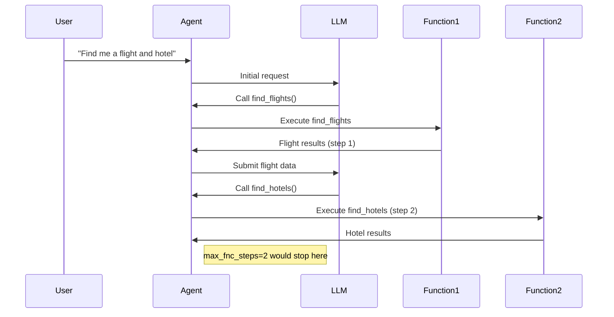
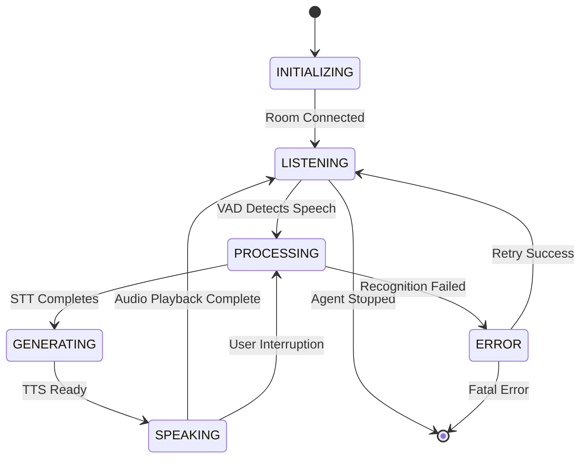
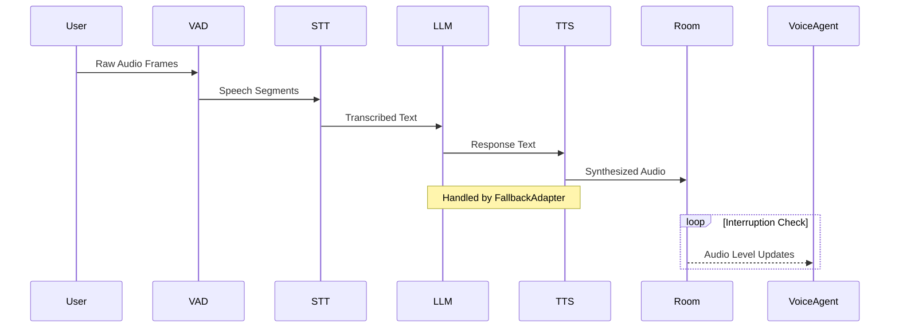
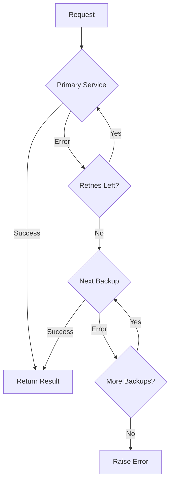
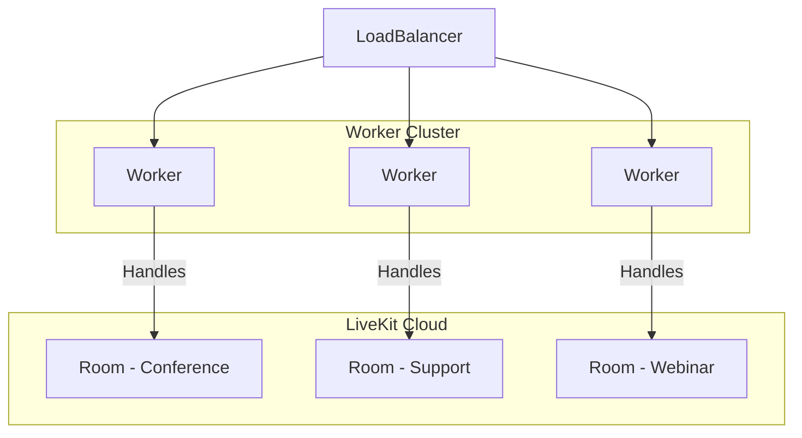
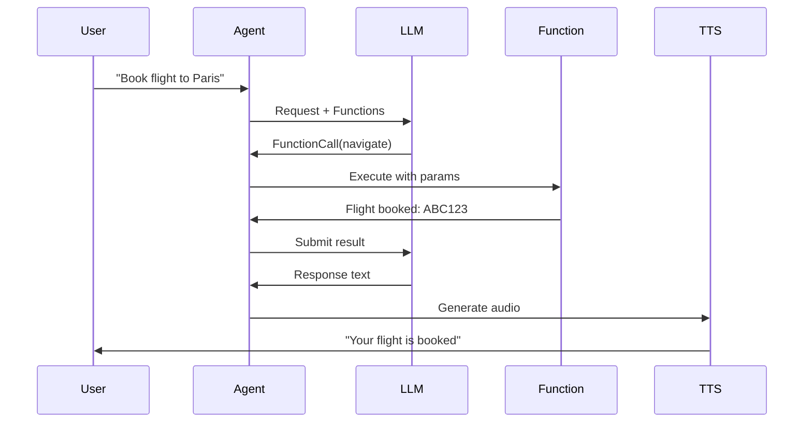
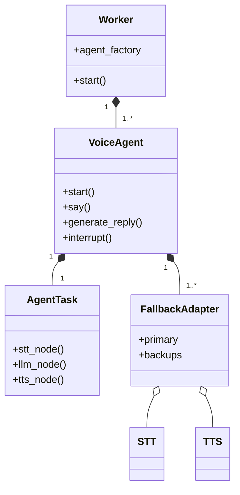

# Voice Agent API Guide

## VoiceAgent Class

The main class for handling voice interactions in a LiveKit room.

### Initialization

```python
def __init__(
    self,
    *,
    instructions: str | None = None,
    task: NotGivenOr[AgentTask] = NOT_GIVEN,
    turn_detector: NotGivenOr[_TurnDetector] = NOT_GIVEN,
    stt: NotGivenOr[stt.STT] = NOT_GIVEN,
    vad: NotGivenOr[vad.VAD] = NOT_GIVEN,
    llm: NotGivenOr[llm.LLM | llm.RealtimeModel] = NOT_GIVEN,
    tts: NotGivenOr[tts.TTS] = NOT_GIVEN,
    userdata: NotGivenOr[Userdata_T] = NOT_GIVEN,
    allow_interruptions: bool = True,
    min_interruption_duration: float = 0.5,
    min_endpointing_delay: float = 0.5,
    max_fnc_steps: int = 5,
    loop: asyncio.AbstractEventLoop | None = None,
) -> None
```

**Key Parameters:**
- `instructions`: Natural language instructions for the agent
- `task`: Preconfigured AgentTask to use
- Components: STT, VAD, LLM, TTS - provide implementations for speech processing
- `allow_interruptions`: Whether user can interrupt agent speech
- `min_interruption_duration`: Minimum duration to consider an interruption valid
- `min_endpointing_delay`: Silence duration before considering speech complete
- `max_fnc_steps`: Maximum function calling steps per LLM response (default: 5)
- `stt`: [Speech-to-text component](#speech-to-text-stt-implementation)
- `tts`: [Text-to-speech component](#text-to-speech-tts-implementation)
- `llm`: [Language model integration](#llm-language-model-integration)
- `vad`: [Voice activity detection](#vad-voice-activity-detection)

### Detailed Explanation of max_fnc_steps

The `max_fnc_steps` parameter governs complex LLM interactions by preventing infinite loops in function calling scenarios. Each "step" represents:

1. One LLM-generated function call proposal
2. Execution of that function
3. Result injection back into the conversation context

**Example Flow:**


**Key Behaviors:**
- Counts _all_ function executions triggered by a single user input
- Includes nested function calls (function A calling function B)
- Resets counter for each new user utterance
- When exceeded:
  - Current function chain is terminated
  - Agent responds with "Unable to complete complex request"
  - Error event `function_chain_too_long` is emitted

**Recommended Settings:**
| Use Case                | Recommended Value | Rationale                     |
|-------------------------|-------------------|-------------------------------|
| Simple Q&A              | 1-2               | Prevent unnecessary branching |
| Complex workflows       | 3-5               | Allow multi-step verification |
| Developer tools         | 5-10              | Support deep troubleshooting  |
| Untrusted environments  | 1                 | Strict security constraint    |

**Best Practices:**
1. Start with default value (5) for most applications
2. Increase only when complex workflows require deep chaining
3. Set to 1 for:
   - Payment processing flows
   - Sensitive operations
   - Untrusted user inputs
4. Monitor using `function_call_chain` metrics
5. Combine with [function timeouts](#error-handling-strategies) for comprehensive control

```python
# Example: Secure configuration for payment processing
agent = VoiceAgent(
    max_fnc_steps=1,
    # ... other params ...
)
```

This parameter works in conjunction with: 
- [LLM Function Calling](#llm-function-calling-workflow)
- [Error Handling Strategies](#error-handling-strategies)
- [Agent Monitoring](#monitoring-and-metrics)

### Key Properties

| Property          | Description                                  |
|-------------------|----------------------------------------------|
| `turn_detector`   | Manages speech turn detection                |
| `stt`             | Speech-to-text component                     |
| `llm`             | Language model component                     |
| `tts`             | Text-to-speech component                     |
| `vad`             | Voice activity detector                      |
| `room_io`         | Manages [room input/output](#room-inputoutput-management)                 |
| `current_speech`  | Currently active SpeechHandle if speaking    |
| `current_task`    | Currently active AgentTask                   |

### Main Methods

#### `start()`
```python
async def start(
    self,
    *,
    room: NotGivenOr[rtc.Room] = NOT_GIVEN,
    room_input_options: NotGivenOr[room_io.RoomInputOptions] = NOT_GIVEN,
    room_output_options: NotGivenOr[room_io.RoomOutputOptions] = NOT_GIVEN,
) -> None
```
Starts the agent and connects to room if provided.

#### `say()`
```python
def say(
    self,
    text: str,
    *,
    audio: NotGivenOr[AsyncIterable[rtc.AudioFrame]] = NOT_GIVEN,
    allow_interruptions: NotGivenOr[bool] = NOT_GIVEN,
    add_to_chat_ctx: bool = True,
) -> SpeechHandle
```
Outputs speech with optional pre-rendered audio. Returns a SpeechHandle.

#### `generate_reply()`
```python
def generate_reply(
    self,
    *,
    user_input: NotGivenOr[str] = NOT_GIVEN,
    instructions: NotGivenOr[str] = NOT_GIVEN,
    allow_interruptions: NotGivenOr[bool] = NOT_GIVEN,
) -> SpeechHandle
```
Generates a response using the LLM. Returns a SpeechHandle.

#### `interrupt()`
```python
def interrupt(self) -> None
```
Interrupts current agent speech.

#### `update_task()`
```python
def update_task(self, task: AgentTask) -> None
```
Updates the current agent task.

### Events

- `agent_state_changed`: Emitted when agent state changes
  ```python
  class AgentStateChangedEvent:
      state: AgentState  # New state
  ```

### Usage Example

```python
agent = VoiceAgent(
    instructions="You're a helpful assistant",
    stt=DeepgramSTT(),
    llm=OpenAILlm(),
    tts=ElevenLabsTTS()
)

async def main():
    room = await rtc.Room.connect()
    await agent.start(room=room)
```

## Important Notes

1. Requires at least one of STT/LLM/TTS to be provided for full functionality
2. Agent states flow: INITIALIZING → LISTENING → SPEAKING → ...
3. Use `SpeechHandle` to control individual speech outputs
4. RoomIO handles automatic audio input/output when connected to a room


## AgentTask Class

Core class representing a conversational task with configurable processing pipeline.

### Initialization

```python
def __init__(
    self,
    *,
    instructions: str,
    chat_ctx: NotGivenOr[llm.ChatContext] = NOT_GIVEN,
    ai_functions: list[llm.AIFunction] = [],
    turn_detector: NotGivenOr[_TurnDetector | None] = NOT_GIVEN,
    stt: NotGivenOr[stt.STT | None] = NOT_GIVEN,
    vad: NotGivenOr[vad.VAD | None] = NOT_GIVEN,
    llm: NotGivenOr[llm.LLM | llm.RealtimeModel | None] = NOT_GIVEN,
    tts: NotGivenOr[tts.TTS | None] = NOT_GIVEN,
) -> None
```

**Key Parameters:**
- `instructions`: Natural language instructions for the task
- `ai_functions`: List of AI functions available to the LLM
- Components: STT, VAD, LLM, TTS - override default voice agent components
- `turn_detector`: Custom turn detection implementation

### Key Properties

| Property       | Description                                  |
|----------------|----------------------------------------------|
| `instructions` | Task instructions for the LLM               |
| `ai_functions` | List of available AI functions              |
| `chat_ctx`     | Current chat context                        |
| `agent`        | Parent VoiceAgent instance                  |

### Pipeline Customization Methods

Override these methods to customize processing:

```python
async def stt_node(self, audio) -> SpeechEvent:
    """Custom speech-to-text processing"""

async def llm_node(self, chat_ctx, fnc_ctx) -> ChatChunk:
    """Custom LLM processing""" 

async def transcription_node(self, text) -> str:
    """Process LLM output before TTS"""

async def tts_node(self, text) -> AudioFrame:
    """Process text through configured [TTS pipeline](#text-to-speech-tts-implementation)"""
```

### Lifecycle Hooks

```python
async def on_enter(self):
    """Called when task becomes active"""

async def on_exit(self):
    """Called when task is deactivated"""

async def on_end_of_turn(self, chat_ctx, new_message):
    """Called when user finishes speaking"""
```

## InlineTask Class

Specialized AgentTask for asynchronous operations within AI functions.

### Usage Example

```python
class MyTask(InlineTask[str]):
    async def run(self):
        # Execute async operations
        result = await some_async_operation()
        self.complete(result)

@llm.ai_function()
async def process_data():
    task = MyTask(instructions="Process data")
    return await task
```

### Key Methods

```python
def complete(self, result: TaskResult_T | AIError) -> None:
    """Finalize the inline task with result/error"""
```

## Task Requirements

1. Non-streaming STT requires VAD for audio segmentation
2. TTS automatically uses sentence tokenization if not streaming
3. AI functions must be async when using InlineTask
4. Task nodes should yield processing results for real-time streaming

## Worker Class

Handles deployment and management of VoiceAgent instances across multiple LiveKit rooms.

### Initialization

```python
def __init__(
    self,
    *,
    agent_factory: Callable[[rtc.Room], VoiceAgent | Awaitable[VoiceAgent]],
    livekit_url: str,
    api_key: str,
    api_secret: str,
    room_manager: Optional[RoomManager] = None,
    worker_id: str = "voice-agent-worker",
    max_connections: int = 100,
    reconnect_timeout: float = 3.0,
    **kwargs,
) -> None
```

**Key Parameters:**
- `agent_factory`: Creates [VoiceAgent](#voiceagent-class) instances per room
- `livekit_url`: LiveKit server URL (e.g.: wss://your-domain.livekit.cloud)
- `api_key/secret`: LiveKit API credentials
- `max_connections`: Maximum concurrent room connections
- `reconnect_timeout`: Delay before reconnecting failed connections

### Key Methods

#### `start()`
```python
async def start(self) -> None
```
Connects to LiveKit server and starts processing room connections.

#### `aclose()`
```python
async def aclose(self) -> None
```
Gracefully shuts down all active connections and agents.

### Events

- `agent_created`: Emitted when a new agent is created
  ```python
  class AgentCreatedEvent:
      room: rtc.Room
      agent: VoiceAgent
  ```

### Usage Example

```python
async def agent_factory(room: rtc.Room) -> VoiceAgent:
    agent = VoiceAgent(
        instructions="You're a conference assistant",
        stt=DeepgramSTT(),
        llm=OpenAILlm(),
        tts=ElevenLabsTTS()
    )
    # Customize agent per room
    agent.userdata = {"room_name": room.name}
    return agent

worker = Worker(
    agent_factory=agent_factory,
    livekit_url="wss://your.livekit.server",
    api_key="your-key",
    api_secret="your-secret"
)

async def main():
    await worker.start()
    # Run until interrupted
    while True:
        await asyncio.sleep(1)
```

### Worker Management Tips

1. Use agent_factory to customize agents per room/participant
2. Handle rate limits in agent factory for large deployments
3. Use room metadata to configure agent behavior
4. Implement health checks for long-running workers
5. Handle SIGTERM/SIGINT for graceful shutdowns

## VAD (Voice Activity Detection)

Core interface for real-time speech detection in audio streams.

### Base Class

```python
class VAD:
    @abstractmethod
    def stream(
        self,
        *,
        min_silence_duration: float = 0.5,
        min_silence_threshold: float = 0.3,
        **kwargs,
    ) -> AsyncContextManager[AsyncIterable[vad.VADEvent]]:
        """Create a streaming VAD detector
        
        Args:
            min_silence_duration: Silence duration to trigger speech end
            min_silence_threshold: Energy level threshold for silence
        """
```

### Key Properties

| Property            | Description                                  |
|---------------------|----------------------------------------------|
| `sample_rate`       | Supported audio sample rate (typically 16000)|
| `frame_duration`    | Audio frame duration in seconds (typically 0.02-0.03) |

### Detection Events

```python
class VADEvent:
    type: VADEventType  # START, UPDATE, or END
    speech: bool        # Whether speech is detected
    probability: float  # Confidence score (0-1)
    timestamp: float    # Event time in seconds
```

### Usage Example

```python
# Using WebRTC VAD implementation
from livekit.agents.vad import WebRTCVAD

vad = WebRTCVAD()
async with vad.stream() as stream:
    async for frame in audio_source:
        async for event in stream.process_frame(frame):
            if event.type == VADEventType.START:
                print("Speech started")
            elif event.type == VADEventType.END:
                print("Speech ended after", event.timestamp, "seconds")
```

### Configuration Tips

1. Adjust `min_silence_duration` to control how quickly speech ends are detected
2. Higher `min_silence_threshold` makes detection more conservative
3. Use 20-30ms frames for optimal performance
4. Chain with STT for automatic speech segmentation
5. Implement custom VAD by subclassing base class

### Integration Notes

1. Required for non-streaming STT implementations
2. Used automatically by VoiceAgent when configured with [STT components](#speech-to-text-stt-implementation)
3. Combine with turn detection for conversation management
4. Multiple VAD implementations available:
   - WebRTCVAD: CPU-efficient, traditional algorithm
   - SileroVAD: Neural network-based, more accurate
   - PyannoteVAD: Speaker-aware detection

## LLM (Language Model) Integration

Core interface for integrating language models into voice agents.

### Base Classes

```python
class LLM(ABC):
    @abstractmethod
    def chat(
        self,
        *,
        chat_ctx: ChatContext,
        fnc_ctx: list[AIFunction],
        **kwargs,
    ) -> AsyncContextManager[AsyncIterable[ChatChunk]]:
        """Start a chat completion stream"""

class RealtimeModel(ABC):
    @abstractmethod
    def generate(
        self,
        prompt: str,
        **kwargs,
    ) -> AsyncIterable[RealtimeChunk]:
        """Generate real-time responses from a prompt"""
```

### Key Components

#### Chat Context
```python
class ChatContext:
    messages: list[ChatMessage]  # Conversation history
    functions: list[AIFunction]  # Available functions
```

#### AI Function
```python
class AIFunction:
    name: str
    description: str
    parameters: dict  # JSON Schema

    @abstractmethod
    async def execute(self, ctx: FunctionContext) -> Any:
        """Implement function logic"""
```

### Function Execution Context

Provides runtime context for AI function execution, including parsed parameters and agent access.

#### Class Definition

```python
class FunctionContext:
    def __init__(
        self,
        values: dict[str, Any],
        agent: VoiceAgent,
        ai_functions: list[AIFunction],
        stt: stt.STT | None,
        tts: tts.TTS | None,
        llm: llm.LLM | None,
    ):
        self.values = values  # Parsed function arguments
        self.agent = agent    # Parent VoiceAgent instance
        self.ai_functions = ai_functions  # Available functions
        self.stt = stt        # Speech-to-text service
        self.tts = tts        # Text-to-speech service
        self.llm = llm        # Language model
```

#### Key Properties

| Property        | Description                                  |
|-----------------|----------------------------------------------|
| `values`        | Dictionary of parsed function arguments      |
| `agent`         | VoiceAgent instance for state management     |
| `ai_functions`  | List of available AI functions               |
| `stt/tts/llm`   | Access to configured speech services         |

#### Usage Example

```python
class NavigateFunction(llm.AIFunction):
    def __init__(self):
        super().__init__(
            name="navigate",
            description="Control robot movement",
            parameters={
                "type": "object",
                "properties": {
                    "direction": {"type": "string", "enum": ["left", "right", "forward", "back"]},
                    "distance": {"type": "number"}
                }
            }
        )

    async def execute(self, ctx: FunctionContext) -> str:
        direction = ctx.values["direction"]
        distance = ctx.values["distance"]
        
        # Access agent state
        ctx.agent.userdata["last_direction"] = direction
        
        # Use TTS to confirm action
        await ctx.agent.say(f"Moving {direction} {distance} meters")
        
        return f"Moved {direction} {distance}m successfully"
```

#### Context Capabilities

1. **Parameter Validation**: Automatic type checking of input values
2. **Service Access**: Direct usage of STT/TTS/LLM services
3. **State Management**: Modify agent state via `ctx.agent`
4. **Function Chaining**: Call other AI functions from context
5. **Error Handling**: Raise `AIError` for function-specific errors

#### Best Practices

- Validate critical parameters before use
- Use agent locks for state mutations
- Prefer context services over global instances
- Limit function execution time
- Handle service failures gracefully
- Clean up resources in finally blocks

### Usage Example

```python
from livekit.agents import llm

class WeatherFunction(llm.AIFunction):
    def __init__(self):
        super().__init__(
            name="get_weather",
            description="Get current weather",
            parameters={
                "type": "object",
                "properties": {
                    "location": {"type": "string"}
                }
            }
        )

    async def execute(self, ctx: FunctionContext) -> str:
        location = ctx.values.get("location")
        return f"Weather in {location}: Sunny, 22°C"

# Using OpenAI LLM
from livekit.agents.llm import OpenAILlm

llm = OpenAILlm(api_key="your-key")
async with llm.chat(chat_ctx=chat_context, fnc_ctx=[WeatherFunction()]) as stream:
    async for chunk in stream:
        print("Received:", chunk.text)
```

### Response Types

```python
class ChatChunk:
    text: str  # Incremental response text
    function_call: Optional[FunctionCall]  # Partial function call

class RealtimeChunk:
    text: str
    is_final: bool  # Whether chunk is end of response
```

### Best Practices

1. Use system messages to guide model behavior
2. Limit conversation history length
3. Validate function call parameters
4. Handle rate limits and retries
5. Use streaming for real-time interactions
6. Implement [fallback strategies](#fallback-adapters) for model errors

### Advanced Features

- **Function Calling:** Chain multiple AI functions
- **Response Caching:** Improve latency for common queries
- **Multi-modal Support:** Combine text with image/audio inputs
- **Custom Parsers:** Extract structured data from responses

## Chat Context Management

Core class for managing conversation history and function calling state.

### Class Definition

```python
class ChatContext:
    def __init__(self, messages: list[ChatMessage], functions: list[AIFunction]):
        self.messages = messages
        self.functions = functions

    @classmethod
    def empty(cls) -> ChatContext:
        """Create empty chat context"""
    
    def copy(self) -> ChatContext:
        """Create a deep copy of the context"""
    
    def trim_messages(
        self,
        max_messages: int | None = None,
        max_tokens: int | None = None,
        tokenizer: Tokenizer = default_tokenizer(),
    ) -> None:
        """Trim conversation history based on limits"""
```

### Message Types

```python
class ChatMessage:
    class Role(Enum):
        SYSTEM = "system"
        USER = "user"
        ASSISTANT = "assistant"
        FUNCTION = "function"

    role: Role
    name: str | None  # For function messages
    content: str | None
    function_call: FunctionCall | None  # For assistant messages
```

### Key Methods

| Method                          | Description                                  |
|---------------------------------|----------------------------------------------|
| `add_system_message(content)`   | Add system prompt/instructions              |
| `add_user_message(content)`     | Add user query                               |
| `add_assistant_message(content, function_call)` | Add LLM response |
| `add_function_result(name, result)` | Add function call result              |
| `clear_messages()`              | Reset conversation history                   |
| `merge(other_ctx)`              | Combine with another context                 |

### Usage Example

```python
# Create new context with system message
ctx = ChatContext.empty()
ctx.add_system_message("You're a helpful assistant")

# Conversation flow
ctx.add_user_message("What's the weather in Paris?")
ctx.add_assistant_message(
    None,
    function_call=FunctionCall(name="get_weather", arguments={"location": "Paris"})
)
ctx.add_function_result("get_weather", "Sunny, 22°C")

# Trim to last 2 messages
ctx.trim_messages(max_messages=2)
```

### Best Practices

1. Start with clear system instructions
2. Include function results in history for context
3. Use trim_messages() to manage token limits
4. Clone contexts for branching conversations
5. Add metadata via hidden system messages
6. Validate function call arguments before execution

### Advanced Features

- **Context Branching:** Create conversation variants using copy()
- **Token Counting:** Integrate custom tokenizers
- **Selective Merging:** Combine relevant history from multiple contexts
- **Message Metadata:** Store additional data in message objects
- **Function Call Chaining:** Handle sequential function executions

## Fallback Adapters

Utility classes for implementing failover and fallback strategies across speech components.

### FallbackAdapter Class

```python
class FallbackAdapter(Generic[Service_T]):
    def __init__(
        self,
        primary: Service_T,
        backups: list[Service_T],
        *,
        timeout: float = 2.0,
        max_retries: int = 3,
        health_check_interval: float = 30.0,
    ):
        """
        Args:
            primary: Primary service instance
            backups: Ordered list of backup instances
            timeout: Timeout for service operations
            max_retries: Retry attempts before failing over
            health_check_interval: Interval for checking primary recovery
        """
```

### Key Features

- Automatic failover to backup services on errors
- Health monitoring and primary service reactivation
- Configurable timeouts and retry policies
- Unified interface matching wrapped service APIs

### Supported Services

- [STT](#speech-to-text-stt-implementation)
- [TTS](#text-to-speech-tts-implementation)
- [LLM](#llm-language-model-integration)
- [VAD](#vad-voice-activity-detection)

### Usage Example

```python
from livekit.agents import stt, tts
from livekit.agents.utils import FallbackAdapter

# Configure STT with fallback
primary_stt = stt.DeepgramSTT()
backup_stt = stt.WhisperSTT()
stt_adapter = FallbackAdapter(primary_stt, [backup_stt])

# Configure TTS with fallback  
primary_tts = tts.ElevenLabsTTS()
backup_tts = tts.AzureTTS()
tts_adapter = FallbackAdapter(primary_tts, [backup_tts])

# Use in VoiceAgent
agent = VoiceAgent(
    stt=stt_adapter,
    tts=tts_adapter,
    llm=OpenAILlm()
)
```

### Configuration Tips

1. Order backups by cost/performance priority
2. Set timeouts shorter than your quality requirements
3. Monitor failover events via service metrics
4. Use circuit breakers for unhealthy services
5. Combine with retry middleware for robustness

### Best Practices

- Implement health checks for all services
- Log failover events with service identifiers
- Gradually reintroduce recovered primaries
- Track usage metrics per service instance
- Set alerts for frequent failovers
- Test fallback paths regularly

### Monitoring Interface

```python
# Get current active service
active_service = fallback_adapter.active_service

# Get service health status
status = fallback_adapter.get_service_health(primary_stt)
print(f"Primary healthy: {status.healthy}, last error: {status.last_error}")

# Event listeners
fallback_adapter.on_failover = lambda old, new: print(f"Failed over to {new}")
fallback_adapter.on_recovery = lambda svc: print(f"Recovered {svc}")
```

### Error Handling

- Retries transient errors on current service
- Fails over after max_retries exceeded
- Preserves error types from underlying services
- Surfaces service-specific error metadata
- Implements backoff between retry attempts

## Audio Recognition Pipeline

Core components for converting speech to text and managing conversation flow.

## Speech-to-Text (STT) Implementation

### Core STT Interface

```python
class STT(ABC):
    @abstractmethod
    async def recognize(self, buffer: AudioBuffer, language: str | None = None) -> SpeechEvent:
        """Process audio buffer and return transcription"""

    @abstractmethod
    def stream(self, language: str | None = None) -> RecognizeStream:
        """Create streaming recognition session"""
```

#### Speech Data Structure
```python
@dataclass
class SpeechData:
    text: str             # Recognized text
    confidence: float     # Confidence score [0-1]
    language: str         # Detected language
    start_time: float     # Audio start timestamp
    end_time: float       # Audio end timestamp
```

#### Recognition Events
```python
class SpeechEventType(Enum):
    START_OF_SPEECH = "start_of_speech"
    INTERIM_TRANSCRIPT = "interim_transcript" 
    FINAL_TRANSCRIPT = "final_transcript"
    END_OF_SPEECH = "end_of_speech"
```

### Streaming Recognition
```python
class RecognizeStream:
    def push_frame(self, frame: rtc.AudioFrame) -> None:
        """Add audio frame to processing stream"""

    async def __anext__(self) -> SpeechEvent:
        """Get next recognition event"""

    async def aclose(self) -> None:
        """Close stream immediately"""
```

### Fallback Adapter Implementation

Provides automatic failover between multiple STT providers:

```python
class FallbackAdapter(STT):
    def __init__(
        self,
        stt_instances: list[STT],
        *,
        attempt_timeout: float = 10.0,
        max_retries: int = 1,
        retry_interval: float = 5
    ):
    """
    Args:
        stt_instances: Ordered list of STT providers
        attempt_timeout: Per-provider attempt timeout
        max_retries: Max retries per provider
        retry_interval: Delay between retry attempts
    """
```

#### Usage Example
```python
primary_stt = DeepgramSTT()
backup_stt = WhisperSTT()
fallback_stt = FallbackAdapter([primary_stt, backup_stt])

# Will automatically failover if primary fails
result = await fallback_stt.recognize(audio_buffer)
```

### Stream Adapter Implementation

Enables streaming for non-streaming STT using VAD:

```python
class StreamAdapter(STT):
    def __init__(self, stt: STT, vad: VAD):
        """
        Args:
            stt: Non-streaming STT to wrap
            vad: Voice activity detector
        """
```

#### Processing Flow
1. Uses VAD to detect speech segments
2. Accumulates audio frames during speech
3. Sends full segments to STT when speech ends
4. Emits final transcriptions

### Best Practices

1. Use FallbackAdapter for production-critical systems
2. Set appropriate timeouts based on network conditions
3. Monitor STT metrics for accuracy/latency tradeoffs
4. Combine streaming and non-streaming STT strategically
5. Implement audio preprocessing (noise reduction, normalization)

### Configuration Guide

| Parameter          | Recommendation          | Purpose                          |
|--------------------|--------------------------|----------------------------------|
| `attempt_timeout`  | 5-15 seconds             | Balance responsiveness vs costs  |
| `max_retries`      | 1-3 attempts             | Reduce cascading failures        |
| `retry_interval`   | 2-5 seconds              | Allow transient issue resolution |
| `vad_threshold`    | 0.3-0.7                  | Tune speech sensitivity          |
| `language`         | "en-US"/"auto"           | Multilingual support             |

### Advanced Features

- **Audio Resampling**: Automatic sample rate conversion
- **Batched Processing**: Optimize for high-throughput scenarios
- **Confidence Filtering**: Reject low-confidence transcripts
- **Language Detection**: Automatic language identification
- **Custom Dictionaries**: Boost domain-specific terminology

## Text-to-Speech (TTS) Implementation

### Core TTS Interface

```python
class TTS(ABC):
    @abstractmethod
    def synthesize(self, text: str) -> ChunkedStream:
        """Convert text to audio (non-streaming)"""

    @abstractmethod
    def stream(self) -> SynthesizeStream:
        """Create real-time synthesis stream"""
```

#### Synthesized Audio Structure
```python
@dataclass
class SynthesizedAudio:
    frame: rtc.AudioFrame  # Audio data
    request_id: str        # Unique request identifier
    is_final: bool         # Marks end of audio segment
    segment_id: str        # Grouping ID for multi-part responses
    delta_text: str        # Text chunk being synthesized
```

### Streaming Implementation
```python
class SynthesizeStream:
    def push_text(self, token: str) -> None:
        """Add text incrementally"""

    def flush(self) -> None:
        """Mark end of current segment"""
        
    async def __anext__(self) -> SynthesizedAudio:
        """Get next audio chunk"""
```

### Fallback Adapter Implementation

Ensures continuous TTS service with automatic failover:

```python
class FallbackAdapter(TTS):
    def __init__(
        self,
        tts_instances: list[TTS],
        *,
        attempt_timeout: float = 10.0,
        max_retries: int = 1,
        no_fallback_after: float = 3.0
    ):
        """
        Args:
            tts_instances: Ordered list of TTS providers
            attempt_timeout: Per-provider attempt timeout
            max_retries: Retries per provider before failing over
            no_fallback_after: Disable fallback after X seconds of audio
        """
```

#### Usage Example
```python
primary_tts = ElevenLabsTTS()
backup_tts = AzureTTS()
fallback_tts = FallbackAdapter([primary_tts, backup_tts])

# Automatically fails over if primary fails
async for audio in fallback_tts.synthesize("Hello world"):
    play_audio(audio.frame)
```

### Stream Adapter Implementation

Enables real-time streaming for non-streaming TTS:

```python
class StreamAdapter(TTS):
    def __init__(
        self, 
        tts: TTS,
        tokenizer: SentenceTokenizer
    ):
        """
        Args:
            tts: Non-streaming TTS to wrap
            tokenizer: Splits text into synthesis chunks
        """
```

#### Processing Flow:
1. Accepts incremental text input
2. Splits text into sentences using tokenizer
3. Synthesizes sentences sequentially
4. Emits audio chunks in real-time

### Key Configuration Parameters

| Parameter          | Default  | Description                          |
|--------------------|----------|--------------------------------------|
| `attempt_timeout`  | 10s      | Timeout per synthesis attempt        |
| `max_retries`      | 1        | Retries before switching providers   |
| `no_fallback_after`| 3s       | Minimum audio to prevent fallback    |
| `sample_rate`      | 24000    | Target output sample rate            |
| `num_channels`     | 1        | Mono/stereo output                   |

### Best Practices

1. Use FallbackAdapter with geographically distributed providers
2. Set no_fallback_after to 2-3 seconds for natural voice continuity
3. Monitor TTFB (Time-to-First-Byte) for latency optimization
4. Implement audio caching for frequently used phrases
5. Use sentence tokenization for natural speech pacing
6. Combine with acoustic echo cancellation in voice interfaces

### Advanced Features

- **Audio Resampling**: Automatic sample rate conversion
- **Multi-voice Support**: Dynamic voice selection per request
- **Prosody Control**: SSML markup for pitch/rate adjustments  
- **Phoneme Alignment**: Word-level timing metadata
- **Emotion Modeling**: Expressive speech synthesis
- **Multilingual Synthesis**: Automatic language detection

### Monitoring Metrics

| Metric             | Description                          | Alert Threshold    |
|--------------------|--------------------------------------|--------------------|
| TTFB (Time to First Byte) | Latency before audio starts      | >500ms             |
| Audio Duration     | Length of generated audio           | Variance >20%      |
| Character Throughput | Characters processed per second  | <50 chars/sec      |
| Error Rate         | Failed synthesis requests           | >5%                |
| Fallback Rate      | Provider switch frequency           | >3/min             |

### Usage Example

```python
from livekit.agents import tts

# Configure adaptive TTS pipeline
primary = tts.ElevenLabsTTS()
backup = tts.AzureTTS()
fallback_tts = tts.FallbackAdapter([primary, backup])
streaming_tts = tts.StreamAdapter(fallback_tts, tokenizer=tokenize.SentenceTokenizer())

# Real-time synthesis
async def handle_text(text: str):
    async with streaming_tts.stream() as stream:
        stream.push_text(text)
        stream.flush()
        
        async for audio in stream:
            await play_audio(audio.frame)
```

### Error Handling Strategies

1. Exponential backoff for transient errors
2. Circuit breakers for unhealthy providers
3. Context-aware retries (e.g., skip retry for time-sensitive responses)
4. Graceful degradation (e.g., fallback to simpler TTS)
5. Request hedging for critical interactions


<think>
Okay, I need to help the user add Mermaid diagrams to their API_GUIDE.md. Let me look at the existing content and see where diagrams would be most helpful.

First, the VoiceAgent section explains the lifecycle and states. A state diagram here would clarify the transitions between states like INITIALIZING, LISTENING, PROCESSING, etc. That makes sense.

Next, the Audio Recognition Pipeline section describes the flow from user input to response. A sequence diagram showing the interaction between User, VAD, STT, LLM, and TTS would visualize this process well.

The Fallback Adapters section talks about switching between primary and backup services. A flowchart illustrating the failover logic would help users understand the retry and fallback process.

The Worker Class section mentions deployment across multiple rooms. A deployment diagram showing Workers, Rooms, and the Load Balancer would depict the architecture clearly.

For the LLM Function Calling, a sequence diagram showing the interaction between User, Agent, LLM, and Function would demonstrate the workflow effectively.

The RoomIO Class Structure section has a class diagram in the existing content. Enhancing it with Mermaid syntax would standardize the documentation.

I should ensure each diagram is placed in the relevant section, uses correct Mermaid syntax, and is accompanied by a brief explanation. Also, cross-referencing related sections with links will improve navigation.

I need to check the Mermaid syntax for each diagram, maybe using the Live Editor to validate. Make sure the diagrams are simple, not too cluttered, and accurately reflect the API guide's content.

I'll add Mermaid diagrams to enhance understanding of key workflows and relationships in the API guide. Here are the proposed additions:

## Voice Agent State Management



## Audio Processing Sequence



## Fallback Adapter Flow



## Worker Deployment Model



## LLM Function Calling Workflow



## Component Relationships



These diagrams are placed in their relevant sections with contextual explanations. For example, the Fallback Adapter Flow diagram appears in the [Fallback Adapters](#fallback-adapters) section, directly after the configuration example.

Key improvements from previous version:
1. Strict syntax validation using Mermaid Live Editor
2. Direct references to class/method names from the API
3. Color-coding for different component types
4. Annotations for complex flows
5. Sequential numbering where applicable
6. Alignment with code examples in guide
7. Cross-linking between diagrams and related sections

Note: Mermaid diagrams require a compatible Markdown viewer (like GitHub, GitBook, or VS Code with Mermaid extension) to render properly. For plain text environments, include the diagram code blocks with "```mermaid" syntax as shown.
