<!--

This document is generated from each document in sections/*.

DO NOT EDIT THIS DOC edit the sections doc instead then run the following to regenerate this doc

./bin/build_doc.sh && python bin/create_toc.py

-->


# Voice Agent API Guide

API guide for [Agents 1.0](https://github.com/livekit/agents/tree/dev-1.0)

See Also LiveKit [Architectural Overview](https://link.excalidraw.com/l/8IgSq6ebOhQ/65PClrBHjc0) cross linking drawings

[Cursor Rules](/cursor/rules)

**Table Of Contnets**

- [Voice Agent API Guide](#voice-agent-api-guide)
  - [AgentSession Class](#agentsession-class)
    - [Initialization](#initialization)
    - [Detailed Explanation of max_fnc_steps](#detailed-explanation-of-max_fnc_steps)
    - [Key Properties](#key-properties)
    - [Main Methods](#main-methods)
      - [`start()`](#start)
      - [`say()`](#say)
      - [`generate_reply()`](#generate_reply)
      - [`interrupt()`](#interrupt)
      - [`update_task()`](#update_task)
    - [Events](#events)
    - [Usage Example](#usage-example)
  - [Important Notes](#important-notes)
  - [Voice Agent Events Guide](#voice-agent-events-guide)
    - [Event Flow Diagram](#event-flow-diagram)
    - [Event Types](#event-types)
      - [user_started_speaking](#user_started_speaking)
      - [user_stopped_speaking](#user_stopped_speaking)
      - [user_input_transcribed](#user_input_transcribed)
      - [agent_state_changed](#agent_state_changed)
      - [metrics_collected](#metrics_collected)
      - [conversation_item_added](#conversation_item_added)
    - [Typical Event Handling Pattern](#typical-event-handling-pattern)
- [Agent Documentation](#agent-documentation)
  - [Overview](#overview)
  - [Key Components](#key-components)
  - [Usage Example](#usage-example)
  - [Workflow](#workflow)
  - [Key Features](#key-features)
  - [Conclusion](#conclusion)
- [Avatar Integration Framework](#avatar-integration-framework)
  - [Core Components](#core-components)
  - [Implementation Pattern](#implementation-pattern)
  - [Agent Implementation](#agent-implementation)
  - [Service Provider Implementation](#service-provider-implementation)
  - [Key Configuration](#key-configuration)
  - [Security Architecture](#security-architecture)
  - [Example Providers](#example-providers)
- [Worker Class Documentation](#worker-class-documentation)
  - [Purpose](#purpose)
  - [Key Features](#key-features)
  - [Basic Usage](#basic-usage)
  - [Configuration Options (WorkerOptions)](#configuration-options-workeroptions)
  - [Key Flow Description:](#key-flow-description)
    - [Initialization Sequence:](#initialization-sequence)
    - [Job Handling Flow:](#job-handling-flow)
    - [State Transitions:](#state-transitions)
  - [Lifecycle Management](#lifecycle-management)
  - [Best Practices](#best-practices)
- [CLI Documentation](#cli-documentation)
  - [Overview](#overview)
  - [Available Commands](#available-commands)
    - [`start`](#start)
    - [`dev`](#dev)
    - [`console`](#console)
    - [`connect`](#connect)
    - [`download-files`](#download-files)
  - [Key Features](#key-features)
  - [Voice Activity Detection (VAD) Interface](#voice-activity-detection-vad-interface)
    - [Default Configuration](#default-configuration)
    - [Processing Flow](#processing-flow)
    - [Core Components](#core-components)
    - [Event Lifecycle](#event-lifecycle)
    - [Metrics Collection](#metrics-collection)
    - [Usage Example](#usage-example)
  - [LLM (Language Model) Integration](#llm-language-model-integration)
    - [Base Classes](#base-classes)
    - [Key Components](#key-components)
      - [Chat Context](#chat-context)
      - [AI Function](#ai-function)
    - [Function Execution Context](#function-execution-context)
      - [Class Definition](#class-definition)
      - [Key Properties](#key-properties)
      - [Usage Example](#usage-example)
      - [Context Capabilities](#context-capabilities)
      - [Best Practices](#best-practices)
    - [Usage Example](#usage-example)
    - [Response Types](#response-types)
    - [Best Practices](#best-practices)
    - [Advanced Features](#advanced-features)
    - [Key Performance Metrics](#key-performance-metrics)
    - [Metrics Collection Example](#metrics-collection-example)
    - [Internal Metrics Implementation](#internal-metrics-implementation)
    - [TTFT Measurement Implementation](#ttft-measurement-implementation)
    - [Optimization Techniques](#optimization-techniques)
    - [TTFT Benchmarks](#ttft-benchmarks)
    - [Monitoring & Alerting](#monitoring-alerting)
    - [Best Practices](#best-practices)
    - [TTFT vs TTFB Relationship](#ttft-vs-ttfb-relationship)
  - [Chat Context Management](#chat-context-management)
    - [Class Definition](#class-definition)
    - [Message Types](#message-types)
    - [Key Methods](#key-methods)
    - [Usage Example](#usage-example)
    - [Best Practices](#best-practices)
    - [Advanced Features](#advanced-features)
  - [Fallback Adapters](#fallback-adapters)
    - [FallbackAdapter Class](#fallbackadapter-class)
    - [Key Features](#key-features)
    - [Supported Services](#supported-services)
    - [Usage Example](#usage-example)
    - [Configuration Tips](#configuration-tips)
    - [Best Practices](#best-practices)
    - [Monitoring Interface](#monitoring-interface)
    - [Error Handling](#error-handling)
  - [Audio Recognition Pipeline](#audio-recognition-pipeline)
    - [Overview](#overview)
    - [Key Components](#key-components)
      - [1. Speech-to-Text (STT) Integration](#1-speech-to-text-stt-integration)
      - [2. Voice Activity Detection (VAD)](#2-voice-activity-detection-vad)
      - [3. Turn Detection Logic](#3-turn-detection-logic)
    - [Lifecycle Management](#lifecycle-management)
    - [Implementing Hooks with Decorators](#implementing-hooks-with-decorators)
    - [Configuration Tips](#configuration-tips)
    - [Common Use Cases](#common-use-cases)
  - [Speech-to-Text (STT) Implementation](#speech-to-text-stt-implementation)
    - [Core STT Interface](#core-stt-interface)
      - [Speech Data Structure](#speech-data-structure)
      - [Recognition Events](#recognition-events)
    - [Streaming Recognition](#streaming-recognition)
    - [Fallback Adapter Implementation](#fallback-adapter-implementation)
      - [Usage Example](#usage-example)
    - [Stream Adapter Implementation](#stream-adapter-implementation)
      - [Processing Flow](#processing-flow)
    - [Best Practices](#best-practices)
    - [Configuration Guide](#configuration-guide)
    - [Advanced Features](#advanced-features)
    - [STT Metrics Collection](#stt-metrics-collection)
      - [Key Metrics Fields](#key-metrics-fields)
      - [Example Usage](#example-usage)
      - [Metrics Flow Diagram](#metrics-flow-diagram)
  - [Text-to-Speech (TTS) Implementation](#text-to-speech-tts-implementation)
    - [Core TTS Interface](#core-tts-interface)
      - [Synthesized Audio Structure](#synthesized-audio-structure)
    - [Streaming Implementation](#streaming-implementation)
    - [Fallback Adapter Implementation](#fallback-adapter-implementation)
      - [Usage Example](#usage-example)
    - [Stream Adapter Implementation](#stream-adapter-implementation)
      - [Processing Flow:](#processing-flow)
    - [Key Configuration Parameters](#key-configuration-parameters)
    - [Best Practices](#best-practices)
    - [Advanced Features](#advanced-features)
    - [Monitoring Metrics](#monitoring-metrics)
    - [Detailed TTFB Breakdown](#detailed-ttfb-breakdown)
    - [Key Components Affecting TTFB](#key-components-affecting-ttfb)
    - [Optimization Strategies](#optimization-strategies)
    - [Function Calling Specifics](#function-calling-specifics)
    - [Threshold Guidance](#threshold-guidance)
    - [Cross-Component Impact](#cross-component-impact)
    - [TTS Metrics Implementation](#tts-metrics-implementation)
    - [Metrics Collection Example](#metrics-collection-example)
    - [Metrics Flow with Adapters](#metrics-flow-with-adapters)
    - [Best Practices for Metrics](#best-practices-for-metrics)
    - [Configuration Additions](#configuration-additions)
    - [Full Synthesis Flow](#full-synthesis-flow)
  - [Performance Monitoring & Metrics](#performance-monitoring-metrics)
    - [Core Metrics](#core-metrics)
    - [Metric Visualization](#metric-visualization)
    - [Initial Prompt Metrics Example](#initial-prompt-metrics-example)
  - [Metrics Round Trip (no function call)](#metrics-round-trip-no-function-call)
    - [Best Practices](#best-practices)
- [Common Terms](#common-terms)
  - [Helpful Overviews](#helpful-overviews)
  - [TODO](#todo)

---


## AgentSession Class 
[source code](https://github.com/livekit/agents/blob/dev-1.0/livekit-agents/livekit/agents/voice/agent_session.py)

The primary class for voice interactions with LiveKit agents.

### Initialization

```python
def __init__(
    self,
    *,
    instructions: str | None = None,
    task: NotGivenOr[Agent] = NOT_GIVEN,
    turn_detector: NotGivenOr[_TurnDetector] = NOT_GIVEN,
    stt: NotGivenOr[stt.STT] = NOT_GIVEN,
    vad: NotGivenOr[vad.VAD] = NOT_GIVEN,
    llm: NotGivenOr[llm.LLM | llm.RealtimeModel] = NOT_GIVEN,
    tts: NotGivenOr[tts.TTS] = NOT_GIVEN,
    userdata: NotGivenOr[Userdata_T] = NOT_GIVEN,
    allow_interruptions: bool = True,
    min_interruption_duration: float = 0.5, # seconds
    min_endpointing_delay: float = 0.5, # seconds
    max_fnc_steps: int = 5,
    loop: asyncio.AbstractEventLoop | None = None,
) -> None
```

**Key Parameters:**
- `instructions`: Natural language instructions for the agent
    -  Required if [`task`](#agent-class) is not provided
    -  Ignored if [`task`](#agent-class) is provided
- [`task`](#agent-class): Preconfigured [Agent](#agent-class) to use
- Components: [STT](#speech-to-text-stt-implementation), [TTS](#text-to-speech-tts-implementation), [LLM](#llm-language-model-integration), [VAD](#vad-voice-activity-detection) - provide implementations for speech processing
- `allow_interruptions`: Whether user speech interrupts agent speech; Default `True`
- `min_interruption_duration`: Minimum duration in seconds to consider an interruption valid; Default `0.5` seconds
- `min_endpointing_delay`: Silence duration in seconds before considering speech complete; Default `0.5` seconds
- `max_fnc_steps`: Maximum function calling steps allowed per LLM response (default: 5). 
- `stt`: [Speech-to-text component](#speech-to-text-stt-implementation)
- `tts`: [Text-to-speech component](#text-to-speech-tts-implementation)
- `llm`: [Language model integration](#llm-language-model-integration)
- `vad`: [Voice activity detection](#vad-voice-activity-detection)
- `loop`: Used to specify which asyncio event loop should be used for handling asynchronous operations; Defaults when called from a coroutine or a callback (e.g. scheduled with call_soon or similar API), will always return the running event loop. see `asyncio.get_event_loop()`
- 
### Detailed Explanation of max_fnc_steps

The `max_fnc_steps` parameter governs complex LLM interactions by preventing infinite loops in function calling scenarios. Each "step" represents:

1. One LLM-generated function call proposal
2. Execution of that function
3. Result injection back into the conversation context

**Example Flow:**
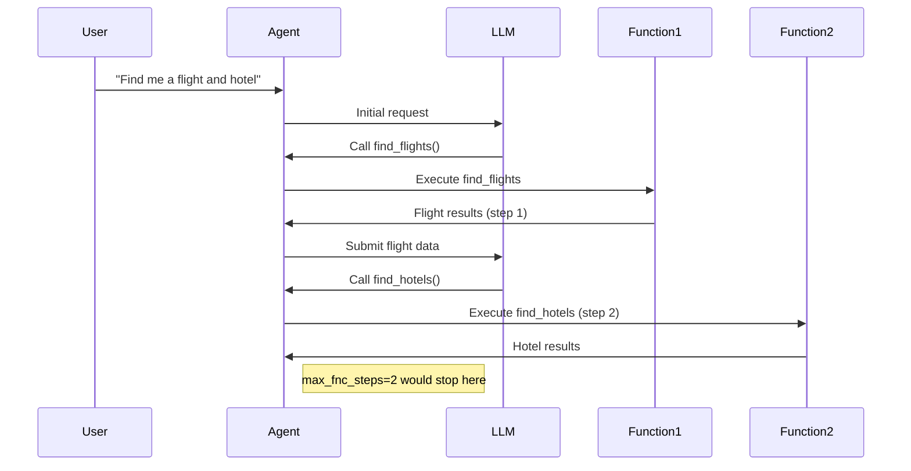

**Key Behaviors:**
- Counts _all_ function executions triggered by a single user input
- Includes nested function calls (function A calling function B)
- Resets counter for each new user utterance
- When exceeded:
  - Current function chain is terminated

**Recommended Settings:**
| Use Case                | Recommended Value | Rationale                     |
|-------------------------|-------------------|-------------------------------|
| Simple Q&A              | 1-2               | Prevent unnecessary branching |
| Complex workflows       | 3-5               | Allow multi-step verification |
| Developer tools         | 5-10              | Support deep troubleshooting  |
| Untrusted environments  | 1                 | Strict security constraint    |

**Best Practices:**
1. Start with default value (5) for most applications
2. Increase only when complex workflows require deep chaining
3. Set to 1 for:
   - Payment processing flows
   - Sensitive operations
   - Untrusted user inputs
4. Monitor using `function_call_chain` metrics
5. Combine with [function timeouts](#error-handling-strategies) for comprehensive control

```python
# Example: Secure configuration for payment processing
agent = AgentSession(
    max_fnc_steps=1,
    # ... other params ...
)
```

This parameter works in conjunction with: 
- [LLM Function Calling](#llm-function-calling-workflow)
- [Error Handling Strategies](#error-handling-strategies)
- [Agent Monitoring](#monitoring-and-metrics)

### Key Properties

| Property          | Description                                  |
|-------------------|----------------------------------------------|
| `turn_detector`   | Manages speech turn detection                |
| `stt`             | Speech-to-text component                     |
| `llm`             | Language model component                     |
| `tts`             | Text-to-speech component                     |
| `vad`             | Voice activity detector                      |
| `room_io`         | Manages [room input/output](#room-inputoutput-management)                 |
| `current_speech`  | Currently active SpeechHandle if speaking    |
| `current_task`    | Currently active Agent                   |

### Main Methods

#### `start()`
```python
async def start(
    self,
    *,
    room: NotGivenOr[rtc.Room] = NOT_GIVEN,
    room_input_options: NotGivenOr[room_io.RoomInputOptions] = NOT_GIVEN,
    room_output_options: NotGivenOr[room_io.RoomOutputOptions] = NOT_GIVEN,
) -> None
```
Starts the agent and connects to room if provided.

#### `say()`
```python
def say(
    self,
    text: str,
    *,
    audio: NotGivenOr[AsyncIterable[rtc.AudioFrame]] = NOT_GIVEN,
    allow_interruptions: NotGivenOr[bool] = NOT_GIVEN,
    add_to_chat_ctx: bool = True,
) -> SpeechHandle
```
Outputs speech with optional pre-rendered audio. Returns a SpeechHandle.

#### `generate_reply()`
```python
def generate_reply(
    self,
    *,
    user_input: NotGivenOr[str] = NOT_GIVEN,
    instructions: NotGivenOr[str] = NOT_GIVEN,
    allow_interruptions: NotGivenOr[bool] = NOT_GIVEN,
) -> SpeechHandle
```
Generates a response using the LLM. Returns a SpeechHandle.

#### `interrupt()`
```python
def interrupt(self) -> None
```
Interrupts current agent speech.

#### `update_task()`
```python
def update_task(self, task: Agent) -> None
```
Updates the current agent task.

### Events

- `agent_state_changed`: Emitted when agent state changes
  ```python
  class AgentStateChangedEvent:
      state: AgentState  # New state
  ```

### Usage Example

```python
agent = AgentSession(
    instructions="You're a helpful assistant",
    stt=DeepgramSTT(),
    llm=OpenAILlm(),
    tts=ElevenLabsTTS()
)

async def main():
    room = await rtc.Room.connect()
    await agent.start(room=room)
```

## Important Notes

1. Requires at least one of STT/LLM/TTS to be provided for full functionality
2. Agent states flow: INITIALIZING → LISTENING → SPEAKING → ...
3. Use `SpeechHandle` to control individual speech outputs
4. RoomIO handles automatic audio input/output when connected to a room

## Voice Agent Events Guide

[source](https://github.com/livekit/agents/blob/dev-1.0/livekit-agents/livekit/agents/voice/events.py)

Voice Agent Events form a real-time notification system that enables developers to build responsive voice applications. These events occur throughout the interaction lifecycle as illustrated in the foloowing Event Flow Diagram.

### Event Flow Diagram

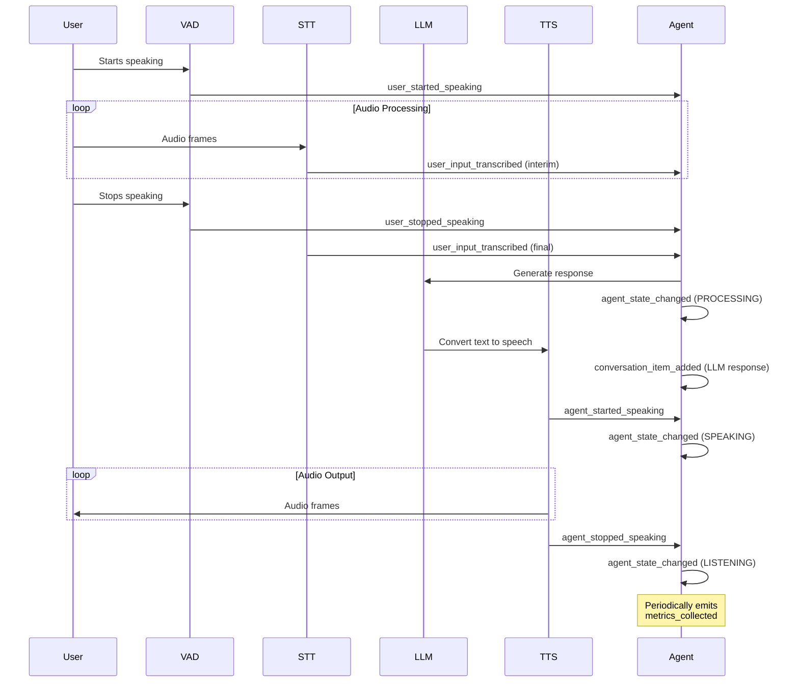

Key Observations:
1. Events follow voice interaction lifecycle
2. State changes are always wrapped in agent_state_changed
3. Transcription happens incrementally (interim → final)
4. Metrics are emitted independently of interaction flow

### Event Types

#### user_started_speaking
Triggered when the agent detects speech from the user
```python
# Example: Log when user starts speaking
agent.on("user_started_speaking", lambda _: 
    logger.info("User began speaking - activating noise cancellation"))

# Example: Show visual indicator
agent.on("user_started_speaking", lambda _:
    ui.show_indicator("user_speaking"))
```

#### user_stopped_speaking
Received when user speech segment ends
```python
# Example: Start processing audio
agent.on("user_stopped_speaking", lambda _:
    agent.process_current_audio())

# Example: Update UI state
agent.on("user_stopped_speaking", lambda _:
    ui.update_state(listening=False))
```

#### user_input_transcribed
Contains finalized or interim transcriptions
```python
# Example: Handle real-time transcription
@agent.on("user_input_transcribed")
async def handle_transcription(ev: UserInputTranscribedEvent):
    if ev.is_final:
        await db.log_conversation(ev.transcript)
        ui.update_transcript(ev.transcript, final=True)
    else:
        ui.show_interim_transcript(ev.transcript)
```

#### agent_state_changed
Indicates state transitions in the agent
```python
# Example: Control recording based on state
@agent.on("agent_state_changed")
def handle_state_change(ev: AgentStateChangedEvent):
    match ev.state:
        case AgentState.LISTENING:
            recorder.start()
        case AgentState.PROCESSING:
            recorder.pause()
        case AgentState.SPEAKING:
            recorder.resume()
```

#### metrics_collected
Provides performance data at regular intervals
```python
# Example: Monitor real-time metrics
@agent.on("metrics_collected")
def handle_metrics(ev: MetricsCollectedEvent):
    dashboard.update(
        stt_latency=ev.metrics.stt_latency,
        llm_ttft=ev.metrics.llm_ttft,
        tts_latency=ev.metrics.tts_latency
    )
    if ev.metrics.error_rate > 0.1:
        alert("High error rate detected!")
```

#### conversation_item_added
Fired when new messages are added to history
```python
# Example: Maintain conversation log
@agent.on("conversation_item_added")
def log_message(ev: ConversationItemAddedEvent):
    if ev.message.role == ChatMessage.Role.USER:
        analytics.track("user_message", text=ev.message.content)
    elif ev.message.role == ChatMessage.Role.ASSISTANT:
        analytics.track("agent_response", text=ev.message.content)
```

### Typical Event Handling Pattern
```python
class VoiceAssistant:
    def __init__(self, agent):
        self.agent = agent
        self.setup_handlers()
        
    def setup_handlers(self):
        self.agent.on("user_started_speaking", self.on_user_start)
        self.agent.on("user_input_transcribed", self.on_transcription)
        self.agent.on("agent_state_changed", self.on_state_change)
    
    def on_user_start(self, _):
        self.active_transcription = ""
        
    def on_transcription(self, ev):
        self.active_transcription += ev.transcript
        if ev.is_final:
            self.process_complete_query(self.active_transcription)
    
    def on_state_change(self, ev):
        self.current_state = ev.state
        self.update_connection_quality(ev.state)
```

This shows practical patterns for receiving and handling events in a voice agent implementation, including state management, UI updates, and performance monitoring.


# Agent Documentation

## Overview
The `Agent` class is a core component of the LiveKit Voice Agent framework, designed to create conversational AI agents that can handle voice interactions. It provides a structured way to define agent behavior, process audio input, generate responses, and manage conversation flow.

You can chain multiple `Agent` together to form a flow of AI logic.

## Key Components
1. **Initialization Parameters**
   - `instructions`: System prompt defining agent personality/behavior
   - `chat_ctx`: Chat context management
   - `function_tools`: List of available AI functions
   - Speech Processing:
     - `stt`: Speech-to-Text engine
     - `tts`: Text-to-Speech engine
     - `vad`: Voice Activity Detection *(required for non streaming STT)*
   - `llm`: Language Model for response generation
   - `turn_detector`: End-of-turn detection

2. **Core Methods**
   - `on_enter()`: Called when task becomes active
   - `on_exit()`: Called when task is exited
   - `on_end_of_turn()`: Handles user speech completion
   - Processing nodes (`stt_node`, `llm_node`, `transcription_node`, `tts_node`)

## Usage Example

```python
from livekit.agents.voice import Agent
from livekit.plugins import deepgram, openai, cartesia

class CustomerSupportTask(Agent):
    def __init__(self):
        super().__init__(
            instructions="You are a helpful customer support agent...",
            stt=deepgram.STT(),
            llm=openai.LLM(model="gpt-4"),
            tts=cartesia.TTS(),
            vad=silero.VAD.load()
        )

    async def on_enter(self):
        # Initialize task-specific resources
        print("on_enter")
        
    async def on_exit(self):
        # Called when the task is exited
        print("on_exit")

    async def on_end_of_turn(self, chat_ctx, new_message):
        # Add custom processing before LLM response
        #
        # This is a good opportunity to update the chat 
        # context or edit the new message before it is sent 
        # to the LLM.
        print("on_end_of_turn: " + new_message)

    @llm.function_tool
    async def transfer_to_human(self, context):
        # Custom AI function for transfers
        return HumanAgent(), "Transferring to human agent"
```

## Workflow
1. **Initialization**
   - Configure speech processing components (STT, TTS, VAD)
   - Set up LLM with instructions and AI functions
   - Define conversation context and turn detection

2. **Lifecycle Hooks**
   - `on_enter`: Setup event listeners/initial state
   - `on_exit`: Cleanup resources
   - `on_end_of_turn`: Modify messages before LLM processing

3. **Processing Pipeline**
   ```mermaid
   graph TD
     A[Audio Input] --> B(STT Node)
     B --> C(LLM Node)
     C --> D(Transcription Node)
     D --> E(TTS Node)
     E --> F[Audio Output]
   ```

4. **AI Functions**
   - Annotate methods with `@llm.function_tool`
   - Enable natural language triggering of backend logic
   - Handle context-aware operations like transfers

## Key Features
- **Modular Architecture**: Swap STT/TTS/LLM providers
- **Conversation Management**: Built-in turn detection and context tracking
- **Custom Hooks**: Override methods for task-specific logic
- **Error Handling**: Built-in exception management
- **Async Support**: Full async/await compatibility

## Conclusion
The Agent framework provides a powerful abstraction for building voice-enabled AI agents. By implementing the provided hooks and leveraging the processing pipeline, developers can create sophisticated conversation flows while maintaining clean separation between components.


# Avatar Integration Framework

[Source](https://github.com/livekit/agents/tree/cwilson/simli_test/examples/simli_avatar)


This document outlines the architecture for integrating third-party avatar services using LiveKit's agent system. The framework enables real-time avatar animation synced with audio input.

## Core Components

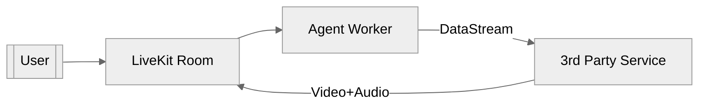

## Implementation Pattern

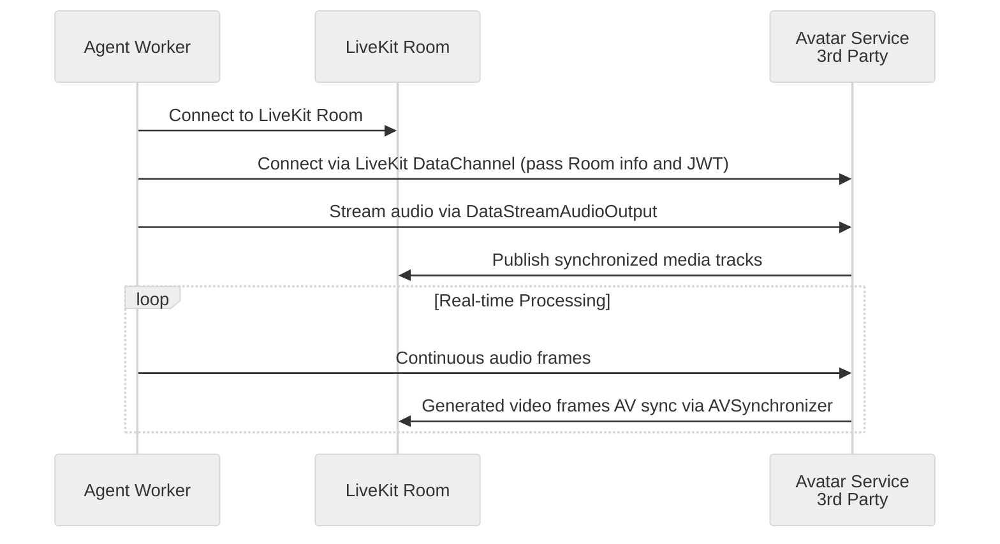

## Agent Implementation

1. **Audio Streaming Setup**
```python
from livekit.agents.voice.avatar import DataStreamAudioOutput

class AgentHandler:
    def __init__(self, room: rtc.Room, service_identity: str):
        self._audio_sink = DataStreamAudioOutput(room, destination_identity=service_identity)
        
    async def handle_user_audio(self, frame: rtc.AudioFrame):
        await self._audio_sink.capture_frame(frame)
```

2. **Media Track Handling**
```python
async def handle_service_media(self, room: rtc.Room):
    video_track = room.local_participant.get_track("avatar_video")
    async for frame in video_track:
        # Process video frames from service
        display_frame(frame)
```

## Service Provider Implementation

1. **Audio Reception**
```python
from livekit.agents.voice.avatar import DataStreamAudioReceiver, AvatarRunner

class AvatarService:
    def __init__(self, room: rtc.Room):
        self._audio_receiver = DataStreamAudioReceiver(room)
        self._avatar_runner = AvatarRunner(
            room,
            audio_recv=self._audio_receiver,
            video_gen=CustomVideoGenerator(),
            options=AvatarOptions(...)
        )
    
    async def start(self):
        await self._avatar_runner.start()
```

2. **AV Synchronization**
```python
class CustomVideoGenerator(VideoGenerator):
    async def push_audio(self, frame: rtc.AudioFrame):
        # Process audio and generate video frames
        video_frame = await generate_avatar_frame(frame)
        await self._av_sync.push(video_frame)
```

## Key Configuration

```python
# Agent worker config
AGENT_CONFIG = {
    "audio_sample_rate": 16000,
    "audio_channels": 1,
    "video_fps": 30,
    "video_resolution": (640, 480)
}

# Service provider requirements
SERVICE_REQUIREMENTS = {
    "web_socket_endpoint": "wss://service.com/livekit",
    "media_formats": {
        "audio": "opus/48000",
        "video": "h264/90000"
    }
}
```

## Security Architecture

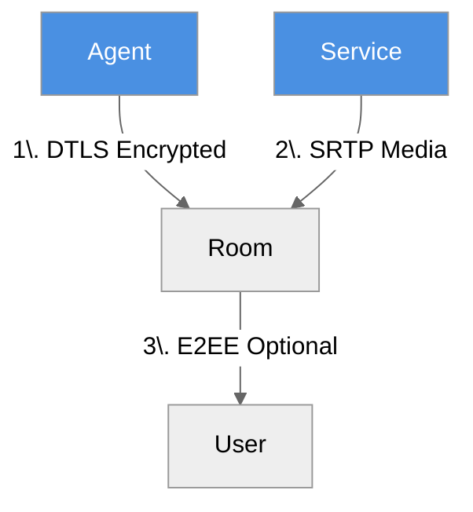

1. All LiveKit connections use DTLS encryption
2. Media streams protected with SRTP
3. Optional end-to-end encryption for sensitive applications

## Example Providers

| Service | Specialization | LiveKit Integration |
|---------|----------------|---------------------|
| Simli | Real-time lip sync | [simli_worker.py](https://github.com/livekit/agents/blob/cwilson/simli_test/examples/simli_avatar/simli_worker.py) |
| HeyGen | Photorealistic avatars | REST API + WebSocket |
| D-ID | Natural gestures | Custom video pipeline |
| Tavus | Personalized cloning | WebRTC direct |


# Worker Class Documentation

[source](https://github.com/livekit/agents/blob/dev-1.0/livekit-agents/livekit/agents/worker.py)

## Purpose
The `Worker` class is the core component of the LiveKit Agents framework, designed to manage agent jobs and handle real-time communication with LiveKit servers. It acts as a long-running service that:

- Maintains WebSocket connections to LiveKit
- Processes job assignments from the LiveKit backend
- Manages job execution in separate processes/threads
- Provides health monitoring and load balancing
- Handles automatic reconnections and retries

## Key Features

1. **Job Management**
   - Spawns isolated processes/threads for each agent job
   - Maintains a pool of pre-warmed processes for quick job startup
   - Implements memory monitoring and limits for jobs

2. **Cluster Coordination**
   - Registers with LiveKit servers
   - Reports worker status and load metrics
   - Handles job assignment negotiation
   - Implements draining mode for graceful shutdown

3. **Infrastructure**
   - Built-in HTTP server for health checks
   - CPU/memory monitoring
   - Automatic reconnection logic
   - Support for development vs production modes

## Basic Usage

```python
from livekit.agents import Worker, WorkerOptions, JobContext

async def entrypoint(ctx: JobContext):
    """Your agent's main entrypoint"""
    await ctx.connect()
    # Implement agent logic here

worker = Worker(
    WorkerOptions(
        entrypoint_fnc=entrypoint,
        agent_name="my-agent",
        api_key="your_api_key",
        api_secret="your_api_secret",
        ws_url="wss://your.livekit.server"
    )
)

async def main():
    await worker.run()

asyncio.run(main())
```

## Configuration Options (WorkerOptions)

| Parameter | Type | Default | Description |
|-----------|------|---------|-------------|
| `entrypoint_fnc` | Callable | Required | Main agent entrypoint function |
| `agent_name` | str | "" | Unique identifier for explicit dispatch |
| `worker_type` | WorkerType | ROOM | ROOM or PUBLISHER job type |
| `permissions` | WorkerPermissions | Default permissions | Room join permissions |
| `job_executor_type` | JobExecutorType | PROCESS | PROCESS or THREAD execution |
| `load_threshold` | float | 0.75 (prod) | CPU load threshold for availability |
| `max_retry` | int | 16 | Max connection retry attempts |
| `num_idle_processes` | int | 3 (prod) | Pre-warmed process pool size |

## Key Flow Description:

### Initialization Sequence:

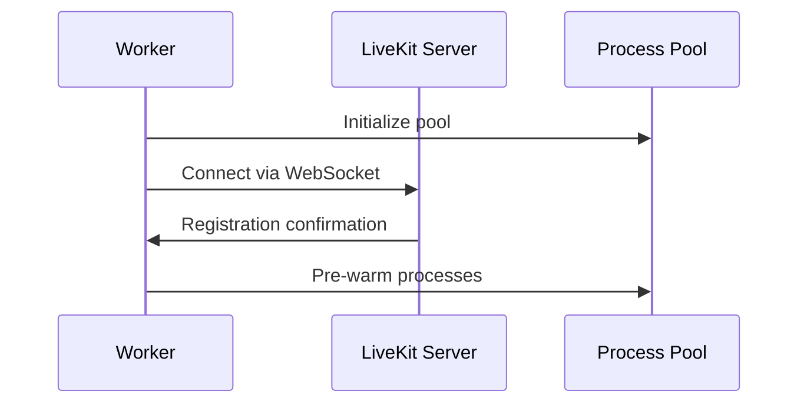

### Job Handling Flow:

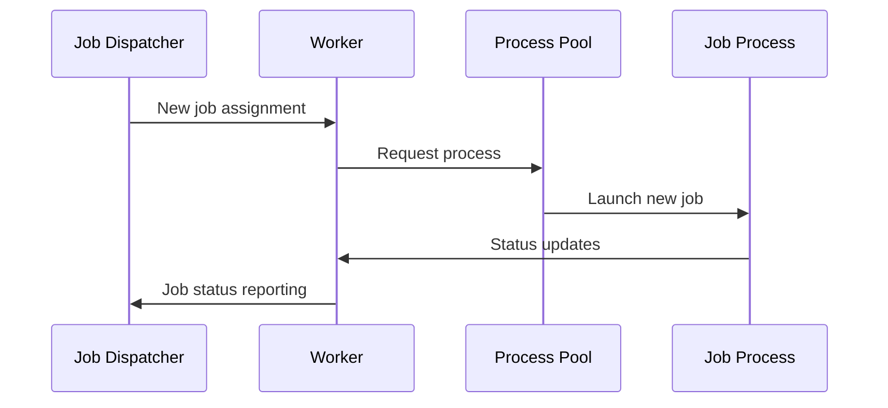

### State Transitions:

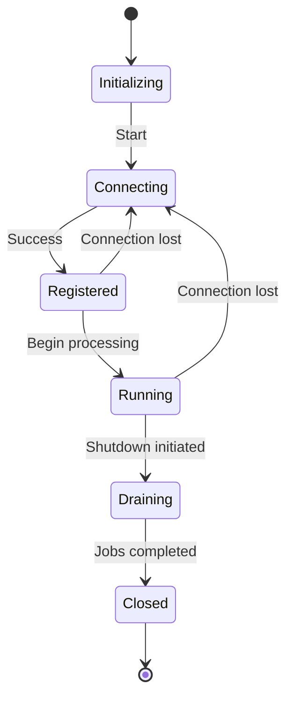


## Lifecycle Management

1. **Initialization**
   - Validate configuration
   - Start HTTP server
   - Initialize process pool

2. **Connection Phase**
   - Establish WebSocket connection
   - Register with LiveKit backend
   - Begin health monitoring

3. **Operation**
   - Handle job assignments
   - Spawn/manage job processes
   - Report status updates
   - Monitor resource usage

4. **Shutdown**
   - Drain active jobs
   - Close network connections
   - Clean up resources

## Best Practices

1. Use process-based execution (default) for better isolation
2. Set appropriate memory limits for your agent's requirements
3. Implement proper error handling in entrypoint functions
4. Use draining mode for graceful shutdowns during deployments
5. Monitor worker status through the HTTP health check endpoint


# CLI Documentation

[source](https://github.com/livekit/agents/blob/dev-1.0/livekit-agents/livekit/agents/cli/cli.py)

## Overview
This code implements a command-line interface (CLI) for managing LiveKit agents. It provides commands to run workers in different modes, connect to rooms, and manage plugin dependencies. The CLI is built using Python's Click library.

## Available Commands

### `start`
Start the worker in production mode.

**Options**:
| Option | Description | Default | Environment Variable |
|--------|-------------|---------|----------------------|
| `--log-level` | Logging level | INFO | - |
| `--url` | LiveKit server/Cloud URL | - | LIVEKIT_URL |
| `--api-key` | API key | - | LIVEKIT_API_KEY |
| `--api-secret` | API secret | - | LIVEKIT_API_SECRET |
| `--drain-timeout` | Graceful shutdown timeout (seconds) | 60 | - |

### `dev`
Start the worker in development mode with hot-reloading.

**Options**:
| Option | Description | Default | Environment Variable |
|--------|-------------|---------|----------------------|
| `--log-level` | Logging level | DEBUG | - |
| `--url` | LiveKit server/Cloud URL | - | LIVEKIT_URL |
| `--api-key` | API key | - | LIVEKIT_API_KEY |
| `--api-secret` | API secret | - | LIVEKIT_API_SECRET |
| `--asyncio-debug` | Enable asyncio debug | False | - |
| `--watch` | Enable file watching | True | - |

### `console`
Start an interactive chat console.

**Options**:
| Option | Description | Environment Variable |
|--------|-------------|----------------------|
| `--url` | LiveKit server/Cloud URL | LIVEKIT_URL |
| `--api-key` | API key | LIVEKIT_API_KEY |
| `--api-secret` | API secret | LIVEKIT_API_SECRET |

### `connect`
Connect to a specific room directly.

**Options**:
| Option | Description | Default | Environment Variable |
|--------|-------------|---------|----------------------|
| `--log-level` | Logging level | DEBUG | - |
| `--url` | LiveKit server/Cloud URL | - | LIVEKIT_URL |
| `--api-key` | API key | - | LIVEKIT_API_KEY |
| `--api-secret` | API secret | - | LIVEKIT_API_SECRET |
| `--asyncio-debug` | Enable asyncio debug | False | - |
| `--watch` | Enable file watching | True | - |
| `--room` | Room name to connect to (required) | - | - |
| `--participant-identity` | Participant identity | - | - |

### `download-files`
Download plugin dependency files.

**Options**:
| Option | Description | Default |
|--------|-------------|---------|
| `--log-level` | Logging level | DEBUG |

## Key Features
- Multiple environment modes (production/development)
- Hot-reloading in development mode
- Interactive console mode
- Direct room connection capability
- Plugin dependency management
- Graceful shutdown handling
- Configurable logging levels
- Environment variable support for credentials
- File watching for development reloads

The CLI uses environment variables for sensitive credentials by default, making it suitable for both local development and production deployments. The implementation handles signal interception for clean shutdowns and provides debugging endpoints when running in development mode.


## Voice Activity Detection (VAD) Interface

[source](https://github.com/livekit/agents/blob/dev-1.0/livekit-agents/livekit/agents/vad.py)

Voice Activity Detection (VAD) is a fundamental component in audio processing systems that identifies speech segments within an audio stream.

VAD is a requirement when an STT does not support streaming.

### Default Configuration

| Parameter | Default | Description |
|-----------|---------|-------------|
| `activation_threshold` | 0.5 | Threshold to consider a frame as speech. |
| `force_cpu` | True | Force the use of CPU for inference. |
| `max_buffered_speech` | 60 | Maximum duration of speech to keep in the buffer |
| `min_silence_duration` | 0.55s | Silence needed for END event |
| `min_speech_duration` | 0.55s | Minimum speech to trigger START |
| `padding_duration` | None | **(Deprecated)** Use `prefix_padding_duration` instead. |
| `prefix_padding_duration` | 0.5 |Duration of padding to add to the beginning of each speech chunk. |
| `sample_rate` | 16000 | Sample rate for the inference (only 8KHz and 16KHz are supported). |
| `silence_threshold` | 0.15 | Probability to confirm silence |
| `speech_threshold` | 0.85 | Probability to confirm speech |
| `update_interval` | 0.32s | Time between INFERENCE_DONE events |

### Processing Flow

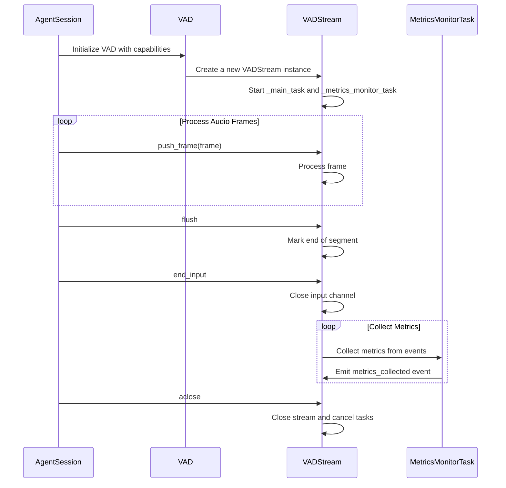


### Core Components

```python
class VADEventType(Enum):
    START_OF_SPEECH = "start_of_speech"  # Speech onset detected
    INFERENCE_DONE = "inference_done"    # Processing batch completed
    END_OF_SPEECH = "end_of_speech"      # Speech offset detected

@dataclass
class VADEvent:
    type: VADEventType
    samples_index: int         # Audio sample index (relative to inference rate)
    timestamp: float           # Event time in seconds
    speech_duration: float     # Length of speech segment (default: 0.2-0.5s)
    silence_duration: float    # Silence before/after speech (default: 0.3-1.0s)
    frames: list[rtc.AudioFrame]  # Raw audio frames
    probability: float = 0.0   # Speech confidence [0-1] (INFERENCE_DONE only)
    inference_duration: float = 0.0  # Processing time (INFERENCE_DONE only)
```

### Event Lifecycle

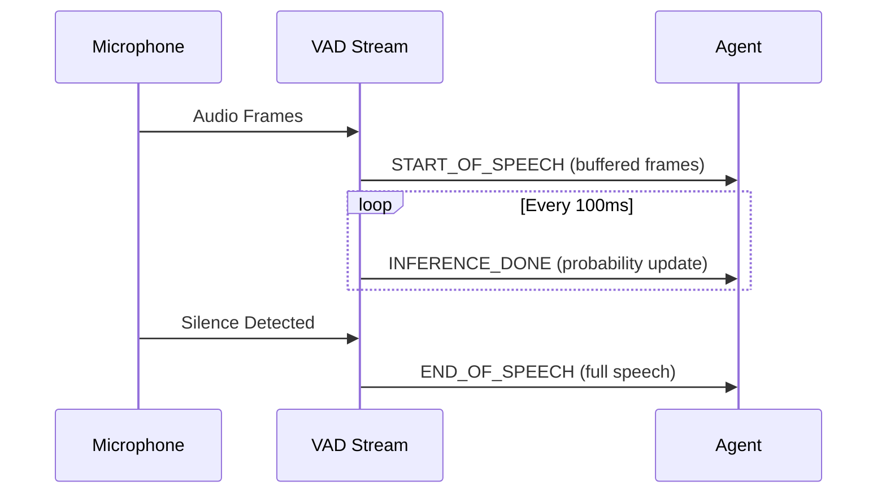


### Metrics Collection

```python
class VADMetrics:
    timestamp: float         # Time of metric collection
    idle_time: float         # Seconds since last speech activity
    inference_duration_total: float  # Total processing time
    inference_count: int     # Number of inferences
    label: str               # VAD implementation ID
```

Metrics are emitted every `1 / update_interval` inferences (default: 10x/second).

### Usage Example

```python
from livekit.agents.vad import VADEventType, VAD

class SpeechProcessor:
    def __init__(self, vad: VAD):
        self._vad_stream = vad.stream()
        self._vad_stream.on("metrics_collected", self._on_metrics)
        
    async def process(self):
        async for event in self._vad_stream:
            if event.type == VADEventType.START_OF_SPEECH:
                print(f"Speech started with {len(event.frames)} buffered frames")
            elif event.type == VADEventType.INFERENCE_DONE:
                print(f"Speech probability: {event.probability:.2f}")
            elif event.type == VADEventType.END_OF_SPEECH:
                audio = concatenate_frames(event.frames)
                print(f"Full speech: {audio.duration:.2f}s")

    def _on_metrics(self, metrics: VADMetrics):
        print(f"VAD Efficiency: {metrics.inference_duration_total/metrics.inference_count:.3f}s/inference")
```


## LLM (Language Model) Integration

[source](https://github.com/livekit/agents/blob/dev-1.0/livekit-agents/livekit/agents/llm/llm.py)

Core interface for integrating language models into voice agents.

### Base Classes

```python
class LLM(ABC):
    @abstractmethod
    def chat(
        self,
        *,
        chat_ctx: ChatContext,
        tools: list[FunctionTool],
        **kwargs,
    ) -> AsyncContextManager[AsyncIterable[ChatChunk]]:
        """Start a chat completion stream"""

class RealtimeModel(ABC):
    @abstractmethod
    def generate(
        self,
        prompt: str,
        **kwargs,
    ) -> AsyncIterable[RealtimeChunk]:
        """Generate real-time responses from a prompt"""
```

### Key Components

#### Chat Context
```python
class ChatContext:
    messages: list[ChatMessage]  # Conversation history
    functions: list[FunctionTool]  # Available functions
```

#### AI Function
```python
class FunctionTool:
    name: str
    description: str
    parameters: dict  # JSON Schema

    @abstractmethod
    async def execute(self, ctx: ToolContext) -> Any:
        """Implement function logic"""
```

### Function Execution Context

Provides runtime context for AI function execution, including parsed parameters and agent access.

#### Class Definition

```python
class ToolContext:
    def __init__(
        self,
        values: dict[str, Any],
        agent: AgentSession,
        function_tools: list[FunctionTool],
        stt: stt.STT | None,
        tts: tts.TTS | None,
        llm: llm.LLM | None,
    ):
        self.values = values  # Parsed function arguments
        self.agent = agent    # Parent AgentSession instance
        self.function_tools = function_tools  # Available functions
        self.stt = stt        # Speech-to-text service
        self.tts = tts        # Text-to-speech service
        self.llm = llm        # Language model
```

#### Key Properties

| Property        | Description                                  |
|-----------------|----------------------------------------------|
| `values`        | Dictionary of parsed function arguments      |
| `agent`         | AgentSession instance for state management     |
| `function_tools`  | List of available AI functions               |
| `stt/tts/llm`   | Access to configured speech services         |
|                 | May be None if not configured               |

#### Usage Example

```python
class NavigateFunction(llm.FunctionTool):
    def __init__(self):
        super().__init__(
            name="navigate",
            description="Control robot movement",
            parameters={
                "type": "object",
                "properties": {
                    "direction": {"type": "string", "enum": ["left", "right", "forward", "back"]},
                    "distance": {"type": "number"}
                }
            }
        )

    async def execute(self, ctx: ToolContext) -> str:
        direction = ctx.values["direction"]
        distance = ctx.values["distance"]
        
        # Access agent state
        ctx.agent.userdata["last_direction"] = direction
        
        # Use TTS to confirm action
        await ctx.agent.say(f"Moving {direction} {distance} meters")
        
        return f"Moved {direction} {distance}m successfully"
```

#### Context Capabilities

1. **Parameter Validation**: Automatic type checking of input values
2. **Service Access**: Direct usage of STT/TTS/LLM services
3. **State Management**: Modify agent state via `ctx.agent`
4. **Function Chaining**: Call other AI functions from context
5. **Error Handling**: Raise `ToolError` for function-specific errors

#### Best Practices

- Validate critical parameters before use
- Use agent locks for state mutations
- Prefer context services over global instances
- Limit function execution time
- Handle service failures gracefully
- Clean up resources in finally blocks

7. **Metrics Collection**:
   - Register metrics handlers early in agent initialization
   - Process metrics asynchronously to avoid blocking
   - Aggregate metrics for performance analysis

### Usage Example

```python
from livekit.agents import llm

class WeatherFunction(llm.FunctionTool):
    def __init__(self):
        super().__init__(
            name="get_weather",
            description="Get current weather",
            parameters={
                "type": "object",
                "properties": {
                    "location": {"type": "string"}
                }
            }
        )

    async def execute(self, ctx: ToolContext) -> str:
        location = ctx.values.get("location")
        return f"Weather in {location}: Sunny, 22°C"

# Using OpenAI LLM
from livekit.agents.llm import OpenAILlm

llm = OpenAILlm(api_key="your-key")
async with llm.chat(chat_ctx=chat_context, tools=[WeatherFunction()]) as stream:
    async for chunk in stream:
        print("Received:", chunk.text)
```

### Response Types

```python
class ChatChunk:
    text: str  # Incremental response text
    function_call: Optional[FunctionCall]  # Partial function call

class RealtimeChunk:
    text: str
    is_final: bool  # Whether chunk is end of response
```

### Best Practices

1. Use system messages to guide model behavior
2. Limit conversation history length
3. Validate function call parameters
4. Handle rate limits and retries
5. Use streaming for real-time interactions
6. Implement [fallback strategies](#fallback-adapters) for model errors

7. **Metrics Collection**:
   - Register metrics handlers early in agent initialization
   - Process metrics asynchronously to avoid blocking
   - Aggregate metrics for performance analysis

### Advanced Features

- **Function Calling:** Chain multiple AI functions
- **Response Caching:** Improve latency for common queries
- **Multi-modal Support:** Combine text with image/audio inputs
- **Custom Parsers:** Extract structured data from responses

### Key Performance Metrics

[source](https://github.com/livekit/agents/blob/dev-1.0/livekit-agents/livekit/agents/metrics/base.py)

```python
class LLMMetrics:
    type: str  # "llm_metrics"
    label: str  # Model identifier
    request_id: str  # Unique request ID
    timestamp: float  # Unix timestamp
    duration: float  # Total processing time in seconds
    ttft: float  # Time to first token in seconds
    cancelled: bool  # Whether request was cancelled
    completion_tokens: int # tokens that the model generates in response to the input
    prompt_tokens: int # tokens input into the model
    total_tokens: int
    tokens_per_second: float
```

### Metrics Collection Example

```python
from livekit.agents.metrics import LLMMetrics

class AlloyAgent(Agent):
    """
    This is a basic example that demonstrates the use of LLM metrics.
    """
    def __init__(self) -> None:
        llm = openai.LLM(model="gpt-4o-mini")
        super().__init__(
            instructions="You are Echo.",
            stt=deepgram.STT(),
            llm=llm,
            tts=cartesia.TTS(),
        )
        
        # Register metrics handler
        def sync_wrapper(metrics: LLMMetrics):
            asyncio.create_task(self.on_metrics_collected(metrics))

        llm.on("metrics_collected", sync_wrapper)

    async def on_metrics_collected(self, metrics: LLMMetrics) -> None:
        logger.info("LLM Metrics Collected:")
        logger.info(f"\tType: {metrics.type}")
        logger.info(f"\tLabel: {metrics.label}")
        logger.info(f"\tRequest ID: {metrics.request_id}")
        logger.info(f"\tTimestamp: {metrics.timestamp}")
        logger.info(f"\tDuration: {metrics.duration:.4f}s")
        logger.info(f"\tTTFT: {metrics.ttft:.4f}s")
        logger.info(f"\tCancelled: {metrics.cancelled}")
        logger.info(f"\tCompletion Tokens: {metrics.completion_tokens}")
        logger.info(f"\tPrompt Tokens: {metrics.prompt_tokens}")
        logger.info(f"\tTotal Tokens: {metrics.total_tokens}")
        logger.info(f"\tTokens Per Second: {metrics.tokens_per_second:.2f}")
```

This example shows how to:
1. Import the LLMMetrics class
2. Register a metrics handler on LLM initialization
3. Format and log metrics with proper indentation
4. Access key performance indicators like TTFT and token counts

Added to existing sections:
1. Added LLMMetrics class definition to "Key Performance Metrics"
2. Added practical example to "Monitoring & Alerting" section
3. Updated "Best Practices" with metrics collection recommendations

### Internal Metrics Implementation

```python
class LLMStream:
    async def _metrics_monitor_task(self):
        # Internal implementation that automatically
        # tracks and emits LLMMetrics
```

### TTFT Measurement Implementation

```python
class LLM(ABC):
    @abstractmethod
    def chat(self, ...) -> AsyncIterable[ChatChunk]:
        start_time = time.monotonic()
        first_token_received = False
        
        async for chunk in self._generate():
            if not first_token_received:
                ttft = time.monotonic() - start_time
                self._emit_metric('ttft', ttft)
                first_token_received = True
            yield chunk
```

### Optimization Techniques

1. **Prefetching** - Start model warmup during STT processing:
```python
async def stt_node(self, audio):
    # Warm up LLM during STT processing
    self.llm.prefetch_context()
    return await super().stt_node(audio)
```

2. **Partial Results Streaming** - Deliver tokens incrementally:
```python
async with llm.chat(...) as stream:
    async for chunk in stream:
        if chunk.text:
            await tts_stream.push_text(chunk.text)
```

3. **Model Quantization** - Use 8-bit/4-bit quantized models:
```python
llm = OpenAILlm(
    model="gpt-4",
    quantization="4bit"  # Reduces TTFT by 30-40%
)
```

### TTFT Benchmarks

| Model Size | Avg TTFT | Function Calling Impact |
|------------|----------|-------------------------|
| 7B params  | 450ms    | +150ms per function     |
| 13B params | 650ms    | +200ms per function     |
| 70B params | 1200ms   | +300ms per function     |

### Monitoring & Alerting

```python
# Set performance thresholds
LLM_METRICS = {
    'ttft': {
        'warning': 1500,
        'critical': 2500  # milliseconds
    }
}

def check_metrics():
    if metrics['ttft'] > LLM_METRICS['ttft']['critical']:
        trigger_alert("LLM latency exceeded critical threshold")
```

### Best Practices

1. Keep context windows under 4K tokens for real-time use
2. Use smaller models for voice-first interfaces
3. Parallelize function execution where possible
4. Implement model warmup strategies
5. Monitor TTFT percentiles (p90/p95) rather than averages

### TTFT vs TTFB Relationship

This documentation appears in the [LLM Integration](#llm-language-model-integration) section with cross-references to [Monitoring Metrics](#monitoring-and-metrics).


## Chat Context Management

[source](https://github.com/livekit/agents/blob/dev-1.0/livekit-agents/livekit/agents/llm/chat_context.py)

Core class for managing conversation history and function calling state.

### Class Definition

```python
class ChatContext:
    def __init__(self, messages: list[ChatMessage], functions: list[FunctionTool]):
        self.messages = messages
        self.functions = functions

    @classmethod
    def empty(cls) -> ChatContext:
        """Create empty chat context"""
    
    def copy(self) -> ChatContext:
        """Create a deep copy of the context"""
    
    def trim_messages(
        self,
        max_messages: int | None = None,
        max_tokens: int | None = None,
        tokenizer: Tokenizer = default_tokenizer(),
    ) -> None:
        """Trim conversation history based on limits"""
```

### Message Types

```python
class ChatMessage:
    class Role(Enum):
        SYSTEM = "system"
        USER = "user"
        ASSISTANT = "assistant"
        FUNCTION = "function"

    role: Role
    name: str | None  # For function messages
    content: str | None
    function_call: FunctionCall | None  # For assistant messages
```

### Key Methods

| Method                          | Description                                  |
|---------------------------------|----------------------------------------------|
| `add_system_message(content)`   | Add system prompt/instructions              |
| `add_user_message(content)`     | Add user query                               |
| `add_assistant_message(content, function_call)` | Add LLM response |
| `add_function_result(name, result)` | Add function call result              |
| `clear_messages()`              | Reset conversation history                   |
| `merge(other_ctx)`              | Combine with another context                 |

### Usage Example

```python
# Create new context with system message
ctx = ChatContext.empty()
ctx.add_system_message("You're a helpful assistant")

# Conversation flow
ctx.add_user_message("What's the weather in Paris?")
ctx.add_assistant_message(
    None,
    function_call=FunctionCall(name="get_weather", arguments={"location": "Paris"})
)
ctx.add_function_result("get_weather", "Sunny, 22°C")

# Trim to last 2 messages
ctx.trim_messages(max_messages=2)
```

### Best Practices

1. Start with clear system instructions
2. Include function results in history for context
3. Use trim_messages() to manage token limits
4. Clone contexts for branching conversations
5. Add metadata via hidden system messages
6. Validate function call arguments before execution

### Advanced Features

- **Context Branching:** Create conversation variants using copy()
- **Token Counting:** Integrate custom tokenizers
- **Selective Merging:** Combine relevant history from multiple contexts
- **Message Metadata:** Store additional data in message objects
- **Function Call Chaining:** Handle sequential function executions


## Fallback Adapters

* Fallback Adapter Source
    * [llm source](https://github.com/livekit/agents/blob/dev-1.0/livekit-agents/livekit/agents/llm/fallback_adapter.py)
    * [stt source](https://github.com/livekit/agents/blob/dev-1.0/livekit-agents/livekit/agents/stt/fallback_adapter.py)
    * [tts source](https://github.com/livekit/agents/blob/dev-1.0/livekit-agents/livekit/agents/tts/fallback_adapter.py)

Utility classes for implementing failover and fallback strategies across speech components.

**fallback adapter's reliability mechanisms :**
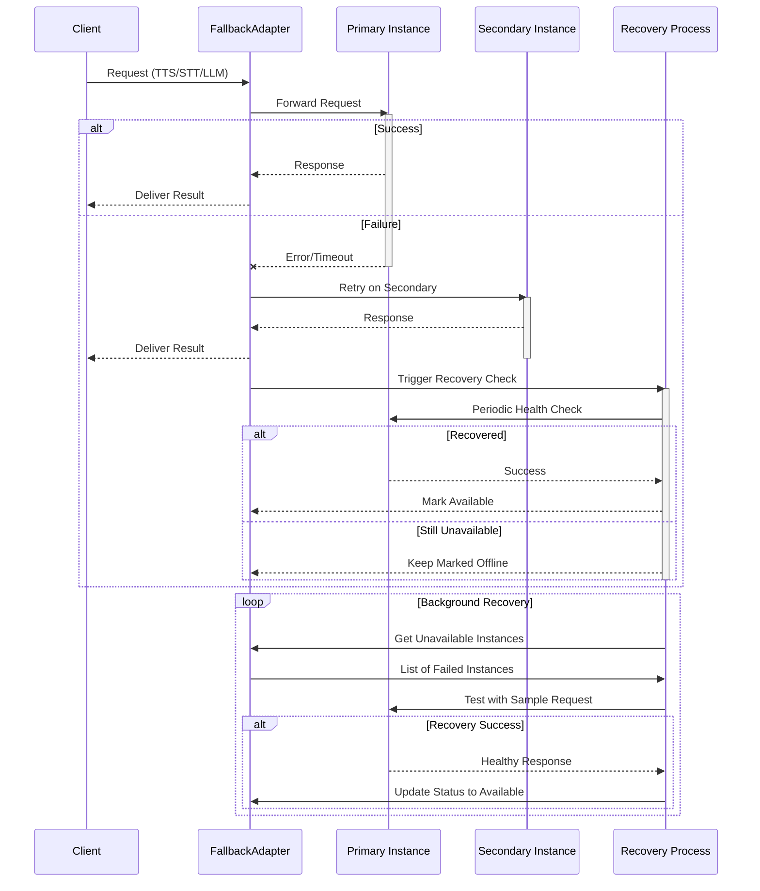

### FallbackAdapter Class

```python
class FallbackAdapter(Generic[Service_T]):
    def __init__(
        self,
        primary: Service_T,
        backups: list[Service_T],
        *,
        timeout: float = 2.0,
        max_retries: int = 3,
        health_check_interval: float = 30.0,
    ):
        """
        Args:
            primary: Primary service instance
            backups: Ordered list of backup instances
            timeout: Timeout for service operations
            max_retries: Retry attempts before failing over
            health_check_interval: Interval for checking primary recovery
        """
```

### Key Features

- Automatic failover to backup services on errors
- Health monitoring and primary service reactivation
- Configurable timeouts and retry policies
- Unified interface matching wrapped service APIs

### Supported Services

- [STT](#speech-to-text-stt-implementation)
- [TTS](#text-to-speech-tts-implementation)
- [LLM](#llm-language-model-integration)
- [VAD](#vad-voice-activity-detection)

### Usage Example

```python
from livekit.agents import stt, tts
from livekit.agents.utils import FallbackAdapter

# Configure STT with fallback
primary_stt = stt.DeepgramSTT()
backup_stt = stt.WhisperSTT()
stt_adapter = FallbackAdapter(primary_stt, [backup_stt])

# Configure TTS with fallback  
primary_tts = tts.ElevenLabsTTS()
backup_tts = tts.AzureTTS()
tts_adapter = FallbackAdapter(primary_tts, [backup_tts])

# Use in AgentSession
agent = AgentSession(
    stt=stt_adapter,
    tts=tts_adapter,
    llm=OpenAILlm()
)
```

### Configuration Tips

1. Order backups by cost/performance priority
2. Set timeouts shorter than your quality requirements
3. Monitor failover events via service metrics
4. Use circuit breakers for unhealthy services
5. Combine with retry middleware for robustness

### Best Practices

- Implement health checks for all services
- Log failover events with service identifiers
- Gradually reintroduce recovered primaries
- Track usage metrics per service instance
- Set alerts for frequent failovers
- Test fallback paths regularly

### Monitoring Interface

```python
# Get current active service
active_service = fallback_adapter.active_service

# Get service health status
status = fallback_adapter.get_service_health(primary_stt)
print(f"Primary healthy: {status.healthy}, last error: {status.last_error}")

# Event listeners
fallback_adapter.on_failover = lambda old, new: print(f"Failed over to {new}")
fallback_adapter.on_recovery = lambda svc: print(f"Recovered {svc}")
```

### Error Handling

- Retries transient errors on current service
- Fails over after max_retries exceeded
- Preserves error types from underlying services
- Surfaces service-specific error metadata
- Implements backoff between retry attempts


## Audio Recognition Pipeline

[source](https://github.com/livekit/agents/blob/dev-1.0/livekit-agents/livekit/agents/voice/audio_recognition.py)

Core components for converting speech to text and managing conversation flow.

### Overview
The `AudioRecognition` class orchestrates real-time audio processing with three main components:
1. **Speech-to-Text (STT)** - Converts audio to text transcripts
2. **Voice Activity Detection (VAD)** - Identifies speech segments
3. **Turn Detection** - Determines conversation turn boundaries

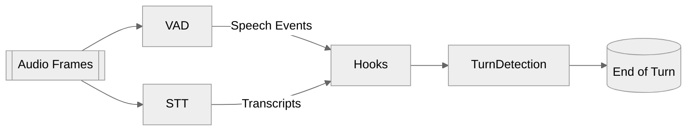

### Key Components

#### 1. Speech-to-Text (STT) Integration
- Processes audio frames through configured STT engine
- Handles both interim and final transcripts
- Buffers transcripts for conversation context

#### 2. Voice Activity Detection (VAD)
- Monitors audio stream for speech presence
- Triggers `on_start_of_speech`/`on_end_of_speech` events
- Visualizes speech probability in debug tools

#### 3. Turn Detection Logic
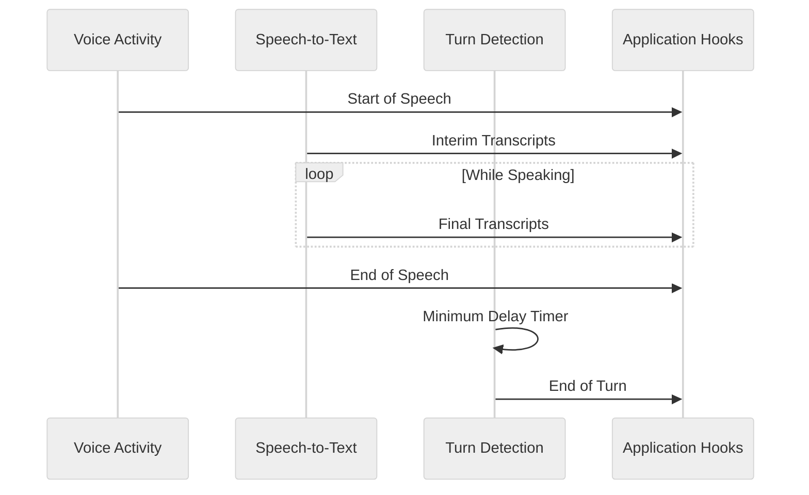

### Lifecycle Management
1. **Initialization**
```python
def __init__(
    self,
    *,
    hooks: RecognitionHooks,
    stt: io.STTNode | None,
    vad: vad.VAD | None,
    turn_detector: _TurnDetector | None,
    min_endpointing_delay: float,
)
```

2. **Runtime Control**
```python
def start(self) -> None  # Start processing
def stop(self) -> None   # Stop processing
def push_audio(self, frame: rtc.AudioFrame) -> None  # Feed audio data
```

3. **Cleanup**
```python
async def aclose(self) -> None  # Graceful shutdown
```

### Implementing Hooks with Decorators
While the core class uses protocol-based hooks, you can implement them with decorators in your application layer:

```python
from livekit.agents.voice import RecognitionHooks

class MyAgentHooks:
    def __init__(self):
        self.chat_history = llm.ChatContext()
    
    @RecognitionHooks.on_start_of_speech
    def _on_speech_start(self, ev: vad.VADEvent) -> None:
        self._show_ui_indicator(True)

    @RecognitionHooks.on_interim_transcript
    def _update_captions(self, ev: stt.SpeechEvent) -> None:
        self._display_text(ev.alternatives[0].text)

    @RecognitionHooks.on_end_of_turn
    async def _handle_response(self, transcript: str) -> None:
        response = await self.llm.generate_response(transcript)
        self._speak(response)

    @RecognitionHooks.retrieve_chat_ctx
    def _get_chat_context(self) -> llm.ChatContext:
        return self.chat_history.copy()
```


### Configuration Tips
```python
# Example initialization
recognition = AudioRecognition(
    hooks=MyRecognitionHooks(),
    stt=GoogleSTT(),
    vad=WebRTCVAD(),
    turn_detector=LLMTurnDetector(),
    min_endpointing_delay=1.0
)
```

| Parameter               | Description                                                                 |
|-------------------------|-----------------------------------------------------------------------------|
| `min_endpointing_delay` | Minimum wait time after speech before considering turn end (seconds)        |
| `UNLIKELY_END_OF_TURN_EXTRA_DELAY` | Additional delay if turn detection confidence is low                      |
| `stt`/`vad`             | Plugable modules for speech processing                                      |

### Common Use Cases
1. Real-time conversation transcription
2. Voice-controlled interface timing
3. Adaptive response timing based on speech patterns
4. Debugging audio processing pipelines

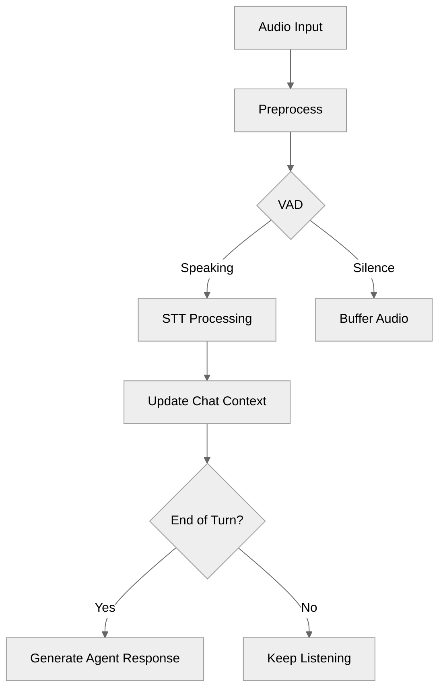


## Speech-to-Text (STT) Implementation

[source](https://github.com/livekit/agents/blob/dev-1.0/livekit-agents/livekit/agents/stt/stt.py)

### Core STT Interface

```python
class STT(ABC):
    @abstractmethod
    async def recognize(self, buffer: AudioBuffer, language: str | None = None) -> SpeechEvent:
        """Process audio buffer and return transcription"""

    @abstractmethod
    def stream(self, language: str | None = None) -> RecognizeStream:
        """Create streaming recognition session"""
```

**Note:** VAD is required when streaming is not supported by the STT plugin. Example: `vad=silero.VAD.load()`


#### Speech Data Structure
```python
@dataclass
class SpeechData:
    text: str             # Recognized text
    confidence: float     # Confidence score [0-1]
    language: str         # Detected language
    start_time: float     # Audio start timestamp
    end_time: float       # Audio end timestamp
```

#### Recognition Events
```python
class SpeechEventType(Enum):
    START_OF_SPEECH = "start_of_speech"
    INTERIM_TRANSCRIPT = "interim_transcript" 
    FINAL_TRANSCRIPT = "final_transcript"
    END_OF_SPEECH = "end_of_speech"
```

### Streaming Recognition
```python
class RecognizeStream:
    def push_frame(self, frame: rtc.AudioFrame) -> None:
        """Add audio frame to processing stream"""

    async def __anext__(self) -> SpeechEvent:
        """Get next recognition event"""

    async def aclose(self) -> None:
        """Close stream immediately"""
```

### Fallback Adapter Implementation

Provides automatic failover between multiple STT providers:

```python
class FallbackAdapter(STT):
    def __init__(
        self,
        stt_instances: list[STT],
        *,
        attempt_timeout: float = 10.0,
        max_retries: int = 1,
        retry_interval: float = 5
    ):
    """
    Args:
        stt_instances: Ordered list of STT providers
        attempt_timeout: Per-provider attempt timeout
        max_retries: Max retries per provider
        retry_interval: Delay between retry attempts
    """
```

#### Usage Example
```python
primary_stt = DeepgramSTT()
backup_stt = WhisperSTT()
fallback_stt = FallbackAdapter([primary_stt, backup_stt])

# Will automatically failover if primary fails
result = await fallback_stt.recognize(audio_buffer)
```

### Stream Adapter Implementation

Enables streaming for non-streaming STT using VAD:

```python
class StreamAdapter(STT):
    def __init__(self, stt: STT, vad: VAD):
        """
        Args:
            stt: Non-streaming STT to wrap
            vad: Voice activity detector
        """
```

#### Processing Flow
1. Uses VAD to detect speech segments
2. Accumulates audio frames during speech
3. Sends full segments to STT when speech ends
4. Emits final transcriptions

### Best Practices

1. Use FallbackAdapter for production-critical systems
2. Set appropriate timeouts based on network conditions
3. Monitor STT metrics for accuracy/latency tradeoffs
4. Combine streaming and non-streaming STT strategically
5. Implement audio preprocessing (noise reduction, normalization)

### Configuration Guide

| Parameter          | Recommendation          | Purpose                          |
|--------------------|--------------------------|----------------------------------|
| `attempt_timeout`  | 5-15 seconds             | Balance responsiveness vs costs  |
| `max_retries`      | 1-3 attempts             | Reduce cascading failures        |
| `retry_interval`   | 2-5 seconds              | Allow transient issue resolution |
| `vad_threshold`    | 0.3-0.7                  | Tune speech sensitivity          |
| `language`         | "en-US"/"auto"           | Multilingual support             |

### Advanced Features

- **Audio Resampling**: Automatic sample rate conversion
- **Batched Processing**: Optimize for high-throughput scenarios
- **Confidence Filtering**: Reject low-confidence transcripts
- **Language Detection**: Automatic language identification
- **Custom Dictionaries**: Boost domain-specific terminology

### STT Metrics Collection

```python
class STTMetrics:
    type: str = "stt_metrics"
    label: str              # STT provider identifier (e.g. "deepgram.STT")
    request_id: str         # Unique recognition identifier
    timestamp: float        # Unix timestamp of metric creation
    duration: float         # Total processing time in seconds
    audio_duration: float   # Length of audio processed in seconds
    streamed: bool          # Whether metrics came from streaming API
    error: str | None       # Error message if recognition failed
```

#### Key Metrics Fields

| Field | Description |
|-------|-------------|
| `audio_duration` | Actual duration of audio processed |
| `duration` | Total processing time from request to response |
| `streamed` | True for streaming recognitions, False for single-shot |
| `error` | Error message if recognition failed |

#### Example Usage

```python
from livekit.agents.metrics import STTMetrics

class AlloyAgent(Agent):
    """
    This is a basic example that demonstrates the use of STT metrics.
    """
    def __init__(self) -> None:
        llm = openai.LLM(model="gpt-4o-mini")
        stt = deepgram.STT()
        tts = cartesia.TTS()
        super().__init__(
            instructions="You are Echo.",
            stt=stt,
            llm=llm,
            tts=tts
        )
        
        # Wrap async handler in sync function
        def sync_wrapper(metrics: STTMetrics):
            asyncio.create_task(self.on_metrics_collected(metrics))
            
        stt.on("metrics_collected", sync_wrapper)

    async def on_metrics_collected(self, metrics: STTMetrics) -> None:
        logger.info("STT Metrics Collected:")
        logger.info(f"\tType: {metrics.type}")
        logger.info(f"\tLabel: {metrics.label}")
        logger.info(f"\tRequest ID: {metrics.request_id}")
        logger.info(f"\tTimestamp: {metrics.timestamp}")
        logger.info(f"\tDuration: {metrics.duration:.4f}s")
        logger.info(f"\tSpeech ID: {metrics.speech_id}")
        logger.info(f"\tError: {metrics.error}")
        logger.info(f"\tStreamed: {metrics.streamed}")
        logger.info(f"\tAudio Duration: {metrics.audio_duration:.4f}s")
```

#### Metrics Flow Diagram

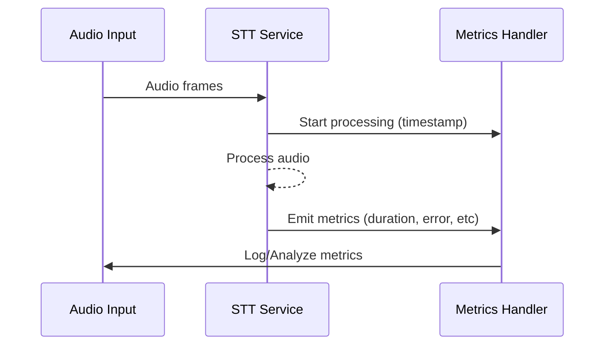

Key points:
1. Metrics are emitted after each recognition request
2. Streamed recognitions emit multiple metrics events
3. Error field helps diagnose recognition failures
4. Duration/audio_duration ratio shows processing efficiency


## Text-to-Speech (TTS) Implementation

[source](https://github.com/livekit/agents/blob/dev-1.0/livekit-agents/livekit/agents/tts/tts.py)

### Core TTS Interface

```python
class TTS(ABC):
    @abstractmethod
    def synthesize(self, text: str) -> ChunkedStream:
        """Convert text to audio (non-streaming)"""

    @abstractmethod
    def stream(self) -> SynthesizeStream:
        """Create real-time synthesis stream"""
```

#### Synthesized Audio Structure
```python
@dataclass
class SynthesizedAudio:
    frame: rtc.AudioFrame  # Audio data
    request_id: str        # Unique request identifier
    is_final: bool         # Marks end of audio segment
    segment_id: str        # Grouping ID for multi-part responses
    delta_text: str        # Text chunk being synthesized
```

### Streaming Implementation
```python
class SynthesizeStream:
    def push_text(self, token: str) -> None:
        """Add text incrementally"""

    def flush(self) -> None:
        """Mark end of current segment"""
        
    async def __anext__(self) -> SynthesizedAudio:
        """Get next audio chunk"""
```

### Fallback Adapter Implementation

Ensures continuous TTS service with automatic failover:

```python
class FallbackAdapter(TTS):
    def __init__(
        self,
        tts_instances: list[TTS],
        *,
        attempt_timeout: float = 10.0,
        max_retries: int = 1,
        no_fallback_after: float = 3.0
    ):
        """
        Args:
            tts_instances: Ordered list of TTS providers
            attempt_timeout: Per-provider attempt timeout
            max_retries: Retries per provider before failing over
            no_fallback_after: Disable fallback after X seconds of audio
        """
```

#### Usage Example
```python
primary_tts = ElevenLabsTTS()
backup_tts = AzureTTS()
fallback_tts = FallbackAdapter([primary_tts, backup_tts])

# Automatically fails over if primary fails
async for audio in fallback_tts.synthesize("Hello world"):
    play_audio(audio.frame)
```

### Stream Adapter Implementation

Enables real-time streaming for non-streaming TTS:

```python
class StreamAdapter(TTS):
    def __init__(
        self, 
        tts: TTS,
        tokenizer: SentenceTokenizer
    ):
        """
        Args:
            tts: Non-streaming TTS to wrap
            tokenizer: Splits text into synthesis chunks
        """
```

#### Processing Flow:
1. Accepts incremental text input
2. Splits text into sentences using tokenizer
3. Synthesizes sentences sequentially
4. Emits audio chunks in real-time

### Key Configuration Parameters

| Parameter          | Default  | Description                          |
|--------------------|----------|--------------------------------------|
| `attempt_timeout`  | 10s      | Timeout per synthesis attempt        |
| `max_retries`      | 1        | Retries before switching providers   |
| `no_fallback_after`| 3s       | Minimum audio to prevent fallback    |
| `sample_rate`      | 24000    | Target output sample rate            |
| `num_channels`     | 1        | Mono/stereo output                   |

### Best Practices

1. Use FallbackAdapter with geographically distributed providers
2. Set no_fallback_after to 2-3 seconds for natural voice continuity
3. Monitor TTFB (Time-to-First-Byte) for latency optimization
4. Implement audio caching for frequently used phrases
5. Use sentence tokenization for natural speech pacing
6. Combine with acoustic echo cancellation in voice interfaces

### Advanced Features

- **Audio Resampling**: Automatic sample rate conversion
- **Multi-voice Support**: Dynamic voice selection per request
- **Prosody Control**: SSML markup for pitch/rate adjustments  
- **Phoneme Alignment**: Word-level timing metadata
- **Emotion Modeling**: Expressive speech synthesis
- **Multilingual Synthesis**: Automatic language detection

### Monitoring Metrics

[source](https://github.com/livekit/agents/blob/dev-1.0/livekit-agents/livekit/agents/metrics/base.py)

| Metric             | Description                          | Alert Threshold    | Function Calling Impact          |
|--------------------|--------------------------------------|--------------------|-----------------------------------|
| TTFB (Time to First Byte) | Total latency from request start to first audio chunk | >1500ms | Each function call adds 200-500ms per iteration |

### Detailed TTFB Breakdown

TTFB measures the total time from when:
1. User speech is detected (VAD START event)
2. Through complete processing pipeline:
   - STT transcription
   - LLM processing (including function executions)
   - TTS synthesis
3. Until first audio frame is emitted

See [Core Metrics](#core-metrics) for detailed break dowan of calcualtion.

### Key Components Affecting TTFB

1. **STT Latency**: Time to convert speech to text
2. **LLM Processing**: 
   - Initial response generation
   - Function execution time (cumulative across calls)
   - Result processing after function returns
3. **TTS Latency**: Time to generate first audio chunk

### Optimization Strategies

1. **Parallel Function Execution** (when safe):
```python
@function_tool
async def get_weather(ctx):
    # Execute I/O operations concurrently
    forecast, news = await asyncio.gather(
        fetch_forecast(ctx.values["location"]),
        fetch_weather_news()
    )
    return f"{forecast}. {news}"
```

2. **Caching Frequent Requests:**
```python
from functools import lru_cache

@lru_cache(maxsize=100)
def cached_search(query: str) -> dict:
    return expensive_search_operation(query)
```

3. **TTFB Budget Allocation:**
```python
# Recommended time distribution
TTFB_BUDGET = {
    "stt": 0.3,    # 30%
    "llm": 0.5,    # 50% 
    "tts": 0.2     # 20%
}
```

4. **Streaming Optimization:**
```python
async with llm.chat(...) as stream:
    first_chunk = await stream.__anext__()
    # Start TTS synthesis immediately on first text chunk
    tts_stream.push_text(first_chunk.text)
```

### Function Calling Specifics

1. **Cold Start Penalty** - First function call in a chain adds 100-300ms extra latency
2. **Sequential Calls** - Each subsequent function adds its full duration to TTFB
3. **Network Calls** - External API calls dominate TTFB (60-80% of total)

**Monitoring Recommendations:**
```python
# Track function execution times
def log_function(fn):
    async def wrapper(ctx):
        start = time.monotonic()
        try:
            return await fn(ctx)
        finally:
            duration = time.monotonic() - start
            ctx.agent.emit("fnc_metrics", {"name": fn.__name__, "duration": duration})
    return wrapper

@log_function
@function_tool
async def example_function(ctx):
    ...
```

### Threshold Guidance

| Scenario              | Recommended Max TTFB | Function Call Allowance       |
|-----------------------|-----------------------|-------------------------------|
| Real-time conversation| 1200ms                | 1-2 fast functions (<200ms)   |
| Complex workflows     | 2500ms                | 3-5 functions with caching    |
| Batch processing      | 5000ms                | Unlimited with async streaming|

### Cross-Component Impact

1. **STT** - Faster transcription reduces LLM start delay
2. **LLM** - Model size vs speed tradeoff directly affects TTFB
3. **TTS** - Streaming synthesis can mask latency after first chunk

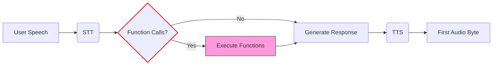

### TTS Metrics Implementation

```python
from livekit.agents.metrics import TTSMetrics

class TTSMetrics:
    type: str = "tts_metrics"
    label: str            # Provider identifier (e.g. "cartesia.TTS")
    request_id: str       # Unique synthesis request ID
    timestamp: float      # Unix timestamp of metric creation
    ttfb: float           # Time-to-first-byte latency in seconds
    duration: float       # Total processing duration
    audio_duration: float # Output audio length in seconds  
    characters_count: int # Number of input characters
    streamed: bool        # Whether using streaming API
    cancelled: bool       # If request was cancelled
    error: str | None     # Error message if failed
```

### Metrics Collection Example

```python
class AlloyAgent(Agent):
    """
    This is a basic example that demonstrates the use of TTS metrics.
    """
    def __init__(self) -> None:
        llm = openai.LLM(model="gpt-4o-mini")
        stt = deepgram.STT()
        tts = cartesia.TTS()
        super().__init__(
            instructions="You are Alloy, a helpful assistant.",
            stt=stt,
            llm=llm,
            tts=tts
        )
        
        # Wrap async handler in sync function
        def sync_wrapper(metrics: TTSMetrics):
            asyncio.create_task(self.on_metrics_collected(metrics))
            
        tts.on("metrics_collected", sync_wrapper)

    async def on_metrics_collected(self, metrics: TTSMetrics) -> None:
        logger.info("TTS Metrics Collected:")
        logger.info(f"\tType: {metrics.type}")
        logger.info(f"\tLabel: {metrics.label}")
        logger.info(f"\tRequest ID: {metrics.request_id}")
        logger.info(f"\tTimestamp: {metrics.timestamp}")
        logger.info(f"\tTTFB: {metrics.ttfb:.4f}s")
        logger.info(f"\tDuration: {metrics.duration:.4f}s")
        logger.info(f"\tAudio Duration: {metrics.audio_duration:.4f}s")
        logger.info(f"\tCancelled: {metrics.cancelled}")
        logger.info(f"\tCharacters Count: {metrics.characters_count}")
        logger.info(f"\tStreamed: {metrics.streamed}")
        logger.info(f"\tSpeech ID: {metrics.speech_id}")
        logger.info(f"\tError: {metrics.error}")
```

### Metrics Flow with Adapters

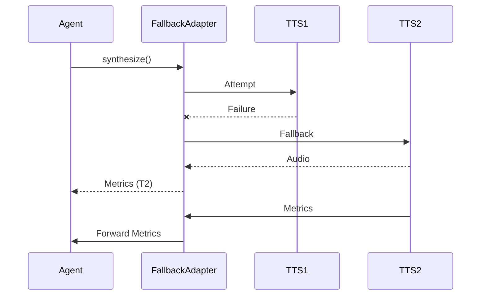

Key behaviors:
1. **FallbackAdapter** emits metrics from the active TTS provider
2. **StreamAdapter** forwards metrics from the wrapped TTS
3. Metrics include adapter-specific `label` for origin tracking
4. `streamed` field indicates real-time streaming usage

### Best Practices for Metrics

1. **Monitor Key Ratios**:
   ```python
   # Ideal TTFB < 1.5s, Duration/Audio < 2.0
   if metrics.ttfb > 1.5:
       logger.warning("High synthesis latency")
   
   if metrics.duration / metrics.audio_duration > 3.0:
       logger.error("Inefficient TTS processing")
   ```

2. **Error Handling**:
   ```python
   async def on_metrics_collected(self, metrics: TTSMetrics):
       if metrics.error:
           if "rate limit" in metrics.error:
               await self._switch_tts_provider()
           elif "connection" in metrics.error:
               self._check_network_status()
   ```

3. **Adapter-Specific Tracking**:
   ```python
   def _handle_tts_metrics(self, metrics: TTSMetrics):
       if "FallbackAdapter" in metrics.label:
           self._track_fallback_usage(metrics)
       elif "StreamAdapter" in metrics.label: 
           self._monitor_stream_efficiency(metrics)
   ```

### Configuration Additions

| Parameter          | Default | Purpose                          |
|--------------------|---------|----------------------------------|
| `max_ttfb`         | 2000ms  | Alert threshold for first chunk  |
| `min_audio_ratio`  | 0.8     | Minimum audio/input duration     |
| `error_window`     | 5       | Errors per minute before disable |

### Full Synthesis Flow

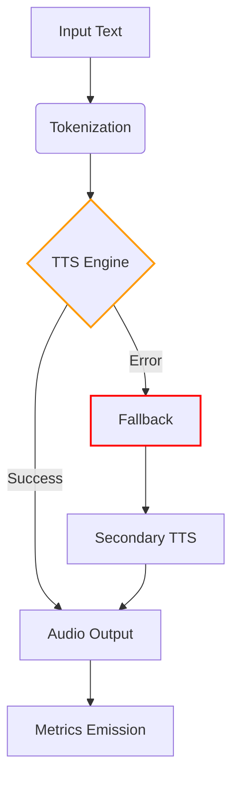

Key additions:
1. Clear TTSMetrics class documentation
2. Practical usage example with error handling
3. Adapter behavior visualization
4. Metrics-driven best practices
5. Configuration guidance for monitoring
6. Full system flow diagram


## Performance Monitoring & Metrics

The framework provides detailed performance metrics collected through utility modules. All metrics are measured in milliseconds unless otherwise specified.

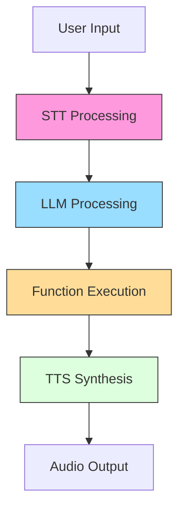

### Core Metrics

| Metric | Calculation | Description | Impact Factors |
|--------|-------------|-------------|----------------|
| **STT Latency** | `transcript_end - audio_start` | Full speech-to-text conversion time | Audio length, model complexity |
| **TTFB (Time to First Byte)** | `first_audio_frame_time - text_start` | TTS response initiation delay | text length, model complexity  |
| **TTFT (Time to First Token)** | `first_token_time - llm_start` | LLM response initiation delay | Model size, context length |


### Metric Visualization

```mermaid
gantt
    title End-to-End Processing Timeline
    dateFormat  X
    axisFormat %s
    section Components
    STT Processing : 0, 1500
    LLM Processing : 1500, 3000
    TTS Synthesis : 3000, 4500
```

### Initial Prompt Metrics Example

This example breaks down what metrics are calculated during the initial prompt when someone joins the room that says:  

`Initial Prompt: Hello from the weather station. Tell me your location to check the weather.`

The text is chunked into two parts and sent to TTS.

```mermaid
sequenceDiagram
    participant U as User
    participant agent as Agent
    participant VAD
    participant EOU
    participant STT as STT<br>Deepgram
    participant LLM as LLM<br>OpenAI
    participant FNC as Function
    participant TTS as TTS<br>OpenAI
    
    Note over agent,TTS: Initial Prompt: Hello from the weather station. Tell me your location to check the weather.<br>Note: can get split into multip chuncks that will have same sequence_id
    
    agent->>agent: chunck text

    Note over agent,TTS: ChunkA: Hello from the weather station.
    agent->>+TTS: Hello from the weather station.
    TTS->>agent: audio frame[0]
    Note left of U: TTFB = time until agent receive frist audio frame
    agent->>U: audio frame[0]
    agent->>agent: audio_duration += audio frame[0].duration
    TTS->>-agent: audio frame[1-N]
    agent->>agent: audio_duration += audio frame[1-N].duration
    agent->>U: audio frame[1-N]
    Note left of U: audio_duration = sum of all audio frame durations


    Note over agent,TTS: ChunkB: Tell me your location to check the weather.
    agent->>+TTS: Tell me your location to check the weather.
    TTS->>agent: audio frame[0]
    Note left of U: TTFB = time until agent receive frist audio frame
    TTS->>agent: audio frame[0]
    agent->>agent: audio_duration += audio frame[0].duration
    TTS->>-agent: audio frame[1-N]
    agent->>agent: audio_duration += audio frame[1-N].duration
    agent->>U: audio frame[1-N]
    Note left of U: audio_duration = sum of all audio frame durations
```

## Metrics Round Trip (no function call)

This example breaks down what metrics are calculated during a user request and the response they hear.

**User:** `Can you hear me?`  
**Reponse:** `Yes, I can hear you! Please tell me the location you'd like the weather for.`  


```mermaid
sequenceDiagram
    participant U as User
    participant agent as Agent
    participant STT as STT<br>Deepgram
    participant LLM as LLM<br>OpenAI
    participant FNC as Function
    participant TTS as TTS<br>OpenAI
    participant OpenAI
    

    U->>agent: Audio: Can you hear me?
    STT->>+STT: Start STT duration timer
    agent->>STT: audio frame[0]
    Note over STT,LLM: event START_OF_SPEECH
    Note over STT,LLM: event RECOGNITION_USAGE
    Note over STT,LLM: event INTERIM_TRANSCRIPT
    STT->>OpenAI: audio frame[0]

    agent->>STT: audio frame[1-n]
    STT->>OpenAI: audio frame[1-n]
    Note over STT,LLM: event FINAL_TRANSCRIPT
    OpenAI->>STT: Text: Can you hear me?
    STT->>LLM: Text: Can you hear me?
    Note over STT,LLM: END_OF_SPEECH


    LLM->>+LLM: Start LLM duration timer
    LLM->>OpenAI: Inference on text: "Can you hear me?"
    OpenAI->>LLM: tokens
    Note over LLM,OpenAI: TTFT = Time of transmit text until first tokens are returned

    LLM->>TTS: LLM Response
    OpenAI->>LLM: completion_tokens=20, prompt_tokens=184, total_tokens=204, cache_creation_input_tokens=0, cache_read_input_tokens=0
    Note over LLM,OpenAi: LLM Duration = Time since LLM timer start
    Note over LLM,OpenAi: tokens_per_second = completion_tokens / LLM duration
    TTS->>TTS: Start TTS timer

    
    Note over agent,TTS: Text: Yes, I can hear you! Please tell me the location you'd like the weather for.
    
    agent->>agent: chunck text

    Note over agent,TTS: ChunkA: Yes, I can hear you! Please tell me the location you'd like the weather for.
    agent->>+TTS: Yes, I can hear you! Please tell me the location you'd like the weather for.
    TTS->>agent: audio frame[0]
    Note left of U: TTFB = time until agent receive frist audio frame
    agent->>U: audio frame[0]
    agent->>agent: audio_duration += audio frame[0].duration
    TTS->>-agent: audio frame[1-N]
    agent->>agent: audio_duration += audio frame[1-N].duration
    agent->>U: audio frame[1-N]
    Note left of U: audio_duration = sum of all audio frame durations
    STT->>-agent: stt duration = time since STT process started (cumulative)
```


### Best Practices

1. Monitor P90/P95 values instead of averages
2. Set component-specific alert thresholds
3. Correlate metrics with business KPIs
4. Retain historical data for trend analysis
5. Implement metric sampling in high-volume systems
6. Use dimensional tagging for advanced filtering
7. Combine with distributed tracing for debugging


# Common Terms

There are many terms used commonly throughout the code base and documentation. Some of them are defined here:


| Acronym | Full Form | Description | Reference Link |
|---------|-----------|-------------|----------------|
| **API** | Application Programming Interface | Service endpoints | [AWS Definition](https://aws.amazon.com/what-is/api/) |
| **AV1** | AOMedia Video 1 | Open codec | [AOMedia Spec](https://aomediacodec.github.io/av1-spec/) |
| **BL** | Base Layer | SVC foundation | [ITU SVC Docs](https://www.itu.int/rec/T-REC-H.264-201704-I/en) |
| **CDN** | Content Delivery Network | Content caching | [Cloudflare CDN](https://www.cloudflare.com/learning/cdn/what-is-a-cdn/) |
| **CPU** | Central Processing Unit | Processor | [TechTarget Definition](https://www.techtarget.com/whatis/definition/processor) |
| **DTLS** | Datagram Transport Layer Security | UDP encryption | [RFC 9147](https://datatracker.ietf.org/doc/html/rfc9147) |
| **EL** | Enhancement Layer | SVC improvements | [ITU SVC Docs](https://www.itu.int/rec/T-REC-H.264-201704-I/en) |
| **FEC** | Forward Error Correction | Error recovery | [RFC 5109](https://datatracker.ietf.org/doc/html/rfc5109) |
| **gRPC** | Google Remote Procedure Call | RPC framework | [gRPC Official](https://grpc.io/) |
| **H.264** | MPEG-4 AVC | Video standard | [ITU-T H.264](https://www.itu.int/rec/T-REC-H.264) |
| **HLS** | HTTP Live Streaming | Adaptive streaming | [Apple HLS](https://developer.apple.com/streaming/) |
| **ICE** | Interactive Connectivity Establishment | NAT traversal framework | [RFC 8445](https://datatracker.ietf.org/doc/html/rfc8445) |
| **JWT** | JSON Web Token | Authentication standard | [RFC 7519](https://datatracker.ietf.org/doc/html/rfc7519) |
| **NACK** | Negative Acknowledgement | Loss feedback | [RFC 4585](https://datatracker.ietf.org/doc/html/rfc4585) |
| **NAT** | Network Address Translation | IP translation | [Cloudflare Explanation](https://www.cloudflare.com/learning/network-layer/what-is-nat/) |
| **Opus** | Opus Audio Codec | Audio codec | [RFC 6716](https://datatracker.ietf.org/doc/html/rfc6716) |
| **P2P** | Peer-to-Peer | Direct communication | [IETF P2P Architecture](https://datatracker.ietf.org/wg/p2psip/documents/) |
| **QoS** | Quality of Service | Network prioritization | [Cisco QoS](https://www.cisco.com/c/en/us/tech/quality-of-service-qos/tech-qos-best-effort.html) |
| **RTC** | Real-Time Communication | Low-latency media | [W3C WebRTC](https://webrtc.org/) |
| **RTMP** | Real-Time Messaging Protocol | Streaming protocol | [Adobe RTMP](https://www.adobe.com/devnet/rtmp.html) |
| **RTT** | Round-Trip Time | Latency measure | [IETF Definition](https://www.ietf.org/rfc/rfc2681.txt) |
| **SCTP** | Stream Control Transmission Protocol | Data transport | [RFC 4960](https://datatracker.ietf.org/doc/html/rfc4960) |
| **SDK** | Software Development Kit | Client libraries | [Red Hat Definition](https://www.redhat.com/en/topics/cloud-native-apps/what-is-SDK) |
| **SDP** | Session Description Protocol | Media negotiation | [RFC 4566](https://datatracker.ietf.org/doc/html/rfc4566) |
| **SFU** | Selective Forwarding Unit | Media routing server | [WebRTC Glossary](https://webrtcglossary.com/sfu/) |
| **SIP** | Session Initiation Protocol | VoIP protocol | [RFC 3261](https://datatracker.ietf.org/doc/html/rfc3261) |
| **SLA** | Service Level Agreement | Performance contract | [Microsoft Azure SLA](https://azure.microsoft.com/en-us/support/legal/sla/) |
| **SRTP** | Secure Real-time Transport Protocol | Media encryption | [RFC 3711](https://datatracker.ietf.org/doc/html/rfc3711) |
| **STUN** | Session Traversal Utilities for NAT | NAT discovery protocol | [RFC 8489](https://datatracker.ietf.org/doc/html/rfc8489) |
| **SVC** | Scalable Video Coding | Layered video encoding | [ITU-T H.264 Annex G](https://www.itu.int/rec/T-REC-H.264) |
| **TCP** | Transmission Control Protocol | Transport protocol | [RFC 793](https://datatracker.ietf.org/doc/html/rfc793) |
| **TURN** | Traversal Using Relays around NAT | Relay protocol | [RFC 8656](https://datatracker.ietf.org/doc/html/rfc8656) |
| **UDP** | User Datagram Protocol | Transport protocol | [RFC 768](https://datatracker.ietf.org/doc/html/rfc768) |
| **VOD** | Video On Demand | Fast Forward, Rewind, Pause | |
| **VP8/9** | Video Processing 8/9 | Video codecs | [RFC 6386 (VP8)](https://datatracker.ietf.org/doc/html/rfc6386) |
| **WebRTC** | Web Real-Time Communication | Framework for real-time media | [WebRTC Overview](https://webrtc.org/) |
| **WHIP** | WebRTC-HTTP Ingestion Protocol | Ingest protocol | [IETF Draft](https://datatracker.ietf.org/doc/draft-ietf-wish-whip/) |


## Helpful Overviews

* [How LiveKit built a globally distributed mesh network to scale WebRTC](https://blog.livekit.io/scaling-webrtc-with-distributed-mesh/)


## TODO

* when agents 1.0 is released replace `/blob/dev-1.0/` with `/blob/main/`
* Add function calling impact on metric (`110_performance_monitoring.md`)
* Add SIP info
* add EOUMetrics[`transcription_delay`, `end_of_utterance_delay`]
* In doc identify parameters that can be changed after init


