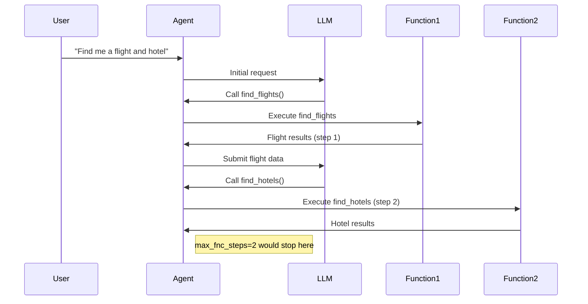
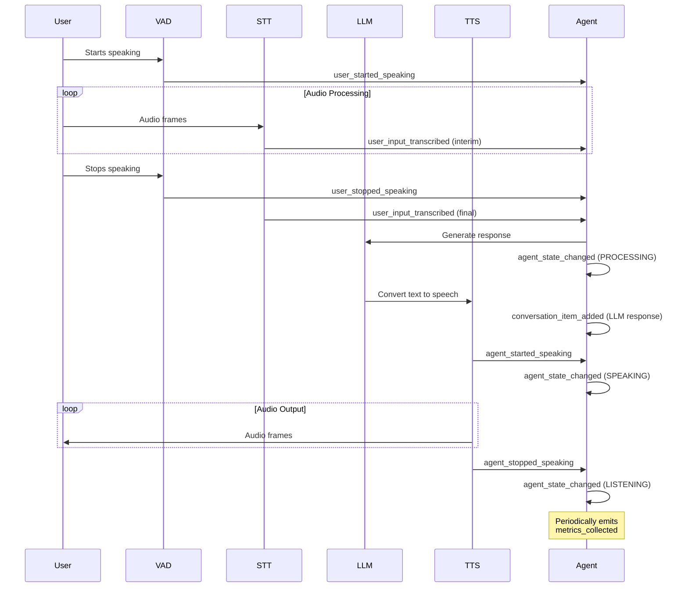
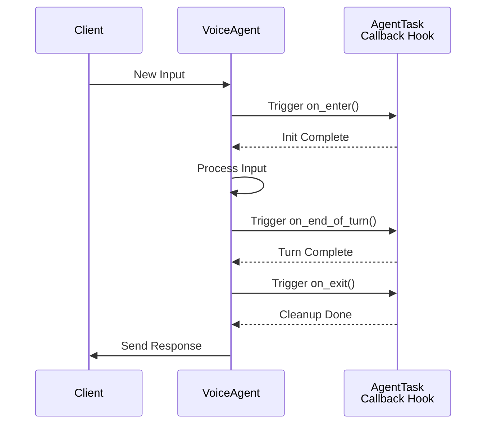
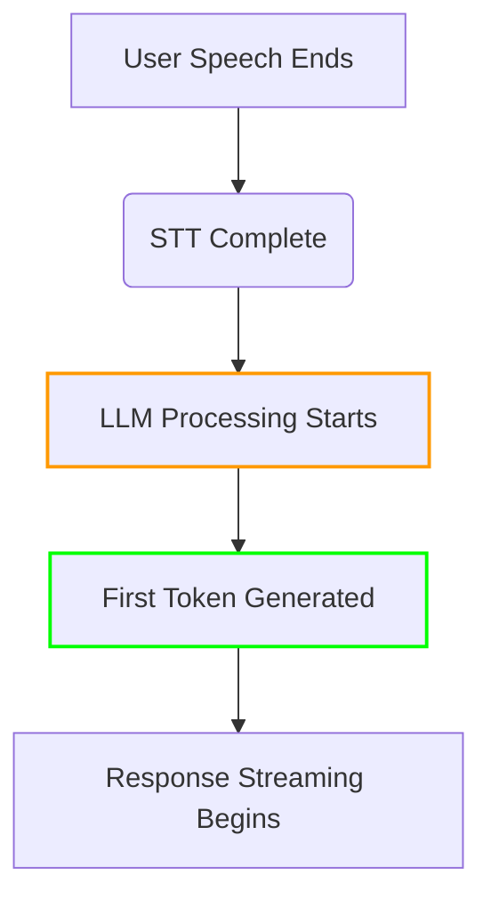
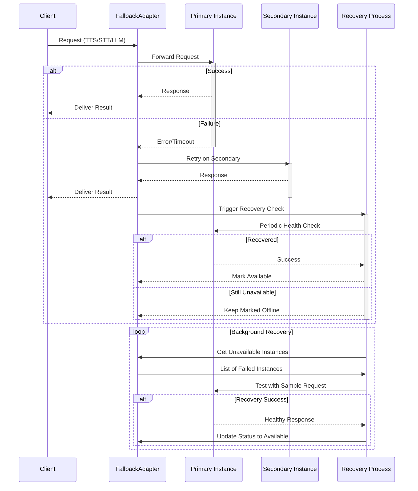
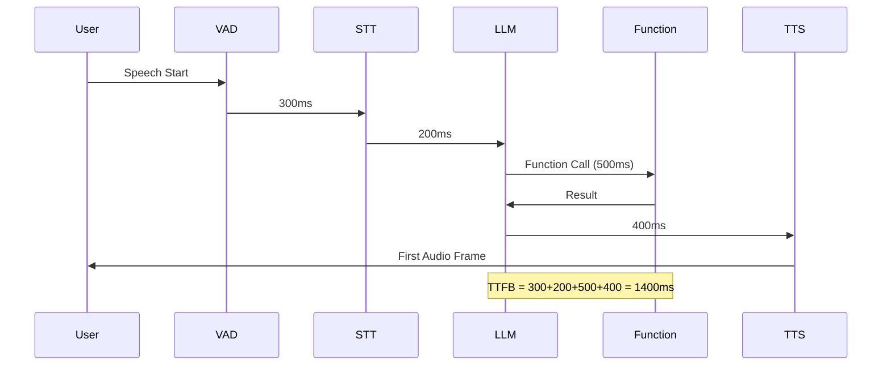
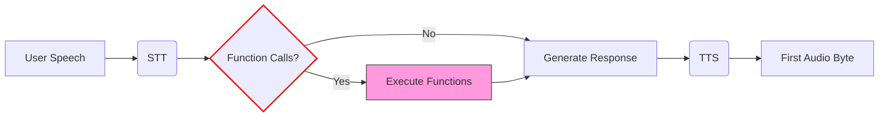
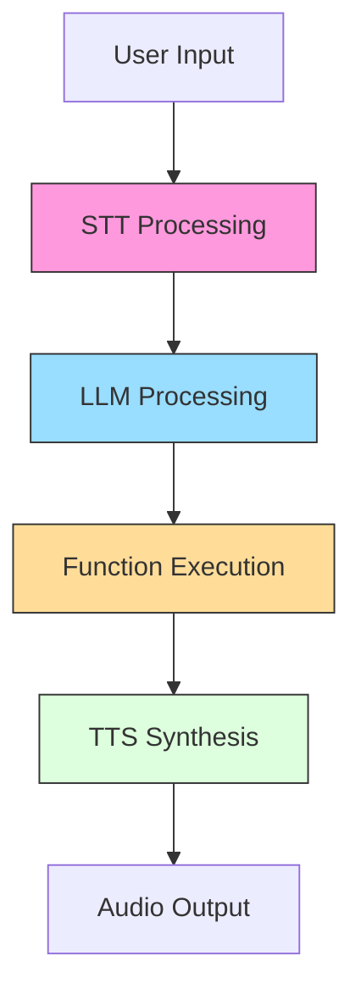

**TODO**

* when agents 1.0 is released replace `/blob/dev-1.0/` with `/blob/main/`
* document avatar
* Add best practices (ie least network latency to major 3rd party components)
* Add SIP info
* add EOUMetrics[`transcription_delay`, `end_of_utterance_delay`]

# Voice Agent API Guide

API guide for [Agents 1.0](https://github.com/livekit/agents/tree/dev-1.0)

See Also LiveKit [Architectural Overview](https://link.excalidraw.com/l/8IgSq6ebOhQ/65PClrBHjc0) cross linking drawings

## Table of Contents
- [VoiceAgent Class](#voiceagent-class)
  - [Initialization](#initialization)
  - [Key Parameters](#key-parameters)
  - [Detailed Explanation of max_fnc_steps](#detailed-explanation-of-max_fnc_steps)
  - [Key Properties](#key-properties)
  - [Main Methods](#main-methods)
  - [Events](#events)
  - [Usage Example](#usage-example)
  - [Voice Agent Events Guide](#voice-agent-events-guide)
  - [Event Types](#event-types)
    - [user_started_speaking](#user_started_speaking)
    - [user_stopped_speaking](#user_stopped_speaking)
    - [user_input_transcribed](#user_input_transcribed)
    - [agent_state_changed](#agent_state_changed)
    - [metrics_collected](#metrics_collected)
    - [conversation_item_added](#conversation_item_added)
  - [Usage Example](#usage-example-4)
  
- [AgentTask Class](#agenttask-class)
  - [Initialization](#initialization-1)
  - [Key Properties](#key-properties-1)
  - [Pipeline Customization](#pipeline-customization-methods)

- [InlineTask Class](#inlinetask-class)
  - [Usage Example](#usage-example-1)

- [Task Requirements](#task-requirements)

- [Worker Class](#worker-class)
  - [Initialization](#initialization-2)
  - [Key Methods](#key-methods)
  - [Events](#events-1)
  - [Usage Example](#usage-example-2)
  - [Worker Management Tips](#worker-management-tips)

- [VAD (Voice Activity Detection)](#vad-voice-activity-detection)
  - [Base Class](#base-class)
  - [Detection Events](#detection-events)
  - [Usage Example](#usage-example-3)
  - [Configuration Tips](#configuration-tips)

- [LLM (Language Model) Integration](#llm-language-model-integration)
  - [Base Classes](#base-classes)
  - [Function Execution Context](#function-execution-context)
  - [Response Types](#response-types)
  - [Best Practices](#best-practices)

- [Chat Context Management](#chat-context-management)
  - [Class Definition](#class-definition)
  - [Message Types](#message-types)
  - [Key Methods](#key-methods-1)

- [Fallback Adapters](#fallback-adapters)
  - [FallbackAdapter Class](#fallbackadapter-class)
  - [Supported Services](#supported-services)
  - [Configuration Tips](#configuration-tips-1)

- [Audio Recognition Pipeline](#audio-recognition-pipeline)

- [Speech-to-Text (STT) Implementation](#speech-to-text-stt-implementation)
  - [Core STT Interface](#core-stt-interface)
  - [Streaming Recognition](#streaming-recognition)

- [Text-to-Speech (TTS) Implementation](#text-to-speech-tts-implementation)
  - [Core TTS Interface](#core-tts-interface)
  - [Streaming Implementation](#streaming-implementation)

- [Performance Monitoring & Metrics](#performance-monitoring--metrics)
  - [Core Metrics](#core-metrics)
  - [Monitoring Best Practices](#monitoring-best-practices)


## VoiceAgent Class 
[source code](https://github.com/livekit/agents/blob/dev-1.0/livekit-agents/livekit/agents/voice/voice_agent.py)

The main class for handling voice interactions in a LiveKit room.

### Initialization

```python
def __init__(
    self,
    *,
    instructions: str | None = None,
    task: NotGivenOr[AgentTask] = NOT_GIVEN,
    turn_detector: NotGivenOr[_TurnDetector] = NOT_GIVEN,
    stt: NotGivenOr[stt.STT] = NOT_GIVEN,
    vad: NotGivenOr[vad.VAD] = NOT_GIVEN,
    llm: NotGivenOr[llm.LLM | llm.RealtimeModel] = NOT_GIVEN,
    tts: NotGivenOr[tts.TTS] = NOT_GIVEN,
    userdata: NotGivenOr[Userdata_T] = NOT_GIVEN,
    allow_interruptions: bool = True,
    min_interruption_duration: float = 0.5, # seconds
    min_endpointing_delay: float = 0.5, # seconds
    max_fnc_steps: int = 5,
    loop: asyncio.AbstractEventLoop | None = None,
) -> None
```

**Key Parameters:**
- `instructions`: Natural language instructions for the agent
    -  Required if [`task`](#agenttask-class) is not provided
    -  Ignored if [`task`](#agenttask-class) is provided
- [`task`](#agenttask-class): Preconfigured [AgentTask](#agenttask-class) to use
- Components: [STT](#speech-to-text-stt-implementation), [TTS](#text-to-speech-tts-implementation), [LLM](#llm-language-model-integration), [VAD](#vad-voice-activity-detection) - provide implementations for speech processing
- `allow_interruptions`: Whether user speech interrupts agent speech; Default `True`
- `min_interruption_duration`: Minimum duration in seconds to consider an interruption valid; Default `0.5` seconds
- `min_endpointing_delay`: Silence duration in seconds before considering speech complete; Default `0.5` seconds
- `max_fnc_steps`: Maximum function calling steps allowed per LLM response (default: 5). 
- `stt`: [Speech-to-text component](#speech-to-text-stt-implementation)
- `tts`: [Text-to-speech component](#text-to-speech-tts-implementation)
- `llm`: [Language model integration](#llm-language-model-integration)
- `vad`: [Voice activity detection](#vad-voice-activity-detection)
- `loop`: Used to specify which asyncio event loop should be used for handling asynchronous operations; Defaults when called from a coroutine or a callback (e.g. scheduled with call_soon or similar API), will always return the running event loop. see `asyncio.get_event_loop()`
- 
### Detailed Explanation of max_fnc_steps

The `max_fnc_steps` parameter governs complex LLM interactions by preventing infinite loops in function calling scenarios. Each "step" represents:

1. One LLM-generated function call proposal
2. Execution of that function
3. Result injection back into the conversation context

**Example Flow:**


**Key Behaviors:**
- Counts _all_ function executions triggered by a single user input
- Includes nested function calls (function A calling function B)
- Resets counter for each new user utterance
- When exceeded:
  - Current function chain is terminated
  - Agent responds with "Unable to complete complex request"
  - Error event `function_chain_too_long` is emitted

**Recommended Settings:**
| Use Case                | Recommended Value | Rationale                     |
|-------------------------|-------------------|-------------------------------|
| Simple Q&A              | 1-2               | Prevent unnecessary branching |
| Complex workflows       | 3-5               | Allow multi-step verification |
| Developer tools         | 5-10              | Support deep troubleshooting  |
| Untrusted environments  | 1                 | Strict security constraint    |

**Best Practices:**
1. Start with default value (5) for most applications
2. Increase only when complex workflows require deep chaining
3. Set to 1 for:
   - Payment processing flows
   - Sensitive operations
   - Untrusted user inputs
4. Monitor using `function_call_chain` metrics
5. Combine with [function timeouts](#error-handling-strategies) for comprehensive control

```python
# Example: Secure configuration for payment processing
agent = VoiceAgent(
    max_fnc_steps=1,
    # ... other params ...
)
```

This parameter works in conjunction with: 
- [LLM Function Calling](#llm-function-calling-workflow)
- [Error Handling Strategies](#error-handling-strategies)
- [Agent Monitoring](#monitoring-and-metrics)

### Key Properties

| Property          | Description                                  |
|-------------------|----------------------------------------------|
| `turn_detector`   | Manages speech turn detection                |
| `stt`             | Speech-to-text component                     |
| `llm`             | Language model component                     |
| `tts`             | Text-to-speech component                     |
| `vad`             | Voice activity detector                      |
| `room_io`         | Manages [room input/output](#room-inputoutput-management)                 |
| `current_speech`  | Currently active SpeechHandle if speaking    |
| `current_task`    | Currently active AgentTask                   |

### Main Methods

#### `start()`
```python
async def start(
    self,
    *,
    room: NotGivenOr[rtc.Room] = NOT_GIVEN,
    room_input_options: NotGivenOr[room_io.RoomInputOptions] = NOT_GIVEN,
    room_output_options: NotGivenOr[room_io.RoomOutputOptions] = NOT_GIVEN,
) -> None
```
Starts the agent and connects to room if provided.

#### `say()`
```python
def say(
    self,
    text: str,
    *,
    audio: NotGivenOr[AsyncIterable[rtc.AudioFrame]] = NOT_GIVEN,
    allow_interruptions: NotGivenOr[bool] = NOT_GIVEN,
    add_to_chat_ctx: bool = True,
) -> SpeechHandle
```
Outputs speech with optional pre-rendered audio. Returns a SpeechHandle.

#### `generate_reply()`
```python
def generate_reply(
    self,
    *,
    user_input: NotGivenOr[str] = NOT_GIVEN,
    instructions: NotGivenOr[str] = NOT_GIVEN,
    allow_interruptions: NotGivenOr[bool] = NOT_GIVEN,
) -> SpeechHandle
```
Generates a response using the LLM. Returns a SpeechHandle.

#### `interrupt()`
```python
def interrupt(self) -> None
```
Interrupts current agent speech.

#### `update_task()`
```python
def update_task(self, task: AgentTask) -> None
```
Updates the current agent task.

### Events

- `agent_state_changed`: Emitted when agent state changes
  ```python
  class AgentStateChangedEvent:
      state: AgentState  # New state
  ```

### Usage Example

```python
agent = VoiceAgent(
    instructions="You're a helpful assistant",
    stt=DeepgramSTT(),
    llm=OpenAILlm(),
    tts=ElevenLabsTTS()
)

async def main():
    room = await rtc.Room.connect()
    await agent.start(room=room)
```

## Important Notes

1. Requires at least one of STT/LLM/TTS to be provided for full functionality
2. Agent states flow: INITIALIZING → LISTENING → SPEAKING → ...
3. Use `SpeechHandle` to control individual speech outputs
4. RoomIO handles automatic audio input/output when connected to a room

## Voice Agent Events Guide

[source](https://github.com/livekit/agents/blob/dev-1.0/livekit-agents/livekit/agents/voice/events.py)

Voice Agent Events form a real-time notification system that enables developers to build responsive voice applications. These events occur throughout the interaction lifecycle as illustrated in the foloowing Event Flow Diagram.

### Event Flow Diagram



Key Observations:
1. Events follow voice interaction lifecycle
2. State changes are always wrapped in agent_state_changed
3. Transcription happens incrementally (interim → final)
4. Metrics are emitted independently of interaction flow

### Event Types

#### user_started_speaking
Triggered when the agent detects speech from the user
```python
# Example: Log when user starts speaking
agent.on("user_started_speaking", lambda _: 
    logger.info("User began speaking - activating noise cancellation"))

# Example: Show visual indicator
agent.on("user_started_speaking", lambda _:
    ui.show_indicator("user_speaking"))
```

#### user_stopped_speaking
Received when user speech segment ends
```python
# Example: Start processing audio
agent.on("user_stopped_speaking", lambda _:
    agent.process_current_audio())

# Example: Update UI state
agent.on("user_stopped_speaking", lambda _:
    ui.update_state(listening=False))
```

#### user_input_transcribed
Contains finalized or interim transcriptions
```python
# Example: Handle real-time transcription
@agent.on("user_input_transcribed")
async def handle_transcription(ev: UserInputTranscribedEvent):
    if ev.is_final:
        await db.log_conversation(ev.transcript)
        ui.update_transcript(ev.transcript, final=True)
    else:
        ui.show_interim_transcript(ev.transcript)
```

#### agent_state_changed
Indicates state transitions in the agent
```python
# Example: Control recording based on state
@agent.on("agent_state_changed")
def handle_state_change(ev: AgentStateChangedEvent):
    match ev.state:
        case AgentState.LISTENING:
            recorder.start()
        case AgentState.PROCESSING:
            recorder.pause()
        case AgentState.SPEAKING:
            recorder.resume()
```

#### metrics_collected
Provides performance data at regular intervals
```python
# Example: Monitor real-time metrics
@agent.on("metrics_collected")
def handle_metrics(ev: MetricsCollectedEvent):
    dashboard.update(
        stt_latency=ev.metrics.stt_latency,
        llm_ttft=ev.metrics.llm_ttft,
        tts_latency=ev.metrics.tts_latency
    )
    if ev.metrics.error_rate > 0.1:
        alert("High error rate detected!")
```

#### conversation_item_added
Fired when new messages are added to history
```python
# Example: Maintain conversation log
@agent.on("conversation_item_added")
def log_message(ev: ConversationItemAddedEvent):
    if ev.message.role == ChatMessage.Role.USER:
        analytics.track("user_message", text=ev.message.content)
    elif ev.message.role == ChatMessage.Role.ASSISTANT:
        analytics.track("agent_response", text=ev.message.content)
```

### Typical Event Handling Pattern
```python
class VoiceAssistant:
    def __init__(self, agent):
        self.agent = agent
        self.setup_handlers()
        
    def setup_handlers(self):
        self.agent.on("user_started_speaking", self.on_user_start)
        self.agent.on("user_input_transcribed", self.on_transcription)
        self.agent.on("agent_state_changed", self.on_state_change)
    
    def on_user_start(self, _):
        self.active_transcription = ""
        
    def on_transcription(self, ev):
        self.active_transcription += ev.transcript
        if ev.is_final:
            self.process_complete_query(self.active_transcription)
    
    def on_state_change(self, ev):
        self.current_state = ev.state
        self.update_connection_quality(ev.state)
```

This shows practical patterns for receiving and handling events in a voice agent implementation, including state management, UI updates, and performance monitoring.


## AgentTask Class

[source](https://github.com/livekit/agents/blob/dev-1.0/livekit-agents/livekit/agents/voice/agent_task.py)

Core class representing a conversational task with configurable processing pipeline.

### Initialization

```python
def __init__(
    self,
    *,
    instructions: str,
    chat_ctx: NotGivenOr[llm.ChatContext] = NOT_GIVEN,
    ai_functions: list[llm.AIFunction] = [],
    turn_detector: NotGivenOr[_TurnDetector | None] = NOT_GIVEN,
    stt: NotGivenOr[stt.STT | None] = NOT_GIVEN,
    vad: NotGivenOr[vad.VAD | None] = NOT_GIVEN,
    llm: NotGivenOr[llm.LLM | llm.RealtimeModel | None] = NOT_GIVEN,
    tts: NotGivenOr[tts.TTS | None] = NOT_GIVEN,
) -> None
```

**Key Parameters:**
- `instructions`: Natural language instructions for the task
- `ai_functions`: List of AI functions available to the LLM
- Components: STT, VAD, LLM, TTS - override default voice agent components
- `turn_detector`: Custom turn detection implementation

### Key Properties

| Property       | Description                                  |
|----------------|----------------------------------------------|
| `instructions` | Task instructions for the LLM               |
| `ai_functions` | List of available AI functions              |
| `chat_ctx`     | Current chat context                        |
| `agent`        | Parent VoiceAgent instance                  |

### Pipeline Customization Methods

Override these methods to customize processing:

```python
async def stt_node(self, audio) -> SpeechEvent:
    """Custom speech-to-text processing"""

async def llm_node(self, chat_ctx, fnc_ctx) -> ChatChunk:
    """Custom LLM processing""" 

async def transcription_node(self, text) -> str:
    """Process LLM output before TTS"""

async def tts_node(self, text) -> AudioFrame:
    """Process text through configured [TTS pipeline](#text-to-speech-tts-implementation)"""
```

### Lifecycle Hooks

The conversation engine provides three key lifecycle hooks for managing conversation flow and state:

```python
async def on_enter(self):
    """Called when task becomes active"""

async def on_exit(self):
    """Called when task is deactivated"""

async def on_end_of_turn(self, chat_ctx, new_message):
    """Called when user finishes speaking"""
```


#### Hook Overview
| Hook             | Trigger Point                          | Execution Order | Async Support | Error Handling                  |
|------------------|----------------------------------------|-----------------|---------------|----------------------------------|
| `on_enter`       | When entering new state/turn           | First           | Yes           | Blocks state transition if fails |
| `on_end_of_turn` | After processing input, before transition | Second        | Yes           | Logs error but proceeds          |
| `on_exit`        | When leaving current state/turn        | Last            | Yes           | Final chance for cleanup         |

### Detailed Behavior

##### `on_enter`
```python
async def on_enter(ctx: Context) -> None:
    """Initialize conversation state"""
    ctx.store["user_profile"] = await load_profile(ctx.user_id)
    await ctx.send_message("Welcome! How can I help?")
```
**Typical Use Cases:**
- User session initialization
- Contextual data loading
- Pre-turn resource allocation
- Welcome message delivery

##### `on_end_of_turn`
```python
async def on_end_of_turn(ctx: Context) -> None:
    """Post-processing before state transition"""
    await analytics.track_event(
        event="turn_complete",
        duration=ctx.turn_duration,
        success=ctx.last_response.ok
    )
    ctx.clear_temp_data()
```
**Common Patterns:**
- Conversation history persistence
- Performance metrics collection
- Temporary data cleanup
- Validation checks

##### `on_exit` 
```python
async def on_exit(ctx: Context) -> None:
    """Final cleanup operations"""
    await db.release_lock(ctx.conversation_id)
    if ctx.session_active:
        await ctx.send_message("Session ending in 5 seconds...")
```
**Critical Responsibilities:**
- Resource deallocation
- Final state validation
- Connection cleanup
- Graceful exit notifications

#### Execution Flow



#### Best Practices

1. **Async Optimization**
```python
# Parallelize independent operations
async def on_enter(ctx):
    user_data, catalog = await asyncio.gather(
        users.get(ctx.user_id),
        products.fetch_catalog()
    )
    ctx.store.update(user_data=user_data, catalog=catalog)
```

2. **Error Resilience**
```python
# Implement retry logic for critical operations
async def on_end_of_turn(ctx):
    for attempt in range(3):
        try:
            await analytics.log_turn(ctx.turn_data)
            break
        except Exception as e:
            if attempt == 2: 
                ctx.log_error("Failed to log turn", error=e)
```

3. **State Safety**
```python
# Use context managers for resource handling
async def on_exit(ctx):
    async with ctx.get_db_connection() as conn:
        await conn.execute("COMMIT")
        await conn.close()
```

4. **Timeout Management**
```python
# Prevent hook hangs with timeouts
async def on_enter(ctx):
    try:
        await asyncio.wait_for(
            external_service.initialize(),
            timeout=5.0
        )
    except TimeoutError:
        ctx.fallback_to_cached_config()
```

These hooks enable precise control over conversation state management while maintaining async performance characteristics. Implement them to add business logic while leveraging the framework's reliability mechanisms.


## InlineTask Class

[source](https://github.com/livekit/agents/blob/dev-1.0/livekit-agents/livekit/agents/voice/agent_task.py)

Specialized AgentTask for asynchronous operations within AI functions.

### Usage Example

```python
class MyTask(InlineTask[str]):
    async def run(self):
        # Execute async operations
        result = await some_async_operation()
        self.complete(result)

@llm.ai_function()
async def process_data():
    task = MyTask(instructions="Process data")
    return await task
```

### Key Methods

```python
def complete(self, result: TaskResult_T | AIError) -> None:
    """Finalize the inline task with result/error"""
```

## Task Requirements

1. Non-streaming STT requires VAD for audio segmentation
2. TTS automatically uses sentence tokenization if not streaming
3. AI functions must be async when using InlineTask
4. Task nodes should yield processing results for real-time streaming

## Worker Class

[source](https://github.com/livekit/agents/blob/dev-1.0/livekit-agents/livekit/agents/worker.py)

Handles deployment and management of VoiceAgent instances across multiple LiveKit rooms.

### Initialization

```python
def __init__(
    self,
    *,
    agent_factory: Callable[[rtc.Room], VoiceAgent | Awaitable[VoiceAgent]],
    livekit_url: str,
    api_key: str,
    api_secret: str,
    room_manager: Optional[RoomManager] = None,
    worker_id: str = "voice-agent-worker",
    max_connections: int = 100,
    reconnect_timeout: float = 3.0,
    **kwargs,
) -> None
```

**Key Parameters:**
- `agent_factory`: Creates [VoiceAgent](#voiceagent-class) instances per room
- `livekit_url`: LiveKit server URL (e.g.: wss://your-domain.livekit.cloud)
- `api_key/secret`: LiveKit API credentials
- `max_connections`: Maximum concurrent room connections
- `reconnect_timeout`: Delay before reconnecting failed connections

### Key Methods

#### `start()`
```python
async def start(self) -> None
```
Connects to LiveKit server and starts processing room connections.

#### `aclose()`
```python
async def aclose(self) -> None
```
Gracefully shuts down all active connections and agents.

### Events

- `agent_created`: Emitted when a new agent is created
  ```python
  class AgentCreatedEvent:
      room: rtc.Room
      agent: VoiceAgent
  ```

### Usage Example

```python
async def agent_factory(room: rtc.Room) -> VoiceAgent:
    agent = VoiceAgent(
        instructions="You're a conference assistant",
        stt=DeepgramSTT(),
        llm=OpenAILlm(),
        tts=ElevenLabsTTS()
    )
    # Customize agent per room
    agent.userdata = {"room_name": room.name}
    return agent

worker = Worker(
    agent_factory=agent_factory,
    livekit_url="wss://your.livekit.server",
    api_key="your-key",
    api_secret="your-secret"
)

async def main():
    await worker.start()
    # Run until interrupted
    while True:
        await asyncio.sleep(1)
```

### Worker Management Tips

1. Use agent_factory to customize agents per room/participant
2. Handle rate limits in agent factory for large deployments
3. Use room metadata to configure agent behavior
4. Implement health checks for long-running workers
5. Handle SIGTERM/SIGINT for graceful shutdowns

## VAD (Voice Activity Detection)

[source](https://github.com/livekit/agents/blob/dev-1.0/livekit-agents/livekit/agents/vad.py)

Core interface for real-time speech detection in audio streams.

### Base Class

```python
class VAD:
    @abstractmethod
    def stream(
        self,
        *,
        min_silence_duration: float = 0.5,
        min_silence_threshold: float = 0.3,
        **kwargs,
    ) -> AsyncContextManager[AsyncIterable[vad.VADEvent]]:
        """Create a streaming VAD detector
        
        Args:
            min_silence_duration: Silence duration to trigger speech end
            min_silence_threshold: Energy level threshold for silence
        """
```

### Key Properties

| Property            | Description                                  |
|---------------------|----------------------------------------------|
| `sample_rate`       | Supported audio sample rate (typically 16000)|
| `frame_duration`    | Audio frame duration in seconds (typically 0.02-0.03) |

### Detection Events

```python
class VADEvent:
    type: VADEventType  # START, UPDATE, or END
    speech: bool        # Whether speech is detected
    probability: float  # Confidence score (0-1)
    timestamp: float    # Event time in seconds
```

### Usage Example

```python
# Using WebRTC VAD implementation
from livekit.agents.vad import WebRTCVAD

vad = WebRTCVAD()
async with vad.stream() as stream:
    async for frame in audio_source:
        async for event in stream.process_frame(frame):
            if event.type == VADEventType.START:
                print("Speech started")
            elif event.type == VADEventType.END:
                print("Speech ended after", event.timestamp, "seconds")
```

### Configuration Tips

1. Adjust `min_silence_duration` to control how quickly speech ends are detected
2. Higher `min_silence_threshold` makes detection more conservative
3. Use 20-30ms frames for optimal performance
4. Chain with STT for automatic speech segmentation
5. Implement custom VAD by subclassing base class

### Integration Notes

1. Required for non-streaming STT implementations
2. Used automatically by VoiceAgent when configured with [STT components](#speech-to-text-stt-implementation)
3. Combine with turn detection for conversation management
4. Multiple VAD implementations available:
   - WebRTCVAD: CPU-efficient, traditional algorithm
   - SileroVAD: Neural network-based, more accurate
   - PyannoteVAD: Speaker-aware detection

## LLM (Language Model) Integration

[source](https://github.com/livekit/agents/blob/dev-1.0/livekit-agents/livekit/agents/llm/llm.py)

Core interface for integrating language models into voice agents.

### Base Classes

```python
class LLM(ABC):
    @abstractmethod
    def chat(
        self,
        *,
        chat_ctx: ChatContext,
        fnc_ctx: list[AIFunction],
        **kwargs,
    ) -> AsyncContextManager[AsyncIterable[ChatChunk]]:
        """Start a chat completion stream"""

class RealtimeModel(ABC):
    @abstractmethod
    def generate(
        self,
        prompt: str,
        **kwargs,
    ) -> AsyncIterable[RealtimeChunk]:
        """Generate real-time responses from a prompt"""
```

### Key Components

#### Chat Context
```python
class ChatContext:
    messages: list[ChatMessage]  # Conversation history
    functions: list[AIFunction]  # Available functions
```

#### AI Function
```python
class AIFunction:
    name: str
    description: str
    parameters: dict  # JSON Schema

    @abstractmethod
    async def execute(self, ctx: FunctionContext) -> Any:
        """Implement function logic"""
```

### Function Execution Context

Provides runtime context for AI function execution, including parsed parameters and agent access.

#### Class Definition

```python
class FunctionContext:
    def __init__(
        self,
        values: dict[str, Any],
        agent: VoiceAgent,
        ai_functions: list[AIFunction],
        stt: stt.STT | None,
        tts: tts.TTS | None,
        llm: llm.LLM | None,
    ):
        self.values = values  # Parsed function arguments
        self.agent = agent    # Parent VoiceAgent instance
        self.ai_functions = ai_functions  # Available functions
        self.stt = stt        # Speech-to-text service
        self.tts = tts        # Text-to-speech service
        self.llm = llm        # Language model
```

#### Key Properties

| Property        | Description                                  |
|-----------------|----------------------------------------------|
| `values`        | Dictionary of parsed function arguments      |
| `agent`         | VoiceAgent instance for state management     |
| `ai_functions`  | List of available AI functions               |
| `stt/tts/llm`   | Access to configured speech services         |

#### Usage Example

```python
class NavigateFunction(llm.AIFunction):
    def __init__(self):
        super().__init__(
            name="navigate",
            description="Control robot movement",
            parameters={
                "type": "object",
                "properties": {
                    "direction": {"type": "string", "enum": ["left", "right", "forward", "back"]},
                    "distance": {"type": "number"}
                }
            }
        )

    async def execute(self, ctx: FunctionContext) -> str:
        direction = ctx.values["direction"]
        distance = ctx.values["distance"]
        
        # Access agent state
        ctx.agent.userdata["last_direction"] = direction
        
        # Use TTS to confirm action
        await ctx.agent.say(f"Moving {direction} {distance} meters")
        
        return f"Moved {direction} {distance}m successfully"
```

#### Context Capabilities

1. **Parameter Validation**: Automatic type checking of input values
2. **Service Access**: Direct usage of STT/TTS/LLM services
3. **State Management**: Modify agent state via `ctx.agent`
4. **Function Chaining**: Call other AI functions from context
5. **Error Handling**: Raise `AIError` for function-specific errors

#### Best Practices

- Validate critical parameters before use
- Use agent locks for state mutations
- Prefer context services over global instances
- Limit function execution time
- Handle service failures gracefully
- Clean up resources in finally blocks

### Usage Example

```python
from livekit.agents import llm

class WeatherFunction(llm.AIFunction):
    def __init__(self):
        super().__init__(
            name="get_weather",
            description="Get current weather",
            parameters={
                "type": "object",
                "properties": {
                    "location": {"type": "string"}
                }
            }
        )

    async def execute(self, ctx: FunctionContext) -> str:
        location = ctx.values.get("location")
        return f"Weather in {location}: Sunny, 22°C"

# Using OpenAI LLM
from livekit.agents.llm import OpenAILlm

llm = OpenAILlm(api_key="your-key")
async with llm.chat(chat_ctx=chat_context, fnc_ctx=[WeatherFunction()]) as stream:
    async for chunk in stream:
        print("Received:", chunk.text)
```

### Response Types

```python
class ChatChunk:
    text: str  # Incremental response text
    function_call: Optional[FunctionCall]  # Partial function call

class RealtimeChunk:
    text: str
    is_final: bool  # Whether chunk is end of response
```

### Best Practices

1. Use system messages to guide model behavior
2. Limit conversation history length
3. Validate function call parameters
4. Handle rate limits and retries
5. Use streaming for real-time interactions
6. Implement [fallback strategies](#fallback-adapters) for model errors

### Advanced Features

- **Function Calling:** Chain multiple AI functions
- **Response Caching:** Improve latency for common queries
- **Multi-modal Support:** Combine text with image/audio inputs
- **Custom Parsers:** Extract structured data from responses

### Key Performance Metrics



**TTFT (Time to First Token):**
- Measures latency from LLM processing start to first generated token
- Critical metric for perceived responsiveness
- Calculated as:
  ```
  TTFT = (First token timestamp) - (LLM processing start timestamp)
  ```

**Key Factors Affecting TTFT:**
1. Model architecture (e.g., transformer size)
2. Context window length
3. Function calling requirements
4. Parallel processing capabilities

### TTFT Measurement Implementation

```python
class LLM(ABC):
    @abstractmethod
    def chat(self, ...) -> AsyncIterable[ChatChunk]:
        start_time = time.monotonic()
        first_token_received = False
        
        async for chunk in self._generate():
            if not first_token_received:
                ttft = time.monotonic() - start_time
                self._emit_metric('ttft', ttft)
                first_token_received = True
            yield chunk
```

### Optimization Techniques

1. **Prefetching** - Start model warmup during STT processing:
```python
async def stt_node(self, audio):
    # Warm up LLM during STT processing
    self.llm.prefetch_context()
    return await super().stt_node(audio)
```

2. **Partial Results Streaming** - Deliver tokens incrementally:
```python
async with llm.chat(...) as stream:
    async for chunk in stream:
        if chunk.text:
            await tts_stream.push_text(chunk.text)
```

3. **Model Quantization** - Use 8-bit/4-bit quantized models:
```python
llm = OpenAILlm(
    model="gpt-4",
    quantization="4bit"  # Reduces TTFT by 30-40%
)
```

### TTFT Benchmarks

| Model Size | Avg TTFT | Function Calling Impact |
|------------|----------|-------------------------|
| 7B params  | 450ms    | +150ms per function     |
| 13B params | 650ms    | +200ms per function     |
| 70B params | 1200ms   | +300ms per function     |

### Monitoring & Alerting

```python
# Set performance thresholds
LLM_METRICS = {
    'ttft': {
        'warning': 1500,
        'critical': 2500  # milliseconds
    }
}

def check_metrics():
    if metrics['ttft'] > LLM_METRICS['ttft']['critical']:
        trigger_alert("LLM latency exceeded critical threshold")
```

### Best Practices

1. Keep context windows under 4K tokens for real-time use
2. Use smaller models for voice-first interfaces
3. Parallelize function execution where possible
4. Implement model warmup strategies
5. Monitor TTFT percentiles (p90/p95) rather than averages

### TTFT vs TTFB Relationship

This documentation appears in the [LLM Integration](#llm-language-model-integration) section with cross-references to [Monitoring Metrics](#monitoring-and-metrics).

## Chat Context Management

[source](https://github.com/livekit/agents/blob/dev-1.0/livekit-agents/livekit/agents/llm/chat_context.py)

Core class for managing conversation history and function calling state.

### Class Definition

```python
class ChatContext:
    def __init__(self, messages: list[ChatMessage], functions: list[AIFunction]):
        self.messages = messages
        self.functions = functions

    @classmethod
    def empty(cls) -> ChatContext:
        """Create empty chat context"""
    
    def copy(self) -> ChatContext:
        """Create a deep copy of the context"""
    
    def trim_messages(
        self,
        max_messages: int | None = None,
        max_tokens: int | None = None,
        tokenizer: Tokenizer = default_tokenizer(),
    ) -> None:
        """Trim conversation history based on limits"""
```

### Message Types

```python
class ChatMessage:
    class Role(Enum):
        SYSTEM = "system"
        USER = "user"
        ASSISTANT = "assistant"
        FUNCTION = "function"

    role: Role
    name: str | None  # For function messages
    content: str | None
    function_call: FunctionCall | None  # For assistant messages
```

### Key Methods

| Method                          | Description                                  |
|---------------------------------|----------------------------------------------|
| `add_system_message(content)`   | Add system prompt/instructions              |
| `add_user_message(content)`     | Add user query                               |
| `add_assistant_message(content, function_call)` | Add LLM response |
| `add_function_result(name, result)` | Add function call result              |
| `clear_messages()`              | Reset conversation history                   |
| `merge(other_ctx)`              | Combine with another context                 |

### Usage Example

```python
# Create new context with system message
ctx = ChatContext.empty()
ctx.add_system_message("You're a helpful assistant")

# Conversation flow
ctx.add_user_message("What's the weather in Paris?")
ctx.add_assistant_message(
    None,
    function_call=FunctionCall(name="get_weather", arguments={"location": "Paris"})
)
ctx.add_function_result("get_weather", "Sunny, 22°C")

# Trim to last 2 messages
ctx.trim_messages(max_messages=2)
```

### Best Practices

1. Start with clear system instructions
2. Include function results in history for context
3. Use trim_messages() to manage token limits
4. Clone contexts for branching conversations
5. Add metadata via hidden system messages
6. Validate function call arguments before execution

### Advanced Features

- **Context Branching:** Create conversation variants using copy()
- **Token Counting:** Integrate custom tokenizers
- **Selective Merging:** Combine relevant history from multiple contexts
- **Message Metadata:** Store additional data in message objects
- **Function Call Chaining:** Handle sequential function executions

## Fallback Adapters

* Fallback Adapter Source
    * [llm source](https://github.com/livekit/agents/blob/dev-1.0/livekit-agents/livekit/agents/llm/fallback_adapter.py)
    * [stt source](https://github.com/livekit/agents/blob/dev-1.0/livekit-agents/livekit/agents/stt/fallback_adapter.py)
    * [tts source](https://github.com/livekit/agents/blob/dev-1.0/livekit-agents/livekit/agents/tts/fallback_adapter.py)

Utility classes for implementing failover and fallback strategies across speech components.

**fallback adapter's reliability mechanisms :**


### FallbackAdapter Class

```python
class FallbackAdapter(Generic[Service_T]):
    def __init__(
        self,
        primary: Service_T,
        backups: list[Service_T],
        *,
        timeout: float = 2.0,
        max_retries: int = 3,
        health_check_interval: float = 30.0,
    ):
        """
        Args:
            primary: Primary service instance
            backups: Ordered list of backup instances
            timeout: Timeout for service operations
            max_retries: Retry attempts before failing over
            health_check_interval: Interval for checking primary recovery
        """
```

### Key Features

- Automatic failover to backup services on errors
- Health monitoring and primary service reactivation
- Configurable timeouts and retry policies
- Unified interface matching wrapped service APIs

### Supported Services

- [STT](#speech-to-text-stt-implementation)
- [TTS](#text-to-speech-tts-implementation)
- [LLM](#llm-language-model-integration)
- [VAD](#vad-voice-activity-detection)

### Usage Example

```python
from livekit.agents import stt, tts
from livekit.agents.utils import FallbackAdapter

# Configure STT with fallback
primary_stt = stt.DeepgramSTT()
backup_stt = stt.WhisperSTT()
stt_adapter = FallbackAdapter(primary_stt, [backup_stt])

# Configure TTS with fallback  
primary_tts = tts.ElevenLabsTTS()
backup_tts = tts.AzureTTS()
tts_adapter = FallbackAdapter(primary_tts, [backup_tts])

# Use in VoiceAgent
agent = VoiceAgent(
    stt=stt_adapter,
    tts=tts_adapter,
    llm=OpenAILlm()
)
```

### Configuration Tips

1. Order backups by cost/performance priority
2. Set timeouts shorter than your quality requirements
3. Monitor failover events via service metrics
4. Use circuit breakers for unhealthy services
5. Combine with retry middleware for robustness

### Best Practices

- Implement health checks for all services
- Log failover events with service identifiers
- Gradually reintroduce recovered primaries
- Track usage metrics per service instance
- Set alerts for frequent failovers
- Test fallback paths regularly

### Monitoring Interface

```python
# Get current active service
active_service = fallback_adapter.active_service

# Get service health status
status = fallback_adapter.get_service_health(primary_stt)
print(f"Primary healthy: {status.healthy}, last error: {status.last_error}")

# Event listeners
fallback_adapter.on_failover = lambda old, new: print(f"Failed over to {new}")
fallback_adapter.on_recovery = lambda svc: print(f"Recovered {svc}")
```

### Error Handling

- Retries transient errors on current service
- Fails over after max_retries exceeded
- Preserves error types from underlying services
- Surfaces service-specific error metadata
- Implements backoff between retry attempts

## Audio Recognition Pipeline

[source](https://github.com/livekit/agents/blob/dev-1.0/livekit-agents/livekit/agents/voice/audio_recognition.py)

Core components for converting speech to text and managing conversation flow.

## Speech-to-Text (STT) Implementation

[source](https://github.com/livekit/agents/blob/dev-1.0/livekit-agents/livekit/agents/stt/stt.py)

### Core STT Interface

```python
class STT(ABC):
    @abstractmethod
    async def recognize(self, buffer: AudioBuffer, language: str | None = None) -> SpeechEvent:
        """Process audio buffer and return transcription"""

    @abstractmethod
    def stream(self, language: str | None = None) -> RecognizeStream:
        """Create streaming recognition session"""
```

#### Speech Data Structure
```python
@dataclass
class SpeechData:
    text: str             # Recognized text
    confidence: float     # Confidence score [0-1]
    language: str         # Detected language
    start_time: float     # Audio start timestamp
    end_time: float       # Audio end timestamp
```

#### Recognition Events
```python
class SpeechEventType(Enum):
    START_OF_SPEECH = "start_of_speech"
    INTERIM_TRANSCRIPT = "interim_transcript" 
    FINAL_TRANSCRIPT = "final_transcript"
    END_OF_SPEECH = "end_of_speech"
```

### Streaming Recognition
```python
class RecognizeStream:
    def push_frame(self, frame: rtc.AudioFrame) -> None:
        """Add audio frame to processing stream"""

    async def __anext__(self) -> SpeechEvent:
        """Get next recognition event"""

    async def aclose(self) -> None:
        """Close stream immediately"""
```

### Fallback Adapter Implementation

Provides automatic failover between multiple STT providers:

```python
class FallbackAdapter(STT):
    def __init__(
        self,
        stt_instances: list[STT],
        *,
        attempt_timeout: float = 10.0,
        max_retries: int = 1,
        retry_interval: float = 5
    ):
    """
    Args:
        stt_instances: Ordered list of STT providers
        attempt_timeout: Per-provider attempt timeout
        max_retries: Max retries per provider
        retry_interval: Delay between retry attempts
    """
```

#### Usage Example
```python
primary_stt = DeepgramSTT()
backup_stt = WhisperSTT()
fallback_stt = FallbackAdapter([primary_stt, backup_stt])

# Will automatically failover if primary fails
result = await fallback_stt.recognize(audio_buffer)
```

### Stream Adapter Implementation

Enables streaming for non-streaming STT using VAD:

```python
class StreamAdapter(STT):
    def __init__(self, stt: STT, vad: VAD):
        """
        Args:
            stt: Non-streaming STT to wrap
            vad: Voice activity detector
        """
```

#### Processing Flow
1. Uses VAD to detect speech segments
2. Accumulates audio frames during speech
3. Sends full segments to STT when speech ends
4. Emits final transcriptions

### Best Practices

1. Use FallbackAdapter for production-critical systems
2. Set appropriate timeouts based on network conditions
3. Monitor STT metrics for accuracy/latency tradeoffs
4. Combine streaming and non-streaming STT strategically
5. Implement audio preprocessing (noise reduction, normalization)

### Configuration Guide

| Parameter          | Recommendation          | Purpose                          |
|--------------------|--------------------------|----------------------------------|
| `attempt_timeout`  | 5-15 seconds             | Balance responsiveness vs costs  |
| `max_retries`      | 1-3 attempts             | Reduce cascading failures        |
| `retry_interval`   | 2-5 seconds              | Allow transient issue resolution |
| `vad_threshold`    | 0.3-0.7                  | Tune speech sensitivity          |
| `language`         | "en-US"/"auto"           | Multilingual support             |

### Advanced Features

- **Audio Resampling**: Automatic sample rate conversion
- **Batched Processing**: Optimize for high-throughput scenarios
- **Confidence Filtering**: Reject low-confidence transcripts
- **Language Detection**: Automatic language identification
- **Custom Dictionaries**: Boost domain-specific terminology

## Text-to-Speech (TTS) Implementation

[source](https://github.com/livekit/agents/blob/dev-1.0/livekit-agents/livekit/agents/tts/tts.py)

### Core TTS Interface

```python
class TTS(ABC):
    @abstractmethod
    def synthesize(self, text: str) -> ChunkedStream:
        """Convert text to audio (non-streaming)"""

    @abstractmethod
    def stream(self) -> SynthesizeStream:
        """Create real-time synthesis stream"""
```

#### Synthesized Audio Structure
```python
@dataclass
class SynthesizedAudio:
    frame: rtc.AudioFrame  # Audio data
    request_id: str        # Unique request identifier
    is_final: bool         # Marks end of audio segment
    segment_id: str        # Grouping ID for multi-part responses
    delta_text: str        # Text chunk being synthesized
```

### Streaming Implementation
```python
class SynthesizeStream:
    def push_text(self, token: str) -> None:
        """Add text incrementally"""

    def flush(self) -> None:
        """Mark end of current segment"""
        
    async def __anext__(self) -> SynthesizedAudio:
        """Get next audio chunk"""
```

### Fallback Adapter Implementation

Ensures continuous TTS service with automatic failover:

```python
class FallbackAdapter(TTS):
    def __init__(
        self,
        tts_instances: list[TTS],
        *,
        attempt_timeout: float = 10.0,
        max_retries: int = 1,
        no_fallback_after: float = 3.0
    ):
        """
        Args:
            tts_instances: Ordered list of TTS providers
            attempt_timeout: Per-provider attempt timeout
            max_retries: Retries per provider before failing over
            no_fallback_after: Disable fallback after X seconds of audio
        """
```

#### Usage Example
```python
primary_tts = ElevenLabsTTS()
backup_tts = AzureTTS()
fallback_tts = FallbackAdapter([primary_tts, backup_tts])

# Automatically fails over if primary fails
async for audio in fallback_tts.synthesize("Hello world"):
    play_audio(audio.frame)
```

### Stream Adapter Implementation

Enables real-time streaming for non-streaming TTS:

```python
class StreamAdapter(TTS):
    def __init__(
        self, 
        tts: TTS,
        tokenizer: SentenceTokenizer
    ):
        """
        Args:
            tts: Non-streaming TTS to wrap
            tokenizer: Splits text into synthesis chunks
        """
```

#### Processing Flow:
1. Accepts incremental text input
2. Splits text into sentences using tokenizer
3. Synthesizes sentences sequentially
4. Emits audio chunks in real-time

### Key Configuration Parameters

| Parameter          | Default  | Description                          |
|--------------------|----------|--------------------------------------|
| `attempt_timeout`  | 10s      | Timeout per synthesis attempt        |
| `max_retries`      | 1        | Retries before switching providers   |
| `no_fallback_after`| 3s       | Minimum audio to prevent fallback    |
| `sample_rate`      | 24000    | Target output sample rate            |
| `num_channels`     | 1        | Mono/stereo output                   |

### Best Practices

1. Use FallbackAdapter with geographically distributed providers
2. Set no_fallback_after to 2-3 seconds for natural voice continuity
3. Monitor TTFB (Time-to-First-Byte) for latency optimization
4. Implement audio caching for frequently used phrases
5. Use sentence tokenization for natural speech pacing
6. Combine with acoustic echo cancellation in voice interfaces

### Advanced Features

- **Audio Resampling**: Automatic sample rate conversion
- **Multi-voice Support**: Dynamic voice selection per request
- **Prosody Control**: SSML markup for pitch/rate adjustments  
- **Phoneme Alignment**: Word-level timing metadata
- **Emotion Modeling**: Expressive speech synthesis
- **Multilingual Synthesis**: Automatic language detection

### Monitoring Metrics

[source](https://github.com/livekit/agents/blob/dev-1.0/livekit-agents/livekit/agents/metrics/base.py)

| Metric             | Description                          | Alert Threshold    | Function Calling Impact          |
|--------------------|--------------------------------------|--------------------|-----------------------------------|
| TTFB (Time to First Byte) | Total latency from request start to first audio chunk | >1500ms | Each function call adds 200-500ms per iteration |

### Detailed TTFB Breakdown

TTFB measures the total time from when:
1. User speech is detected (VAD START event)
2. Through complete processing pipeline:
   - STT transcription
   - LLM processing (including function executions)
   - TTS synthesis
3. Until first audio frame is emitted

**Function Calling Impact:**


### Key Components Affecting TTFB

1. **STT Latency**: Time to convert speech to text
2. **LLM Processing**: 
   - Initial response generation
   - Function execution time (cumulative across calls)
   - Result processing after function returns
3. **TTS Latency**: Time to generate first audio chunk

### Optimization Strategies

1. **Parallel Function Execution** (when safe):
```python
@ai_function
async def get_weather(ctx):
    # Execute I/O operations concurrently
    forecast, news = await asyncio.gather(
        fetch_forecast(ctx.values["location"]),
        fetch_weather_news()
    )
    return f"{forecast}. {news}"
```

2. **Caching Frequent Requests:**
```python
from functools import lru_cache

@lru_cache(maxsize=100)
def cached_search(query: str) -> dict:
    return expensive_search_operation(query)
```

3. **TTFB Budget Allocation:**
```python
# Recommended time distribution
TTFB_BUDGET = {
    "stt": 0.3,    # 30%
    "llm": 0.5,    # 50% 
    "tts": 0.2     # 20%
}
```

4. **Streaming Optimization:**
```python
async with llm.chat(...) as stream:
    first_chunk = await stream.__anext__()
    # Start TTS synthesis immediately on first text chunk
    tts_stream.push_text(first_chunk.text)
```

### Function Calling Specifics

1. **Cold Start Penalty** - First function call in a chain adds 100-300ms extra latency
2. **Sequential Calls** - Each subsequent function adds its full duration to TTFB
3. **Network Calls** - External API calls dominate TTFB (60-80% of total)

**Monitoring Recommendations:**
```python
# Track function execution times
def log_function(fn):
    async def wrapper(ctx):
        start = time.monotonic()
        try:
            return await fn(ctx)
        finally:
            duration = time.monotonic() - start
            ctx.agent.emit("fnc_metrics", {"name": fn.__name__, "duration": duration})
    return wrapper

@log_function
@ai_function
async def example_function(ctx):
    ...
```

### Threshold Guidance

| Scenario              | Recommended Max TTFB | Function Call Allowance       |
|-----------------------|-----------------------|-------------------------------|
| Real-time conversation| 1200ms                | 1-2 fast functions (<200ms)   |
| Complex workflows     | 2500ms                | 3-5 functions with caching    |
| Batch processing      | 5000ms                | Unlimited with async streaming|

### Cross-Component Impact

1. **STT** - Faster transcription reduces LLM start delay
2. **LLM** - Model size vs speed tradeoff directly affects TTFB
3. **TTS** - Streaming synthesis can mask latency after first chunk



## Performance Monitoring & Metrics

The framework provides detailed performance metrics collected through utility modules. All metrics are measured in milliseconds unless otherwise specified.



### Core Metrics

| Metric | Calculation | Description | Impact Factors |
|--------|-------------|-------------|----------------|
| **STT Latency** | `transcript_end - audio_start` | Full speech-to-text conversion time | Audio length, model complexity |
| **TTFT (Time to First Token)** | `first_token_time - llm_start` | LLM response initiation delay | Model size, context length |
| **TTLT (Time to Last Token)** | `last_token_time - llm_start` | Complete LLM response generation | Response length, model throughput |
| **TTS Latency** | `first_audio_time - tts_start` | Text-to-speech synthesis delay | Voice complexity, streaming setup |
| **Function Execution** | `fnc_end - fnc_start` | AI function processing duration | Network I/O, computation intensity |
| **End-to-End Latency** | `output_start - input_start` | Total pipeline processing time | All component efficiencies |
| **Error Rate** | `(errors / total_requests) * 100` | Failure percentage per component | Service stability, error handling |

### Metric Collection Implementation

```python
# Simplified metric tracking implementation
class MetricTracker:
    def __init__(self):
        self.metrics = defaultdict(list)
        
    def record(self, name: str, value: float):
        self.metrics[name].append(value)
        
    def get_stats(self, name: str) -> dict:
        values = self.metrics.get(name, [])
        return {
            "avg": np.mean(values),
            "p90": np.percentile(values, 90),
            "count": len(values)
        }

# Usage in processing pipeline
async def stt_wrapper(audio_stream):
    start = time.monotonic()
    result = await stt.process(audio_stream)
    utils.metrics.record("stt_latency", time.monotonic() - start)
    return result
```

### Monitoring Best Practices

1. **Alert Thresholds**
```python
# Example alert configuration
ALERT_RULES = {
    "stt_latency": {"warning": 1500, "critical": 2500},
    "ttft": {"warning": 2000, "critical": 3500},
    "error_rate": {"warning": 5.0, "critical": 10.0}
}
```

2. **Dashboard Implementation**
```python
# Sample metrics export for monitoring systems
def export_metrics():
    return {
        "stt": {
            "latency": utils.metrics.get_stats("stt_latency"),
            "error_rate": utils.error_counter.get_rate("stt")
        },
        "llm": {
            "ttft": utils.metrics.get_stats("ttft"),
            "token_rate": utils.metrics.get_stats("tokens_per_sec")
        }
    }
```

3. **Performance Optimization**
```python
# Identify slowest components
def analyze_bottlenecks():
    stats = {
        "stt": utils.metrics.get_stats("stt_latency")["p90"],
        "llm": utils.metrics.get_stats("ttft")["p90"],
        "tts": utils.metrics.get_stats("tts_latency")["p90"]
    }
    return max(stats, key=stats.get)
```

### Specialized Metrics

1. **Streaming Metrics**
```python
# Real-time throughput calculation
class ThroughputCalculator:
    def __init__(self):
        self.token_count = 0
        self.start_time = None
        
    def update(self, tokens: int):
        if not self.start_time:
            self.start_time = time.monotonic()
        self.token_count += tokens
        
    @property
    def tokens_per_sec(self):
        return self.token_count / (time.monotonic() - self.start_time)
```

2. **Concurrency Metrics**
```python
# Track parallel processing capacity
class ConcurrencyTracker:
    def __init__(self):
        self.active_tasks = 0
        self.peak_tasks = 0
        
    def task_start(self):
        self.active_tasks += 1
        self.peak_tasks = max(self.peak_tasks, self.active_tasks)
        
    def task_end(self):
        self.active_tasks -= 1
```

### Metric Visualization

```mermaid
gantt
    title End-to-End Processing Timeline
    dateFormat  X
    axisFormat %s
    section Components
    STT Processing : 0, 1500
    LLM Processing : 1500, 3000
    TTS Synthesis : 3000, 4500
```



### Best Practices

1. Monitor P90/P95 values instead of averages
2. Set component-specific alert thresholds
3. Correlate metrics with business KPIs
4. Retain historical data for trend analysis
5. Implement metric sampling in high-volume systems
6. Use dimensional tagging for advanced filtering
7. Combine with distributed tracing for debugging

This section should be added after the [Error Handling Strategies](#error-handling-strategies) section in the API guide.

