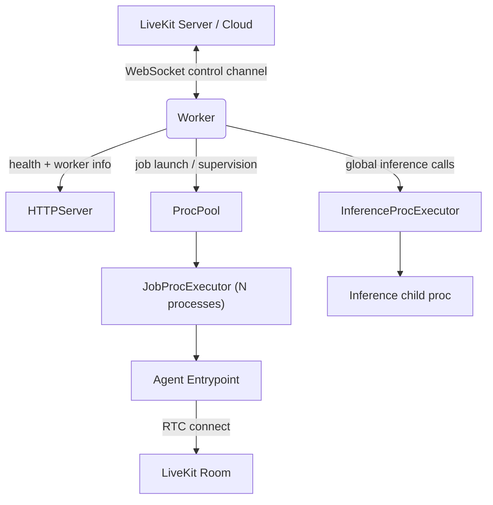
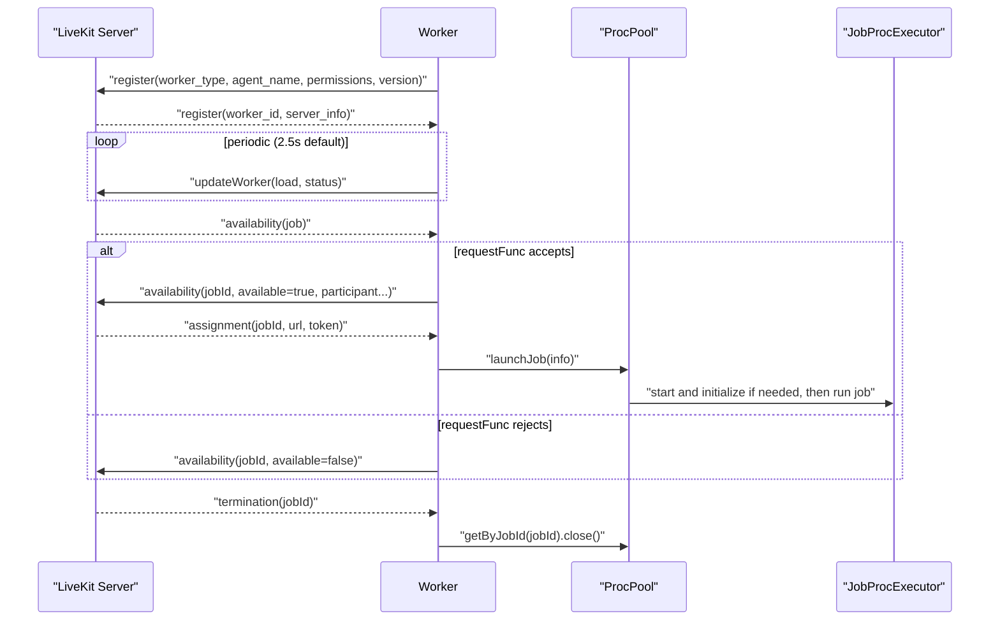
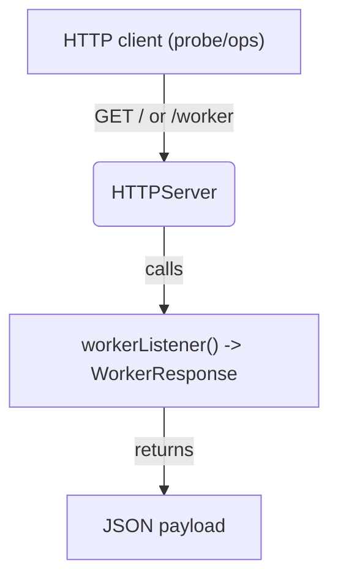
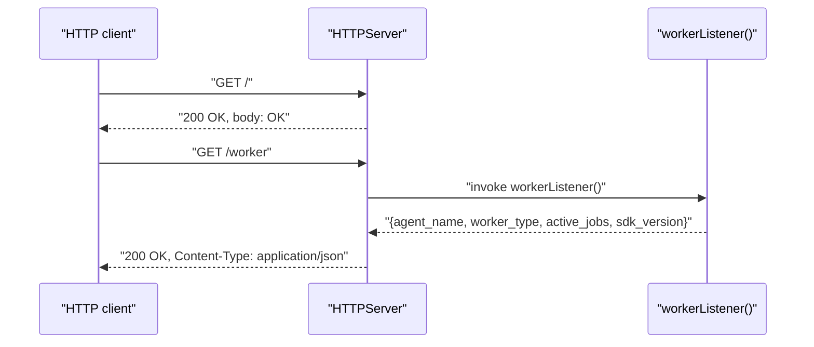

<!--

This document is generated from each document in sections/*.

DO NOT EDIT THIS DOC edit the sections doc instead then run the following to regenerate this doc

./bin/build_doc.sh && python bin/create_toc.py

-->


# Voice Agent API Guide

API guide for [Agents-JS 1.0](https://github.com/livekit/agents-js/tree/dev-1.0)

See Also LiveKit [Architectural Overview](https://link.excalidraw.com/l/8IgSq6ebOhQ/65PClrBHjc0) cross linking drawings


**Table Of Contnets**

- [Voice Agent API Guide](#voice-agent-api-guide)
    - [Worker architecture and usage](#worker-architecture-and-usage)
      - [Purpose](#purpose)
      - [High-level architecture](#high-level-architecture)
      - [Control-plane protocol flow](#control-plane-protocol-flow)
      - [Lifecycle overview](#lifecycle-overview)
      - [HTTP endpoints](#http-endpoints)
      - [WorkerOptions (key fields)](#workeroptions-key-fields)
      - [Process pool and inference](#process-pool-and-inference)
      - [Programmatic usage](#programmatic-usage)
      - [CLI usage](#cli-usage)
      - [Notable behaviors and edge cases](#notable-behaviors-and-edge-cases)
      - [Known shortcomings and probable bugs](#known-shortcomings-and-probable-bugs)
      - [Testing and observability tips](#testing-and-observability-tips)
      - [Versioning](#versioning)
    - [HTTPServer architecture and usage](#httpserver-architecture-and-usage)
      - [Purpose](#purpose)
      - [High-level architecture](#high-level-architecture)
      - [Endpoints](#endpoints)
      - [API](#api)
      - [Typical usage and integration](#typical-usage-and-integration)
      - [Request/response flow](#requestresponse-flow)
      - [Operational notes](#operational-notes)
      - [Known shortcomings and probable bugs](#known-shortcomings-and-probable-bugs)
- [Common Terms](#common-terms)
  - [Helpful Overviews](#helpful-overviews)
  - [TODO](#todo)

---


### Worker architecture and usage

This document explains the responsibilities, lifecycle, and usage of `agents/src/worker.ts`, and how it integrates with the process pool, inference executor, HTTP health server, and the LiveKit control plane. It also lists known shortcomings and likely bugs.

#### Purpose

The `Worker` orchestrates agent jobs requested by a LiveKit server or Cloud project. It maintains a WebSocket control session, advertises availability based on system load, accepts assignments, launches agent jobs into supervised processes, exposes health/metrics over HTTP, and manages graceful shutdown.

#### High-level architecture


```mermaid
graph TD
  A["LiveKit Server / Cloud"] <--> |"WebSocket control channel"| B("Worker")
  B -->|"health + worker info"| C["HTTPServer"]
  B -->|"job launch / supervision"| D["ProcPool"]
  D --> E["JobProcExecutor (N processes)"]
  B -->|"global inference calls"| F["InferenceProcExecutor"]
  F --> G["Inference child proc"]
  E --> H["Agent Entrypoint"]
  H -->|"RTC connect"| I["LiveKit Room"]
```

Key modules:
- `Worker` (`agents/src/worker.ts`): main orchestrator; manages WS, availability, assignments, termination, and shutdown.
- `HTTPServer` (`agents/src/http_server.ts`): exposes `/` (health) and `/worker` (JSON info).
- `ProcPool` (`agents/src/ipc/proc_pool.ts`): maintains a pool of warmed `JobProcExecutor`s or spins one on demand.
- `InferenceProcExecutor` (`agents/src/ipc/inference_proc_executor.ts`): global inference subprocess, multiplexed across jobs.
- `Job*` (`agents/src/job.ts`): job request/acceptance surface and job runtime context (`JobContext`).

#### Control-plane protocol flow


```mermaid
sequenceDiagram
  participant Server as "LiveKit Server"
  participant Worker
  participant Pool as "ProcPool"
  participant Exec as "JobProcExecutor"

  Worker->>Server: "register(worker_type, agent_name, permissions, version)"
  Server-->>Worker: "register(worker_id, server_info)"

  loop periodic (2.5s default)
    Worker->>Server: "updateWorker(load, status)"
  end

  Server-->>Worker: "availability(job)"
  alt requestFunc accepts
    Worker->>Server: "availability(jobId, available=true, participant...)"
    Server-->>Worker: "assignment(jobId, url, token)"
    Worker->>Pool: "launchJob(info)"
    Pool->>Exec: "start and initialize if needed, then run job"
  else requestFunc rejects
    Worker->>Server: "availability(jobId, available=false)"
  end

  Server-->>Worker: "termination(jobId)"
  Worker->>Pool: "getByJobId(jobId).close()"
```

#### Lifecycle overview

- Initialization
  - Validates `wsURL`, `apiKey`, `apiSecret` (or Cloud `workerToken` constraints).
  - Optionally starts `InferenceProcExecutor` if any `InferenceRunner` is registered.
  - Starts `ProcPool` (warming N processes in production when configured).
  - Starts `HTTPServer` on `host:port` (default 8081 in production; ephemeral in dev).

- WebSocket session
  - Connects to `LIVEKIT_URL` (switching to `ws://`), path `agent`, with JWT from `livekit-server-sdk`.
  - On open: sends `register` with worker type, agent name, permissions, version.
  - Periodically samples `loadFunc()` and sends `updateWorker` with load and availability.
  - Handles messages:
    - `availability`: constructs `JobRequest` and delegates to `requestFunc` (default: accept).
    - `assignment`: resolves pending assignment and launches the job via `ProcPool`.
    - `termination`: finds the running process and closes it.

- Drain and shutdown
  - `drain()` marks worker FULL and waits for active jobs to finish (with optional timeout).
  - `close()` shuts down inference executor, all job executors, HTTP server, and WS.

#### HTTP endpoints

- `GET /`: health check, returns `OK`.
- `GET /worker`: JSON payload with:
  - `agent_name`, `worker_type`, `active_jobs`, `sdk_version`.

#### WorkerOptions (key fields)

- `agent` (required): module path that default-exports an `Agent` entrypoint used by `JobProcExecutor`.
- `requestFunc(job: JobRequest)`: decide to `accept` or `reject` a job. Default: `accept()`.
- `loadFunc(): Promise<number>`: returns 0..1 load value. Default: CPU sampling over 2.5s.
- `loadThreshold`: mark FULL when `load >= threshold`. Default: 0.7 (prod) / `Infinity` (dev).
- `numIdleProcesses`: warmed processes in pool (prod default 3, dev 0).
- `initializeProcessTimeout`/`shutdownProcessTimeout`: per-process timeouts.
- `permissions: WorkerPermissions`: LiveKit participant permissions for the agent.
- `workerType`: `JobType` (default `JT_ROOM`).
- `wsURL`, `apiKey`, `apiSecret` or `workerToken` for Cloud.
- `host`, `port`: HTTP server bind (default `0.0.0.0:8081` in prod).
- `jobMemoryWarnMB`, `jobMemoryLimitMB`: soft/hard memory guardrails per job executor.

#### Process pool and inference

- `ProcPool` strategies
  - With `numIdleProcesses > 0`: a `MultiMutex` controls the number of warmed executors; a background loop keeps them initialized in `warmedProcQueue`.
  - With `numIdleProcesses = 0`: launches a new `JobProcExecutor` per job on demand.

- `InferenceProcExecutor`
  - Spawns a dedicated supervised process for inference; methods are invoked via IPC.
  - Register runners globally via `InferenceRunner.registerRunner(method, importPath)` before starting the worker.

#### Programmatic usage

```ts
import { runApp } from 'agents/src/cli.js';
import { WorkerOptions, WorkerPermissions } from 'agents/src/worker.js';

runApp(
  new WorkerOptions({
    agent: new URL('./my_agent.js', import.meta.url).pathname,
    agentName: 'my-agent',
    workerType: 1, // JobType.JT_ROOM
    production: false,
    wsURL: process.env.LIVEKIT_URL,
    apiKey: process.env.LIVEKIT_API_KEY,
    apiSecret: process.env.LIVEKIT_API_SECRET,
    permissions: new WorkerPermissions(true, true, true, true, [], false),
  }),
);
```

Environment variables supported by the CLI and `WorkerOptions`:
- `LIVEKIT_URL`, `LIVEKIT_API_KEY`, `LIVEKIT_API_SECRET`, `LOG_LEVEL`, optionally `LIVEKIT_WORKER_TOKEN`.

#### CLI usage

- Start in production mode:
  - `pnpm -w agents start --url wss://... --api-key ... --api-secret ...`
- Start in development mode:
  - `pnpm -w agents dev --url ws://localhost:7880 --api-key ... --api-secret ...`
- Connect to a specific room (simulate a job):
  - `pnpm -w agents connect --room <name> [--participant-identity <id>]`

#### Notable behaviors and edge cases

- Availability decisions are delegated to `requestFunc`. If it neither calls `accept` nor `reject`, the intended behavior is auto-reject (see issues below).
- Load sampling uses a 2.5s window and rounds to 2 decimals; status flips generate log messages.
- In Cloud (`workerToken` set), custom `loadFunc`/`loadThreshold` are forced to defaults and a warning is logged.

#### Known shortcomings and probable bugs

- Auto-reject not executed
  - In `#availability`, when `requestFunc` completes without calling `accept`/`reject`, the code only logs "automatically rejecting the job" but does not actually invoke the rejection path. This can leave the server waiting indefinitely for the availability response. Expected fix: call `onReject()` when `answered` is still `false` after `requestFunc` returns.

- Assignment timeout does not unwind wait
  - The assignment wait sets a timer that only logs a warning on timeout but leaves the pending promise unresolved. This means the accept path will continue awaiting the assignment indefinitely. Expected fix: clear the pending entry and proceed with a controlled failure or retry.

- HTTP header typo
  - `HTTPServer` sets `Contet-Type` instead of `Content-Type` on `/worker` responses, which can affect clients expecting proper JSON content type.

- WebSocket URL construction is fragile
  - `new URL(url + 'agent')` relies on implicit trailing slash. Safer to use `new URL('agent', url)` to join paths.

- Type-safety and linter issues (non-functional but noisy)
  - `defaultCpuLoad` uses `Object.values(cpu.times).reduce((acc, i) => ...)` where types are inferred as `unknown`. Cast to `number` to satisfy the linter.
  - Node globals/types: `process`, `NodeJS.Timeout`, and built-in modules require proper Node type configuration (e.g., `@types/node` and `tsconfig` `types: ["node"]`).
  - Un-typed callback parameters: add types for WebSocket event handlers (`error`, `close`, `message`).

- Minor logging/message inconsistencies
  - `JobContext.onParticipantConnected` warning contains a typo ("prticipant").

- Potential race on warmed executor removal
  - In `ProcPool.procWatchTask`, if `closed` becomes true after pushing the executor but before initialization, ensure the executor is reliably closed and removed (the `finally` block splices it, but verify index handling and close semantics).

#### Testing and observability tips

- Health check: `curl http://<host>:<port>/` should return `OK`.
- Worker info: `curl http://<host>:<port>/worker` for JSON snapshot.
- Observe availability flips by temporarily customizing `loadFunc()` to return values above/below the `loadThreshold`.
- Use `connect` CLI subcommand to simulate a publisher job in a specific room during development.

#### Versioning

- Worker logs include the SDK `version` from `agents/src/version.ts` and the server info returned during registration. This helps correlate worker binaries with control-plane behavior.


### HTTPServer architecture and usage

This document covers `agents/src/http_server.ts`, which exposes health and worker info endpoints for process-level monitoring and discovery.

#### Purpose

Provide a tiny HTTP surface for:
- Health checks for orchestration (readiness/liveness).
- A JSON snapshot of worker metadata (agent name, worker type, active jobs, SDK version).

#### High-level architecture


```mermaid
graph TD
  A["HTTP client (probe/ops)"] -->|"GET / or /worker"| B("HTTPServer")
  B -->|"calls"| C["workerListener() -> WorkerResponse"]
  C -->|"returns"| D["JSON payload"]
```

#### Endpoints

- `GET /`
  - Returns `200 OK` with body `OK`.
- `GET /worker`
  - Returns `200 OK` with JSON from the injected `workerListener()` callback.
  - Shape:
    - `agent_name: string`
    - `worker_type: string`
    - `active_jobs: number`
    - `sdk_version: string`
- Any other path: `404 Not Found`.

#### API

- Constructor: `new HTTPServer(host: string, port: number, workerListener: () => WorkerResponse)`
  - `host`: interface to bind (e.g., `0.0.0.0`).
  - `port`: port to listen on.
  - `workerListener`: function that returns a serializable `WorkerResponse` snapshot.
- `run(): Promise<void>`
  - Starts listening and logs the bound port.
- `close(): Promise<void>`
  - Stops the server.

#### Typical usage and integration

The worker constructs and owns the HTTP server, passing a listener that captures live state:

```ts
import { HTTPServer } from "agents/src/http_server.js";

const http = new HTTPServer(host, port, () => ({
  agent_name: opts.agentName,
  worker_type: JobType[opts.workerType],
  active_jobs: procPool.processes.filter((p) => p.runningJob).length,
  sdk_version: version,
}));

await http.run();
// later ...
await http.close();
```

#### Request/response flow


```mermaid
sequenceDiagram
  participant Client as "HTTP client"
  participant Server as "HTTPServer"
  participant Worker as "workerListener()"

  Client->>Server: "GET /"
  Server-->>Client: "200 OK, body: OK"

  Client->>Server: "GET /worker"
  Server->>Worker: "invoke workerListener()"
  Worker-->>Server: "{agent_name, worker_type, active_jobs, sdk_version}"
  Server-->>Client: "200 OK, Content-Type: application/json"
```

#### Operational notes

- Bind address/port are controlled by the `WorkerOptions` passed to the worker.
- In development, the port may be zero (ephemeral); consult logs for the actual port.
- Health and info are intentionally simple; it’s fine to front this with a reverse proxy.

#### Known shortcomings and probable bugs

- Content-Type header typo
  - The code sets `Contet-Type` instead of `Content-Type` for `/worker`. Clients may not treat the body as JSON. Fix: `res.writeHead(200, { 'Content-Type': 'application/json' });`.

- Lack of method checks
  - All HTTP methods are treated the same. Consider restricting to `GET` and returning `405 Method Not Allowed` for others.

- No error handling around `workerListener()`
  - If the callback throws, the request may hang or return a partial response. Wrap in try/catch and return `500`.

- No CORS headers
  - If consumed from browser contexts, add appropriate CORS headers.

- Security exposure
  - Defaults may bind to `0.0.0.0`. Ensure this surface is protected if deployed on public networks.

- TypeScript/node typings
  - Uses `node:http`; make sure `@types/node` is installed and `tsconfig` includes `"types": ["node"]` to avoid linter errors.


# Common Terms

There are many terms used commonly throughout the code base and documentation. Some of them are defined here:


| Acronym | Full Form | Description | Reference Link |
|---------|-----------|-------------|----------------|
| **API** | Application Programming Interface | Service endpoints | [AWS Definition](https://aws.amazon.com/what-is/api/) |
| **AV1** | AOMedia Video 1 | Open codec | [AOMedia Spec](https://aomediacodec.github.io/av1-spec/) |
| **BL** | Base Layer | SVC foundation | [ITU SVC Docs](https://www.itu.int/rec/T-REC-H.264-201704-I/en) |
| **CDN** | Content Delivery Network | Content caching | [Cloudflare CDN](https://www.cloudflare.com/learning/cdn/what-is-a-cdn/) |
| **CPU** | Central Processing Unit | Processor | [TechTarget Definition](https://www.techtarget.com/whatis/definition/processor) |
| **DTLS** | Datagram Transport Layer Security | UDP encryption | [RFC 9147](https://datatracker.ietf.org/doc/html/rfc9147) |
| **EL** | Enhancement Layer | SVC improvements | [ITU SVC Docs](https://www.itu.int/rec/T-REC-H.264-201704-I/en) |
| **FEC** | Forward Error Correction | Error recovery | [RFC 5109](https://datatracker.ietf.org/doc/html/rfc5109) |
| **gRPC** | Google Remote Procedure Call | RPC framework | [gRPC Official](https://grpc.io/) |
| **H.264** | MPEG-4 AVC | Video standard | [ITU-T H.264](https://www.itu.int/rec/T-REC-H.264) |
| **HLS** | HTTP Live Streaming | Adaptive streaming | [Apple HLS](https://developer.apple.com/streaming/) |
| **ICE** | Interactive Connectivity Establishment | NAT traversal framework | [RFC 8445](https://datatracker.ietf.org/doc/html/rfc8445) |
| **JWT** | JSON Web Token | Authentication standard | [RFC 7519](https://datatracker.ietf.org/doc/html/rfc7519) |
| **NACK** | Negative Acknowledgement | Loss feedback | [RFC 4585](https://datatracker.ietf.org/doc/html/rfc4585) |
| **NAT** | Network Address Translation | IP translation | [Cloudflare Explanation](https://www.cloudflare.com/learning/network-layer/what-is-nat/) |
| **Opus** | Opus Audio Codec | Audio codec | [RFC 6716](https://datatracker.ietf.org/doc/html/rfc6716) |
| **P2P** | Peer-to-Peer | Direct communication | [IETF P2P Architecture](https://datatracker.ietf.org/wg/p2psip/documents/) |
| **QoS** | Quality of Service | Network prioritization | [Cisco QoS](https://www.cisco.com/c/en/us/tech/quality-of-service-qos/tech-qos-best-effort.html) |
| **RTC** | Real-Time Communication | Low-latency media | [W3C WebRTC](https://webrtc.org/) |
| **RTMP** | Real-Time Messaging Protocol | Streaming protocol | [Adobe RTMP](https://www.adobe.com/devnet/rtmp.html) |
| **RTT** | Round-Trip Time | Latency measure | [IETF Definition](https://www.ietf.org/rfc/rfc2681.txt) |
| **SCTP** | Stream Control Transmission Protocol | Data transport | [RFC 4960](https://datatracker.ietf.org/doc/html/rfc4960) |
| **SDK** | Software Development Kit | Client libraries | [Red Hat Definition](https://www.redhat.com/en/topics/cloud-native-apps/what-is-SDK) |
| **SDP** | Session Description Protocol | Media negotiation | [RFC 4566](https://datatracker.ietf.org/doc/html/rfc4566) |
| **SFU** | Selective Forwarding Unit | Media routing server | [WebRTC Glossary](https://webrtcglossary.com/sfu/) |
| **SIP** | Session Initiation Protocol | VoIP protocol | [RFC 3261](https://datatracker.ietf.org/doc/html/rfc3261) |
| **SLA** | Service Level Agreement | Performance contract | [Microsoft Azure SLA](https://azure.microsoft.com/en-us/support/legal/sla/) |
| **SRTP** | Secure Real-time Transport Protocol | Media encryption | [RFC 3711](https://datatracker.ietf.org/doc/html/rfc3711) |
| **STUN** | Session Traversal Utilities for NAT | NAT discovery protocol | [RFC 8489](https://datatracker.ietf.org/doc/html/rfc8489) |
| **SVC** | Scalable Video Coding | Layered video encoding | [ITU-T H.264 Annex G](https://www.itu.int/rec/T-REC-H.264) |
| **TCP** | Transmission Control Protocol | Transport protocol | [RFC 793](https://datatracker.ietf.org/doc/html/rfc793) |
| **TURN** | Traversal Using Relays around NAT | Relay protocol | [RFC 8656](https://datatracker.ietf.org/doc/html/rfc8656) |
| **UDP** | User Datagram Protocol | Transport protocol | [RFC 768](https://datatracker.ietf.org/doc/html/rfc768) |
| **VOD** | Video On Demand | Fast Forward, Rewind, Pause | |
| **VP8/9** | Video Processing 8/9 | Video codecs | [RFC 6386 (VP8)](https://datatracker.ietf.org/doc/html/rfc6386) |
| **WebRTC** | Web Real-Time Communication | Framework for real-time media | [WebRTC Overview](https://webrtc.org/) |
| **WHIP** | WebRTC-HTTP Ingestion Protocol | Ingest protocol | [IETF Draft](https://datatracker.ietf.org/doc/draft-ietf-wish-whip/) |


## Helpful Overviews

* [How LiveKit built a globally distributed mesh network to scale WebRTC](https://blog.livekit.io/scaling-webrtc-with-distributed-mesh/)


## TODO

* when agents 1.0 is released replace `/blob/dev-1.0/` with `/blob/main/`
* Add SIP info
* In doc identify parameters that can be changed after init


