<!--

This document is generated from each document in sections/*.

DO NOT EDIT THIS DOC edit the sections doc instead then run the following to regenerate this doc

./bin/build_doc.sh && python bin/create_toc.py

-->


# Voice Agent API Guide

API guide for [Agents-JS 1.0](https://github.com/livekit/agents-js/tree/dev-1.0)

See Also LiveKit [Architectural Overview](https://link.excalidraw.com/l/8IgSq6ebOhQ/65PClrBHjc0) cross linking drawings


**Table Of Contnets**

- [Voice Agent API Guide](#voice-agent-api-guide)
    - [CLI: agents/src/cli.ts](#cli-agentssrcclits)
      - [Purpose](#purpose)
      - [Commands](#commands)
      - [Global options and environment variables](#global-options-and-environment-variables)
      - [Boot flow](#boot-flow)
      - [Signals and shutdown behavior](#signals-and-shutdown-behavior)
      - [Integration with WorkerOptions](#integration-with-workeroptions)
      - [Typical invocations](#typical-invocations)
      - [Known notes and minor issues](#known-notes-and-minor-issues)
    - [Worker architecture and usage](#worker-architecture-and-usage)
      - [Purpose](#purpose)
      - [High-level architecture](#high-level-architecture)
      - [Control-plane protocol flow](#control-plane-protocol-flow)
      - [Lifecycle overview](#lifecycle-overview)
      - [HTTP endpoints](#http-endpoints)
      - [WorkerOptions (key fields)](#workeroptions-key-fields)
      - [Process pool and inference](#process-pool-and-inference)
      - [Programmatic usage](#programmatic-usage)
      - [CLI usage](#cli-usage)
      - [Notable behaviors and edge cases](#notable-behaviors-and-edge-cases)
      - [Known shortcomings and probable bugs](#known-shortcomings-and-probable-bugs)
      - [Testing and observability tips](#testing-and-observability-tips)
      - [Versioning](#versioning)
    - [HTTPServer architecture and usage](#httpserver-architecture-and-usage)
      - [Purpose](#purpose)
      - [High-level architecture](#high-level-architecture)
      - [Endpoints](#endpoints)
      - [API](#api)
      - [Typical usage and integration](#typical-usage-and-integration)
      - [Request/response flow](#requestresponse-flow)
      - [Operational notes](#operational-notes)
      - [Known shortcomings and probable bugs](#known-shortcomings-and-probable-bugs)
    - [ProcPool architecture and usage](#procpool-architecture-and-usage)
      - [Purpose](#purpose)
      - [High-level architecture](#high-level-architecture)
      - [Concurrency model](#concurrency-model)
      - [Operations](#operations)
      - [Control flow: warming and consumption](#control-flow-warming-and-consumption)
      - [Typical usage](#typical-usage)
      - [Known shortcomings and probable bugs](#known-shortcomings-and-probable-bugs)
      - [Tuning notes](#tuning-notes)
    - [SupervisedProc architecture and usage](#supervisedproc-architecture-and-usage)
      - [Purpose](#purpose)
      - [High-level structure](#high-level-structure)
      - [Lifecycle overview](#lifecycle-overview)
      - [IPC messages](#ipc-messages)
      - [Sequence: start, handshake, run, shutdown](#sequence-start-handshake-run-shutdown)
      - [Typical subclassing](#typical-subclassing)
      - [Known shortcomings and probable bugs](#known-shortcomings-and-probable-bugs)
      - [Tuning recommendations](#tuning-recommendations)
    - [JobProcExecutor architecture and usage](#jobprocexecutor-architecture-and-usage)
      - [Purpose](#purpose)
      - [High-level architecture](#high-level-architecture)
      - [Key fields and behavior](#key-fields-and-behavior)
      - [Job launch and inference flow](#job-launch-and-inference-flow)
      - [Integration points](#integration-points)
      - [Known shortcomings and probable bugs](#known-shortcomings-and-probable-bugs)
      - [Practical tips](#practical-tips)
    - [Job APIs: JobContext, JobRequest, and JobProcess](#job-apis-jobcontext-jobrequest-and-jobprocess)
      - [Key types](#key-types)
      - [High-level usage](#high-level-usage)
      - [Job acceptance flow](#job-acceptance-flow)
      - [JobContext lifecycle](#jobcontext-lifecycle)
      - [JobContext API](#jobcontext-api)
      - [Participant entrypoints](#participant-entrypoints)
      - [CurrentJobContext](#currentjobcontext)
      - [Known shortcomings and probable bugs](#known-shortcomings-and-probable-bugs)
      - [Tips for agent authors](#tips-for-agent-authors)
    - [Inference executor and runners](#inference-executor-and-runners)
      - [Purpose](#purpose)
      - [High-level architecture](#high-level-architecture)
      - [Registration and lifecycle](#registration-and-lifecycle)
      - [IPC messages (inference-specific)](#ipc-messages-inference-specific)
      - [Request/response flow](#requestresponse-flow)
      - [InferenceProcExecutor API](#inferenceprocexecutor-api)
      - [InferenceRunner API](#inferencerunner-api)
      - [Typical usage pattern](#typical-usage-pattern)
      - [Known shortcomings and probable bugs](#known-shortcomings-and-probable-bugs)
      - [Operational tips](#operational-tips)
    - [Job child process: job_proc_lazy_main.ts](#job-child-process-job_proc_lazy_maints)
      - [Responsibilities](#responsibilities)
      - [Architecture](#architecture)
      - [Boot and handshake](#boot-and-handshake)
      - [Ping/pong and orphan detection](#pingpong-and-orphan-detection)
      - [Job startup and shutdown](#job-startup-and-shutdown)
      - [Inference bridge (InfClient)](#inference-bridge-infclient)
      - [Notable implementation details and issues](#notable-implementation-details-and-issues)
      - [Tips for agent authors](#tips-for-agent-authors)
    - [Voice Activity Detection (VAD) architecture and usage](#voice-activity-detection-vad-architecture-and-usage)
      - [Purpose](#purpose)
      - [High-level architecture](#high-level-architecture)
      - [Core types](#core-types)
      - [VADStream API](#vadstream-api)
      - [Voice pipeline with VAD](#voice-pipeline-with-vad)
      - [Example usage](#example-usage)
      - [Metrics collection](#metrics-collection)
      - [Known shortcomings and probable bugs](#known-shortcomings-and-probable-bugs)
      - [Where to find concrete VADs](#where-to-find-concrete-vads)
    - [Silero VAD plugin](#silero-vad-plugin)
      - [Purpose](#purpose)
      - [Options and defaults](#options-and-defaults)
      - [Loading and prewarming](#loading-and-prewarming)
      - [Streaming flow](#streaming-flow)
      - [Resampling and buffering](#resampling-and-buffering)
      - [Event semantics](#event-semantics)
      - [Updating options at runtime](#updating-options-at-runtime)
      - [Performance and backpressure](#performance-and-backpressure)
      - [Integration with core VAD](#integration-with-core-vad)
      - [Known notes and issues](#known-notes-and-issues)
      - [Minimal example](#minimal-example)
    - [Voice AgentSession architecture and usage](#voice-agentsession-architecture-and-usage)
      - [Purpose](#purpose)
      - [High-level architecture](#high-level-architecture)
      - [Construction and options](#construction-and-options)
      - [Lifecycle](#lifecycle)
      - [Core methods](#core-methods)
      - [Events](#events)
      - [Turn detection modes](#turn-detection-modes)
      - [Typical flow](#typical-flow)
      - [State accessors](#state-accessors)
      - [Known behaviors and notes](#known-behaviors-and-notes)
      - [Known shortcomings and probable bugs](#known-shortcomings-and-probable-bugs)
    - [AudioRecognition architecture and usage](#audiorecognition-architecture-and-usage)
      - [Purpose](#purpose)
      - [High-level architecture](#high-level-architecture)
      - [Construction](#construction)
      - [Key responsibilities](#key-responsibilities)
      - [Typical sequence](#typical-sequence)
      - [API surface](#api-surface)
      - [End-of-turn scheduling](#end-of-turn-scheduling)
      - [Known shortcomings and probable bugs](#known-shortcomings-and-probable-bugs)
      - [Integration notes](#integration-notes)
    - [Voice Agent architecture and usage](#voice-agent-architecture-and-usage)
      - [Purpose](#purpose)
      - [High-level architecture](#high-level-architecture)
      - [Construction](#construction)
      - [Key APIs](#key-apis)
      - [Default node wrappers](#default-node-wrappers)
      - [Typical usage](#typical-usage)
      - [Tool calling context](#tool-calling-context)
      - [Known shortcomings and probable bugs](#known-shortcomings-and-probable-bugs)
    - [Voice IO architecture and usage](#voice-io-architecture-and-usage)
      - [Purpose](#purpose)
      - [High-level architecture](#high-level-architecture)
      - [Node function types](#node-function-types)
      - [AudioInput](#audioinput)
      - [AudioOutput](#audiooutput)
      - [TextOutput](#textoutput)
      - [AgentInput/AgentOutput controllers](#agentinputagentoutput-controllers)
      - [Typical usage](#typical-usage)
      - [Known shortcomings and probable bugs](#known-shortcomings-and-probable-bugs)
    - [RoomIO architecture and usage](#roomio-architecture-and-usage)
      - [Purpose](#purpose)
      - [High-level architecture](#high-level-architecture)
      - [Options](#options)
      - [Lifecycle](#lifecycle)
      - [Text input handling](#text-input-handling)
      - [Transcript forwarding](#transcript-forwarding)
      - [Participant selection](#participant-selection)
      - [API](#api)
      - [Known shortcomings and probable bugs](#known-shortcomings-and-probable-bugs)
    - [Room IO streams: _input.ts and _output.ts](#room-io-streams-_inputts-and-_outputts)
      - [Purpose](#purpose)
      - [Architecture](#architecture)
    - [_input.ts: ParticipantAudioInputStream](#_inputts-participantaudioinputstream)
    - [_output.ts: Transcription outputs](#_outputts-transcription-outputs)
    - [_output.ts: ParticipantAudioOutput](#_outputts-participantaudiooutput)
      - [Known shortcomings and probable bugs](#known-shortcomings-and-probable-bugs)
    - [TranscriptionSynchronizer architecture and usage](#transcriptionsynchronizer-architecture-and-usage)
      - [Purpose](#purpose)
      - [High-level architecture](#high-level-architecture)
      - [Text pacing model](#text-pacing-model)
      - [API](#api)
      - [SegmentSynchronizerImpl core](#segmentsynchronizerimpl-core)
      - [Typical flow](#typical-flow)
      - [Known shortcomings and probable bugs](#known-shortcomings-and-probable-bugs)
      - [Tuning](#tuning)
    - [SpeechHandle architecture and usage](#speechhandle-architecture-and-usage)
      - [Purpose](#purpose)
      - [API](#api)
      - [Typical usage](#typical-usage)
      - [Interaction with AgentActivity and IO](#interaction-with-agentactivity-and-io)
      - [Known shortcomings and probable bugs](#known-shortcomings-and-probable-bugs)
    - [AgentActivity architecture and usage](#agentactivity-architecture-and-usage)
      - [Purpose](#purpose)
      - [High-level architecture](#high-level-architecture)
      - [Lifecycle](#lifecycle)
      - [Speech queue and interruptions](#speech-queue-and-interruptions)
      - [Recognition integration](#recognition-integration)
      - [Generation paths](#generation-paths)
      - [Typical flow](#typical-flow)
      - [Known shortcomings and probable bugs](#known-shortcomings-and-probable-bugs)
- [Common Terms](#common-terms)
  - [Helpful Overviews](#helpful-overviews)
  - [TODO](#todo)

---


### CLI: agents/src/cli.ts

This document explains the LiveKit Agents CLI: commands, options, environment variables, signal handling, and how it boots a `Worker`.

#### Purpose

Provide a developer- and production-friendly interface to start a worker, run in dev mode, connect to a specific room (simulate a job), and download plugin files.

#### Commands

- `start`
  - Runs the worker in production mode.
  - Honors global options and env vars.

- `dev`
  - Runs the worker in development mode (debug logging by default).

- `connect --room <string> [--participant-identity <string>]`
  - Starts a worker in dev mode and, after registration, simulates a job by connecting to the specified room (and optional participant identity) via `Worker.simulateJob`.

- `download-files`
  - Initializes logging and invokes `Plugin.registeredPlugins[i].downloadFiles()` in sequence, logging per-plugin success/failure.

#### Global options and environment variables

- `--log-level <level>`: one of `trace`, `debug`, `info`, `warn`, `error`, `fatal` (env: `LOG_LEVEL`).
- `--url <string>`: LiveKit WebSocket URL (env: `LIVEKIT_URL`).
- `--api-key <string>`: LiveKit API key (env: `LIVEKIT_API_KEY`).
- `--api-secret <string>`: LiveKit API secret (env: `LIVEKIT_API_SECRET`).
- `--worker-token <string>`: Cloud-only internal token (env: `LIVEKIT_WORKER_TOKEN`, hidden in help).

Notes:
- Options supplied on the command line override the values in `WorkerOptions` passed to `runApp`.
- The `production` flag inside `WorkerOptions` is explicitly overridden by the selected command (`start` vs `dev`).

#### Boot flow

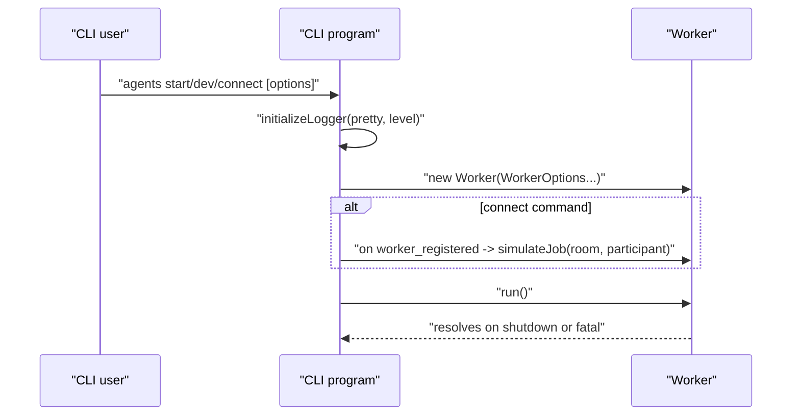
```mermaid
sequenceDiagram
  participant User as "CLI user"
  participant CLI as "CLI program"
  participant Worker as "Worker"

  User->>CLI: "agents start/dev/connect [options]"
  CLI->>CLI: "initializeLogger(pretty, level)"
  CLI->>Worker: "new Worker(WorkerOptions...)"
  alt connect command
    CLI->>Worker: "on worker_registered -> simulateJob(room, participant)"
  end
  CLI->>Worker: "run()"
  Worker-->>CLI: "resolves on shutdown or fatal"
```

#### Signals and shutdown behavior

- `SIGINT` (Ctrl+C)
  - First signal: logs receipt; in production, calls `worker.drain()`; then `worker.close()` and exits with code `130`.
  - Second `SIGINT`: force-exits with code `130`.

- `SIGTERM`
  - Logs receipt; in production, calls `worker.drain()`; then `worker.close()` and exits with code `143`.

- Errors in `worker.run()`
  - Logs fatal and exits with code `1`.

#### Integration with WorkerOptions

`runApp(opts: WorkerOptions)` wires the CLI to the worker. The command handlers overwrite these fields from CLI/env when provided:
- `wsURL`, `apiKey`, `apiSecret`, `logLevel`, and optionally `workerToken`.

Example:

```ts
import { runApp } from 'agents/src/cli.js';
import { WorkerOptions } from 'agents/src/worker.js';

runApp(new WorkerOptions({
  agent: new URL('./agent.js', import.meta.url).pathname,
  agentName: 'my-agent',
  production: false, // command will override
}));
```

#### Typical invocations

- Production server:
  - `pnpm -w agents start --url wss://PROJECT.livekit.cloud --api-key ... --api-secret ... --log-level info`

- Local development:
  - `pnpm -w agents dev --url ws://localhost:7880 --api-key devkey --api-secret devsecret --log-level debug`

- Connect to a room for quick testing:
  - `pnpm -w agents connect --room demo --participant-identity alice --url ws://localhost:7880 --api-key dev --api-secret dev`

- Download plugin assets:
  - `pnpm -w agents download-files`

#### Known notes and minor issues

- Help fallback: If run with no subcommand and not from the job child, `program.help()` is shown.
- Typo: a comment says "overriddden"; cosmetic only.
- `download-files` runs all plugin downloads sequentially; parallelization could improve speed.


### Worker architecture and usage

This document explains the responsibilities, lifecycle, and usage of `agents/src/worker.ts`, and how it integrates with the process pool, inference executor, HTTP health server, and the LiveKit control plane. It also lists known shortcomings and likely bugs.

#### Purpose

The `Worker` orchestrates agent jobs requested by a LiveKit server or Cloud project. It maintains a WebSocket control session, advertises availability based on system load, accepts assignments, launches agent jobs into supervised processes, exposes health/metrics over HTTP, and manages graceful shutdown.

#### High-level architecture

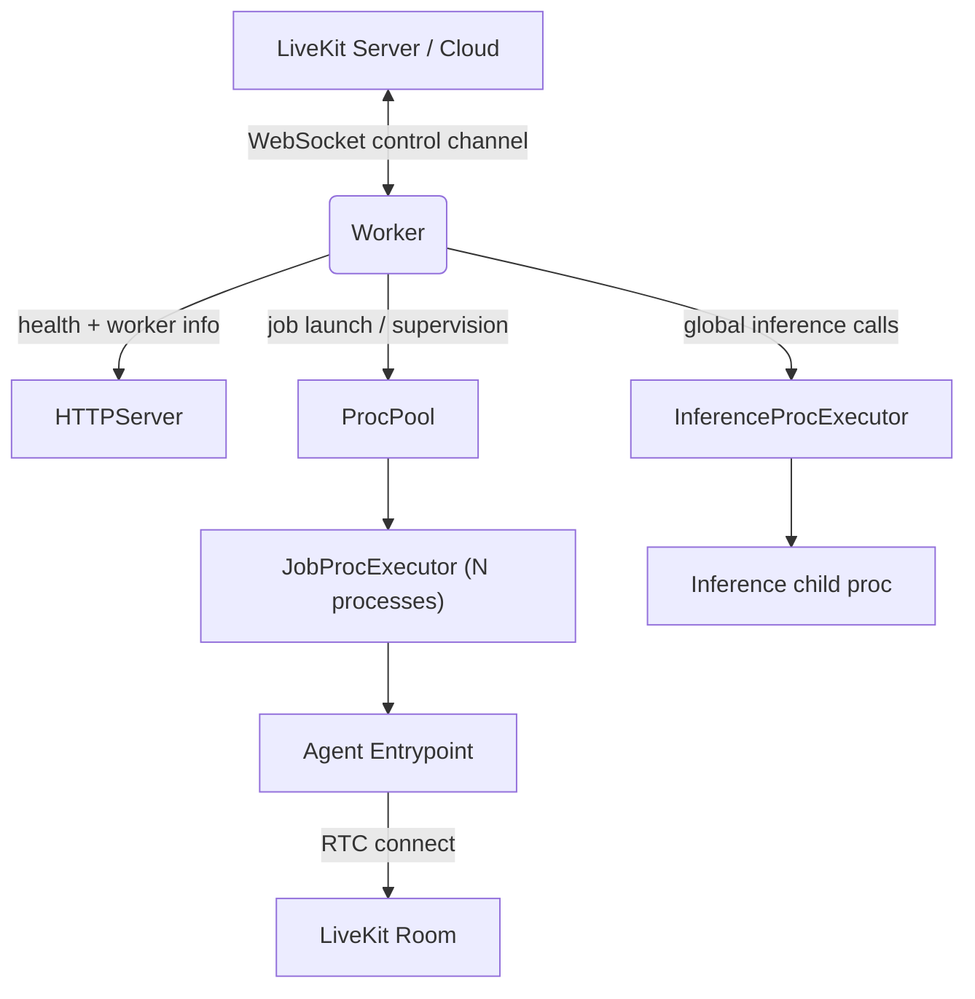
```mermaid
graph TD
  A["LiveKit Server / Cloud"] <--> |"WebSocket control channel"| B("Worker")
  B -->|"health + worker info"| C["HTTPServer"]
  B -->|"job launch / supervision"| D["ProcPool"]
  D --> E["JobProcExecutor (N processes)"]
  B -->|"global inference calls"| F["InferenceProcExecutor"]
  F --> G["Inference child proc"]
  E --> H["Agent Entrypoint"]
  H -->|"RTC connect"| I["LiveKit Room"]
```

Key modules:
- `Worker` (`agents/src/worker.ts`): main orchestrator; manages WS, availability, assignments, termination, and shutdown.
- `HTTPServer` (`agents/src/http_server.ts`): exposes `/` (health) and `/worker` (JSON info).
- `ProcPool` (`agents/src/ipc/proc_pool.ts`): maintains a pool of warmed `JobProcExecutor`s or spins one on demand.
- `InferenceProcExecutor` (`agents/src/ipc/inference_proc_executor.ts`): global inference subprocess, multiplexed across jobs.
- `Job*` (`agents/src/job.ts`): job request/acceptance surface and job runtime context (`JobContext`).

#### Control-plane protocol flow

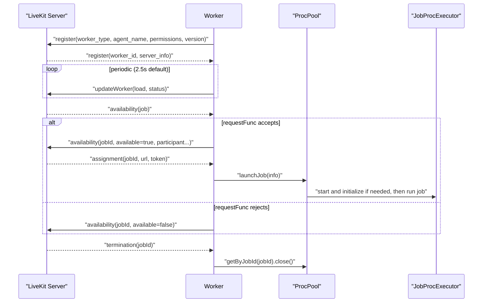
```mermaid
sequenceDiagram
  participant Server as "LiveKit Server"
  participant Worker
  participant Pool as "ProcPool"
  participant Exec as "JobProcExecutor"

  Worker->>Server: "register(worker_type, agent_name, permissions, version)"
  Server-->>Worker: "register(worker_id, server_info)"

  loop periodic (2.5s default)
    Worker->>Server: "updateWorker(load, status)"
  end

  Server-->>Worker: "availability(job)"
  alt requestFunc accepts
    Worker->>Server: "availability(jobId, available=true, participant...)"
    Server-->>Worker: "assignment(jobId, url, token)"
    Worker->>Pool: "launchJob(info)"
    Pool->>Exec: "start and initialize if needed, then run job"
  else requestFunc rejects
    Worker->>Server: "availability(jobId, available=false)"
  end

  Server-->>Worker: "termination(jobId)"
  Worker->>Pool: "getByJobId(jobId).close()"
```

#### Lifecycle overview

- Initialization
  - Validates `wsURL`, `apiKey`, `apiSecret` (or Cloud `workerToken` constraints).
  - Optionally starts `InferenceProcExecutor` if any `InferenceRunner` is registered.
  - Starts `ProcPool` (warming N processes in production when configured).
  - Starts `HTTPServer` on `host:port` (default 8081 in production; ephemeral in dev).

- WebSocket session
  - Connects to `LIVEKIT_URL` (switching to `ws://`), path `agent`, with JWT from `livekit-server-sdk`.
  - On open: sends `register` with worker type, agent name, permissions, version.
  - Periodically samples `loadFunc()` and sends `updateWorker` with load and availability.
  - Handles messages:
    - `availability`: constructs `JobRequest` and delegates to `requestFunc` (default: accept).
    - `assignment`: resolves pending assignment and launches the job via `ProcPool`.
    - `termination`: finds the running process and closes it.

- Drain and shutdown
  - `drain()` marks worker FULL and waits for active jobs to finish (with optional timeout).
  - `close()` shuts down inference executor, all job executors, HTTP server, and WS.

#### HTTP endpoints

- `GET /`: health check, returns `OK`.
- `GET /worker`: JSON payload with:
  - `agent_name`, `worker_type`, `active_jobs`, `sdk_version`.

#### WorkerOptions (key fields)

- `agent` (required): module path that default-exports an `Agent` entrypoint used by `JobProcExecutor`.
- `requestFunc(job: JobRequest)`: decide to `accept` or `reject` a job. Default: `accept()`.
- `loadFunc(): Promise<number>`: returns 0..1 load value. Default: CPU sampling over 2.5s.
- `loadThreshold`: mark FULL when `load >= threshold`. Default: 0.7 (prod) / `Infinity` (dev).
- `numIdleProcesses`: warmed processes in pool (prod default 3, dev 0).
- `initializeProcessTimeout`/`shutdownProcessTimeout`: per-process timeouts.
- `permissions: WorkerPermissions`: LiveKit participant permissions for the agent.
- `workerType`: `JobType` (default `JT_ROOM`).
- `wsURL`, `apiKey`, `apiSecret` or `workerToken` for Cloud.
- `host`, `port`: HTTP server bind (default `0.0.0.0:8081` in prod).
- `jobMemoryWarnMB`, `jobMemoryLimitMB`: soft/hard memory guardrails per job executor.

#### Process pool and inference

- `ProcPool` strategies
  - With `numIdleProcesses > 0`: a `MultiMutex` controls the number of warmed executors; a background loop keeps them initialized in `warmedProcQueue`.
  - With `numIdleProcesses = 0`: launches a new `JobProcExecutor` per job on demand.

- `InferenceProcExecutor`
  - Spawns a dedicated supervised process for inference; methods are invoked via IPC.
  - Register runners globally via `InferenceRunner.registerRunner(method, importPath)` before starting the worker.

#### Programmatic usage

```ts
import { runApp } from 'agents/src/cli.js';
import { WorkerOptions, WorkerPermissions } from 'agents/src/worker.js';

runApp(
  new WorkerOptions({
    agent: new URL('./my_agent.js', import.meta.url).pathname,
    agentName: 'my-agent',
    workerType: 1, // JobType.JT_ROOM
    production: false,
    wsURL: process.env.LIVEKIT_URL,
    apiKey: process.env.LIVEKIT_API_KEY,
    apiSecret: process.env.LIVEKIT_API_SECRET,
    permissions: new WorkerPermissions(true, true, true, true, [], false),
  }),
);
```

Environment variables supported by the CLI and `WorkerOptions`:
- `LIVEKIT_URL`, `LIVEKIT_API_KEY`, `LIVEKIT_API_SECRET`, `LOG_LEVEL`, optionally `LIVEKIT_WORKER_TOKEN`.

#### CLI usage

- Start in production mode:
  - `pnpm -w agents start --url wss://... --api-key ... --api-secret ...`
- Start in development mode:
  - `pnpm -w agents dev --url ws://localhost:7880 --api-key ... --api-secret ...`
- Connect to a specific room (simulate a job):
  - `pnpm -w agents connect --room <name> [--participant-identity <id>]`

#### Notable behaviors and edge cases

- Availability decisions are delegated to `requestFunc`. If it neither calls `accept` nor `reject`, the intended behavior is auto-reject (see issues below).
- Load sampling uses a 2.5s window and rounds to 2 decimals; status flips generate log messages.
- In Cloud (`workerToken` set), custom `loadFunc`/`loadThreshold` are forced to defaults and a warning is logged.

#### Known shortcomings and probable bugs

- Auto-reject not executed
  - In `#availability`, when `requestFunc` completes without calling `accept`/`reject`, the code only logs "automatically rejecting the job" but does not actually invoke the rejection path. This can leave the server waiting indefinitely for the availability response. Expected fix: call `onReject()` when `answered` is still `false` after `requestFunc` returns.

- Assignment timeout does not unwind wait
  - The assignment wait sets a timer that only logs a warning on timeout but leaves the pending promise unresolved. This means the accept path will continue awaiting the assignment indefinitely. Expected fix: clear the pending entry and proceed with a controlled failure or retry.

- HTTP header typo
  - `HTTPServer` sets `Contet-Type` instead of `Content-Type` on `/worker` responses, which can affect clients expecting proper JSON content type.

- WebSocket URL construction is fragile
  - `new URL(url + 'agent')` relies on implicit trailing slash. Safer to use `new URL('agent', url)` to join paths.

- Type-safety and linter issues (non-functional but noisy)
  - `defaultCpuLoad` uses `Object.values(cpu.times).reduce((acc, i) => ...)` where types are inferred as `unknown`. Cast to `number` to satisfy the linter.
  - Node globals/types: `process`, `NodeJS.Timeout`, and built-in modules require proper Node type configuration (e.g., `@types/node` and `tsconfig` `types: ["node"]`).
  - Un-typed callback parameters: add types for WebSocket event handlers (`error`, `close`, `message`).

- Minor logging/message inconsistencies
  - `JobContext.onParticipantConnected` warning contains a typo ("prticipant").

- Potential race on warmed executor removal
  - In `ProcPool.procWatchTask`, if `closed` becomes true after pushing the executor but before initialization, ensure the executor is reliably closed and removed (the `finally` block splices it, but verify index handling and close semantics).

#### Testing and observability tips

- Health check: `curl http://<host>:<port>/` should return `OK`.
- Worker info: `curl http://<host>:<port>/worker` for JSON snapshot.
- Observe availability flips by temporarily customizing `loadFunc()` to return values above/below the `loadThreshold`.
- Use `connect` CLI subcommand to simulate a publisher job in a specific room during development.

#### Versioning

- Worker logs include the SDK `version` from `agents/src/version.ts` and the server info returned during registration. This helps correlate worker binaries with control-plane behavior.


### HTTPServer architecture and usage

This document covers `agents/src/http_server.ts`, which exposes health and worker info endpoints for process-level monitoring and discovery.

#### Purpose

Provide a tiny HTTP surface for:
- Health checks for orchestration (readiness/liveness).
- A JSON snapshot of worker metadata (agent name, worker type, active jobs, SDK version).

#### High-level architecture

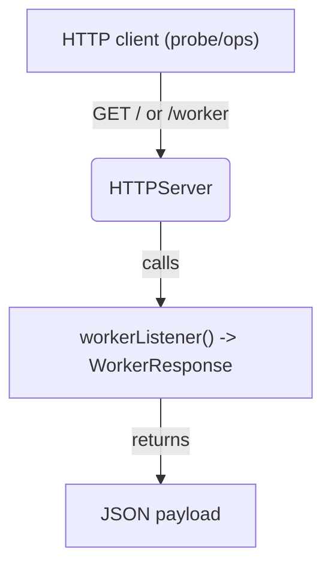
```mermaid
graph TD
  A["HTTP client (probe/ops)"] -->|"GET / or /worker"| B("HTTPServer")
  B -->|"calls"| C["workerListener() -> WorkerResponse"]
  C -->|"returns"| D["JSON payload"]
```

#### Endpoints

- `GET /`
  - Returns `200 OK` with body `OK`.
- `GET /worker`
  - Returns `200 OK` with JSON from the injected `workerListener()` callback.
  - Shape:
    - `agent_name: string`
    - `worker_type: string`
    - `active_jobs: number`
    - `sdk_version: string`
- Any other path: `404 Not Found`.

#### API

- Constructor: `new HTTPServer(host: string, port: number, workerListener: () => WorkerResponse)`
  - `host`: interface to bind (e.g., `0.0.0.0`).
  - `port`: port to listen on.
  - `workerListener`: function that returns a serializable `WorkerResponse` snapshot.
- `run(): Promise<void>`
  - Starts listening and logs the bound port.
- `close(): Promise<void>`
  - Stops the server.

#### Typical usage and integration

The worker constructs and owns the HTTP server, passing a listener that captures live state:

```ts
import { HTTPServer } from "agents/src/http_server.js";

const http = new HTTPServer(host, port, () => ({
  agent_name: opts.agentName,
  worker_type: JobType[opts.workerType],
  active_jobs: procPool.processes.filter((p) => p.runningJob).length,
  sdk_version: version,
}));

await http.run();
// later ...
await http.close();
```

#### Request/response flow

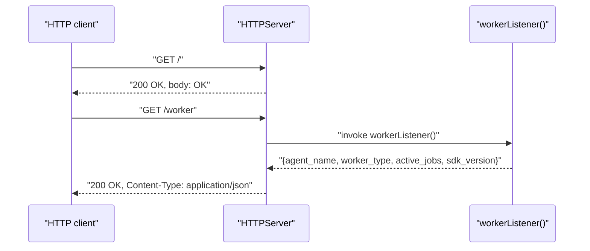
```mermaid
sequenceDiagram
  participant Client as "HTTP client"
  participant Server as "HTTPServer"
  participant Worker as "workerListener()"

  Client->>Server: "GET /"
  Server-->>Client: "200 OK, body: OK"

  Client->>Server: "GET /worker"
  Server->>Worker: "invoke workerListener()"
  Worker-->>Server: "{agent_name, worker_type, active_jobs, sdk_version}"
  Server-->>Client: "200 OK, Content-Type: application/json"
```

#### Operational notes

- Bind address/port are controlled by the `WorkerOptions` passed to the worker.
- In development, the port may be zero (ephemeral); consult logs for the actual port.
- Health and info are intentionally simple; it’s fine to front this with a reverse proxy.

#### Known shortcomings and probable bugs

- Content-Type header typo
  - The code sets `Contet-Type` instead of `Content-Type` for `/worker`. Clients may not treat the body as JSON. Fix: `res.writeHead(200, { 'Content-Type': 'application/json' });`.

- Lack of method checks
  - All HTTP methods are treated the same. Consider restricting to `GET` and returning `405 Method Not Allowed` for others.

- No error handling around `workerListener()`
  - If the callback throws, the request may hang or return a partial response. Wrap in try/catch and return `500`.

- No CORS headers
  - If consumed from browser contexts, add appropriate CORS headers.

- Security exposure
  - Defaults may bind to `0.0.0.0`. Ensure this surface is protected if deployed on public networks.

- TypeScript/node typings
  - Uses `node:http`; make sure `@types/node` is installed and `tsconfig` includes `"types": ["node"]` to avoid linter errors.


### ProcPool architecture and usage

This document explains `agents/src/ipc/proc_pool.ts` — the process pool that pre-warms and manages `JobProcExecutor` instances for running agent jobs.

#### Purpose

`ProcPool` provides:
- Pre-warmed executors to reduce job startup latency.
- A concurrency cap on warmed processes via `MultiMutex`.
- A queue (`warmedProcQueue`) from which ready executors are drawn when jobs arrive.
- On-demand executor creation when no pool is configured.

#### High-level architecture

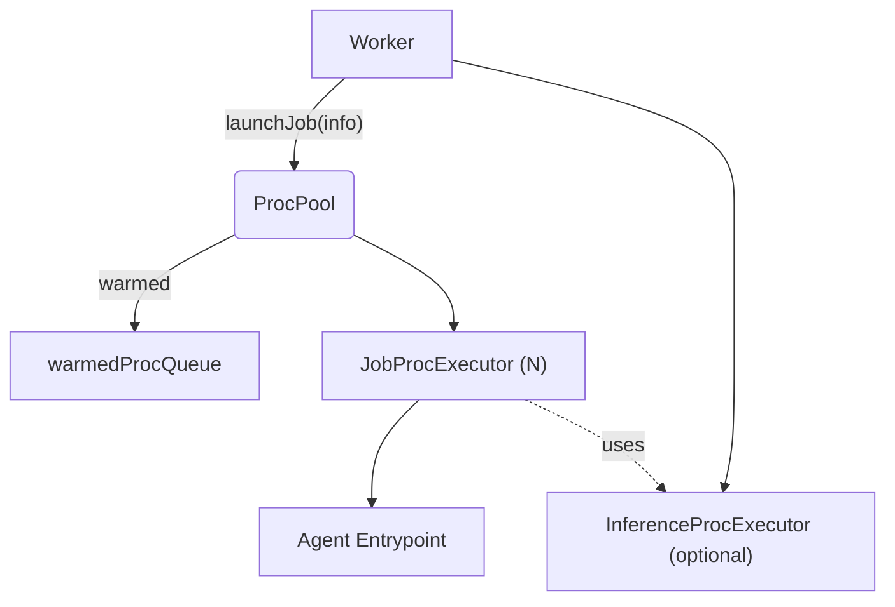
```mermaid
graph TD
  W["Worker"] -->|"launchJob(info)"| P("ProcPool")
  P -->|"warmed"| Q["warmedProcQueue"]
  P --> E["JobProcExecutor (N)"]
  E --> A["Agent Entrypoint"]
  W --> I["InferenceProcExecutor (optional)"]
  E -. uses .-> I
```

#### Concurrency model

- When `numIdleProcesses > 0`, a `MultiMutex` of size `numIdleProcesses` limits the number of warmed executors.
- `run(signal)` loops: acquires one `MultiMutex` slot, spawns `procWatchTask()` which prepares a warmed executor and puts it into `warmedProcQueue`. The unlock handle is stored in `procUnlock` and is only released when a warmed executor is actually consumed by `launchJob()`.
- If initialization fails, the slot is immediately released to avoid deadlock.

#### Operations

- `start()`
  - Starts the background warming loop if a pool size was configured.

- `procWatchTask()`
  - Creates a new `JobProcExecutor` and pushes it into `executors`.
  - Serializes initialization via `initMutex` to avoid contention during startup.
  - If not closed, starts and initializes the executor.
  - On success, puts the executor into `warmedProcQueue`.
  - On init failure, releases the reserved pool slot (`procUnlock`) if present.
  - Waits for the executor to finish (`join()`), then removes it from `executors`.

- `launchJob(info)`
  - If a pool exists: waits for a warmed executor from `warmedProcQueue`; after obtaining it, releases the reserved pool slot (`procUnlock`) so the warming loop can prepare another one; launches the job on that executor.
  - If no pool: constructs a fresh `JobProcExecutor`, starts, initializes, and launches the job.

- `close()`
  - Marks closed and aborts the warming loop.
  - Closes any warmed but idle executors and all tracked executors.
  - Waits for `procWatchTask` promises to settle.

#### Control flow: warming and consumption

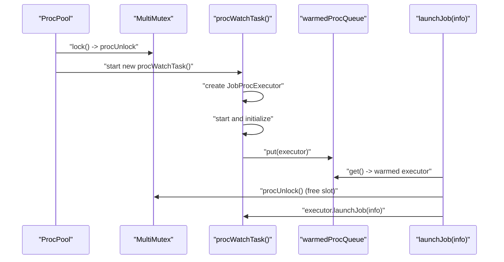
```mermaid
sequenceDiagram
  participant Pool as "ProcPool"
  participant Mutex as "MultiMutex"
  participant Task as "procWatchTask()"
  participant Queue as "warmedProcQueue"
  participant Caller as "launchJob(info)"

  Pool->>Mutex: "lock() -> procUnlock"
  Pool->>Task: "start new procWatchTask()"
  Task->>Task: "create JobProcExecutor"
  Task->>Task: "start and initialize"
  Task->>Queue: "put(executor)"
  Caller->>Queue: "get() -> warmed executor"
  Caller->>Mutex: "procUnlock() (free slot)"
  Caller->>Task: "executor.launchJob(info)"
```

#### Typical usage

`ProcPool` is internal to `Worker`. You normally configure it via `WorkerOptions.numIdleProcesses`, `initializeProcessTimeout`, and `shutdownProcessTimeout`.

#### Known shortcomings and probable bugs

- Removal bug when cleaning up executors
  - In `finally`, the code calls `this.executors.splice(this.executors.indexOf(proc))`, which removes from the found index to the end of the array instead of a single element. It should be `splice(index, 1)` to remove exactly one executor. This can inadvertently delete multiple executors.

- Early return path may skip cleanup
  - If `closed` becomes true after pushing the executor but before initialization (`if (this.closed) { return; }`), it relies on `finally` to splice the executor (subject to the splice bug above). Ensure proper closing and single-element removal.

- Warmed executor dies before consumption
  - If a warmed executor exits before being consumed, the reserved mutex slot may remain pending until `launchJob` tries to unlock. Consider releasing the slot (or re-warming) when the executor terminates pre-consumption.

- `launchJob` waiting semantics
  - With a pool, `warmedProcQueue.get()` awaits indefinitely if no warmed executor is available (e.g., repeated init failures). Consider a timeout and fallback to on-demand spawn to avoid head-of-line blocking.

- Shutdown ordering
  - `close()` calls `close()` on warmed queue items and all executors but does not await each executor's `join()` here. The pending joins occur inside running tasks; ensure callers tolerate in-flight shutdown.

#### Tuning notes

- `numIdleProcesses`: trade-off between latency (higher is faster) and memory/CPU (higher is costlier).
- `initializeProcessTimeout` and `closeTimeout`: keep realistic bounds for environment and agent init time.
- Memory guardrails come from `WorkerOptions` and are passed to executors; adjust per agent complexity.


### SupervisedProc architecture and usage

This document describes `agents/src/ipc/supervised_proc.ts` — the base class that supervises child processes used by executors (e.g., job and inference). It manages spawning, an initialization handshake, health pings, timeouts, and shutdown.

#### Purpose

Provide a common lifecycle for child processes:
- Spawn and initialize a child process with consistent logger and ping configuration.
- Liveness checks via ping/pong and a high-latency warning threshold.
- Memory usage monitoring and enforcement (warn/kill thresholds).
- Graceful shutdown with a timeout and forced kill fallback.

#### High-level structure

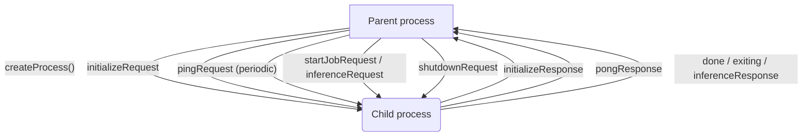
```mermaid
graph TD
  P["Parent process"] -->|"createProcess()"| C("Child process")
  P -->|"initializeRequest"| C
  C -->|"initializeResponse"| P
  P -->|"pingRequest (periodic)"| C
  C -->|"pongResponse"| P
  P -->|"startJobRequest / inferenceRequest"| C
  C -->|"done / exiting / inferenceResponse"| P
  P -->|"shutdownRequest"| C
```

#### Lifecycle overview

- `start()`
  - Validates state, calls `createProcess()` (implemented by subclasses), marks started, and kicks off `run()`.

- `initialize()`
  - Sends `initializeRequest` with `loggerOptions`, ping intervals/timeouts, and awaits the first message which must be `initializeResponse`. A timer enforces `initializeTimeout`.

- `run()`
  - Awaits `init.await` (resolved by `initialize()`).
  - Starts periodic `pingRequest` at `pingInterval` and a `pongTimeout` that kills the child if no timely pong is received.
  - Starts memory monitoring, warning or closing when thresholds are exceeded.
  - Registers message handlers:
    - `pongResponse`: computes latency, warns if above `highPingThreshold`, refreshes the `pongTimeout`.
    - `exiting`: logs reason.
    - `done`: marks closing, removes message listener.
  - Registers process error and exit handlers to unblock `join()`.
  - Calls subclass `mainTask(proc)` to wire child-specific message handling.

- `launchJob(info)`
  - Ensures no job is running, stores `runningJob`, and sends `startJobRequest`.

- `close()`
  - Sends `shutdownRequest` and waits up to `closeTimeout`; kills process if it does not exit in time; clears timers.

#### IPC messages

Defined in `agents/src/ipc/message.ts`:
- Initialization: `initializeRequest`, `initializeResponse`
- Health: `pingRequest`, `pongResponse`
- Control: `startJobRequest`, `shutdownRequest`, `exiting`, `done`
- Inference: `inferenceRequest`, `inferenceResponse`

#### Sequence: start, handshake, run, shutdown

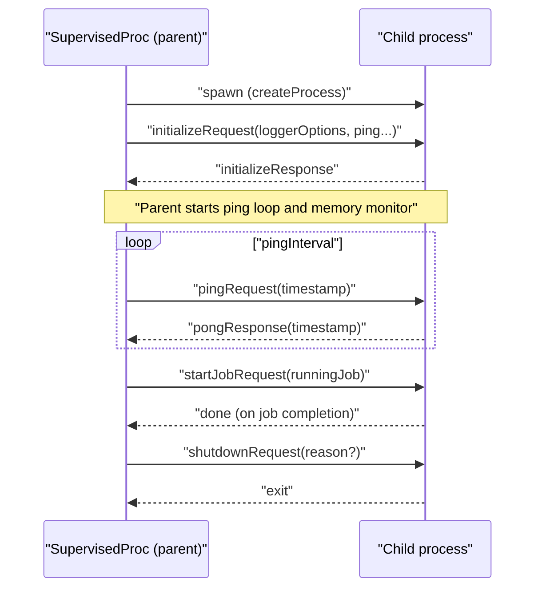
```mermaid
sequenceDiagram
  participant Parent as "SupervisedProc (parent)"
  participant Child as "Child process"

  Parent->>Child: "spawn (createProcess)"
  Parent->>Child: "initializeRequest(loggerOptions, ping...)"
  Child-->>Parent: "initializeResponse"
  Note over Parent,Child: "Parent starts ping loop and memory monitor"
  loop "pingInterval"
    Parent->>Child: "pingRequest(timestamp)"
    Child-->>Parent: "pongResponse(timestamp)"
  end
  Parent->>Child: "startJobRequest(runningJob)"
  Child-->>Parent: "done (on job completion)"
  Parent->>Child: "shutdownRequest(reason?)"
  Child-->>Parent: "exit"
```

#### Typical subclassing

Subclasses implement:
- `createProcess()`: how to fork/spawn the child (e.g., `child_process.fork`).
- `mainTask(proc)`: any executor-specific message routing (e.g., inference request multiplexing).

Examples:
- `ipc/job_proc_executor.ts`
- `ipc/inference_proc_executor.ts`

#### Known shortcomings and probable bugs

- Memory monitoring uses parent memory, not child
  - `process.memoryUsage()` measures the supervising parent’s heap, not the child’s. This defeats enforcement for the child process. Consider either requesting memory stats from the child or sampling the child PID via OS APIs.

- Memory watch interval missing delay
  - `setInterval` for memory monitoring is called without a delay, causing a tight loop that can peg CPU. Provide a reasonable interval (e.g., 1000 ms).

- Timers not consistently cleared
  - In the normal `done`/`exit` path, `pingInterval`, `pongTimeout`, and the memory watch interval may remain until `close()` or error handling clears them. Ensure all timers are cleared as soon as the child is finished to avoid leaks.

- Initialization timeout handling
  - The `initialize()` timeout throws from the timer callback and calls `init.reject()`. Since `run()` awaits `init.await` in a fire-and-forget task, this can surface as an unhandled rejection. Prefer explicit cancellation and consistent cleanup.

- `#logger` child context stability
  - The logger is created with `{ runningJob: this.#runningJob }` at construction time. Before any job is launched this is undefined, and it does not update when `runningJob` changes. Consider deriving child logger fields at log time or recreating the child logger when a job starts.

#### Tuning recommendations

- Choose `pingInterval`, `pingTimeout`, and `highPingThreshold` appropriate to your agent’s workload and platform jitter.
- Set realistic `initializeTimeout` and `closeTimeout` bounds for your environment.
- Implement child-side graceful handling of `shutdownRequest` and timely `pongResponse` to avoid forced kills.


### JobProcExecutor architecture and usage

This document explains `agents/src/ipc/job_proc_executor.ts` — the supervised child-process executor that runs a single agent job and multiplexes inference requests between the job process and the global inference executor.

#### Purpose

- Spawn the job child process (`job_proc_lazy_main.js`) for a given agent module path.
- Perform the common supervised lifecycle (via `SupervisedProc`): initialization, ping/pong, timeouts, shutdown.
- Launch exactly one `RunningJobInfo` into the child.
- Bridge inference requests from the job child to the global `InferenceExecutor` and return responses.

#### High-level architecture

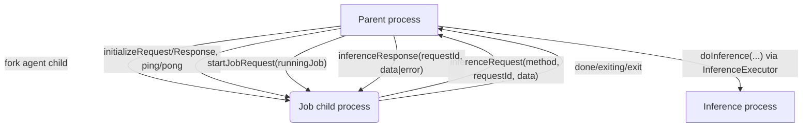
```mermaid
graph TD
  P["Parent process"] -->|"fork agent child"| C("Job child process")
  P -->|"initializeRequest/Response, ping/pong"| C
  P -->|"startJobRequest(runningJob)"| C
  C -->|"inferenceRequest(method, requestId, data)"| P
  P -->|"doInference(...) via InferenceExecutor"| G["Inference process"]
  P -->|"inferenceResponse(requestId, data|error)"| C
  C -->|"done/exiting/exit"| P
```

#### Key fields and behavior

- `createProcess()`
  - `fork(new URL('./job_proc_lazy_main.js', import.meta.url), [agent])` — the child receives the agent module path as argv[2].

- `mainTask(proc)`
  - Listens for `inferenceRequest` from the child and delegates to `#doInferenceTask`.
  - Tracks each inference task in `#inferenceTasks` (not awaited on close).

- `launchJob(info: RunningJobInfo)`
  - Requires `init.done === true` (initialized) and no currently running job.
  - Sets `#jobStatus = JobStatus.RUNNING` and `#runningJob = info`, then sends `startJobRequest`.

- `status`, `runningJob`
  - `status` throws if not set; becomes `RUNNING` on launch. Not updated automatically to a terminal state in current code.

#### Job launch and inference flow

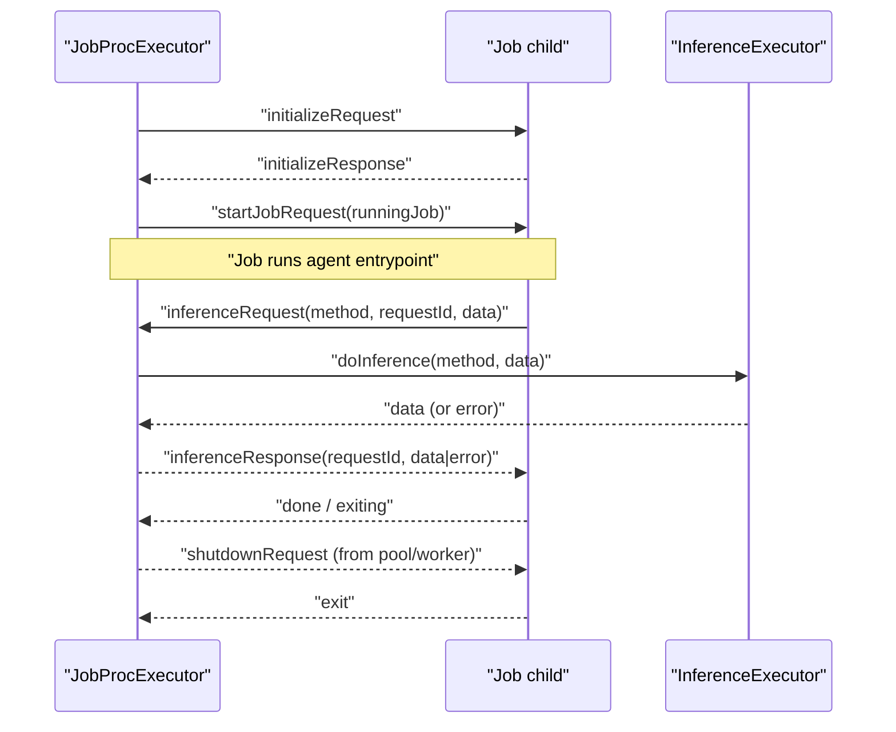
```mermaid
sequenceDiagram
  participant Parent as "JobProcExecutor"
  participant Child as "Job child"
  participant Infer as "InferenceExecutor"

  Parent->>Child: "initializeRequest"
  Child-->>Parent: "initializeResponse"
  Parent->>Child: "startJobRequest(runningJob)"
  Note over Parent,Child: "Job runs agent entrypoint"

  Child->>Parent: "inferenceRequest(method, requestId, data)"
  Parent->>Infer: "doInference(method, data)"
  Infer-->>Parent: "data (or error)"
  Parent-->>Child: "inferenceResponse(requestId, data|error)"

  Child-->>Parent: "done / exiting"
  Parent-->>Child: "shutdownRequest (from pool/worker)"
  Child-->>Parent: "exit"
```

#### Integration points

- Constructed and managed by `ProcPool`:
  - In pooled mode: pre-warmed, then assigned a job when available.
  - In non-pooled mode: created per job and initialized before launch.
- Inference is delegated to `InferenceExecutor` (often an `InferenceProcExecutor`).

#### Known shortcomings and probable bugs

- Status never transitions out of RUNNING
  - `#jobStatus` is set to `RUNNING` on `launchJob`, but there is no state update on `done`/`exit`. Consider updating status when receiving `done` or on process exit.

- Unbounded `#inferenceTasks` growth
  - Pushed to on every request and never pruned. While the process exits on close, references remain in the parent until GC. Consider removing settled promises or awaiting all in `close()`.

- Error serialization across IPC
  - `inferenceResponse.value.error` is typed as `Error`, but native IPC serialization loses prototype/stack. Normalize to a plain object ({ name, message, stack }) on send and reconstruct if needed on receive.

- Missing propagation of `userArguments`
  - The `userArguments` property is available but never sent to the child. If intended, include it in `startJobRequest` or a separate message.

- Logger context
  - Logger is created without dynamic job context. Consider adding job identifiers to the child logger fields when a job launches.

#### Practical tips

- Ensure `initialize()` completes before `launchJob()`.
- If you customize inference, validate method names and payload schemas on both sides (child and parent).
- On shutdown, prefer graceful `shutdownRequest` handling in the child so the parent doesn't have to kill.


### Job APIs: JobContext, JobRequest, and JobProcess

This document explains `agents/src/job.ts` — the public runtime surface available to agent code when a job is launched, along with how jobs are accepted and initialized.

#### Key types

- `JobContext`
  - The main interface exposed to an agent entrypoint. Provides access to the LiveKit room, the agent participant, inference executor, and participant-driven hooks.
- `JobRequest`
  - The request object handed to `WorkerOptions.requestFunc`. Decide whether to accept or reject a job and optionally set participant identity/name/metadata.
- `JobProcess`
  - Minimal process metadata and `userData` storage for the process running the job.
- `AutoSubscribe`
  - Controls which remote tracks are auto-subscribed on connect: `SUBSCRIBE_ALL`, `SUBSCRIBE_NONE`, `VIDEO_ONLY`, `AUDIO_ONLY`.
- `CurrentJobContext`
  - Static accessor to the currently running `JobContext` inside the job process.

#### High-level usage

```ts
// Agent entrypoint (default export) gets a JobContext
export default async function run(job: JobContext) {
  await job.connect();
  const participant = await job.waitForParticipant();
  job.addShutdownCallback(async () => {
    // cleanup resources
  });
}
```

#### Job acceptance flow

`JobRequest` is constructed by the worker on availability checks and passed to your `requestFunc`:

```ts
async function requestFunc(req: JobRequest) {
  // Inspect room or publisher
  if (req.room?.name && shouldAccept(req)) {
    await req.accept('My Agent', '', JSON.stringify({ foo: 'bar' }));
  } else {
    await req.reject();
  }
}
```

Notes:
- `accept(name, identity, metadata, attributes)` allows customizing the agent participant identity/name and metadata.
- If `identity` is empty, it defaults to `agent-<job.id>`.

#### JobContext lifecycle

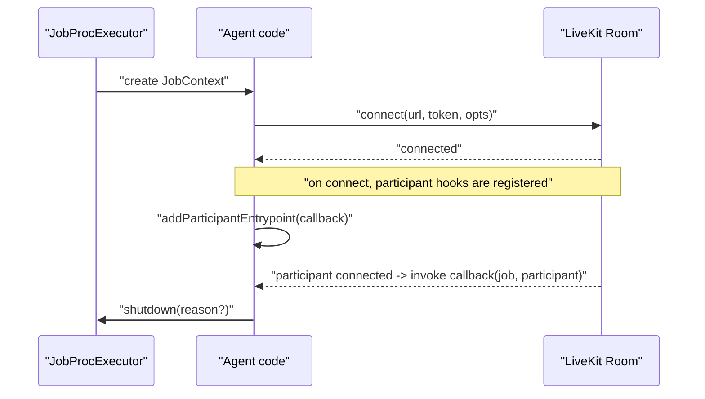
```mermaid
sequenceDiagram
  participant Exec as "JobProcExecutor"
  participant Agent as "Agent code"
  participant Room as "LiveKit Room"

  Exec->>Agent: "create JobContext"
  Agent->>Room: "connect(url, token, opts)"
  Room-->>Agent: "connected"
  Note over Agent,Room: "on connect, participant hooks are registered"
  Agent->>Agent: "addParticipantEntrypoint(callback)"
  Room-->>Agent: "participant connected -> invoke callback(job, participant)"
  Agent->>Exec: "shutdown(reason?)"
```

#### JobContext API

- `get job(): proto.Job`
  - The job protobuf from the control plane.
- `get room(): Room`
  - The `@livekit/rtc-node` room instance used by the agent.
- `get agent(): LocalParticipant | undefined`
  - The agent participant after `connect()`.
- `get inferenceExecutor()`
  - A global `InferenceExecutor` for cross-job inference calls.
- `connect(e2ee?, autoSubscribe?, rtcConfig?)`
  - Establishes RTC connection using the job’s URL and token.
  - `autoSubscribe` defaults to `SUBSCRIBE_ALL`. For `AUDIO_ONLY` or `VIDEO_ONLY`, it subscribes only matching tracks for already-present participants.
- `waitForParticipant(identity?)`
  - Resolves when a non-agent participant is present (immediately if already present, otherwise waits for `ParticipantConnected`). Rejects if the room disconnects first.
- `addParticipantEntrypoint(callback)`
  - Registers a callback to run on every new non-agent participant. Throws if the same callback is added twice.
- `addShutdownCallback(callback)`
  - Adds a promise to be awaited during job shutdown.
- `shutdown(reason = '')`
  - Signals the job to shut down; triggers executor-level shutdown.

#### Participant entrypoints

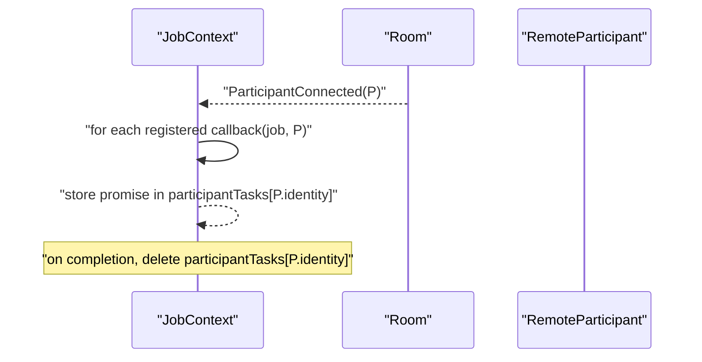
```mermaid
sequenceDiagram
  participant Job as "JobContext"
  participant Room as "Room"
  participant P as "RemoteParticipant"

  Room-->>Job: "ParticipantConnected(P)"
  Job->>Job: "for each registered callback(job, P)"
  Job-->>Job: "store promise in participantTasks[P.identity]"
  Note over Job: "on completion, delete participantTasks[P.identity]"
```

Behavior:
- If a new participant with the same identity arrives before a prior task for that identity finishes, a warning is logged and the new task is still scheduled.

#### CurrentJobContext

Provides `CurrentJobContext.getCurrent()` for code paths that don’t receive `JobContext` explicitly. Set by the executor when the job starts.

#### Known shortcomings and probable bugs

- Event listener cleanup
  - `JobContext` subscribes to `RoomEvent.ParticipantConnected` in the constructor and never removes this handler on shutdown. Consider removing listeners during shutdown to avoid leaks if the room persists longer than the job function.

- Typo in warning message
  - In `onParticipantConnected`, the warning string includes a typo: "prticipant".

- Participant task mapping assumptions
  - `participantTasks` is keyed by `participant.identity`. If identity changes or is undefined at some point, tasks could be mis-associated. The code assumes `identity` is defined (`p.identity!`).

- Auto-subscribe partial behavior
  - For `AUDIO_ONLY`/`VIDEO_ONLY`, it sets `subscribed` true for matching existing publications, but it does not explicitly unsubscribe others. If non-matching tracks were already auto-subscribed by the SDK, additional unsubscribes might be required.

- Global context
  - `CurrentJobContext` is a static global. In the presence of multiple concurrent jobs in the same process (not typical with the current architecture), this would be unsafe.

#### Tips for agent authors

- Call `connect()` early to avoid user-perceived delays.
- Use `waitForParticipant(identity)` to await a specific user before starting heavy logic.
- Use `addShutdownCallback` to release resources (files, network connections, timers).
- Use `inferenceExecutor` for model calls; it is shared across jobs and offloads work to the inference subprocess.


### Inference executor and runners

This document describes `agents/src/ipc/inference_proc_executor.ts` and `agents/src/inference_runner.ts`: how inference runs in a supervised child process, how requests are multiplexed, and how to register custom runners.

#### Purpose

- `InferenceProcExecutor`: a supervised child-process host for model inference. It accepts method calls from job processes and routes them to registered inference runners in the child, returning results via IPC.
- `InferenceRunner`: an abstract base and a registry for available inference methods (by name) and their import paths in the child process.

#### High-level architecture

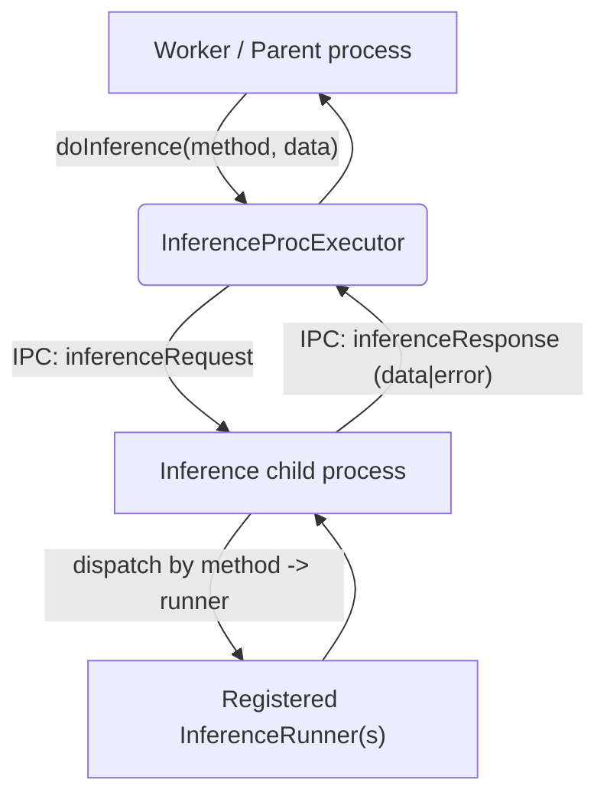
```mermaid
graph TD
  Parent["Worker / Parent process"] -->|"doInference(method, data)"| Exec("InferenceProcExecutor")
  Exec -->|"IPC: inferenceRequest"| Child["Inference child process"]
  Child -->|"dispatch by method -> runner"| Runner["Registered InferenceRunner(s)"]
  Runner --> Child
  Child -->|"IPC: inferenceResponse (data|error)"| Exec
  Exec --> Parent
```

#### Registration and lifecycle

- Register available methods before starting the worker:

```ts
import { InferenceRunner } from 'agents/src/inference_runner.js';

InferenceRunner.registerRunner('classify', new URL('./runners/classify.js', import.meta.url).pathname);
InferenceRunner.registerRunner('embed', new URL('./runners/embed.js', import.meta.url).pathname);
```

- When the worker starts, if any runner is registered, it constructs an `InferenceProcExecutor` with the registry and starts/initializes the child process.
- The executor is supervised (via `SupervisedProc`): initialized with `initializeRequest`, ping/pong health checks, memory limits, and graceful shutdown.

#### IPC messages (inference-specific)

- Parent to child: `inferenceRequest { requestId, method, data }`
- Child to parent: `inferenceResponse { requestId, data, error? }`

#### Request/response flow

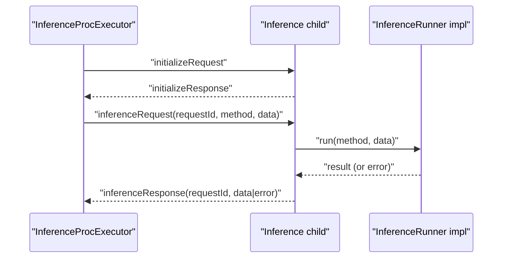
```mermaid
sequenceDiagram
  participant Parent as "InferenceProcExecutor"
  participant Child as "Inference child"
  participant Runner as "InferenceRunner impl"

  Parent->>Child: "initializeRequest"
  Child-->>Parent: "initializeResponse"

  Parent->>Child: "inferenceRequest(requestId, method, data)"
  Child->>Runner: "run(method, data)"
  Runner-->>Child: "result (or error)"
  Child-->>Parent: "inferenceResponse(requestId, data|error)"
```

#### InferenceProcExecutor API

- Constructor options: runners mapping, timeouts, memory thresholds, ping intervals.
- `createProcess()`
  - `fork(new URL('./inference_proc_lazy_main.js', import.meta.url), [JSON.stringify(runners)])`
- `mainTask(proc)`
  - Listens for `inferenceResponse` and resolves the matching pending promise in `#activeRequests` by `requestId`.
- `doInference(method: string, data: unknown): Promise<unknown>`
  - Generates a request id, stores a pending entry, sends `inferenceRequest`, and resolves on matching `inferenceResponse`. Throws if `error` is present.

#### InferenceRunner API

- `InferenceRunner.registerRunner(method: string, importPath: string)`
  - Static registry of method -> module path inside the child process.
- Extend `InferenceRunner<Input, Output>`
  - Implement `initialize()`, `run(data: Input)`, `close()` in your child-side module.

#### Typical usage pattern

```ts
// parent-side (already constructed by Worker)
const result = await inferenceExecutor.doInference('classify', { text: 'hello world' });

// child-side (runner)
export default class ClassifyRunner extends InferenceRunner<{ text: string }, { label: string }> {
  async initialize() { /* load model */ }
  async run(data) { /* return { label } */ }
  async close() { /* release model */ }
}
```

#### Known shortcomings and probable bugs

- No timeout for doInference
  - `doInference` awaits indefinitely for a response. If the child dies or a response is never sent, the promise never resolves and the entry remains in `#activeRequests`. Consider adding a per-request timeout and cleanup.

- Error serialization
  - `error` is sent as an `Error` instance, which loses prototype/stack across IPC. Normalize to a plain object and reconstruct if needed on the caller side.

- Backpressure and queueing
  - Multiple concurrent inference requests are supported, but there is no backpressure control. Consider queueing limits or per-method concurrency caps to avoid overloading the child.

- Orphaned requests on process crash
  - On child `error/exit`, pending requests are not explicitly rejected in this class; callers can hang. Ensure higher-level supervision rejects outstanding requests or add rejection on process failure.

- Runner name collisions
  - `registerRunner` throws if a method is already registered; this is expected. Document method names clearly to avoid conflicts across libraries.

#### Operational tips

- Keep runner initialization fast; heavy models should be loaded lazily or cached within the child process.
- Structure `data` payloads as stable, versioned objects; avoid sending large binary blobs over IPC.
- Monitor ping latency and memory warnings (inherited from `SupervisedProc`) to detect model overload.


### Job child process: job_proc_lazy_main.ts

This document explains `agents/src/ipc/job_proc_lazy_main.ts`, the child process that loads the agent module, hosts the `JobContext`, bridges inference requests to the parent, and coordinates graceful shutdown.

#### Responsibilities

- Receive initialization from the parent and configure logging.
- Dynamically import the agent module and run its `prewarm` and `entry` functions.
- Create the `JobContext` (with a room and inference bridge) and expose it to agent code.
- Respond to pings, send pongs, and detect orphaning when not pinged by the parent.
- Forward inference requests to the parent and return responses back to the agent code.
- Gracefully drain on shutdown and emit `done`.

#### Architecture

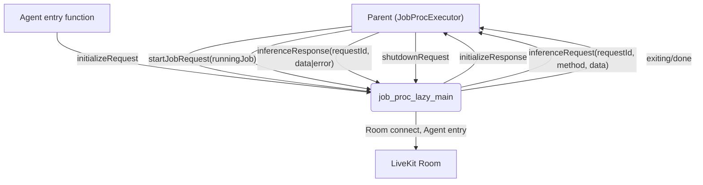
```mermaid
graph TD
  Parent["Parent (JobProcExecutor)"] -->|"initializeRequest"| Child("job_proc_lazy_main")
  Child -->|"initializeResponse"| Parent
  Parent -->|"startJobRequest(runningJob)"| Child
  Child -->|"Room connect, Agent entry"| Room["LiveKit Room"]
  Agent["Agent entry function"] --> Child
  Child -->|"inferenceRequest(requestId, method, data)"| Parent
  Parent -->|"inferenceResponse(requestId, data|error)"| Child
  Parent -->|"shutdownRequest"| Child
  Child -->|"exiting/done"| Parent
```

#### Boot and handshake

1. Waits for the first IPC message to be `initializeRequest`, then configures the logger.
2. Imports the agent module from `process.argv[2]`, validates default export is an `Agent`, sets a default `prewarm` if missing, runs `prewarm`.
3. Sends `initializeResponse`.

#### Ping/pong and orphan detection

- On every `pingRequest`, replies with `pongResponse { lastTimestamp, timestamp }` and refreshes an `ORPHANED_TIMEOUT` timer (15s). If the parent stops pinging, the child logs a warning and resolves its `join` future to exit.

#### Job startup and shutdown

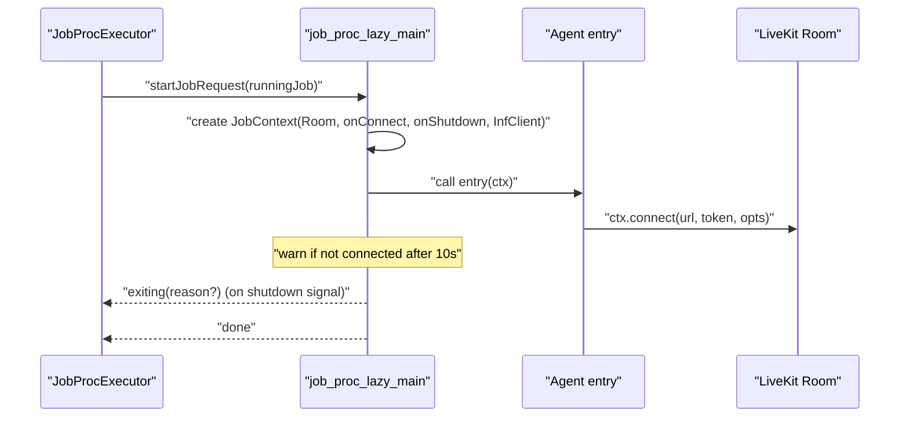
```mermaid
sequenceDiagram
  participant Parent as "JobProcExecutor"
  participant Child as "job_proc_lazy_main"
  participant Agent as "Agent entry"
  participant Room as "LiveKit Room"

  Parent->>Child: "startJobRequest(runningJob)"
  Child->>Child: "create JobContext(Room, onConnect, onShutdown, InfClient)"
  Child->>Agent: "call entry(ctx)"
  Agent->>Room: "ctx.connect(url, token, opts)"
  Note over Child: "warn if not connected after 10s"
  Child-->>Parent: "exiting(reason?) (on shutdown signal)"
  Child-->>Parent: "done"
```

Shutdown sequence details:
- A local `EventEmitter` (`closeEvent`) coordinates shutdown.
- On `RoomEvent.Disconnected` (if not initiated by the agent), emits close.
- When `shutdownRequest` arrives: emits `close`, clears orphan timer, removes message handler, and resolves `join` if no job is running.
- After close: disconnects the room, awaits all `shutdownCallbacks`, sends `done`, logs, and exits.

#### Inference bridge (InfClient)

- The child implements a lightweight `InferenceExecutor` client:
  - On `doInference(method, data)` generates a `requestId`, sends `inferenceRequest`, stores a `PendingInference`, and awaits `inferenceResponse`.
  - On receiving `inferenceResponse`, resolves the matching pending promise by `requestId`.

#### Notable implementation details and issues

- Request ID generation bug
  - `const requestId = 'inference_job_' + randomUUID;` misses parentheses. It should call `randomUUID()`; otherwise the ID becomes a stringified function reference.

- Potential race on pending map
  - The pending map entry is created after sending the request. If a very fast response arrives first, it could be treated as unexpected. Create the `PendingInference` before sending.

- No per-request timeout
  - `doInference` awaits indefinitely. Consider a timeout and cleanup of the pending entry.

- Grammar and log clarity
  - The 10s warning message reads: "room not connect after job_entry was called". Improve wording to: "room not connected within 10s after entry; did you call ctx.connect()?".

- Shutdown reason inconsistency
  - `closeEvent.emit('close', true, reason)` is used in some paths, while `shutdownRequest` emits `close` with only a reason string. Code reading the event uses array indexing (`close[1]`) which becomes undefined. Pass a consistent tuple.

- Signal handlers
  - SIGINT/SIGTERM handlers log using a `logger` declared later. This is safe because the closure captures the variable by reference and the assignment occurs before signals are typically delivered, but be mindful during refactors.

#### Tips for agent authors

- Always call `ctx.connect()` early in your entry function to avoid delayed joins.
- Register `addShutdownCallback` for cleanup and ensure long-running tasks abort on shutdown signals.
- Use `inferenceExecutor` from the `JobContext` for model calls; it transparently routes to the parent’s inference process.


### Voice Activity Detection (VAD) architecture and usage

This document explains `agents/src/vad.ts` — the abstract VAD interfaces used by the voice stack — and how VAD fits into the overall streaming, STT, turn detection, and interruption architecture.

#### Purpose

- Provide a common interface (`VAD`, `VADStream`) to plug in different VAD implementations (e.g., Silero in `plugins/silero`).
- Consume audio frames as a stream and produce VAD events (`START_OF_SPEECH`, `INFERENCE_DONE`, `END_OF_SPEECH`, `METRICS_COLLECTED`).
- Feed downstream logic for turn detection, TTS interruption, and STT segmentation.

#### High-level architecture

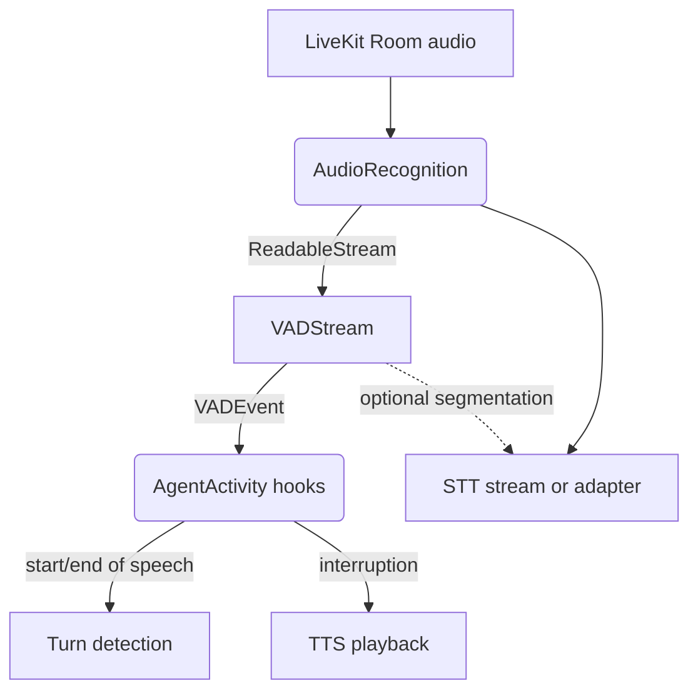
```mermaid
graph TD
  Room["LiveKit Room audio"] --> AR("AudioRecognition")
  AR -->|"ReadableStream<AudioFrame>"| V["VADStream"]
  V -->|"VADEvent"| AA("AgentActivity hooks")
  AA -->|"start/end of speech"| TD["Turn detection"]
  AA -->|"interruption"| TTS["TTS playback"]
  AR --> STT["STT stream or adapter"]
  V -. optional segmentation .-> STT
```

Where VAD is used:
- `voice/AudioRecognition.createVadTask`: attaches `vad.stream()` to the agent's input audio and reacts to events for turn detection and speech state.
- `voice/Agent.default.sttNode`: wraps non-streaming STT in a `STTStreamAdapter` that requires a VAD to segment audio into utterances.
- Examples: `examples/src/realtime_turn_detector.ts` loads a Silero VAD in `prewarm` and passes it to `AgentSession`.

#### Core types

- `VADEventType`: `START_OF_SPEECH`, `INFERENCE_DONE`, `END_OF_SPEECH`, `METRICS_COLLECTED`.
- `VADEvent`: event payload with timing, frames, probability, and raw accumulation thresholds.
- `VADCapabilities`: currently exposes `updateInterval` for metrics reporting.
- `VADCallbacks`: typed emitter for `metrics_collected` events.
- `VAD` (abstract): `label` and `stream()` factory for a `VADStream`.
- `VADStream` (abstract): an async iterator over `VADEvent` with input/output streams and helpers.

#### VADStream API

- `updateInputStream(audio: ReadableStream<AudioFrame>)`
  - Set or swap the upstream audio source. Under the hood, audio is queued into an internal `DeferredReadableStream` and forwarded to the VAD pipeline.
- `detachInputStream()`
  - Detach the current audio source without closing the VAD pipeline.
- `flush()`
  - Pushes an internal sentinel to force processing of buffered audio.
- `endInput()`
  - Closes the input side to signal end of audio.
- `close()`
  - Releases writers/readers and closes the output; iteration ends.
- Async iteration
  - `for await (const ev of vad.stream()) { ... }`

Implementation notes:
- Internally uses `IdentityTransform` to model input and output pipes.
- Splits the output into two readers via `tee()`: one for downstream consumption and one for metrics aggregation.
- Maintains `#lastActivityTime` to compute idle time for metrics.

#### Voice pipeline with VAD

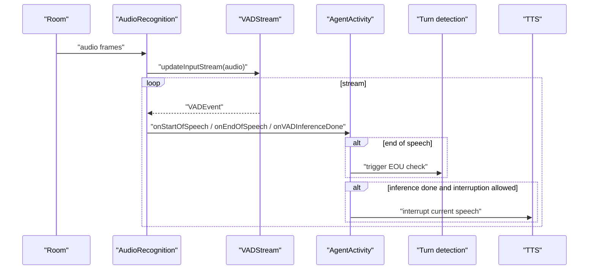
```mermaid
sequenceDiagram
  participant Room as "Room"
  participant Rec as "AudioRecognition"
  participant V as "VADStream"
  participant Act as "AgentActivity"
  participant TD as "Turn detection"
  participant TTS as "TTS"

  Room->>Rec: "audio frames"
  Rec->>V: "updateInputStream(audio)"
  loop stream
    V-->>Rec: "VADEvent"
    Rec->>Act: "onStartOfSpeech / onEndOfSpeech / onVADInferenceDone"
    alt end of speech
      Act->>TD: "trigger EOU check"
    end
    alt inference done and interruption allowed
      Act->>TTS: "interrupt current speech"
    end
  end
```

#### Example usage

```ts
// Prewarm a model VAD and pass into session
proc.userData.vad = await silero.VAD.load();

const session = new voice.AgentSession({
  vad: proc.userData.vad,
  stt: new deepgram.STT(),
  tts: new elevenlabs.TTS(),
});

// Internally, AudioRecognition wires VAD:
const vadStream = vad.stream();
vadStream.updateInputStream(audioStream);
for await (const ev of vadStream) {
  // handle events
}
```

#### Metrics collection

- `monitorMetrics()` consumes a split of the output event stream and emits `metrics_collected` periodically based on `updateInterval`.
- Collected fields include timestamp, idle time since last activity, total inference duration, inference count, and VAD label.

#### Known shortcomings and probable bugs

- Inference duration never accumulates
  - `inferenceDurationTotal` is initialized and reset but never incremented from events. It should sum `ev.inferenceDuration` on `INFERENCE_DONE`.

- First idle time may be huge
  - `#lastActivityTime` starts at zero and is only set on `INFERENCE_DONE` or `END_OF_SPEECH`. The first `START_OF_SPEECH` will compute idle time from epoch. Initialize `#lastActivityTime` on stream construction to current time.

- Metrics loop and cleanup
  - The metrics reader loop runs until the output ends; ensure `close()` is called to break the loop. Consider cancelling the metrics reader explicitly on close.

- Stream resource release
  - `close()` cancels the output reader and closes the output writable, but the input reader and input writer may still hold locks in some paths. Review releasing all locks when closing.

- Deprecated `pushFrame`
  - Marked for removal; prefer `updateInputStream`.

#### Where to find concrete VADs

- Silero-based VAD: see `plugins/silero/src/vad.ts` for a concrete implementation that extends these base classes.


### Silero VAD plugin

This document explains `plugins/silero/src/vad.ts`: a concrete Voice Activity Detection implementation that extends the core `VAD` and `VADStream` in `@livekit/agents` using an ONNX model.

- Class: `plugins/silero/src/vad.ts#VAD` (extends `baseVAD`)
- Stream: `plugins/silero/src/vad.ts#VADStream` (extends `baseStream`)

#### Purpose

- Run lightweight, streaming VAD using a Silero ONNX model.
- Work with arbitrary input sample rates, resampling to the model's rate (8kHz or 16kHz).
- Emit timely VAD events for use in turn detection, TTS interruption, and STT segmentation.

#### Options and defaults

```ts
export interface VADOptions {
  minSpeechDuration: number;        // ms of speech before START_OF_SPEECH
  minSilenceDuration: number;       // ms of silence to end speech
  prefixPaddingDuration: number;    // ms of audio kept before detected start
  maxBufferedSpeech: number;        // ms of buffered output speech cap
  activationThreshold: number;      // probability threshold for speech
  sampleRate: 8000 | 16000;         // model rate
  forceCPU: boolean;                // use CPU even if GPU present
}
```

Defaults (`defaultVADOptions`):
- `minSpeechDuration: 50`
- `minSilenceDuration: 550`
- `prefixPaddingDuration: 500`
- `maxBufferedSpeech: 60000`
- `activationThreshold: 0.5`
- `sampleRate: 16000`
- `forceCPU: true`

Update live via `VAD.updateOptions(partial)`; propagates to active streams.

#### Loading and prewarming

```ts
const vad = await silero.VAD.load({ sampleRate: 16000 });
proc.userData.vad = vad; // set during agent prewarm
```

- `load()` creates an ONNX runtime session (`newInferenceSession`) and returns a ready `VAD`.
- Recommended to call in the agent `prewarm` phase.

#### Streaming flow

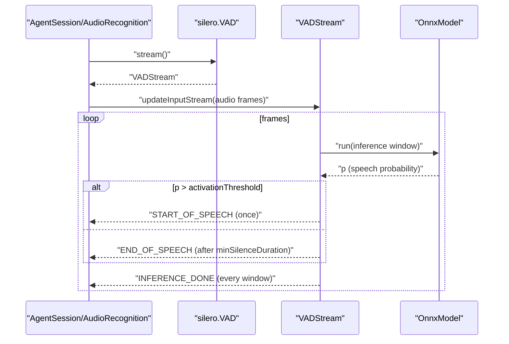
```mermaid
sequenceDiagram
  participant App as "AgentSession/AudioRecognition"
  participant VAD as "silero.VAD"
  participant Stream as "VADStream"
  participant Model as "OnnxModel"

  App->>VAD: "stream()"
  VAD-->>App: "VADStream"
  App->>Stream: "updateInputStream(audio frames)"
  loop frames
    Stream->>Model: "run(inference window)"
    Model-->>Stream: "p (speech probability)"
    alt p > activationThreshold
      Stream-->>App: "START_OF_SPEECH (once)"
    else
      Stream-->>App: "END_OF_SPEECH (after minSilenceDuration)"
    end
    Stream-->>App: "INFERENCE_DONE (every window)"
  end
```

#### Resampling and buffering

- If input sample rate != model rate, an `AudioResampler` (QUICK quality) converts frames for inference.
- A speech buffer stores resampled audio to return complete clips on `START_OF_SPEECH` and `END_OF_SPEECH`.
- `prefixPaddingSamples` retains leading context before speech start.

#### Event semantics

- `INFERENCE_DONE`
  - Emitted for each inference window; includes `probability`, `inferenceDuration`, and the window audio.
- `START_OF_SPEECH`
  - Emitted after `minSpeechDuration` of speech; includes prefixed buffered audio.
- `END_OF_SPEECH`
  - Emitted once silence exceeds `minSilenceDuration` after speaking.

All events include: cumulative `speechDuration`/`silenceDuration`, `samplesIndex`, `timestamp`, `speaking` flag, and raw accumulators.

#### Updating options at runtime

- `VAD.updateOptions(partial)` updates defaults and calls `VADStream.updateOptions` for active streams.
- `VADStream.updateOptions` recomputes buffer sizes and resets the max-reached flag if the buffer grows.

#### Performance and backpressure

- Each inference step measures `inferenceDuration` and accumulates `#extraInferenceTime` vs realtime window; warns if > 200 ms behind.
- After each step, leftover data beyond the window is pushed back into frame buffers to avoid drift.

#### Integration with core VAD

- Extends the core `VAD`/`VADStream` interfaces in `@livekit/agents`, so it plugs into `AudioRecognition` and `AgentSession` without additional glue.
- Emits events consumed by `AgentActivity` for turn detection and interruption.

#### Known notes and issues

- Mixed sample rates: If subsequent frames carry a different input sample rate, an error is logged and the frame is skipped.
- Buffer overflow: When `maxBufferedSpeech` is exceeded, further data for the current speech is ignored until an end is detected; a warning is logged.
- Activation hysteresis: Separate speech/silence threshold durations provide stability, but rapid toggling near threshold can still occur with noisy audio.

#### Minimal example

```ts
const vad = await silero.VAD.load();
const stream = vad.stream();
stream.updateInputStream(audioStream);
for await (const ev of stream) {
  if (ev.type === VADEventType.START_OF_SPEECH) {
    // handle start
  }
}
```


### Voice AgentSession architecture and usage

This document covers `agents/src/voice/agent_session.ts`, the orchestrator for realtime voice interactions. It wires VAD, STT, LLM/RealtimeModel, TTS, turn detection, room I/O, and agent activity.

#### Purpose

- Manage the voice interaction lifecycle for an agent within a LiveKit `Room`.
- Coordinate audio input/output, transcription, generation, and interruptions.
- Emit rich events about user/agent state, messages, metrics, and errors.

#### High-level architecture

```mermaid
graph TD
  A["Room (audio/video)"] --> IO("RoomIO")
  IO --> AR("AudioRecognition")
  AR --> VAD["VAD"]
  AR --> STT["STT"]
  subgraph AgentSession
    ACT("AgentActivity")
    AGT("Agent (behaviors)")
    LLM["LLM / RealtimeModel"]
    TTS["TTS"]
    IN("AgentInput")
    OUT("AgentOutput")
  end
  VAD --> ACT
  STT --> ACT
  AGT --> ACT
  ACT --> LLM
  ACT --> TTS
  OUT --> IO
```

#### Construction and options

```ts
new AgentSession({
  vad, stt, llm, tts,
  turnDetection,              // 'stt' | 'vad' | 'realtime_llm' | 'manual' | _TurnDetector
  voiceOptions: {             // defaults shown
    allowInterruptions: true,
    discardAudioIfUninterruptible: true,
    minInterruptionDuration: 500,
    minInterruptionWords: 0,
    minEndpointingDelay: 500,
    maxEndpointingDelay: 6000,
    maxToolSteps: 3,
  },
});
```

#### Lifecycle

- `start({ agent, room, inputOptions?, outputOptions? })`
  - Creates `RoomIO` and starts it.
  - Initializes `AgentActivity` for the given `Agent` and wires audio input if present.
  - Emits agent state changes: `initializing` → `listening`.
- `updateAgent(agent)`
  - Drains and replaces the current activity with a new one derived from the new agent.
  - Ensures audio input is re-attached to the new activity.

#### Core methods

- `say(text | ReadableStream<string>, { audio?, allowInterruptions?, addToChatCtx? }) => SpeechHandle`
  - Enqueue TTS playback (and optional pre-produced audio). Returns a `SpeechHandle` for interruption/cancellation.

- `generateReply({ userInput?, instructions?, toolChoice?, allowInterruptions? }) => SpeechHandle`
  - Initiate LLM generation; constructs a user `ChatMessage` if `userInput` provided. If the session is draining, delegates to the next activity.

- `commitUserTurn()` / `clearUserTurn()`
  - Manually mark or clear the end of the user's turn when using manual turn detection.

#### Events

See `agents/src/voice/events.ts` for event types. Notable events include:
- `UserInputTranscribed`: streaming transcripts from STT.
- `AgentStateChanged` and `UserStateChanged`: state transitions.
- `ConversationItemAdded`: message added to chat context.
- `FunctionToolsExecuted`: tool execution summary.
- `MetricsCollected`: VAD or other metrics.
- `SpeechCreated`: speech started/queued.
- `Error`: error surfaced from subsystems.

#### Turn detection modes

- `'vad'`: driven by VAD `END_OF_SPEECH` and timing thresholds.
- `'stt'`: driven by STT end-of-utterance plus word and duration thresholds.
- `'realtime_llm'`: server-side turn detection by the realtime model (e.g., OpenAI Realtime).
- `'manual'`: user code calls `commitUserTurn()`.
- Custom `_TurnDetector`: pluggable algorithm via `AudioRecognition`.

#### Typical flow

```mermaid
sequenceDiagram
  participant Room
  participant IO as RoomIO
  participant Rec as AudioRecognition
  participant VAD
  participant STT
  participant Act as AgentActivity
  participant LLM
  participant TTS

  Room->>IO: subscribe audio
  IO->>Rec: audio frames
  Rec->>VAD: updateInputStream(audio)
  Rec->>STT: stream(audio)
  VAD-->>Act: start/end of speech, inference events
  STT-->>Act: interim/final transcripts
  Act->>LLM: generate (as needed)
  LLM-->>Act: text chunks
  Act->>TTS: synthesize
  TTS-->>IO: publish audio
```

#### State accessors

- `chatCtx`: returns a copy of the global `ChatContext`.
- `agentState`: current agent state (`initializing`, `listening`, ...).
- `currentAgent`: throws if not started; otherwise returns active `Agent`.
- `input`/`output`: structured I/O handles for audio/text.

#### Known behaviors and notes

- Start idempotency: calling `start()` repeatedly is safe; subsequent calls no-op.
- Activity replacement drains current activity before starting the next to avoid overlaps.
- `say()` and `generateReply()` throw if session is not running.
- When draining (during agent swap), `generateReply()` uses `nextActivity` to keep experience seamless.

#### Known shortcomings and probable bugs

- Start does not await activity initialization
  - `start()` calls `updateActivity(this.agent)` without `await`. The session state is set to `listening` immediately, while `AgentActivity.start()` and audio wiring may still be in progress. Early `say()`/`generateReply()`/audio could race with initialization. Consider awaiting `updateActivity` or emitting an explicit "ready" event.

- Missing lifecycle locking
  - A TODO notes adding a lock around the activity lifecycle. Concurrent `updateAgent()` or rapid successive starts could interleave drains/starts and lead to transient undefined `activity` states or missed wiring.

- Generate during drain edge case
  - `generateReply()` routes to `nextActivity` when `this.activity.draining` is true; however, if draining is triggered without `nextActivity` set (e.g., external shutdown), it throws. Ensure callers handle this or guard the state.

- No-op output change handlers
  - `onAudioOutputChanged()` and `onTextOutputChanged()` are empty; if dynamic output routing is intended, this is a gap (not strictly a bug but a missing feature).


### AudioRecognition architecture and usage

This document describes `agents/src/voice/audio_recognition.ts`, which coordinates audio ingestion, VAD, STT, and end-of-user (EOU) turn detection for voice agents.

#### Purpose

- Split the incoming audio stream for concurrent VAD and STT processing.
- Maintain interim and final transcripts and user speaking state.
- Detect the end of the user's turn (via VAD- or STT-based heuristics or a model turn detector) and notify higher layers.
- Provide imperative helpers to commit or clear a user turn.

#### High-level architecture

```mermaid
graph TD
  IN["ReadableStream<AudioFrame>"] --> DS(DeferredReadableStream)
  DS -->|tee| VAD_IN["VAD input"]
  DS -->|tee| STT_IN_RAW["STT input"]
  SIL["Silence writer"] --> STT_IN_SIL["Silence stream"]
  STT_IN_RAW & STT_IN_SIL -->|merge| STT_IN

  subgraph AudioRecognition
    VAD_TASK["VAD task"]
    STT_TASK["STT task"]
    EOU["EOU scheduler"]
  end

  VAD_IN --> VAD_TASK
  STT_IN --> STT_TASK
  VAD_TASK --> EOU
  STT_TASK --> EOU
  EOU --> HOOKS["RecognitionHooks"]
```

#### Construction

```ts
const rec = new AudioRecognition({
  recognitionHooks,            // onStartOfSpeech/onVADInferenceDone/onEndOfSpeech/.../onEndOfTurn
  stt,                         // STTNode (ReadableStream<SpeechEvent> | null)
  vad,                         // VAD implementation
  turnDetector,                // optional model-based detector
  turnDetectionMode,           // 'vad' | 'stt' | 'realtime_llm' | 'manual'
  minEndpointingDelay,
  maxEndpointingDelay,
});

rec.setInputAudioStream(audioStream);
await rec.start();
```

#### Key responsibilities

- VAD task
  - Creates a `vad.stream()`, feeds it audio, and forwards `START_OF_SPEECH`, `INFERENCE_DONE`, and `END_OF_SPEECH` to hooks.
  - Tracks `speaking` and sets `lastSpeakingTime` when speech ends; triggers EOU detection under VAD-based or STT-committed modes.

- STT task
  - Calls `stt(input)` to get a `ReadableStream<SpeechEvent>`; reads events and updates interim/final transcripts.
  - On `FINAL_TRANSCRIPT`: appends to `audioTranscript`, clears interim, records language and time; may trigger EOU if not currently speaking.
  - On `END_OF_SPEECH` in STT-based mode: marks `userTurnCommitted` and may trigger EOU.

- EOU detection
  - Builds a temporary `ChatContext` containing the accumulated transcript and (optionally) queries the `turnDetector` to compute an endpointing delay between `minEndpointingDelay` and `maxEndpointingDelay`.
  - Schedules a debounced task that sleeps until `lastSpeakingTime + endpointingDelay`, then calls `hooks.onEndOfTurn({ newTranscript, transcriptionDelay, endOfUtteranceDelay })`.
  - If the hook returns `true`, clears `audioTranscript` and resets `userTurnCommitted`.

- Manual control
  - `commitUserTurn(audioDetached: boolean)`: optionally injects ~500 ms of silence (to flush STT) and schedules EOU detection; sets `userTurnCommitted = true`.
  - `clearUserTurn()`: clears transcripts and restarts the STT task.

#### Typical sequence

```mermaid
sequenceDiagram
  participant In as Audio input
  participant Rec as AudioRecognition
  participant VAD
  participant STT
  participant Hooks

  In->>Rec: setInputAudioStream()
  Rec->>VAD: updateInputStream()
  Rec->>STT: start STT stream
  VAD-->>Rec: START_OF_SPEECH
  Rec->>Hooks: onStartOfSpeech
  STT-->>Rec: INTERIM_TRANSCRIPT / FINAL_TRANSCRIPT
  Rec->>Hooks: onInterimTranscript / onFinalTranscript
  VAD-->>Rec: END_OF_SPEECH
  Rec->>Rec: schedule EOU detection (delay)
  Rec->>Hooks: onEndOfTurn(info)
```

#### API surface

- `setInputAudioStream(stream)` / `detachInputAudioStream()`
- `start()` / `close()`
- `commitUserTurn(audioDetached: boolean)` / `clearUserTurn()`
- `currentTranscript: string`

#### End-of-turn scheduling

- VAD-based: EOU runs after VAD emits `END_OF_SPEECH` (already waited through `silenceDuration`), plus a small endpointing delay.
- STT-based: EOU runs after `END_OF_SPEECH` or `FINAL_TRANSCRIPT` (when not speaking), depending on mode and `userTurnCommitted`.
- Model-based: `turnDetector.unlikelyThreshold()` and `predictEndOfTurn()` adjust the endpointing delay.

#### Known shortcomings and probable bugs

- Missing await on `supportsLanguage`
  - In EOU detection, the code calls `turnDetector.supportsLanguage(this.lastLanguage)` without `await`. Since the API is async, this condition always evaluates truthy (a Promise), and the language check is skipped. It should be `if (!(await turnDetector.supportsLanguage(this.lastLanguage))) { ... }`.

- `sampleRate` never set
  - `commitUserTurn(audioDetached)` attempts to flush STT by writing silence if `this.sampleRate` is defined, but `sampleRate` is never assigned in this class. As a result, silence injection may never occur. Consider capturing the first input frame's `sampleRate` and setting `this.sampleRate`.

- Transcript growth if not committed
  - `audioTranscript` only clears when `onEndOfTurn` returns `true`. If the hook declines commitment repeatedly, transcripts will grow across attempts. Consider a cap or periodic truncation.

- Potential race between VAD and STT triggers
  - EOU can trigger off VAD `END_OF_SPEECH` and also off STT `FINAL_TRANSCRIPT` when `!speaking`. Rapid sequences may schedule overlapping tasks; cancellations help, but subtle races may persist.

- STT stream type check
  - If `stt()` does not return a `ReadableStream`, the current implementation silently does nothing beyond the type check. Consider logging a warning for non-stream outputs.

- Cleanup paths
  - VAD stream detaches and closes only via the `abort` handler; for normal completion, ensure it is closed/detached to stop background loops.

#### Integration notes

- Hooks typically belong to `AgentActivity`, which uses VAD events to drive turn detection and to interrupt TTS.
- The STT stream can be a direct streaming recognizer or an adapter that segments by VAD.
- Silence injection is only used to coax out final transcripts from STT when audio is detached (push-to-talk or manual modes).


### Voice Agent architecture and usage

This document covers `agents/src/voice/agent.ts`, the authoring surface for building voice agent behaviors. It provides defaults for STT/LLM/TTS nodes, manages chat context and tools, and exposes lifecycle hooks.

#### Purpose

- Hold the agent’s instructions, chat context, tool context, and node references (`STT`, `VAD`, `LLM/RealtimeModel`, `TTS`).
- Offer default node wrappers that adapt non-streaming providers into streaming forms.
- Provide hooks for entry/exit and user-turn completion.

#### High-level architecture

```mermaid
graph TD
  subgraph Agent
    I["instructions"]
    C["ChatContext (w/ ToolContext)"]
    N1["STT node"]
    N2["LLM / RealtimeModel"]
    N3["TTS node"]
    V["VAD (optional)"]
  end
  Agent -->|"default.sttNode"| STT_STREAM["stream adapter if needed"]
  Agent -->|"default.llmNode"| LLM_STREAM["LLM chat stream"]
  Agent -->|"default.ttsNode"| TTS_STREAM["stream adapter if needed"]
```

#### Construction

```ts
const agent = new voice.Agent({
  instructions: 'You are helpful...',
  chatCtx,            // optional initial ChatContext
  tools,              // tool context, merged into internal copy
  turnDetection,      // mode hint for session wiring
  stt, vad, llm, tts, // optional nodes (can be provided by session/activity)
});
```

#### Key APIs

- Getters: `vad`, `stt`, `llm`, `tts`, `chatCtx` (readonly copy), `instructions`, `toolCtx`, `session` (through `AgentActivity`).
- Lifecycle hooks: `onEnter()`, `onExit()`; called by the activity when becoming active/inactive.
- Update chat context: `updateChatCtx(chatCtx)` preserves the tool context and updates the active activity if present.

#### Default node wrappers

- `default.sttNode(agent, audio, modelSettings)`
  - Requires an `STT` node; throws if missing.
  - If non-streaming, wraps with `STTStreamAdapter` (requires `agent.vad`).
  - Returns a `ReadableStream` that yields `SpeechEvent | string` from the underlying stream.

- `default.llmNode(agent, chatCtx, toolCtx, modelSettings)`
  - Requires an `LLM` node (non-realtime); throws if missing or if a `RealtimeModel` is provided.
  - Calls `llm.chat({ chatCtx, toolCtx, toolChoice, parallelToolCalls: true })` and exposes a `ReadableStream` of `ChatChunk | string`.

- `default.ttsNode(agent, text, modelSettings)`
  - Requires a `TTS` node; if non-streaming, wraps with `TTSStreamAdapter` + `BasicSentenceTokenizer`.
  - Returns a `ReadableStream<AudioFrame>` that yields audio frames.

- `default.transcriptionNode` / `default.realtimeAudioOutputNode`
  - Pass-through defaults returning the input stream.

#### Typical usage

```ts
const session = new voice.AgentSession({ vad, stt, llm, tts });
await session.start({ agent: new voice.Agent({ instructions: '...' }), room });
session.say('Hello!');
```

#### Tool calling context

- `asyncLocalStorage` carries an optional `functionCall` context for nested tool execution. Use `isStopResponse`/`StopResponse` to abort generation early from within tools.

#### Known shortcomings and probable bugs

- Tools shallow copy
  - In constructor, `this._tools = { ...tools }` performs a shallow copy; nested objects inside `tools` are shared/referenced. Consider deep cloning if mutation isolation is important.

- Missing streaming path for RealtimeModel
  - `default.llmNode` rejects `RealtimeModel` (by design) but there’s no equivalent helper for realtime multimodal nodes here; ensure `AgentActivity` or session provides the correct path.

- Error message mentions AgentTask/VoiceAgent
  - In `default.sttNode`, the error refers to "AgentTask/VoiceAgent" which may be legacy naming. Consider aligning wording with current `Agent`/`AgentSession` terms.

- Tokenizer default may not match TTS models
  - `TTSStreamAdapter` uses `BasicSentenceTokenizer`; for some languages/models better segmentation may be needed. Consider making tokenizer configurable.


### Voice IO architecture and usage

This document covers `agents/src/voice/io.ts`, which defines the input/output abstraction for voice agents: audio input streams, audio output sinks, and text output sinks. It also declares node function types used by the pipeline (`STTNode`, `LLMNode`, `TTSNode`).

#### Purpose

- Provide pluggable I/O surfaces that AgentSession/AgentActivity can wire to LiveKit `Room` or other sources/sinks.
- Track attachment/detachment state, enable/disable flags, and playback lifecycle for audio sinks.
- Offer a uniform contract for LLM/STT/TTS node functions.

#### High-level architecture

```mermaid
graph TD
  subgraph Input
    AIN["AudioInput"] -->|stream| RS["ReadableStream<AudioFrame>"]
  end
  subgraph Output
    AOUT["AudioOutput"] --> NEXT["nextInChain (optional)"]
    TOUT["TextOutput"] --> TNEXT["nextInChain (optional)"]
  end
  CTRL["AgentInput/AgentOutput"] --> AIN
  CTRL --> AOUT
  CTRL --> TOUT
```

#### Node function types

- `STTNode(audio, modelSettings) => Promise<ReadableStream<SpeechEvent | string> | null>`
- `LLMNode(chatCtx, toolCtx, modelSettings) => Promise<ReadableStream<ChatChunk | string> | null>`
- `TTSNode(text, modelSettings) => Promise<ReadableStream<AudioFrame> | null>`

#### AudioInput

- Wraps a `DeferredReadableStream<AudioFrame>`.
- Methods:
  - `get stream()` – readable stream for audio.
  - `onAttached()` / `onDetached()` – lifecycle hooks for enable/disable.

#### AudioOutput

- EventEmitter with playback lifecycle tracking and optional chaining to another `AudioOutput`.
- Key fields:
  - `sampleRate?: number` – optional sink rate.
  - `nextInChain?: AudioOutput` – chained sink that receives `onAttached`/`onDetached` and playback events.
- Playback lifecycle:
  - `captureFrame(frame)` – called to push a frame; starts a new playback segment if not currently capturing.
  - `flush()` – marks end of current segment (does not emit finished).
  - `clearBuffer()` – abstract; immediate stop; implementers must call `onPlaybackFinished` accordingly.
  - `onPlaybackFinished(event)` – marks a segment as finished, resolves waiters, and emits `playbackFinished`.
  - `waitForPlayout()` – waits until all captured segments complete and returns the last `PlaybackFinishedEvent`.
- Chain propagation:
  - `onAttached()` / `onDetached()` forward to `nextInChain` if present.

`PlaybackFinishedEvent`:
- `playbackPosition: number`, `interrupted: boolean`, `synchronizedTranscript?: string`.

#### TextOutput

- Abstract sink for generated text.
- Methods:
  - `captureText(text)` – ingest a string chunk.
  - `flush()` – mark current text segment as complete.
  - `onAttached()` / `onDetached()` – propagate to `nextInChain`.

#### AgentInput/AgentOutput controllers

- `AgentInput`
  - Tracks an `AudioInput | null` and an enable flag.
  - `audioEnabled` getter/setter toggles attached/detached callbacks on the current `AudioInput`.
  - Setting `audio` invokes the provided `audioChanged` callback (used by higher layers to rewire pipelines).

- `AgentOutput`
  - Tracks `AudioOutput | null` and `TextOutput | null`, with independent enable flags.
  - Setting `audio` or `transcription` detaches the previous sink (if any), stores the new one, triggers the corresponding `...Changed` callback, and then calls `onAttached()` on the new sink.
  - `setAudioEnabled` / `setTranscriptionEnabled` toggle attachment state on current sinks.

#### Typical usage

```ts
// Configure session IO
const input = new MyAudioInput();
const audioSink = new MyAudioOutput(/* sampleRate */ 48000);
const textSink = new MyTextOutput();

session.input.audio = input;
session.output.audio = audioSink;
session.output.transcription = textSink;
```

#### Known shortcomings and probable bugs

- Playback finished accounting
  - `onPlaybackFinished` warns when called more times than segments, but does not protect against under-reporting (segments never finished). Consider timeouts or health counters.

- Capture and flush semantics
  - `flush()` resets `_capturing` but does not emit any event; if an implementer forgets to call `onPlaybackFinished`, `waitForPlayout()` can hang. Document and enforce via tests.

- Chain error handling
  - `onAttached`/`onDetached` propagate, but errors thrown by `nextInChain` are not caught. Consider try/catch to isolate chains.

- AgentInput change handling
  - `AgentInput.audio = stream` immediately calls `audioChanged()` but does not attach/detach the new stream. Attachment is controlled by `audioEnabled` and consumer logic; ensure callers call `onAttached()` for initial hookup if needed.

- TextOutput completeness
  - There is no built-in `waitForFlush()`; upstream must infer completion. Consider adding a future for text segment completion similar to audio.


### RoomIO architecture and usage

This document covers `agents/src/voice/room_io/room_io.ts`, which bridges a LiveKit `Room` to the voice agent’s input/output interfaces. It selects a participant, subscribes to audio, publishes agent audio, synchronizes transcripts, and handles text input streams.

#### Purpose

- Manage room-level I/O and bind them to `AgentSession.input`/`output`.
- Select the active user participant (optionally by identity) and listen for joins/leaves.
- Publish agent audio output and forward user/agent transcripts to room data/text streams.
- Optionally synchronize transcript progression with audio playout.

#### High-level architecture

```mermaid
graph TD
  subgraph RoomIO
    IN["ParticipantAudioInputStream"]
    AO["ParticipantAudioOutput"]
    TXU["User transcript output (legacy + modern)"]
    TXA["Agent transcript output (legacy + modern)"]
    Sync["TranscriptionSynchronizer (optional)"]
  end
  Room-->|subscribe audio| IN
  AO-->|publish audio| Room
  TXU-->|emit text| Room
  TXA-->|emit text| Room
  Sync-->AO
  Sync-->TXA
  Room<-->|text stream: TOPIC_CHAT| RoomIO
  RoomIO-->AgentSession
```

#### Options

- `RoomInputOptions`
  - `audioSampleRate`, `audioNumChannels`, `textEnabled`, `audioEnabled`, `videoEnabled`
  - `participantIdentity?`: focus on a specific user; otherwise auto-select the first acceptable participant.
  - `noiseCancellation?`: enable on input.
  - `textInputCallback?`: default interrupts and calls `generateReply` with `userInput`.
  - `participantKinds?`: accepted kinds (default `SIP`, `STANDARD`).

- `RoomOutputOptions`
  - `transcriptionEnabled`, `audioEnabled`, `audioSampleRate`, `audioNumChannels`
  - `syncTranscription`: if true, couples agent transcript timing with audio playout.
  - `audioPublishOptions`: passed to `TrackPublishOptions` (defaults to microphone source).

#### Lifecycle

- `start()`
  - Registers text stream handler for `TOPIC_CHAT` (if enabled).
  - Creates `ParticipantAudioInputStream` and output sinks (`ParticipantAudioOutput`, transcript outputs) per options.
  - Starts `TranscriptionSynchronizer` if enabled and audio output is present.
  - Subscribes to room events: connection state, participant joined/left.
  - Kicks off `initTask()`:
    - Waits for room connection; seeds existing participants; waits for the selected participant; calls `setParticipant`.
    - Updates agent transcript output to use the local participant identity; starts audio output.
  - Attaches created I/O to `AgentSession.input/ output` and subscribes to `AgentSession` events for state and user transcription.

#### Text input handling

- Room text stream handler calls `onUserTextInput(reader, participantInfo)`:
  - Validates target participant.
  - Reads the entire text payload (`reader.readAll()`), then invokes `textInputCallback(sess, { text, info, participant })`.
  - Default callback: `sess.interrupt()` then `sess.generateReply({ userInput: text })`.

#### Transcript forwarding

- `forwardUserTranscript()` consumes the session’s `UserInputTranscribed` stream and forwards chunks to `userTranscriptOutput`, awaiting `captureText` to avoid races; flushes on final events.

#### Participant selection

- If `participantIdentity` is set, waits for that identity.
- Otherwise, ignores participants that are marked as publishing on behalf of the agent (`ATTRIBUTE_PUBLISH_ON_BEHALF`) and filters by `participantKinds`.

#### API

- `setParticipant(identity: string | null)` / `unsetParticipant()`
  - Switch active user and retarget user transcript sinks.
- Getters `audioOutput` / `transcriptionOutput`
  - Return either the raw sink or the synchronized proxy depending on `syncTranscription`.

#### Known shortcomings and probable bugs

- Text handler unregister TODO
  - A TODO notes the text stream handler is not unregistered on close. Without a `close()` method, this can leak handlers across restarts. Implement a `close()` to remove room listeners and unregister text handler.

- Participant disconnect behavior
  - On participant disconnected, it calls `unsetParticipant()` but does not attempt to reselect a new one. Depending on UX, a new participant might be auto-selected; clarify behavior behind AJS-177.

- Transcript forwarder reader not released
  - `forwardUserTranscript()` obtains a reader but never releases it. On shutdown, ensure it is cancelled/released.

- Agent output selection TODO
  - A TODO indicates falling back to agent’s audio output if RoomIO has none (AJS-176). Currently only uses `participantAudioOutput`.

- Attribute keys hard-coded
  - Uses `lk.agent.state` attribute; consider constants or namespacing strategy.


### Room IO streams: _input.ts and _output.ts

This document covers `agents/src/voice/room_io/_input.ts` and `_output.ts`, the low-level building blocks that connect LiveKit media/text streams to the agent I/O layer.

#### Purpose

- `_input.ts`: Subscribe to the active participant’s microphone, resample, and expose as a `ReadableStream<AudioFrame>` via `AudioInput`.
- `_output.ts`: Publish agent audio frames to the room and publish transcripts to both legacy and modern text paths.

#### Architecture

```mermaid
graph TD
  subgraph Input
    PAI["ParticipantAudioInputStream"] --> RS["DeferredReadableStream<AudioFrame>"]
  end
  subgraph Output
    PAO["ParticipantAudioOutput"] --> Room
    PTO["ParticipantTranscriptionOutput"] --> Room
    PLTO["ParticipantLegacyTranscriptionOutput"] --> Room
    PTX["ParalellTextOutput"] --> PTO & PLTO
  end
```

### _input.ts: ParticipantAudioInputStream

- Listens for `RoomEvent.TrackSubscribed`/`TrackUnpublished`.
- Tracks target participant identity; when set, subscribes to the first microphone track and pipes audio into `deferredStream`.
- Applies resampling via `resampleStream` to the requested `sampleRate`.

Key methods:
- `setParticipant(participant: RemoteParticipant | string | null)` – switches the active source; closes stream when unset.
- Internals:
  - `onTrackSubscribed(track, publication, participant)` – guards by identity and source; sets the stream source.
  - `onTrackUnpublished(...)` – if the active publication is removed, falls back to the first available track.

### _output.ts: Transcription outputs

- Base class `BaseParticipantTranscriptionOutput` maintains state and picks a `trackId` (microphone) associated with a participant.
- Two concrete outputs:
  - `ParticipantTranscriptionOutput`: uses the room’s text stream (`streamText`) API.
  - `ParticipantLegacyTranscriptionOutput`: publishes transcription via legacy `publishTranscription` API.
- `ParalellTextOutput` fans out text to both sinks when both are enabled.

Flow:
```mermaid
sequenceDiagram
  participant App as "Agent/RoomIO"
  participant PTX as "ParalellTextOutput"
  participant PTO as "ParticipantTranscriptionOutput"
  participant PLTO as "ParticipantLegacyTranscriptionOutput"
  participant Room

  App->>PTX: captureText(text)
  PTX->>PTO: captureText(text)
  PTX->>PLTO: captureText(text)
  PTO->>Room: streamText(write/close)
  PLTO->>Room: publishTranscription(segments)
  App->>PTX: flush()
  PTX->>PTO: flush()
  PTX->>PLTO: flush()
```

Participant selection:
- `setParticipant(participant)` updates the identity and tries to associate a track ID. On mic track publishes, handlers update `trackId` opportunistically.

### _output.ts: ParticipantAudioOutput

- Extends `AudioOutput` to publish frames via `AudioSource`/`LocalAudioTrack`.
- Tracks pushed duration, queues, and interruption via futures.
- `start()` publishes and waits for subscription to complete.
- `captureFrame(frame)` pushes to `AudioSource` and increments duration.
- `flush()` starts a task that waits for playout (or interruption), then emits `onPlaybackFinished`.
- `clearBuffer()` resolves the interruption future, causing any pending playout wait to compute played duration net of queue and finish.

#### Known shortcomings and probable bugs

- Input: publication fallback ordering
  - On `onTrackUnpublished`, it iterates `participant.trackPublications.values()` and picks the first track with `publication.track`. If there are multiple microphones, no prioritization is applied.

- Input: event listener cleanup
  - The class registers room event listeners in the constructor but does not remove them on shutdown. Provide a `close()` to remove listeners and detach the source.

- Output: publish options ignored
  - `ParticipantAudioOutput.publishTrack()` always wraps new `TrackPublishOptions({ source: SOURCE_MICROPHONE })` instead of using the provided `options.trackPublishOptions`. This ignores caller-specified options.

- Output: duration units
  - `pushedDurationMs` is computed as `samplesPerChannel / sampleRate` (seconds), but named ms. Rename to seconds or multiply by 1000 for milliseconds.

- Output: text output sequencing
  - `ParticipantTranscriptionOutput.captureText` gates on any pending `flushTask`. If capture bursts are large, this can serialize excessively. Consider buffering or backpressure.

- Output: missing teardown
  - Text outputs and audio output do not expose `close()`; they hold room listeners and writers that should be closed on shutdown.


### TranscriptionSynchronizer architecture and usage

This document describes `agents/src/voice/transcription/synchronizer.ts`, which aligns agent text output with audio playout. It segments text, throttles emission based on an estimated speech rate, and annotates playback-finished events with a synchronized transcript.

#### Purpose

- Pace the agent’s transcript to match actual audio timing.
- Provide synchronized transcript text alongside audio `onPlaybackFinished` events.
- Allow enabling/disabling on the fly and rotating segments cleanly.

#### High-level architecture

```mermaid
graph TD
  subgraph Synchronizer
    Impl["SegmentSynchronizerImpl"]
    SAO["SyncedAudioOutput"]
    STO["SyncedTextOutput"]
  end
  AO["AudioOutput (next)"] --> SAO
  TO["TextOutput (next)"] --> STO
  STO --> Impl
  SAO --> Impl
  Impl -->|"forwarded text"| TO
  SAO --> AO
```

#### Text pacing model

- Uses a target rate derived from `speed * STANDARD_SPEECH_RATE` (hyphens per second).
- Tokenizes sentences and words via `SentenceTokenizer` (defaults from `tokenize/basic`).
- Hyphenates words to approximate syllables; delays are computed so the number of emitted hyphens follows elapsed time.

#### API

- Constructor: `new TranscriptionSynchronizer(nextAudio: AudioOutput, nextText: TextOutput, options?)`
  - Wraps the provided outputs with `SyncedAudioOutput`/`SyncedTextOutput` and constructs an initial segment impl.
- Properties:
  - `audioOutput`, `textOutput`: the wrapped outputs to bind into RoomIO.
  - `enabled`: getter/setter to toggle synchronization.
- Methods:
  - `rotateSegment()`: finishes the current segment and starts a new one.
  - `barrier()`: await current rotation to complete.
  - `close()`: stop rotation and close the current impl.

#### SegmentSynchronizerImpl core

- Maintains two inputs:
  - Audio: accumulates `pushedDuration` seconds, marks `done` in `endAudioInput()`.
  - Text: token stream; forwards chunks into an internal output stream with delays; marks `done` in `endTextInput()`.
- When playback finishes (from audio `onPlaybackFinished`), if not interrupted, marks `playbackCompleted` and returns the full text as `synchronizedTranscript`; otherwise returns only forwarded text so far.
- Exposes `readable` and captures forwarded text to the next sink, ending with an automatic `flush()`.

#### Typical flow

```mermaid
sequenceDiagram
  participant T as SyncedTextOutput
  participant A as SyncedAudioOutput
  participant Impl as SegmentSynchronizerImpl
  participant OutT as Next TextOutput
  participant OutA as Next AudioOutput

  T->>Impl: pushText()
  A->>Impl: pushAudio(frame)
  T->>Impl: endTextInput()
  A->>Impl: endAudioInput()
  A->>OutA: onPlaybackFinished(ev)
  A->>Impl: markPlaybackFinished(ev.playbackPosition, ev.interrupted)
  A->>OutT: onPlaybackFinished({ synchronizedTranscript })
```

#### Known shortcomings and probable bugs

- Seconds vs milliseconds
  - Durations are computed as `samplesPerChannel / sampleRate` (seconds) but named as ms in some places. Align naming/units or multiply by 1000 when labeling as ms.

- Start time dependency
  - `startWallTime` is set on the first audio frame with `frameDuration > 0`. If text arrives early or audio is silent initially, pacing begins late. Consider starting on first text or a small bias.

- Rotation during capture
  - `SyncedTextOutput.captureText`/`SyncedAudioOutput.captureFrame` call `barrier()` then push. If `_impl.textInputEnded`/`audioInputEnded` is true, they rotate the segment and push after barrier. Rapid alternation could cause extra rotations.

- Reader closure order
  - `captureTaskImpl` reads from `outputStream` and then flushes `nextInChain`. Ensure `nextInChain.flush()` is safe when the downstream sink is changing participants or being replaced.

- Long sentences
  - The pacing splits by words and hyphens. Very long tokens without hyphens may emit with minimal delay. Consider capping per-token delay.

#### Tuning

- `options.speed` scales pacing; set >1 for faster text, <1 for slower.
- Swap tokenizer/hyphenator for language-specific behavior.


### SpeechHandle architecture and usage

This document describes `agents/src/voice/speech_handle.ts`, a small control object representing a queued TTS playback segment. It exposes interruption, authorization, and playout completion signals and carries an associated chat message.

#### Purpose

- Represent one unit of speech output, carrying metadata such as priority and parent linkage.
- Allow callers to interrupt (if permitted), await authorization, and await playout completion.
- Provide a future-like interface (`then`, `waitForPlayout`) to chain logic after playback.

#### API

- Static priorities:
  - `SPEECH_PRIORITY_LOW = 0`, `SPEECH_PRIORITY_NORMAL = 5`, `SPEECH_PRIORITY_HIGH = 10`.

- Creation:
  - `SpeechHandle.create({ allowInterruptions?, stepIndex?, parent? })` → new handle with unique id.

- Properties and getters:
  - `id: string`, `allowInterruptions: boolean`, `stepIndex: number`, `parent?: SpeechHandle`.
  - `interrupted: boolean` – set once `interrupt()` is called.
  - `done: boolean` – set once playout completes.
  - `chatMessage?: ChatMessage` – associated message when known.

- Control methods:
  - `interrupt()` – resolves the internal interrupt future; throws if interruptions are not allowed or if already done.
  - `then(cb)` – run `cb(handle)` after playout done.
  - `waitForPlayout()` – await playout completion.
  - `waitIfNotInterrupted(promises: Promise[])` – races the provided promises against the interrupt future; returns once either bucket resolves.

- Internal (used by queue/execution engine):
  - `_setChatMessage(msg)`, `_authorizePlayout()`, `_waitForAuthorization()`, `_markPlayoutDone()`.

#### Typical usage

```ts
const handle = SpeechHandle.create({ allowInterruptions: true });

// Queue speech and await completion later
handle.then(() => console.log('speech done'));

// Interrupt if a VAD event indicates the user spoke
handle.interrupt();
```

#### Interaction with AgentActivity and IO

- When TTS starts/queues, a `SpeechHandle` is created and returned to the caller (e.g., `AgentSession.say()` or `generateReply()`).
- The IO layer (`AudioOutput`) reports playback finished events, which eventually call `_markPlayoutDone()`.
- VAD events can call `handle.interrupt()` to stop playback early (if `allowInterruptions`).

#### Known shortcomings and probable bugs

- Interrupt after done
  - `interrupt()` returns early if `done` is true; callers may assume an error is thrown. This is a design choice but document clearly.

- Authorization is never rejected
  - `_waitForAuthorization()` awaits a future that is resolved via `_authorizePlayout()` but never rejected; queues must enforce cancellation semantics separately.

- No timeout helpers
  - No built-in timeout for authorization or playout; upstream must handle timeouts.

- Parent linkage is not used here
  - `parent` is stored but not leveraged in this module; ensure upstream semantics (e.g., batching or hierarchical cancellation) are implemented if needed.


### AgentActivity architecture and usage

This document explains `agents/src/voice/agent_activity.ts`, the core runtime that orchestrates recognition (VAD/STT), generation (LLM/RealtimeModel + TTS), speech queueing/interruptions, and tool execution for a single active agent in an `AgentSession`.

#### Purpose

- Wire up recognition (AudioRecognition) and the generation pipeline for the current agent.
- Manage a priority speech queue with interruption and authorization semantics.
- Bridge RealtimeModel sessions (server-side events, user transcription, tool streams).
- Emit `AgentSession` events for state, metrics, errors, user transcripts, speech creation, and tool execution.

#### High-level architecture

```mermaid
graph TD
  subgraph Activity
    Q["Speech queue (Heap)"]
    AR["AudioRecognition"]
    RT["RealtimeSession (optional)"]
    GEN["Generation pipeline (LLM/TTS/tools)"]
  end
  IN["audio input"] --> AR
  AR -->|hooks| Activity
  Activity -->|state/metrics/events| Sess["AgentSession"]
  Q --> GEN
  GEN --> IO["AgentSession.output"]
  GEN --> Sess
```

#### Lifecycle

- `start()`
  - Binds the agent, configures RealtimeModel or LLM instructions/chat/tools, subscribes to metrics.
  - Starts `AudioRecognition` with configured turn detection mode and delays.
  - Spawns `mainTask()` (speech queue runner) and calls agent `onEnter()` in a tracked task.

- `drain()` and `close()`
  - `drain()` waits for queue to empty (speech tasks may continue to run). `close()` detaches audio, closes recognition and realtime session, and unsubscribes listeners.

#### Speech queue and interruptions

- A max-heap of `[priority, timestamp, SpeechHandle]` ensures higher priority first, then FIFO within same priority.
- `scheduleSpeech(handle, priority, bypassDraining=false)` enqueues and wakes `mainTask()`.
- `mainTask()` authorizes the front speech (`_authorizePlayout()`), waits for its `waitForPlayout()`, then proceeds.
- `interrupt()` interrupts current speech and all queued speeches, and calls `realtimeSession.interrupt()`.

#### Recognition integration

- Hooks update user state on VAD start/end, emit interim/final transcripts, and trigger interruption on VAD inference when thresholds are met.
- End-of-turn (`onEndOfTurn`) coordinates with RealtimeModel vs LLM pipelines, optionally interrupts current speech, runs `onUserTurnCompleted`, then calls `generateReply` with the resulting user message.

#### Generation paths

- Non-realtime (LLM): `pipelineReplyTask`
  - Drives `performLLMInference`, `performTTSInference`, `performTextForwarding`, `performAudioForwarding`, and `performToolExecutions`.
  - Waits for authorization, updates session state on first frame/text, and adds assistant messages (interrupted or final) to chat context.

- Realtime: `realtimeReplyTask` / `realtimeGenerationTask`
  - Uses `RealtimeSession` to push user input, get streamed message/audio/tool events, forward to IO, and handle truncation on interruption.

#### Typical flow

```mermaid
sequenceDiagram
  participant Act as AgentActivity
  participant Rec as AudioRecognition
  participant Q as SpeechQueue
  participant L as LLM/Realtime
  participant TTS
  participant IO as AgentSession.output

  Rec-->>Act: onEndOfTurn(info)
  Act->>Act: userTurnCompleted(info)
  Act->>Act: generateReply(...)
  Act->>Q: scheduleSpeech(handle)
  Q->>Act: authorize(handle)
  Act->>L: start generation
  L-->>Act: stream text/tool calls
  Act->>TTS: stream synth (optional)
  TTS-->>IO: audio frames
  IO-->>Act: onPlaybackFinished
  Act->>Q: next
```

#### Known shortcomings and probable bugs

- Turn detection mode warnings
  - Several branches coerce/override `turnDetectionMode` based on capabilities. This is good UX but can mask misconfiguration; consider surfacing as configuration errors instead of silent fallback.

- Authorization vs task start
  - Tasks for say/pipeline/realtime begin setup before authorization; heavy upstream work may occur before playback is allowed. Consider deferring heavy steps until authorized to reduce wasted work on interrupts.

- Queue wakeups
  - `wakeupMainTask()` is called from many places; ensure it is invoked after all state affecting queue selection is updated to avoid spurious loops.

- Realtime truncation timing
  - On interruption, truncation uses `playbackPosition` potentially from seconds vs ms mismatch if upstream uses different units; verify consistency.

- State transitions
  - Transitions between `thinking`/`speaking`/`listening` rely on first-frame/text futures and task completions; edge races can leave session in the wrong state if sinks change mid-stream.

- Tool step cap
  - `maxToolSteps` enforcement is correct, but repeated tool executions within one step aren’t capped here; ensure `performToolExecutions` bound checks align.


# Common Terms

There are many terms used commonly throughout the code base and documentation. Some of them are defined here:


| Acronym | Full Form | Description | Reference Link |
|---------|-----------|-------------|----------------|
| **API** | Application Programming Interface | Service endpoints | [AWS Definition](https://aws.amazon.com/what-is/api/) |
| **AV1** | AOMedia Video 1 | Open codec | [AOMedia Spec](https://aomediacodec.github.io/av1-spec/) |
| **BL** | Base Layer | SVC foundation | [ITU SVC Docs](https://www.itu.int/rec/T-REC-H.264-201704-I/en) |
| **CDN** | Content Delivery Network | Content caching | [Cloudflare CDN](https://www.cloudflare.com/learning/cdn/what-is-a-cdn/) |
| **CPU** | Central Processing Unit | Processor | [TechTarget Definition](https://www.techtarget.com/whatis/definition/processor) |
| **DTLS** | Datagram Transport Layer Security | UDP encryption | [RFC 9147](https://datatracker.ietf.org/doc/html/rfc9147) |
| **EL** | Enhancement Layer | SVC improvements | [ITU SVC Docs](https://www.itu.int/rec/T-REC-H.264-201704-I/en) |
| **FEC** | Forward Error Correction | Error recovery | [RFC 5109](https://datatracker.ietf.org/doc/html/rfc5109) |
| **gRPC** | Google Remote Procedure Call | RPC framework | [gRPC Official](https://grpc.io/) |
| **H.264** | MPEG-4 AVC | Video standard | [ITU-T H.264](https://www.itu.int/rec/T-REC-H.264) |
| **HLS** | HTTP Live Streaming | Adaptive streaming | [Apple HLS](https://developer.apple.com/streaming/) |
| **ICE** | Interactive Connectivity Establishment | NAT traversal framework | [RFC 8445](https://datatracker.ietf.org/doc/html/rfc8445) |
| **JWT** | JSON Web Token | Authentication standard | [RFC 7519](https://datatracker.ietf.org/doc/html/rfc7519) |
| **NACK** | Negative Acknowledgement | Loss feedback | [RFC 4585](https://datatracker.ietf.org/doc/html/rfc4585) |
| **NAT** | Network Address Translation | IP translation | [Cloudflare Explanation](https://www.cloudflare.com/learning/network-layer/what-is-nat/) |
| **Opus** | Opus Audio Codec | Audio codec | [RFC 6716](https://datatracker.ietf.org/doc/html/rfc6716) |
| **P2P** | Peer-to-Peer | Direct communication | [IETF P2P Architecture](https://datatracker.ietf.org/wg/p2psip/documents/) |
| **QoS** | Quality of Service | Network prioritization | [Cisco QoS](https://www.cisco.com/c/en/us/tech/quality-of-service-qos/tech-qos-best-effort.html) |
| **RTC** | Real-Time Communication | Low-latency media | [W3C WebRTC](https://webrtc.org/) |
| **RTMP** | Real-Time Messaging Protocol | Streaming protocol | [Adobe RTMP](https://www.adobe.com/devnet/rtmp.html) |
| **RTT** | Round-Trip Time | Latency measure | [IETF Definition](https://www.ietf.org/rfc/rfc2681.txt) |
| **SCTP** | Stream Control Transmission Protocol | Data transport | [RFC 4960](https://datatracker.ietf.org/doc/html/rfc4960) |
| **SDK** | Software Development Kit | Client libraries | [Red Hat Definition](https://www.redhat.com/en/topics/cloud-native-apps/what-is-SDK) |
| **SDP** | Session Description Protocol | Media negotiation | [RFC 4566](https://datatracker.ietf.org/doc/html/rfc4566) |
| **SFU** | Selective Forwarding Unit | Media routing server | [WebRTC Glossary](https://webrtcglossary.com/sfu/) |
| **SIP** | Session Initiation Protocol | VoIP protocol | [RFC 3261](https://datatracker.ietf.org/doc/html/rfc3261) |
| **SLA** | Service Level Agreement | Performance contract | [Microsoft Azure SLA](https://azure.microsoft.com/en-us/support/legal/sla/) |
| **SRTP** | Secure Real-time Transport Protocol | Media encryption | [RFC 3711](https://datatracker.ietf.org/doc/html/rfc3711) |
| **STUN** | Session Traversal Utilities for NAT | NAT discovery protocol | [RFC 8489](https://datatracker.ietf.org/doc/html/rfc8489) |
| **SVC** | Scalable Video Coding | Layered video encoding | [ITU-T H.264 Annex G](https://www.itu.int/rec/T-REC-H.264) |
| **TCP** | Transmission Control Protocol | Transport protocol | [RFC 793](https://datatracker.ietf.org/doc/html/rfc793) |
| **TURN** | Traversal Using Relays around NAT | Relay protocol | [RFC 8656](https://datatracker.ietf.org/doc/html/rfc8656) |
| **UDP** | User Datagram Protocol | Transport protocol | [RFC 768](https://datatracker.ietf.org/doc/html/rfc768) |
| **VOD** | Video On Demand | Fast Forward, Rewind, Pause | |
| **VP8/9** | Video Processing 8/9 | Video codecs | [RFC 6386 (VP8)](https://datatracker.ietf.org/doc/html/rfc6386) |
| **WebRTC** | Web Real-Time Communication | Framework for real-time media | [WebRTC Overview](https://webrtc.org/) |
| **WHIP** | WebRTC-HTTP Ingestion Protocol | Ingest protocol | [IETF Draft](https://datatracker.ietf.org/doc/draft-ietf-wish-whip/) |


## Helpful Overviews

* [How LiveKit built a globally distributed mesh network to scale WebRTC](https://blog.livekit.io/scaling-webrtc-with-distributed-mesh/)


## TODO

* when agents 1.0 is released replace `/blob/dev-1.0/` with `/blob/main/`
* Add SIP info
* In doc identify parameters that can be changed after init


