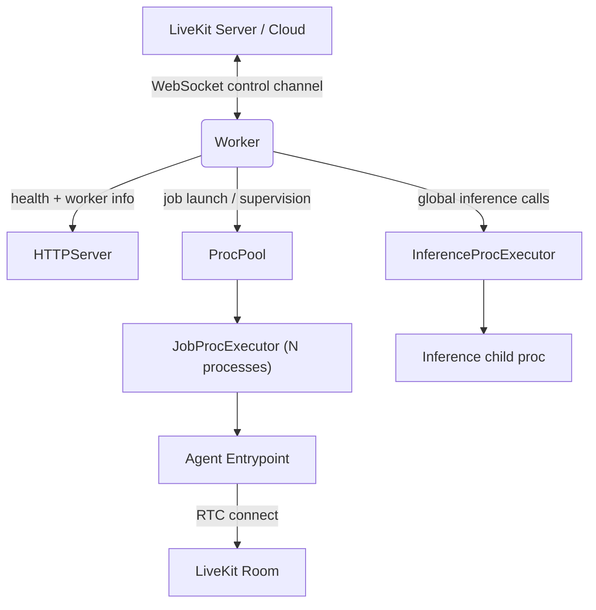
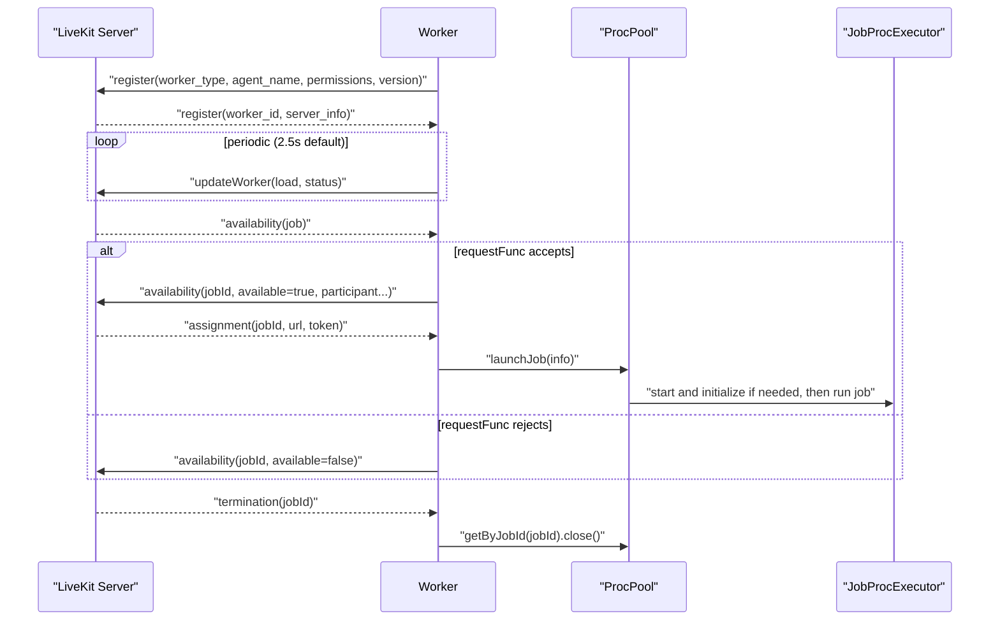

### Worker architecture and usage

This document explains the responsibilities, lifecycle, and usage of `agents/src/worker.ts`, and how it integrates with the process pool, inference executor, HTTP health server, and the LiveKit control plane. It also lists known shortcomings and likely bugs.

#### Purpose

The `Worker` orchestrates agent jobs requested by a LiveKit server or Cloud project. It maintains a WebSocket control session, advertises availability based on system load, accepts assignments, launches agent jobs into supervised processes, exposes health/metrics over HTTP, and manages graceful shutdown.

#### High-level architecture



Key modules:
- `Worker` (`agents/src/worker.ts`): main orchestrator; manages WS, availability, assignments, termination, and shutdown.
- `HTTPServer` (`agents/src/http_server.ts`): exposes `/` (health) and `/worker` (JSON info).
- `ProcPool` (`agents/src/ipc/proc_pool.ts`): maintains a pool of warmed `JobProcExecutor`s or spins one on demand.
- `InferenceProcExecutor` (`agents/src/ipc/inference_proc_executor.ts`): global inference subprocess, multiplexed across jobs.
- `Job*` (`agents/src/job.ts`): job request/acceptance surface and job runtime context (`JobContext`).

#### Control-plane protocol flow



#### Lifecycle overview

- Initialization
  - Validates `wsURL`, `apiKey`, `apiSecret` (or Cloud `workerToken` constraints).
  - Optionally starts `InferenceProcExecutor` if any `InferenceRunner` is registered.
  - Starts `ProcPool` (warming N processes in production when configured).
  - Starts `HTTPServer` on `host:port` (default 8081 in production; ephemeral in dev).

- WebSocket session
  - Connects to `LIVEKIT_URL` (switching to `ws://`), path `agent`, with JWT from `livekit-server-sdk`.
  - On open: sends `register` with worker type, agent name, permissions, version.
  - Periodically samples `loadFunc()` and sends `updateWorker` with load and availability.
  - Handles messages:
    - `availability`: constructs `JobRequest` and delegates to `requestFunc` (default: accept).
    - `assignment`: resolves pending assignment and launches the job via `ProcPool`.
    - `termination`: finds the running process and closes it.

- Drain and shutdown
  - `drain()` marks worker FULL and waits for active jobs to finish (with optional timeout).
  - `close()` shuts down inference executor, all job executors, HTTP server, and WS.

#### HTTP endpoints

- `GET /`: health check, returns `OK`.
- `GET /worker`: JSON payload with:
  - `agent_name`, `worker_type`, `active_jobs`, `sdk_version`.

#### WorkerOptions (key fields)

- `agent` (required): module path that default-exports an `Agent` entrypoint used by `JobProcExecutor`.
- `requestFunc(job: JobRequest)`: decide to `accept` or `reject` a job. Default: `accept()`.
- `loadFunc(): Promise<number>`: returns 0..1 load value. Default: CPU sampling over 2.5s.
- `loadThreshold`: mark FULL when `load >= threshold`. Default: 0.7 (prod) / `Infinity` (dev).
- `numIdleProcesses`: warmed processes in pool (prod default 3, dev 0).
- `initializeProcessTimeout`/`shutdownProcessTimeout`: per-process timeouts.
- `permissions: WorkerPermissions`: LiveKit participant permissions for the agent.
- `workerType`: `JobType` (default `JT_ROOM`).
- `wsURL`, `apiKey`, `apiSecret` or `workerToken` for Cloud.
- `host`, `port`: HTTP server bind (default `0.0.0.0:8081` in prod).
- `jobMemoryWarnMB`, `jobMemoryLimitMB`: soft/hard memory guardrails per job executor.

#### Process pool and inference

- `ProcPool` strategies
  - With `numIdleProcesses > 0`: a `MultiMutex` controls the number of warmed executors; a background loop keeps them initialized in `warmedProcQueue`.
  - With `numIdleProcesses = 0`: launches a new `JobProcExecutor` per job on demand.

- `InferenceProcExecutor`
  - Spawns a dedicated supervised process for inference; methods are invoked via IPC.
  - Register runners globally via `InferenceRunner.registerRunner(method, importPath)` before starting the worker.

#### Programmatic usage

```ts
import { runApp } from 'agents/src/cli.js';
import { WorkerOptions, WorkerPermissions } from 'agents/src/worker.js';

runApp(
  new WorkerOptions({
    agent: new URL('./my_agent.js', import.meta.url).pathname,
    agentName: 'my-agent',
    workerType: 1, // JobType.JT_ROOM
    production: false,
    wsURL: process.env.LIVEKIT_URL,
    apiKey: process.env.LIVEKIT_API_KEY,
    apiSecret: process.env.LIVEKIT_API_SECRET,
    permissions: new WorkerPermissions(true, true, true, true, [], false),
  }),
);
```

Environment variables supported by the CLI and `WorkerOptions`:
- `LIVEKIT_URL`, `LIVEKIT_API_KEY`, `LIVEKIT_API_SECRET`, `LOG_LEVEL`, optionally `LIVEKIT_WORKER_TOKEN`.

#### CLI usage

- Start in production mode:
  - `pnpm -w agents start --url wss://... --api-key ... --api-secret ...`
- Start in development mode:
  - `pnpm -w agents dev --url ws://localhost:7880 --api-key ... --api-secret ...`
- Connect to a specific room (simulate a job):
  - `pnpm -w agents connect --room <name> [--participant-identity <id>]`

#### Notable behaviors and edge cases

- Availability decisions are delegated to `requestFunc`. If it neither calls `accept` nor `reject`, the intended behavior is auto-reject (see issues below).
- Load sampling uses a 2.5s window and rounds to 2 decimals; status flips generate log messages.
- In Cloud (`workerToken` set), custom `loadFunc`/`loadThreshold` are forced to defaults and a warning is logged.

#### Known shortcomings and probable bugs

- Auto-reject not executed
  - In `#availability`, when `requestFunc` completes without calling `accept`/`reject`, the code only logs "automatically rejecting the job" but does not actually invoke the rejection path. This can leave the server waiting indefinitely for the availability response. Expected fix: call `onReject()` when `answered` is still `false` after `requestFunc` returns.

- Assignment timeout does not unwind wait
  - The assignment wait sets a timer that only logs a warning on timeout but leaves the pending promise unresolved. This means the accept path will continue awaiting the assignment indefinitely. Expected fix: clear the pending entry and proceed with a controlled failure or retry.

- HTTP header typo
  - `HTTPServer` sets `Contet-Type` instead of `Content-Type` on `/worker` responses, which can affect clients expecting proper JSON content type.

- WebSocket URL construction is fragile
  - `new URL(url + 'agent')` relies on implicit trailing slash. Safer to use `new URL('agent', url)` to join paths.

- Type-safety and linter issues (non-functional but noisy)
  - `defaultCpuLoad` uses `Object.values(cpu.times).reduce((acc, i) => ...)` where types are inferred as `unknown`. Cast to `number` to satisfy the linter.
  - Node globals/types: `process`, `NodeJS.Timeout`, and built-in modules require proper Node type configuration (e.g., `@types/node` and `tsconfig` `types: ["node"]`).
  - Un-typed callback parameters: add types for WebSocket event handlers (`error`, `close`, `message`).

- Minor logging/message inconsistencies
  - `JobContext.onParticipantConnected` warning contains a typo ("prticipant").

- Potential race on warmed executor removal
  - In `ProcPool.procWatchTask`, if `closed` becomes true after pushing the executor but before initialization, ensure the executor is reliably closed and removed (the `finally` block splices it, but verify index handling and close semantics).

#### Testing and observability tips

- Health check: `curl http://<host>:<port>/` should return `OK`.
- Worker info: `curl http://<host>:<port>/worker` for JSON snapshot.
- Observe availability flips by temporarily customizing `loadFunc()` to return values above/below the `loadThreshold`.
- Use `connect` CLI subcommand to simulate a publisher job in a specific room during development.

#### Versioning

- Worker logs include the SDK `version` from `agents/src/version.ts` and the server info returned during registration. This helps correlate worker binaries with control-plane behavior.

