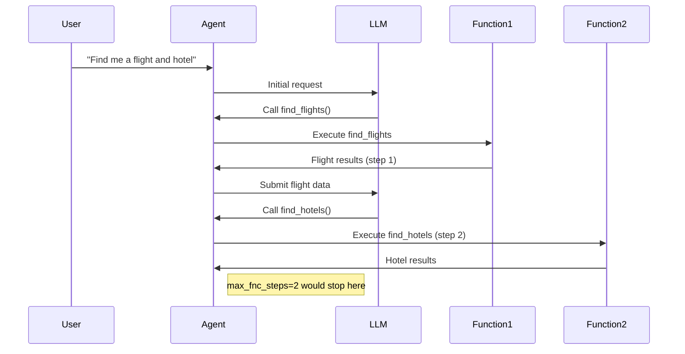
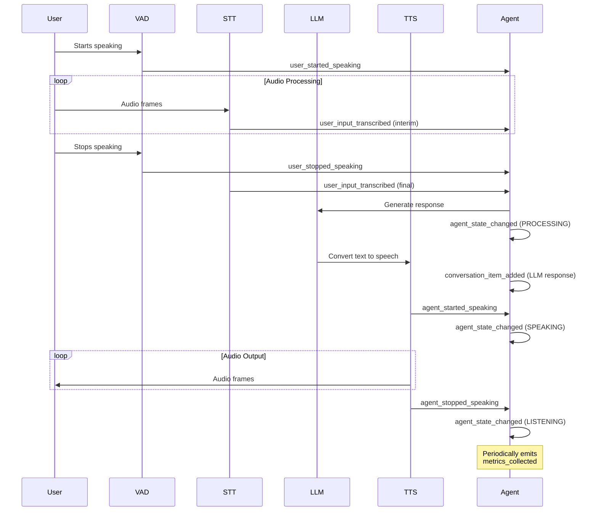

## AgentSession Class 
[source code](https://github.com/livekit/agents/blob/dev-1.0/livekit-agents/livekit/agents/voice/voice_agent.py)

The primary class for voice interactions with LiveKit agents.

### Initialization

```python
def __init__(
    self,
    *,
    instructions: str | None = None,
    task: NotGivenOr[AgentTask] = NOT_GIVEN,
    turn_detector: NotGivenOr[_TurnDetector] = NOT_GIVEN,
    stt: NotGivenOr[stt.STT] = NOT_GIVEN,
    vad: NotGivenOr[vad.VAD] = NOT_GIVEN,
    llm: NotGivenOr[llm.LLM | llm.RealtimeModel] = NOT_GIVEN,
    tts: NotGivenOr[tts.TTS] = NOT_GIVEN,
    userdata: NotGivenOr[Userdata_T] = NOT_GIVEN,
    allow_interruptions: bool = True,
    min_interruption_duration: float = 0.5, # seconds
    min_endpointing_delay: float = 0.5, # seconds
    max_fnc_steps: int = 5,
    loop: asyncio.AbstractEventLoop | None = None,
) -> None
```

**Key Parameters:**
- `instructions`: Natural language instructions for the agent
    -  Required if [`task`](#agenttask-class) is not provided
    -  Ignored if [`task`](#agenttask-class) is provided
- [`task`](#agenttask-class): Preconfigured [AgentTask](#agenttask-class) to use
- Components: [STT](#speech-to-text-stt-implementation), [TTS](#text-to-speech-tts-implementation), [LLM](#llm-language-model-integration), [VAD](#vad-voice-activity-detection) - provide implementations for speech processing
- `allow_interruptions`: Whether user speech interrupts agent speech; Default `True`
- `min_interruption_duration`: Minimum duration in seconds to consider an interruption valid; Default `0.5` seconds
- `min_endpointing_delay`: Silence duration in seconds before considering speech complete; Default `0.5` seconds
- `max_fnc_steps`: Maximum function calling steps allowed per LLM response (default: 5). 
- `stt`: [Speech-to-text component](#speech-to-text-stt-implementation)
- `tts`: [Text-to-speech component](#text-to-speech-tts-implementation)
- `llm`: [Language model integration](#llm-language-model-integration)
- `vad`: [Voice activity detection](#vad-voice-activity-detection)
- `loop`: Used to specify which asyncio event loop should be used for handling asynchronous operations; Defaults when called from a coroutine or a callback (e.g. scheduled with call_soon or similar API), will always return the running event loop. see `asyncio.get_event_loop()`
- 
### Detailed Explanation of max_fnc_steps

The `max_fnc_steps` parameter governs complex LLM interactions by preventing infinite loops in function calling scenarios. Each "step" represents:

1. One LLM-generated function call proposal
2. Execution of that function
3. Result injection back into the conversation context

**Example Flow:**


**Key Behaviors:**
- Counts _all_ function executions triggered by a single user input
- Includes nested function calls (function A calling function B)
- Resets counter for each new user utterance
- When exceeded:
  - Current function chain is terminated

**Recommended Settings:**
| Use Case                | Recommended Value | Rationale                     |
|-------------------------|-------------------|-------------------------------|
| Simple Q&A              | 1-2               | Prevent unnecessary branching |
| Complex workflows       | 3-5               | Allow multi-step verification |
| Developer tools         | 5-10              | Support deep troubleshooting  |
| Untrusted environments  | 1                 | Strict security constraint    |

**Best Practices:**
1. Start with default value (5) for most applications
2. Increase only when complex workflows require deep chaining
3. Set to 1 for:
   - Payment processing flows
   - Sensitive operations
   - Untrusted user inputs
4. Monitor using `function_call_chain` metrics
5. Combine with [function timeouts](#error-handling-strategies) for comprehensive control

```python
# Example: Secure configuration for payment processing
agent = AgentSession(
    max_fnc_steps=1,
    # ... other params ...
)
```

This parameter works in conjunction with: 
- [LLM Function Calling](#llm-function-calling-workflow)
- [Error Handling Strategies](#error-handling-strategies)
- [Agent Monitoring](#monitoring-and-metrics)

### Key Properties

| Property          | Description                                  |
|-------------------|----------------------------------------------|
| `turn_detector`   | Manages speech turn detection                |
| `stt`             | Speech-to-text component                     |
| `llm`             | Language model component                     |
| `tts`             | Text-to-speech component                     |
| `vad`             | Voice activity detector                      |
| `room_io`         | Manages [room input/output](#room-inputoutput-management)                 |
| `current_speech`  | Currently active SpeechHandle if speaking    |
| `current_task`    | Currently active AgentTask                   |

### Main Methods

#### `start()`
```python
async def start(
    self,
    *,
    room: NotGivenOr[rtc.Room] = NOT_GIVEN,
    room_input_options: NotGivenOr[room_io.RoomInputOptions] = NOT_GIVEN,
    room_output_options: NotGivenOr[room_io.RoomOutputOptions] = NOT_GIVEN,
) -> None
```
Starts the agent and connects to room if provided.

#### `say()`
```python
def say(
    self,
    text: str,
    *,
    audio: NotGivenOr[AsyncIterable[rtc.AudioFrame]] = NOT_GIVEN,
    allow_interruptions: NotGivenOr[bool] = NOT_GIVEN,
    add_to_chat_ctx: bool = True,
) -> SpeechHandle
```
Outputs speech with optional pre-rendered audio. Returns a SpeechHandle.

#### `generate_reply()`
```python
def generate_reply(
    self,
    *,
    user_input: NotGivenOr[str] = NOT_GIVEN,
    instructions: NotGivenOr[str] = NOT_GIVEN,
    allow_interruptions: NotGivenOr[bool] = NOT_GIVEN,
) -> SpeechHandle
```
Generates a response using the LLM. Returns a SpeechHandle.

#### `interrupt()`
```python
def interrupt(self) -> None
```
Interrupts current agent speech.

#### `update_task()`
```python
def update_task(self, task: AgentTask) -> None
```
Updates the current agent task.

### Events

- `agent_state_changed`: Emitted when agent state changes
  ```python
  class AgentStateChangedEvent:
      state: AgentState  # New state
  ```

### Usage Example

```python
agent = AgentSession(
    instructions="You're a helpful assistant",
    stt=DeepgramSTT(),
    llm=OpenAILlm(),
    tts=ElevenLabsTTS()
)

async def main():
    room = await rtc.Room.connect()
    await agent.start(room=room)
```

## Important Notes

1. Requires at least one of STT/LLM/TTS to be provided for full functionality
2. Agent states flow: INITIALIZING → LISTENING → SPEAKING → ...
3. Use `SpeechHandle` to control individual speech outputs
4. RoomIO handles automatic audio input/output when connected to a room

## Voice Agent Events Guide

[source](https://github.com/livekit/agents/blob/dev-1.0/livekit-agents/livekit/agents/voice/events.py)

Voice Agent Events form a real-time notification system that enables developers to build responsive voice applications. These events occur throughout the interaction lifecycle as illustrated in the foloowing Event Flow Diagram.

### Event Flow Diagram



Key Observations:
1. Events follow voice interaction lifecycle
2. State changes are always wrapped in agent_state_changed
3. Transcription happens incrementally (interim → final)
4. Metrics are emitted independently of interaction flow

### Event Types

#### user_started_speaking
Triggered when the agent detects speech from the user
```python
# Example: Log when user starts speaking
agent.on("user_started_speaking", lambda _: 
    logger.info("User began speaking - activating noise cancellation"))

# Example: Show visual indicator
agent.on("user_started_speaking", lambda _:
    ui.show_indicator("user_speaking"))
```

#### user_stopped_speaking
Received when user speech segment ends
```python
# Example: Start processing audio
agent.on("user_stopped_speaking", lambda _:
    agent.process_current_audio())

# Example: Update UI state
agent.on("user_stopped_speaking", lambda _:
    ui.update_state(listening=False))
```

#### user_input_transcribed
Contains finalized or interim transcriptions
```python
# Example: Handle real-time transcription
@agent.on("user_input_transcribed")
async def handle_transcription(ev: UserInputTranscribedEvent):
    if ev.is_final:
        await db.log_conversation(ev.transcript)
        ui.update_transcript(ev.transcript, final=True)
    else:
        ui.show_interim_transcript(ev.transcript)
```

#### agent_state_changed
Indicates state transitions in the agent
```python
# Example: Control recording based on state
@agent.on("agent_state_changed")
def handle_state_change(ev: AgentStateChangedEvent):
    match ev.state:
        case AgentState.LISTENING:
            recorder.start()
        case AgentState.PROCESSING:
            recorder.pause()
        case AgentState.SPEAKING:
            recorder.resume()
```

#### metrics_collected
Provides performance data at regular intervals
```python
# Example: Monitor real-time metrics
@agent.on("metrics_collected")
def handle_metrics(ev: MetricsCollectedEvent):
    dashboard.update(
        stt_latency=ev.metrics.stt_latency,
        llm_ttft=ev.metrics.llm_ttft,
        tts_latency=ev.metrics.tts_latency
    )
    if ev.metrics.error_rate > 0.1:
        alert("High error rate detected!")
```

#### conversation_item_added
Fired when new messages are added to history
```python
# Example: Maintain conversation log
@agent.on("conversation_item_added")
def log_message(ev: ConversationItemAddedEvent):
    if ev.message.role == ChatMessage.Role.USER:
        analytics.track("user_message", text=ev.message.content)
    elif ev.message.role == ChatMessage.Role.ASSISTANT:
        analytics.track("agent_response", text=ev.message.content)
```

### Typical Event Handling Pattern
```python
class VoiceAssistant:
    def __init__(self, agent):
        self.agent = agent
        self.setup_handlers()
        
    def setup_handlers(self):
        self.agent.on("user_started_speaking", self.on_user_start)
        self.agent.on("user_input_transcribed", self.on_transcription)
        self.agent.on("agent_state_changed", self.on_state_change)
    
    def on_user_start(self, _):
        self.active_transcription = ""
        
    def on_transcription(self, ev):
        self.active_transcription += ev.transcript
        if ev.is_final:
            self.process_complete_query(self.active_transcription)
    
    def on_state_change(self, ev):
        self.current_state = ev.state
        self.update_connection_quality(ev.state)
```

This shows practical patterns for receiving and handling events in a voice agent implementation, including state management, UI updates, and performance monitoring.

