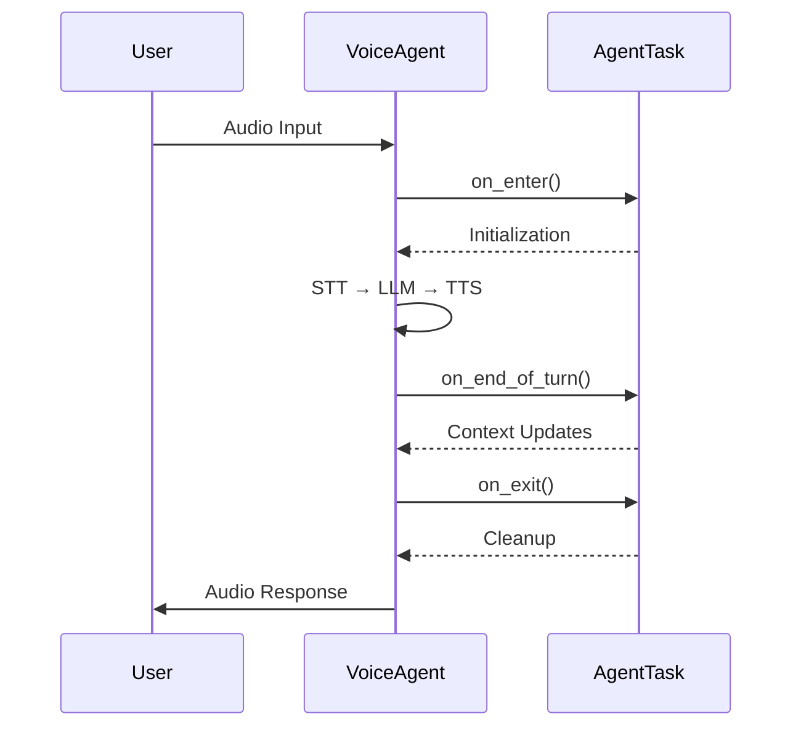

## AgentTask Class

[source](https://github.com/livekit/agents/blob/dev-1.0/livekit-agents/livekit/agents/voice/agent_task.py)

Core class representing a conversational task with configurable processing pipeline.

### Initialization

```python
def __init__(
    self,
    *,
    instructions: str,
    chat_ctx: NotGivenOr[llm.ChatContext] = NOT_GIVEN,
    ai_functions: list[llm.AIFunction] = [],
    turn_detector: NotGivenOr[_TurnDetector | None] = NOT_GIVEN,
    stt: NotGivenOr[stt.STT | None] = NOT_GIVEN,
    vad: NotGivenOr[vad.VAD | None] = NOT_GIVEN,
    llm: NotGivenOr[llm.LLM | llm.RealtimeModel | None] = NOT_GIVEN,
    tts: NotGivenOr[tts.TTS | None] = NOT_GIVEN,
) -> None
```

**Key Parameters:**
- `instructions`: Natural language instructions for the task
- `ai_functions`: List of AI functions available to the LLM
- Components: STT, VAD, LLM, TTS - override default voice agent components
- `turn_detector`: Custom turn detection implementation

### Key Properties

| Property       | Description                                  |
|----------------|----------------------------------------------|
| `instructions` | Task instructions for the LLM               |
| `ai_functions` | List of available AI functions              |
| `chat_ctx`     | Current chat context                        |
| `agent`        | Parent VoiceAgent instance                  |

### Pipeline Customization Methods

Override these methods to customize processing:

```python
async def stt_node(self, audio) -> SpeechEvent:
    """Custom speech-to-text processing"""

async def llm_node(self, chat_ctx, fnc_ctx) -> ChatChunk:
    """Custom LLM processing""" 

async def transcription_node(self, text) -> str:
    """Process LLM output before TTS"""

async def tts_node(self, text) -> AudioFrame:
    """Process text through configured [TTS pipeline](#text-to-speech-tts-implementation)"""
```

### Lifecycle Hooks

The conversation engine provides three key lifecycle hooks for managing conversation flow and state:

**Example Usage**

```python
    class AlloyTask(AgentTask):
        def __init__(self) -> None:
            super().__init__(
                instructions="You are Echo.",
                stt=deepgram.STT(),
                llm=openai.LLM(model="gpt-4o-mini"),
                tts=cartesia.TTS(),
            )
    
        async def on_enter(self) -> None:
            """Called when the task is entered"""
            logger.info("on_enter")
    
        async def on_exit(self) -> None:
            """Called when the task is exited"""
            logger.info("on_exit")
    
        async def on_end_of_turn(self, chat_ctx: llm.ChatContext, new_message: llm.ChatMessage) -> None:
            """Called when the user has finished speaking, and the LLM is about to respond
    
            This is a good opportunity to update the chat context or edit the new message before it is
            sent to the LLM.
            """
            logger.info(f"on_end_of_turn: cat_ctx={chat_ctx}; new_message={new_message}")
```


#### Hook Overview
| Hook             | Trigger Point                          | Execution Order | Async Support | Error Handling                  |
|------------------|----------------------------------------|-----------------|---------------|----------------------------------|
| `on_enter`       | When entering new state/turn           | Pre-processing  | Yes           | Blocks state transition if fails |
| `on_end_of_turn` | After processing input, before response| Mid-processing  | Yes           | Logs error but proceeds          |
| `on_exit`        | When leaving current state/turn        | Post-processing | Yes           | Final cleanup chance             |

### Detailed Behavior

##### `on_enter`
```python
async def on_enter() -> None:
    """Initialize conversation state"""
```
**Typical Use Cases:**
- User session initialization
- Contextual data loading
- Pre-turn resource allocation
- Welcome message delivery

##### `on_end_of_turn`
```python
async def on_end_of_turn(self, chat_ctx: llm.ChatContext, new_message: llm.ChatMessage) -> None:
    """Post-processing before state transition"""
```

**Common Patterns:**
- Conversation history persistence
- Performance metrics collection
- Temporary data cleanup
- Validation checks

##### `on_exit` 
```python
async def on_exit() -> None:
    """Final cleanup operations"""
```
**Critical Responsibilities:**
- Resource deallocation
- Final state validation
- Connection cleanup
- Graceful exit notifications

#### Execution Flow



**Timeout Management**
```python
# Prevent hook hangs with timeouts
async def on_enter():
    try:
        await asyncio.wait_for(
            external_service.initialize(),
            timeout=5.0
        )
    except TimeoutError:
        """Hanlde Errror"""
```

These hooks enable precise control over conversation state management while maintaining async performance characteristics. Implement them to add business logic while leveraging the framework's reliability mechanisms.


## InlineTask Class

[source](https://github.com/livekit/agents/blob/dev-1.0/livekit-agents/livekit/agents/voice/agent_task.py)

Specialized AgentTask for asynchronous operations within AI functions.

### Usage Example

```python
class DataTask(InlineTask[str]):
    async def run(self):
        """Execute within AI function context"""
        result = await process_data()
        self.complete(result)

@llm.ai_function()
async def analyze_data():
    """Launch async task from AI function"""
    task = DataTask(instructions="Analyze dataset")
    return await task  # Returns control to conversation flow
```

### Key Methods

```python
def complete(self, result: TaskResult_T | AIError) -> None:
    """Finalize the inline task with result/error"""
```

## Task Requirements

1. Non-streaming STT requires VAD for audio segmentation
2. TTS automatically uses sentence tokenization if not streaming
3. AI functions must be async when using InlineTask
4. Task nodes should yield processing results for real-time streaming

## Component Dependencies

| Component | Requirement                              | Default Behavior              |
|-----------|------------------------------------------|--------------------------------|
| STT       | Requires VAD if non-streaming            | Uses Deepgram STT              |
| LLM       | Streaming requires RealtimeModel        | Uses OpenAI GPT-4             |
| TTS       | Auto-segments text if non-streaming      | Uses Cartesia TTS             |
| VAD       | Required for push-to-talk detection      | Uses WebRTC VAD               |

