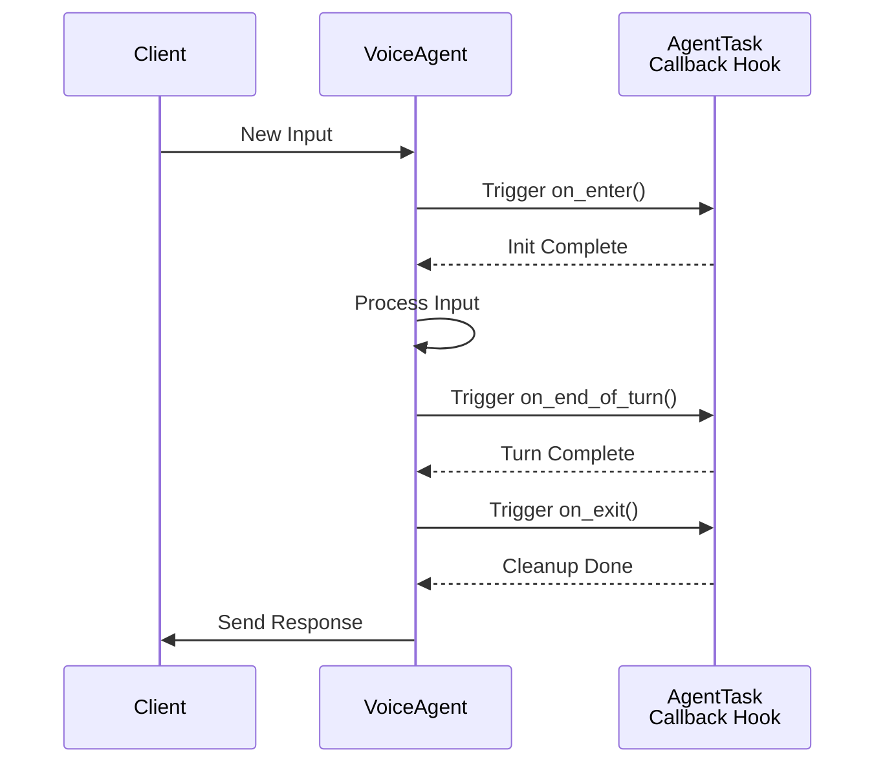

## AgentTask Class

[source](https://github.com/livekit/agents/blob/dev-1.0/livekit-agents/livekit/agents/voice/agent_task.py)

Core class representing a conversational task with configurable processing pipeline.

### Initialization

```python
def __init__(
    self,
    *,
    instructions: str,
    chat_ctx: NotGivenOr[llm.ChatContext] = NOT_GIVEN,
    ai_functions: list[llm.AIFunction] = [],
    turn_detector: NotGivenOr[_TurnDetector | None] = NOT_GIVEN,
    stt: NotGivenOr[stt.STT | None] = NOT_GIVEN,
    vad: NotGivenOr[vad.VAD | None] = NOT_GIVEN,
    llm: NotGivenOr[llm.LLM | llm.RealtimeModel | None] = NOT_GIVEN,
    tts: NotGivenOr[tts.TTS | None] = NOT_GIVEN,
) -> None
```

**Key Parameters:**
- `instructions`: Natural language instructions for the task
- `ai_functions`: List of AI functions available to the LLM
- Components: STT, VAD, LLM, TTS - override default voice agent components
- `turn_detector`: Custom turn detection implementation

### Key Properties

| Property       | Description                                  |
|----------------|----------------------------------------------|
| `instructions` | Task instructions for the LLM               |
| `ai_functions` | List of available AI functions              |
| `chat_ctx`     | Current chat context                        |
| `agent`        | Parent VoiceAgent instance                  |

### Pipeline Customization Methods

Override these methods to customize processing:

```python
async def stt_node(self, audio) -> SpeechEvent:
    """Custom speech-to-text processing"""

async def llm_node(self, chat_ctx, fnc_ctx) -> ChatChunk:
    """Custom LLM processing""" 

async def transcription_node(self, text) -> str:
    """Process LLM output before TTS"""

async def tts_node(self, text) -> AudioFrame:
    """Process text through configured [TTS pipeline](#text-to-speech-tts-implementation)"""
```

### Lifecycle Hooks

The conversation engine provides three key lifecycle hooks for managing conversation flow and state:

```python
    class AlloyTask(AgentTask):
        def __init__(self) -> None:
            super().__init__(
                instructions="You are Echo.",
                stt=deepgram.STT(),
                llm=openai.LLM(model="gpt-4o-mini"),
                tts=cartesia.TTS(),
            )
    
        async def on_enter(self) -> None:
            logger.info("on_enter")
    
        async def on_exit(self) -> None:
            logger.info("on_exit")
    
        async def on_end_of_turn(self, chat_ctx: llm.ChatContext, new_message: llm.ChatMessage) -> None:
            logger.info(f"on_end_of_turn: cat_ctx={chat_ctx}; new_message={new_message}")
            
        @ai_function
        async def talk_to_echo(self, context: CallContext):
            logger.info(f"talk_to_echo {context}")
            return EchoTask(), "Transferring you to Echo."


```


#### Hook Overview
| Hook             | Trigger Point                          | Execution Order | Async Support | Error Handling                  |
|------------------|----------------------------------------|-----------------|---------------|----------------------------------|
| `on_enter`       | When entering new state/turn           | First           | Yes           | Blocks state transition if fails |
| `on_end_of_turn` | After processing input, before transition | Second        | Yes           | Logs error but proceeds          |
| `on_exit`        | When leaving current state/turn        | Last            | Yes           | Final chance for cleanup         |

### Detailed Behavior

##### `on_enter`
```python
async def on_enter(ctx: Context) -> None:
    """Initialize conversation state"""
    ctx.store["user_profile"] = await load_profile(ctx.user_id)
    await ctx.send_message("Welcome! How can I help?")
```
**Typical Use Cases:**
- User session initialization
- Contextual data loading
- Pre-turn resource allocation
- Welcome message delivery

##### `on_end_of_turn`
```python
async def on_end_of_turn(ctx: Context) -> None:
    """Post-processing before state transition"""
    await analytics.track_event(
        event="turn_complete",
        duration=ctx.turn_duration,
        success=ctx.last_response.ok
    )
    ctx.clear_temp_data()
```
**Common Patterns:**
- Conversation history persistence
- Performance metrics collection
- Temporary data cleanup
- Validation checks

##### `on_exit` 
```python
async def on_exit(ctx: Context) -> None:
    """Final cleanup operations"""
    await db.release_lock(ctx.conversation_id)
    if ctx.session_active:
        await ctx.send_message("Session ending in 5 seconds...")
```
**Critical Responsibilities:**
- Resource deallocation
- Final state validation
- Connection cleanup
- Graceful exit notifications

#### Execution Flow



#### Best Practices

1. **Async Optimization**
```python
# Parallelize independent operations
async def on_enter(ctx):
    user_data, catalog = await asyncio.gather(
        users.get(ctx.user_id),
        products.fetch_catalog()
    )
    ctx.store.update(user_data=user_data, catalog=catalog)
```

2. **Error Resilience**
```python
# Implement retry logic for critical operations
async def on_end_of_turn(ctx):
    for attempt in range(3):
        try:
            await analytics.log_turn(ctx.turn_data)
            break
        except Exception as e:
            if attempt == 2: 
                ctx.log_error("Failed to log turn", error=e)
```

3. **State Safety**
```python
# Use context managers for resource handling
async def on_exit(ctx):
    async with ctx.get_db_connection() as conn:
        await conn.execute("COMMIT")
        await conn.close()
```

4. **Timeout Management**
```python
# Prevent hook hangs with timeouts
async def on_enter(ctx):
    try:
        await asyncio.wait_for(
            external_service.initialize(),
            timeout=5.0
        )
    except TimeoutError:
        ctx.fallback_to_cached_config()
```

These hooks enable precise control over conversation state management while maintaining async performance characteristics. Implement them to add business logic while leveraging the framework's reliability mechanisms.


## InlineTask Class

[source](https://github.com/livekit/agents/blob/dev-1.0/livekit-agents/livekit/agents/voice/agent_task.py)

Specialized AgentTask for asynchronous operations within AI functions.

### Usage Example

```python
class MyTask(InlineTask[str]):
    async def run(self):
        # Execute async operations
        result = await some_async_operation()
        self.complete(result)

@llm.ai_function()
async def process_data():
    task = MyTask(instructions="Process data")
    return await task
```

### Key Methods

```python
def complete(self, result: TaskResult_T | AIError) -> None:
    """Finalize the inline task with result/error"""
```

## Task Requirements

1. Non-streaming STT requires VAD for audio segmentation
2. TTS automatically uses sentence tokenization if not streaming
3. AI functions must be async when using InlineTask
4. Task nodes should yield processing results for real-time streaming

