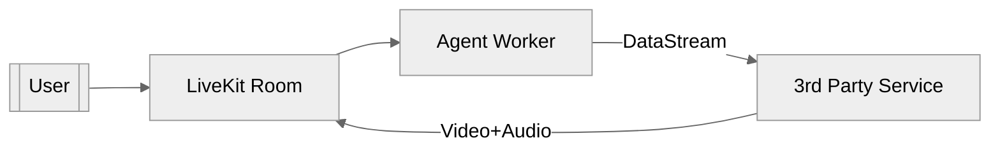
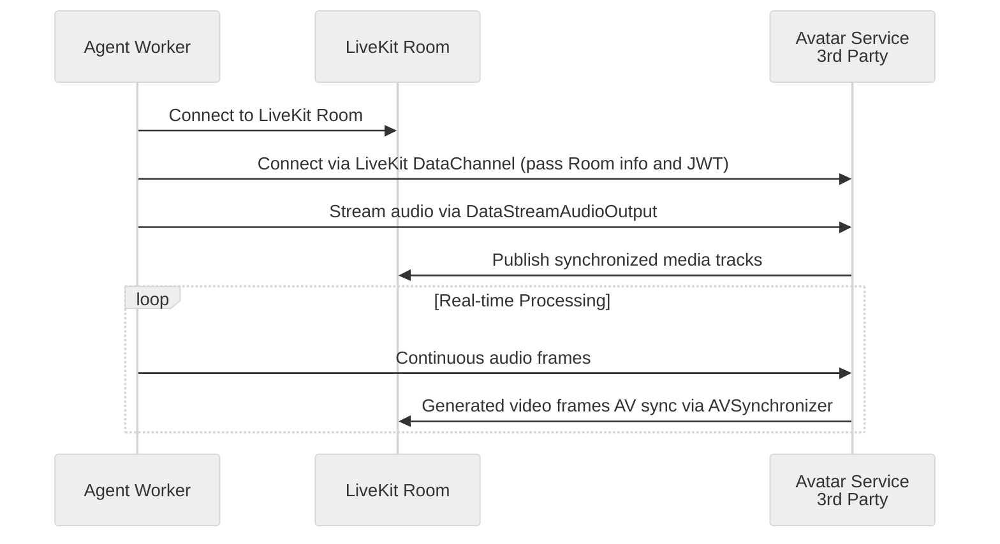
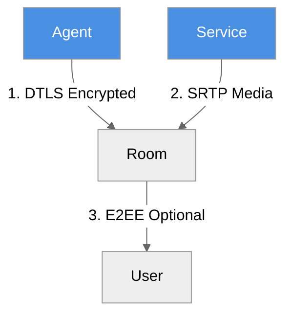

# LiveKit Avatar Integration Framework

[Source](https://github.com/livekit/agents/tree/cwilson/simli_test/examples/simli_avatar)


This document outlines the architecture for integrating third-party avatar services using LiveKit's agent system. The framework enables real-time avatar animation synced with audio input.

## Core Components



## Implementation Pattern



## Agent Implementation

1. **Audio Streaming Setup**
```python
from livekit.agents.voice.avatar import DataStreamAudioOutput

class AgentHandler:
    def __init__(self, room: rtc.Room, service_identity: str):
        self._audio_sink = DataStreamAudioOutput(room, destination_identity=service_identity)
        
    async def handle_user_audio(self, frame: rtc.AudioFrame):
        await self._audio_sink.capture_frame(frame)
```

2. **Media Track Handling**
```python
async def handle_service_media(self, room: rtc.Room):
    video_track = room.local_participant.get_track("avatar_video")
    async for frame in video_track:
        # Process video frames from service
        display_frame(frame)
```

## Service Provider Implementation

1. **Audio Reception**
```python
from livekit.agents.voice.avatar import DataStreamAudioReceiver, AvatarRunner

class AvatarService:
    def __init__(self, room: rtc.Room):
        self._audio_receiver = DataStreamAudioReceiver(room)
        self._avatar_runner = AvatarRunner(
            room,
            audio_recv=self._audio_receiver,
            video_gen=CustomVideoGenerator(),
            options=AvatarOptions(...)
        )
    
    async def start(self):
        await self._avatar_runner.start()
```

2. **AV Synchronization**
```python
class CustomVideoGenerator(VideoGenerator):
    async def push_audio(self, frame: rtc.AudioFrame):
        # Process audio and generate video frames
        video_frame = await generate_avatar_frame(frame)
        await self._av_sync.push(video_frame)
```

## Key Configuration

```python
# Agent worker config
AGENT_CONFIG = {
    "audio_sample_rate": 16000,
    "audio_channels": 1,
    "video_fps": 30,
    "video_resolution": (640, 480)
}

# Service provider requirements
SERVICE_REQUIREMENTS = {
    "web_socket_endpoint": "wss://service.com/livekit",
    "media_formats": {
        "audio": "opus/48000",
        "video": "h264/90000"
    }
}
```

## Security Architecture



1. All LiveKit connections use DTLS encryption
2. Media streams protected with SRTP
3. Optional end-to-end encryption for sensitive applications

## Example Providers

| Service | Specialization | LiveKit Integration |
|---------|----------------|---------------------|
| Simli | Real-time lip sync | [simli_worker.py](https://github.com/livekit/agents/blob/cwilson/simli_test/examples/simli_avatar/simli_worker.py) |
| HeyGen | Photorealistic avatars | REST API + WebSocket |
| D-ID | Natural gestures | Custom video pipeline |
| Tavus | Personalized cloning | WebRTC direct |

