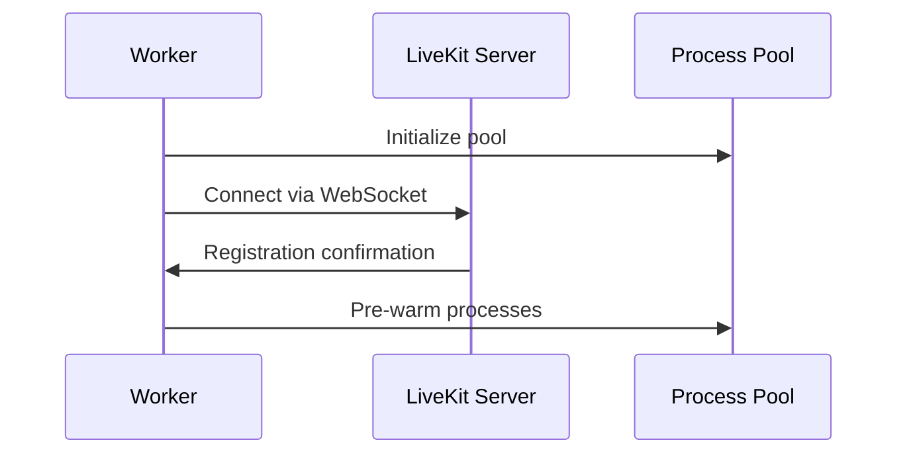
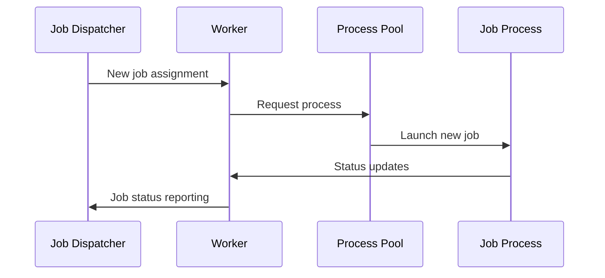
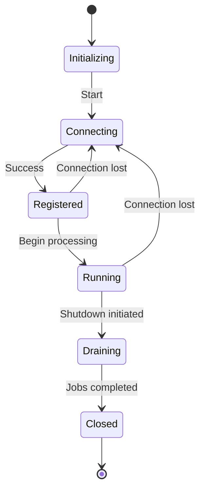

# LiveKit Worker Class Documentation

[source](https://github.com/livekit/agents/blob/dev-1.0/livekit-agents/livekit/agents/worker.py)

## Purpose
The `Worker` class is the core component of the LiveKit Agents framework, designed to manage agent jobs and handle real-time communication with LiveKit servers. It acts as a long-running service that:

- Maintains WebSocket connections to LiveKit
- Processes job assignments from the LiveKit backend
- Manages job execution in separate processes/threads
- Provides health monitoring and load balancing
- Handles automatic reconnections and retries

## Key Features

1. **Job Management**
   - Spawns isolated processes/threads for each agent job
   - Maintains a pool of pre-warmed processes for quick job startup
   - Implements memory monitoring and limits for jobs

2. **Cluster Coordination**
   - Registers with LiveKit servers
   - Reports worker status and load metrics
   - Handles job assignment negotiation
   - Implements draining mode for graceful shutdown

3. **Infrastructure**
   - Built-in HTTP server for health checks
   - CPU/memory monitoring
   - Automatic reconnection logic
   - Support for development vs production modes

## Basic Usage

```python
from livekit.agents import Worker, WorkerOptions, JobContext

async def entrypoint(ctx: JobContext):
    """Your agent's main entrypoint"""
    await ctx.connect()
    # Implement agent logic here

worker = Worker(
    WorkerOptions(
        entrypoint_fnc=entrypoint,
        agent_name="my-agent",
        api_key="your_api_key",
        api_secret="your_api_secret",
        ws_url="wss://your.livekit.server"
    )
)

async def main():
    await worker.run()

asyncio.run(main())
```

## Configuration Options (WorkerOptions)

| Parameter | Type | Default | Description |
|-----------|------|---------|-------------|
| `entrypoint_fnc` | Callable | Required | Main agent entrypoint function |
| `agent_name` | str | "" | Unique identifier for explicit dispatch |
| `worker_type` | WorkerType | ROOM | ROOM or PUBLISHER job type |
| `permissions` | WorkerPermissions | Default permissions | Room join permissions |
| `job_executor_type` | JobExecutorType | PROCESS | PROCESS or THREAD execution |
| `load_threshold` | float | 0.75 (prod) | CPU load threshold for availability |
| `max_retry` | int | 16 | Max connection retry attempts |
| `num_idle_processes` | int | 3 (prod) | Pre-warmed process pool size |

## Key Flow Description:

### Initialization Sequence:



### Job Handling Flow:



### State Transitions:




## Lifecycle Management

1. **Initialization**
   - Validate configuration
   - Start HTTP server
   - Initialize process pool

2. **Connection Phase**
   - Establish WebSocket connection
   - Register with LiveKit backend
   - Begin health monitoring

3. **Operation**
   - Handle job assignments
   - Spawn/manage job processes
   - Report status updates
   - Monitor resource usage

4. **Shutdown**
   - Drain active jobs
   - Close network connections
   - Clean up resources

## Best Practices

1. Use process-based execution (default) for better isolation
2. Set appropriate memory limits for your agent's requirements
3. Implement proper error handling in entrypoint functions
4. Use draining mode for graceful shutdowns during deployments
5. Monitor worker status through the HTTP health check endpoint


