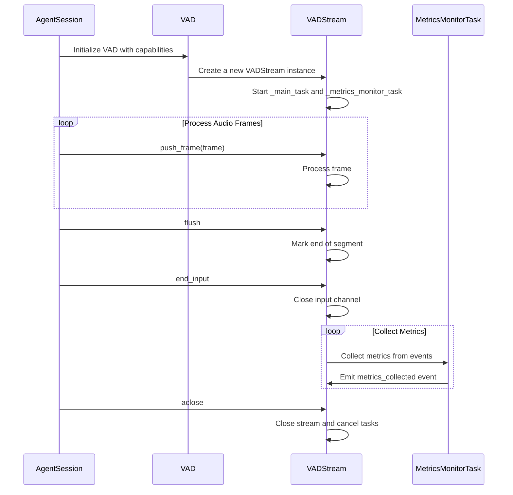

## Voice Activity Detection (VAD) Interface

[source](https://github.com/livekit/agents/blob/dev-1.0/livekit-agents/livekit/agents/vad.py)

Voice Activity Detection (VAD) is a fundamental component in audio processing systems that identifies speech segments within an audio stream.

VAD is a requirement when an STT does not support streaming.

### Default Configuration

| Parameter | Default | Description |
|-----------|---------|-------------|
| `activation_threshold` | 0.5 | Threshold to consider a frame as speech. |
| `force_cpu` | True | Force the use of CPU for inference. |
| `max_buffered_speech` | 60 | Maximum duration of speech to keep in the buffer |
| `min_silence_duration` | 0.55s | Silence needed for END event |
| `min_speech_duration` | 0.55s | Minimum speech to trigger START |
| `padding_duration` | None | **(Deprecated)** Use `prefix_padding_duration` instead. |
| `prefix_padding_duration` | 0.5 |Duration of padding to add to the beginning of each speech chunk. |
| `sample_rate` | 16000 | Sample rate for the inference (only 8KHz and 16KHz are supported). |
| `silence_threshold` | 0.15 | Probability to confirm silence |
| `speech_threshold` | 0.85 | Probability to confirm speech |
| `update_interval` | 0.32s | Time between INFERENCE_DONE events |

### Processing Flow




### Core Components

```python
class VADEventType(Enum):
    START_OF_SPEECH = "start_of_speech"  # Speech onset detected
    INFERENCE_DONE = "inference_done"    # Processing batch completed
    END_OF_SPEECH = "end_of_speech"      # Speech offset detected

@dataclass
class VADEvent:
    type: VADEventType
    samples_index: int         # Audio sample index (relative to inference rate)
    timestamp: float           # Event time in seconds
    speech_duration: float     # Length of speech segment (default: 0.2-0.5s)
    silence_duration: float    # Silence before/after speech (default: 0.3-1.0s)
    frames: list[rtc.AudioFrame]  # Raw audio frames
    probability: float = 0.0   # Speech confidence [0-1] (INFERENCE_DONE only)
    inference_duration: float = 0.0  # Processing time (INFERENCE_DONE only)
```

### Event Lifecycle


### Metrics Collection

```python
class VADMetrics:
    timestamp: float         # Time of metric collection
    idle_time: float         # Seconds since last speech activity
    inference_duration_total: float  # Total processing time
    inference_count: int     # Number of inferences
    label: str               # VAD implementation ID
```

Metrics are emitted every `1 / update_interval` inferences (default: 10x/second).

### Usage Example

```python
from livekit.agents.vad import VADEventType, VAD

class SpeechProcessor:
    def __init__(self, vad: VAD):
        self._vad_stream = vad.stream()
        self._vad_stream.on("metrics_collected", self._on_metrics)
        
    async def process(self):
        async for event in self._vad_stream:
            if event.type == VADEventType.START_OF_SPEECH:
                print(f"Speech started with {len(event.frames)} buffered frames")
            elif event.type == VADEventType.INFERENCE_DONE:
                print(f"Speech probability: {event.probability:.2f}")
            elif event.type == VADEventType.END_OF_SPEECH:
                audio = concatenate_frames(event.frames)
                print(f"Full speech: {audio.duration:.2f}s")

    def _on_metrics(self, metrics: VADMetrics):
        print(f"VAD Efficiency: {metrics.inference_duration_total/metrics.inference_count:.3f}s/inference")
```


