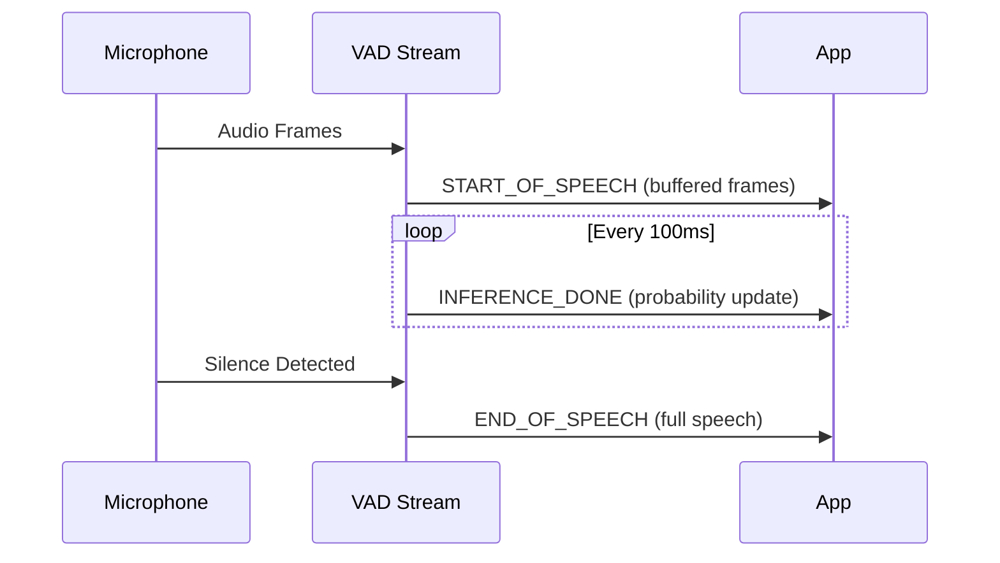
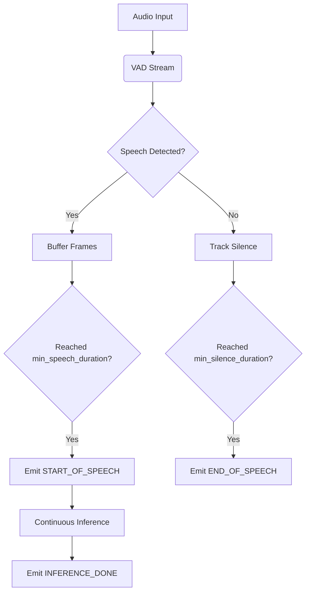

## Voice Activity Detection (VAD) Interface

[source](https://github.com/livekit/agents/blob/dev-1.0/livekit-agents/livekit/agents/vad.py)

VAD is a requirement when an STT does not support streaming.

### Core Components

```python
class VADEventType(Enum):
    START_OF_SPEECH = "start_of_speech"  # Speech onset detected
    INFERENCE_DONE = "inference_done"    # Processing batch completed
    END_OF_SPEECH = "end_of_speech"      # Speech offset detected

@dataclass
class VADEvent:
    type: VADEventType
    samples_index: int         # Audio sample index (relative to inference rate)
    timestamp: float           # Event time in seconds.monotonic()
    speech_duration: float     # Length of speech segment (default: 0.2-0.5s)
    silence_duration: float    # Silence before/after speech (default: 0.3-1.0s)
    frames: list[rtc.AudioFrame]  # Raw audio frames
    probability: float = 0.0   # Speech confidence [0-1] (INFERENCE_DONE only)
    inference_duration: float = 0.0  # Processing time (INFERENCE_DONE only)
```

### Event Lifecycle



### Default Configuration

| Parameter | Default | Description |
|-----------|---------|-------------|
| `update_interval` | 0.1s | Time between INFERENCE_DONE events |
| `min_speech_duration` | 0.3s | Minimum speech to trigger START |
| `min_silence_duration` | 0.5s | Silence needed for END event |
| `speech_threshold` | 0.85 | Probability to confirm speech |
| `silence_threshold` | 0.15 | Probability to confirm silence |

### Metrics Collection

```python
class VADMetrics:
    timestamp: float         # Time of metric collection
    idle_time: float         # Seconds since last speech activity
    inference_duration_total: float  # Total processing time
    inference_count: int     # Number of inferences
    label: str               # VAD implementation ID
```

Metrics are emitted every `1 / update_interval` inferences (default: 10x/second).

### Usage Example

```python
from livekit.agents.vad import VADEventType, VAD

class SpeechProcessor:
    def __init__(self, vad: VAD):
        self._vad_stream = vad.stream()
        self._vad_stream.on("metrics_collected", self._on_metrics)
        
    async def process(self):
        async for event in self._vad_stream:
            if event.type == VADEventType.START_OF_SPEECH:
                print(f"Speech started with {len(event.frames)} buffered frames")
            elif event.type == VADEventType.INFERENCE_DONE:
                print(f"Speech probability: {event.probability:.2f}")
            elif event.type == VADEventType.END_OF_SPEECH:
                audio = concatenate_frames(event.frames)
                print(f"Full speech: {audio.duration:.2f}s")

    def _on_metrics(self, metrics: VADMetrics):
        print(f"VAD Efficiency: {metrics.inference_duration_total/metrics.inference_count:.3f}s/inference")
```

### Processing Flow



### Best Practices

1. **Buffer Management**
```python
# Pre-buffer 2-3 frames before START event
vad = WebRTCVAD(
    min_speech_duration=0.3,
    pre_buffer_frames=2  # ~60ms at 30fps
)
```

2. **Threshold Tuning**
```python
# Adjust for different environments
vad.speech_threshold = 0.92  # Noisy environment
vad.silence_threshold = 0.08  # Sensitive silence detection
```

3. **Performance Monitoring**
```python
def _on_metrics(metrics: VADMetrics):
    if metrics.inference_duration_total > 0.1:
        logger.warning(f"VAD latency high: {metrics.inference_duration_total:.3f}s")
    if metrics.idle_time > 60:
        logger.info("Entering low-power mode")
```

4. **Event Handling**
```python
async def handle_events(stream: VADStream):
    async for event in stream:
        if event.speech_duration > 5.0:
            logger.warning("Long speech segment detected")
            stream.flush()  # Reset buffers
```
