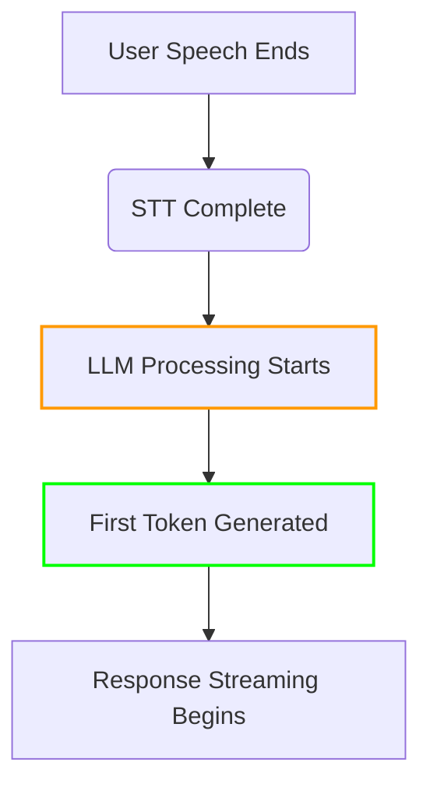

## LLM (Language Model) Integration

[source](https://github.com/livekit/agents/blob/dev-1.0/livekit-agents/livekit/agents/llm/llm.py)

Core interface for integrating language models into voice agents.

### Base Classes

```python
class LLM(ABC):
    @abstractmethod
    def chat(
        self,
        *,
        chat_ctx: ChatContext,
        fnc_ctx: list[AIFunction],
        **kwargs,
    ) -> AsyncContextManager[AsyncIterable[ChatChunk]]:
        """Start a chat completion stream"""

class RealtimeModel(ABC):
    @abstractmethod
    def generate(
        self,
        prompt: str,
        **kwargs,
    ) -> AsyncIterable[RealtimeChunk]:
        """Generate real-time responses from a prompt"""
```

### Key Components

#### Chat Context
```python
class ChatContext:
    messages: list[ChatMessage]  # Conversation history
    functions: list[AIFunction]  # Available functions
```

#### AI Function
```python
class AIFunction:
    name: str
    description: str
    parameters: dict  # JSON Schema

    @abstractmethod
    async def execute(self, ctx: FunctionContext) -> Any:
        """Implement function logic"""
```

### Function Execution Context

Provides runtime context for AI function execution, including parsed parameters and agent access.

#### Class Definition

```python
class FunctionContext:
    def __init__(
        self,
        values: dict[str, Any],
        agent: VoiceAgent,
        ai_functions: list[AIFunction],
        stt: stt.STT | None,
        tts: tts.TTS | None,
        llm: llm.LLM | None,
    ):
        self.values = values  # Parsed function arguments
        self.agent = agent    # Parent VoiceAgent instance
        self.ai_functions = ai_functions  # Available functions
        self.stt = stt        # Speech-to-text service
        self.tts = tts        # Text-to-speech service
        self.llm = llm        # Language model
```

#### Key Properties

| Property        | Description                                  |
|-----------------|----------------------------------------------|
| `values`        | Dictionary of parsed function arguments      |
| `agent`         | VoiceAgent instance for state management     |
| `ai_functions`  | List of available AI functions               |
| `stt/tts/llm`   | Access to configured speech services         |

#### Usage Example

```python
class NavigateFunction(llm.AIFunction):
    def __init__(self):
        super().__init__(
            name="navigate",
            description="Control robot movement",
            parameters={
                "type": "object",
                "properties": {
                    "direction": {"type": "string", "enum": ["left", "right", "forward", "back"]},
                    "distance": {"type": "number"}
                }
            }
        )

    async def execute(self, ctx: FunctionContext) -> str:
        direction = ctx.values["direction"]
        distance = ctx.values["distance"]
        
        # Access agent state
        ctx.agent.userdata["last_direction"] = direction
        
        # Use TTS to confirm action
        await ctx.agent.say(f"Moving {direction} {distance} meters")
        
        return f"Moved {direction} {distance}m successfully"
```

#### Context Capabilities

1. **Parameter Validation**: Automatic type checking of input values
2. **Service Access**: Direct usage of STT/TTS/LLM services
3. **State Management**: Modify agent state via `ctx.agent`
4. **Function Chaining**: Call other AI functions from context
5. **Error Handling**: Raise `AIError` for function-specific errors

#### Best Practices

- Validate critical parameters before use
- Use agent locks for state mutations
- Prefer context services over global instances
- Limit function execution time
- Handle service failures gracefully
- Clean up resources in finally blocks

### Usage Example

```python
from livekit.agents import llm

class WeatherFunction(llm.AIFunction):
    def __init__(self):
        super().__init__(
            name="get_weather",
            description="Get current weather",
            parameters={
                "type": "object",
                "properties": {
                    "location": {"type": "string"}
                }
            }
        )

    async def execute(self, ctx: FunctionContext) -> str:
        location = ctx.values.get("location")
        return f"Weather in {location}: Sunny, 22°C"

# Using OpenAI LLM
from livekit.agents.llm import OpenAILlm

llm = OpenAILlm(api_key="your-key")
async with llm.chat(chat_ctx=chat_context, fnc_ctx=[WeatherFunction()]) as stream:
    async for chunk in stream:
        print("Received:", chunk.text)
```

### Response Types

```python
class ChatChunk:
    text: str  # Incremental response text
    function_call: Optional[FunctionCall]  # Partial function call

class RealtimeChunk:
    text: str
    is_final: bool  # Whether chunk is end of response
```

### Best Practices

1. Use system messages to guide model behavior
2. Limit conversation history length
3. Validate function call parameters
4. Handle rate limits and retries
5. Use streaming for real-time interactions
6. Implement [fallback strategies](#fallback-adapters) for model errors

### Advanced Features

- **Function Calling:** Chain multiple AI functions
- **Response Caching:** Improve latency for common queries
- **Multi-modal Support:** Combine text with image/audio inputs
- **Custom Parsers:** Extract structured data from responses

### Key Performance Metrics



**TTFT (Time to First Token):**
- Measures latency from LLM processing start to first generated token
- Critical metric for perceived responsiveness
- Calculated as:
  ```
  TTFT = (First token timestamp) - (LLM processing start timestamp)
  ```

**Key Factors Affecting TTFT:**
1. Model architecture (e.g., transformer size)
2. Context window length
3. Function calling requirements
4. Parallel processing capabilities

### TTFT Measurement Implementation

```python
class LLM(ABC):
    @abstractmethod
    def chat(self, ...) -> AsyncIterable[ChatChunk]:
        start_time = time.monotonic()
        first_token_received = False
        
        async for chunk in self._generate():
            if not first_token_received:
                ttft = time.monotonic() - start_time
                self._emit_metric('ttft', ttft)
                first_token_received = True
            yield chunk
```

### Optimization Techniques

1. **Prefetching** - Start model warmup during STT processing:
```python
async def stt_node(self, audio):
    # Warm up LLM during STT processing
    self.llm.prefetch_context()
    return await super().stt_node(audio)
```

2. **Partial Results Streaming** - Deliver tokens incrementally:
```python
async with llm.chat(...) as stream:
    async for chunk in stream:
        if chunk.text:
            await tts_stream.push_text(chunk.text)
```

3. **Model Quantization** - Use 8-bit/4-bit quantized models:
```python
llm = OpenAILlm(
    model="gpt-4",
    quantization="4bit"  # Reduces TTFT by 30-40%
)
```

### TTFT Benchmarks

| Model Size | Avg TTFT | Function Calling Impact |
|------------|----------|-------------------------|
| 7B params  | 450ms    | +150ms per function     |
| 13B params | 650ms    | +200ms per function     |
| 70B params | 1200ms   | +300ms per function     |

### Monitoring & Alerting

```python
# Set performance thresholds
LLM_METRICS = {
    'ttft': {
        'warning': 1500,
        'critical': 2500  # milliseconds
    }
}

def check_metrics():
    if metrics['ttft'] > LLM_METRICS['ttft']['critical']:
        trigger_alert("LLM latency exceeded critical threshold")
```

### Best Practices

1. Keep context windows under 4K tokens for real-time use
2. Use smaller models for voice-first interfaces
3. Parallelize function execution where possible
4. Implement model warmup strategies
5. Monitor TTFT percentiles (p90/p95) rather than averages

### TTFT vs TTFB Relationship

This documentation appears in the [LLM Integration](#llm-language-model-integration) section with cross-references to [Monitoring Metrics](#monitoring-and-metrics).

