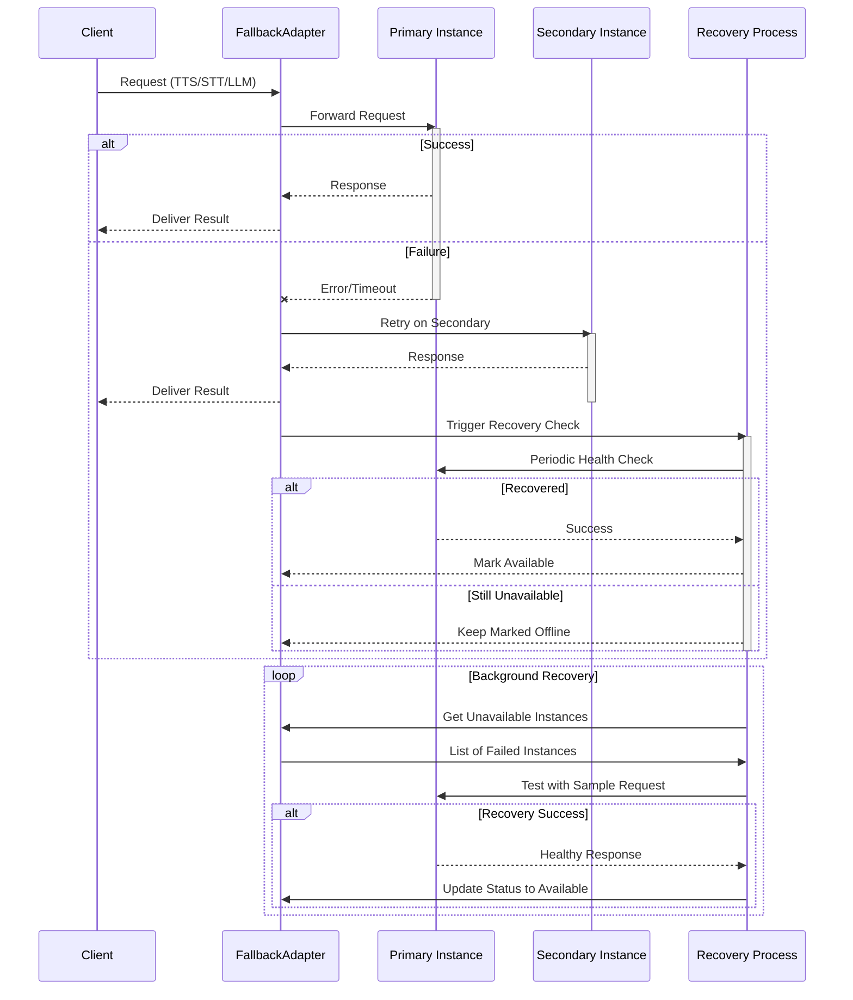

## Fallback Adapters

* Fallback Adapter Source
    * [llm source](https://github.com/livekit/agents/blob/dev-1.0/livekit-agents/livekit/agents/llm/fallback_adapter.py)
    * [stt source](https://github.com/livekit/agents/blob/dev-1.0/livekit-agents/livekit/agents/stt/fallback_adapter.py)
    * [tts source](https://github.com/livekit/agents/blob/dev-1.0/livekit-agents/livekit/agents/tts/fallback_adapter.py)

Utility classes for implementing failover and fallback strategies across speech components.

**fallback adapter's reliability mechanisms :**


### FallbackAdapter Class

```python
class FallbackAdapter(Generic[Service_T]):
    def __init__(
        self,
        primary: Service_T,
        backups: list[Service_T],
        *,
        timeout: float = 2.0,
        max_retries: int = 3,
        health_check_interval: float = 30.0,
    ):
        """
        Args:
            primary: Primary service instance
            backups: Ordered list of backup instances
            timeout: Timeout for service operations
            max_retries: Retry attempts before failing over
            health_check_interval: Interval for checking primary recovery
        """
```

### Key Features

- Automatic failover to backup services on errors
- Health monitoring and primary service reactivation
- Configurable timeouts and retry policies
- Unified interface matching wrapped service APIs

### Supported Services

- [STT](#speech-to-text-stt-implementation)
- [TTS](#text-to-speech-tts-implementation)
- [LLM](#llm-language-model-integration)
- [VAD](#vad-voice-activity-detection)

### Usage Example

```python
from livekit.agents import stt, tts
from livekit.agents.utils import FallbackAdapter

# Configure STT with fallback
primary_stt = stt.DeepgramSTT()
backup_stt = stt.WhisperSTT()
stt_adapter = FallbackAdapter(primary_stt, [backup_stt])

# Configure TTS with fallback  
primary_tts = tts.ElevenLabsTTS()
backup_tts = tts.AzureTTS()
tts_adapter = FallbackAdapter(primary_tts, [backup_tts])

# Use in AgentSession
agent = AgentSession(
    stt=stt_adapter,
    tts=tts_adapter,
    llm=OpenAILlm()
)
```

### Configuration Tips

1. Order backups by cost/performance priority
2. Set timeouts shorter than your quality requirements
3. Monitor failover events via service metrics
4. Use circuit breakers for unhealthy services
5. Combine with retry middleware for robustness

### Best Practices

- Implement health checks for all services
- Log failover events with service identifiers
- Gradually reintroduce recovered primaries
- Track usage metrics per service instance
- Set alerts for frequent failovers
- Test fallback paths regularly

### Monitoring Interface

```python
# Get current active service
active_service = fallback_adapter.active_service

# Get service health status
status = fallback_adapter.get_service_health(primary_stt)
print(f"Primary healthy: {status.healthy}, last error: {status.last_error}")

# Event listeners
fallback_adapter.on_failover = lambda old, new: print(f"Failed over to {new}")
fallback_adapter.on_recovery = lambda svc: print(f"Recovered {svc}")
```

### Error Handling

- Retries transient errors on current service
- Fails over after max_retries exceeded
- Preserves error types from underlying services
- Surfaces service-specific error metadata
- Implements backoff between retry attempts

