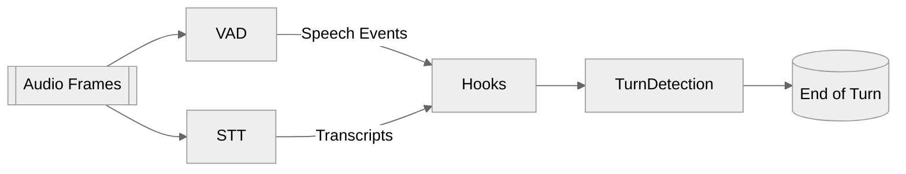
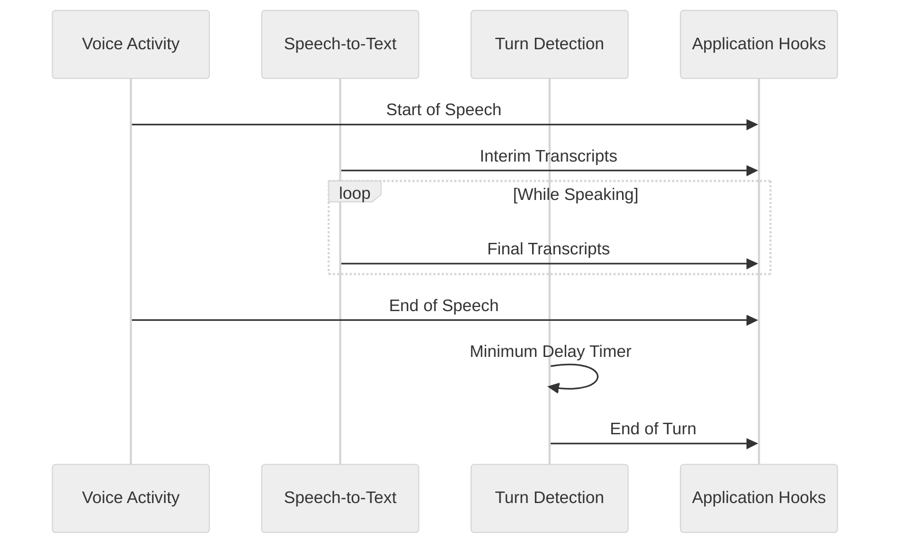
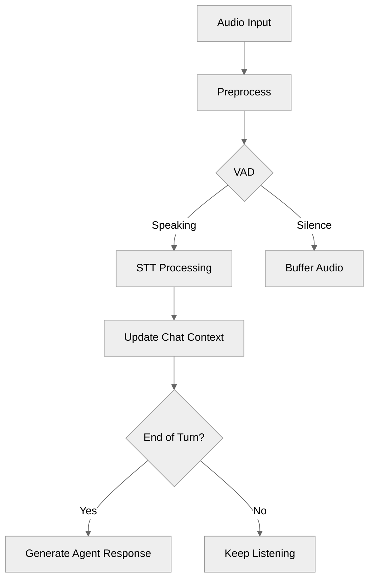

## Audio Recognition Pipeline

[source](https://github.com/livekit/agents/blob/dev-1.0/livekit-agents/livekit/agents/voice/audio_recognition.py)

Core components for converting speech to text and managing conversation flow.

### Overview
The `AudioRecognition` class orchestrates real-time audio processing with three main components:
1. **Speech-to-Text (STT)** - Converts audio to text transcripts
2. **Voice Activity Detection (VAD)** - Identifies speech segments
3. **Turn Detection** - Determines conversation turn boundaries



### Key Components

#### 1. Speech-to-Text (STT) Integration
- Processes audio frames through configured STT engine
- Handles both interim and final transcripts
- Buffers transcripts for conversation context

#### 2. Voice Activity Detection (VAD)
- Monitors audio stream for speech presence
- Triggers `on_start_of_speech`/`on_end_of_speech` events
- Visualizes speech probability in debug tools

#### 3. Turn Detection Logic


### Lifecycle Management
1. **Initialization**
```python
def __init__(
    self,
    *,
    hooks: RecognitionHooks,
    stt: io.STTNode | None,
    vad: vad.VAD | None,
    turn_detector: _TurnDetector | None,
    min_endpointing_delay: float,
)
```

2. **Runtime Control**
```python
def start(self) -> None  # Start processing
def stop(self) -> None   # Stop processing
def push_audio(self, frame: rtc.AudioFrame) -> None  # Feed audio data
```

3. **Cleanup**
```python
async def aclose(self) -> None  # Graceful shutdown
```

### Implementing Hooks with Decorators
While the core class uses protocol-based hooks, you can implement them with decorators in your application layer:

```python
from livekit.agents.voice import RecognitionHooks

class MyAgentHooks:
    def __init__(self):
        self.chat_history = llm.ChatContext()
    
    @RecognitionHooks.on_start_of_speech
    def _on_speech_start(self, ev: vad.VADEvent) -> None:
        self._show_ui_indicator(True)

    @RecognitionHooks.on_interim_transcript
    def _update_captions(self, ev: stt.SpeechEvent) -> None:
        self._display_text(ev.alternatives[0].text)

    @RecognitionHooks.on_end_of_turn
    async def _handle_response(self, transcript: str) -> None:
        response = await self.llm.generate_response(transcript)
        self._speak(response)

    @RecognitionHooks.retrieve_chat_ctx
    def _get_chat_context(self) -> llm.ChatContext:
        return self.chat_history.copy()
```


### Configuration Tips
```python
# Example initialization
recognition = AudioRecognition(
    hooks=MyRecognitionHooks(),
    stt=GoogleSTT(),
    vad=WebRTCVAD(),
    turn_detector=LLMTurnDetector(),
    min_endpointing_delay=1.0
)
```

| Parameter               | Description                                                                 |
|-------------------------|-----------------------------------------------------------------------------|
| `min_endpointing_delay` | Minimum wait time after speech before considering turn end (seconds)        |
| `UNLIKELY_END_OF_TURN_EXTRA_DELAY` | Additional delay if turn detection confidence is low                      |
| `stt`/`vad`             | Plugable modules for speech processing                                      |

### Common Use Cases
1. Real-time conversation transcription
2. Voice-controlled interface timing
3. Adaptive response timing based on speech patterns
4. Debugging audio processing pipelines



