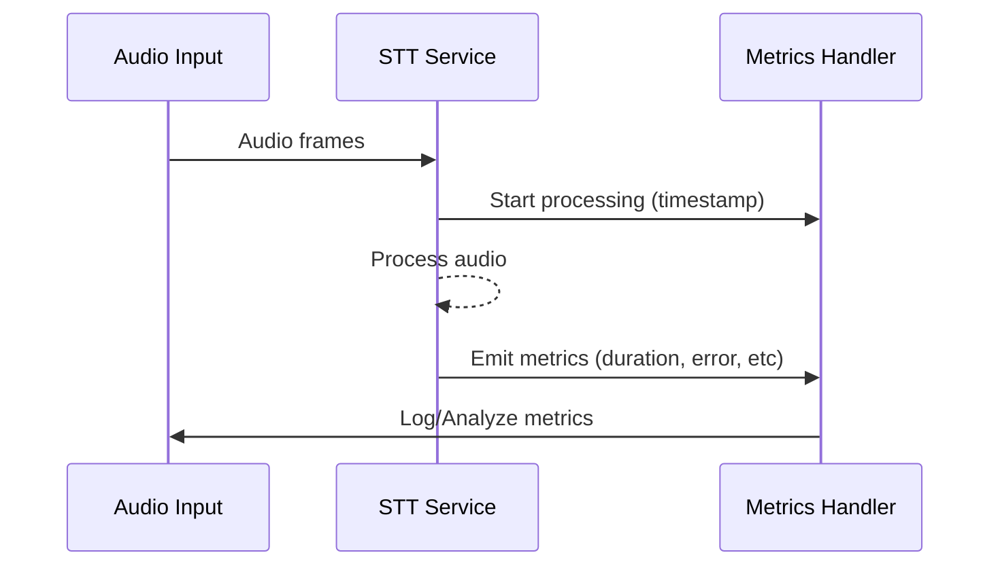

## Speech-to-Text (STT) Implementation

[source](https://github.com/livekit/agents/blob/dev-1.0/livekit-agents/livekit/agents/stt/stt.py)

### Core STT Interface

```python
class STT(ABC):
    @abstractmethod
    async def recognize(self, buffer: AudioBuffer, language: str | None = None) -> SpeechEvent:
        """Process audio buffer and return transcription"""

    @abstractmethod
    def stream(self, language: str | None = None) -> RecognizeStream:
        """Create streaming recognition session"""
```

**Note:** VAD is required when streaming is not supported by the STT plugin. Example: `vad=silero.VAD.load()`


#### Speech Data Structure
```python
@dataclass
class SpeechData:
    text: str             # Recognized text
    confidence: float     # Confidence score [0-1]
    language: str         # Detected language
    start_time: float     # Audio start timestamp
    end_time: float       # Audio end timestamp
```

#### Recognition Events
```python
class SpeechEventType(Enum):
    START_OF_SPEECH = "start_of_speech"
    INTERIM_TRANSCRIPT = "interim_transcript" 
    FINAL_TRANSCRIPT = "final_transcript"
    END_OF_SPEECH = "end_of_speech"
```

### Streaming Recognition
```python
class RecognizeStream:
    def push_frame(self, frame: rtc.AudioFrame) -> None:
        """Add audio frame to processing stream"""

    async def __anext__(self) -> SpeechEvent:
        """Get next recognition event"""

    async def aclose(self) -> None:
        """Close stream immediately"""
```

### Fallback Adapter Implementation

Provides automatic failover between multiple STT providers:

```python
class FallbackAdapter(STT):
    def __init__(
        self,
        stt_instances: list[STT],
        *,
        attempt_timeout: float = 10.0,
        max_retries: int = 1,
        retry_interval: float = 5
    ):
    """
    Args:
        stt_instances: Ordered list of STT providers
        attempt_timeout: Per-provider attempt timeout
        max_retries: Max retries per provider
        retry_interval: Delay between retry attempts
    """
```

#### Usage Example
```python
primary_stt = DeepgramSTT()
backup_stt = WhisperSTT()
fallback_stt = FallbackAdapter([primary_stt, backup_stt])

# Will automatically failover if primary fails
result = await fallback_stt.recognize(audio_buffer)
```

### Stream Adapter Implementation

Enables streaming for non-streaming STT using VAD:

```python
class StreamAdapter(STT):
    def __init__(self, stt: STT, vad: VAD):
        """
        Args:
            stt: Non-streaming STT to wrap
            vad: Voice activity detector
        """
```

#### Processing Flow
1. Uses VAD to detect speech segments
2. Accumulates audio frames during speech
3. Sends full segments to STT when speech ends
4. Emits final transcriptions

### Best Practices

1. Use FallbackAdapter for production-critical systems
2. Set appropriate timeouts based on network conditions
3. Monitor STT metrics for accuracy/latency tradeoffs
4. Combine streaming and non-streaming STT strategically
5. Implement audio preprocessing (noise reduction, normalization)

### Configuration Guide

| Parameter          | Recommendation          | Purpose                          |
|--------------------|--------------------------|----------------------------------|
| `attempt_timeout`  | 5-15 seconds             | Balance responsiveness vs costs  |
| `max_retries`      | 1-3 attempts             | Reduce cascading failures        |
| `retry_interval`   | 2-5 seconds              | Allow transient issue resolution |
| `vad_threshold`    | 0.3-0.7                  | Tune speech sensitivity          |
| `language`         | "en-US"/"auto"           | Multilingual support             |

### Advanced Features

- **Audio Resampling**: Automatic sample rate conversion
- **Batched Processing**: Optimize for high-throughput scenarios
- **Confidence Filtering**: Reject low-confidence transcripts
- **Language Detection**: Automatic language identification
- **Custom Dictionaries**: Boost domain-specific terminology

### STT Metrics Collection

```python
class STTMetrics:
    type: str = "stt_metrics"
    label: str              # STT provider identifier (e.g. "deepgram.STT")
    request_id: str         # Unique recognition identifier
    timestamp: float        # Unix timestamp of metric creation
    duration: float         # Total processing time in seconds
    audio_duration: float   # Length of audio processed in seconds
    streamed: bool          # Whether metrics came from streaming API
    error: str | None       # Error message if recognition failed
```

#### Key Metrics Fields

| Field | Description |
|-------|-------------|
| `audio_duration` | Actual duration of audio processed |
| `duration` | Total processing time from request to response |
| `streamed` | True for streaming recognitions, False for single-shot |
| `error` | Error message if recognition failed |

#### Example Usage

```python
from livekit.agents.metrics import STTMetrics

class AlloyTask(Agent):
    """
    This is a basic example that demonstrates the use of STT metrics.
    """
    def __init__(self) -> None:
        llm = openai.LLM(model="gpt-4o-mini")
        stt = deepgram.STT()
        tts = cartesia.TTS()
        super().__init__(
            instructions="You are Echo.",
            stt=stt,
            llm=llm,
            tts=tts
        )
        
        # Wrap async handler in sync function
        def sync_wrapper(metrics: STTMetrics):
            asyncio.create_task(self.on_metrics_collected(metrics))
            
        stt.on("metrics_collected", sync_wrapper)

    async def on_metrics_collected(self, metrics: STTMetrics) -> None:
        logger.info("STT Metrics Collected:")
        logger.info(f"\tType: {metrics.type}")
        logger.info(f"\tLabel: {metrics.label}")
        logger.info(f"\tRequest ID: {metrics.request_id}")
        logger.info(f"\tTimestamp: {metrics.timestamp}")
        logger.info(f"\tDuration: {metrics.duration:.4f}s")
        logger.info(f"\tSpeech ID: {metrics.speech_id}")
        logger.info(f"\tError: {metrics.error}")
        logger.info(f"\tStreamed: {metrics.streamed}")
        logger.info(f"\tAudio Duration: {metrics.audio_duration:.4f}s")
```

#### Metrics Flow Diagram



Key points:
1. Metrics are emitted after each recognition request
2. Streamed recognitions emit multiple metrics events
3. Error field helps diagnose recognition failures
4. Duration/audio_duration ratio shows processing efficiency

