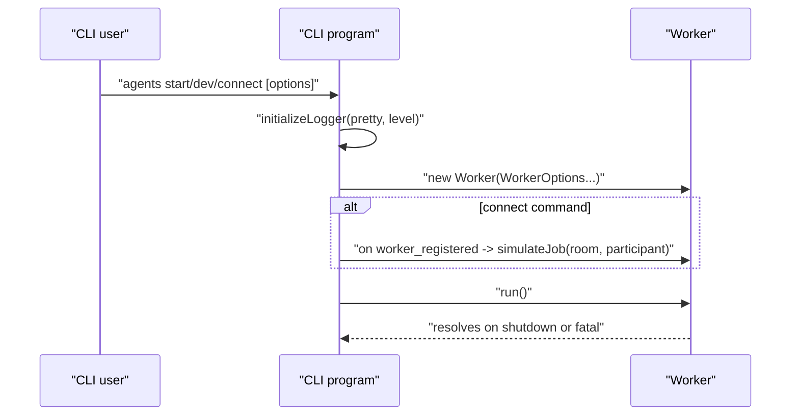

### CLI: agents/src/cli.ts

This document explains the LiveKit Agents CLI: commands, options, environment variables, signal handling, and how it boots a `Worker`.

#### Purpose

Provide a developer- and production-friendly interface to start a worker, run in dev mode, connect to a specific room (simulate a job), and download plugin files.

#### Commands

- `start`
  - Runs the worker in production mode.
  - Honors global options and env vars.

- `dev`
  - Runs the worker in development mode (debug logging by default).

- `connect --room <string> [--participant-identity <string>]`
  - Starts a worker in dev mode and, after registration, simulates a job by connecting to the specified room (and optional participant identity) via `Worker.simulateJob`.

- `download-files`
  - Initializes logging and invokes `Plugin.registeredPlugins[i].downloadFiles()` in sequence, logging per-plugin success/failure.

#### Global options and environment variables

- `--log-level <level>`: one of `trace`, `debug`, `info`, `warn`, `error`, `fatal` (env: `LOG_LEVEL`).
- `--url <string>`: LiveKit WebSocket URL (env: `LIVEKIT_URL`).
- `--api-key <string>`: LiveKit API key (env: `LIVEKIT_API_KEY`).
- `--api-secret <string>`: LiveKit API secret (env: `LIVEKIT_API_SECRET`).
- `--worker-token <string>`: Cloud-only internal token (env: `LIVEKIT_WORKER_TOKEN`, hidden in help).

Notes:
- Options supplied on the command line override the values in `WorkerOptions` passed to `runApp`.
- The `production` flag inside `WorkerOptions` is explicitly overridden by the selected command (`start` vs `dev`).

#### Boot flow



#### Signals and shutdown behavior

- `SIGINT` (Ctrl+C)
  - First signal: logs receipt; in production, calls `worker.drain()`; then `worker.close()` and exits with code `130`.
  - Second `SIGINT`: force-exits with code `130`.

- `SIGTERM`
  - Logs receipt; in production, calls `worker.drain()`; then `worker.close()` and exits with code `143`.

- Errors in `worker.run()`
  - Logs fatal and exits with code `1`.

#### Integration with WorkerOptions

`runApp(opts: WorkerOptions)` wires the CLI to the worker. The command handlers overwrite these fields from CLI/env when provided:
- `wsURL`, `apiKey`, `apiSecret`, `logLevel`, and optionally `workerToken`.

Example:

```ts
import { runApp } from 'agents/src/cli.js';
import { WorkerOptions } from 'agents/src/worker.js';

runApp(new WorkerOptions({
  agent: new URL('./agent.js', import.meta.url).pathname,
  agentName: 'my-agent',
  production: false, // command will override
}));
```

#### Typical invocations

- Production server:
  - `pnpm -w agents start --url wss://PROJECT.livekit.cloud --api-key ... --api-secret ... --log-level info`

- Local development:
  - `pnpm -w agents dev --url ws://localhost:7880 --api-key devkey --api-secret devsecret --log-level debug`

- Connect to a room for quick testing:
  - `pnpm -w agents connect --room demo --participant-identity alice --url ws://localhost:7880 --api-key dev --api-secret dev`

- Download plugin assets:
  - `pnpm -w agents download-files`

#### Known notes and minor issues

- Help fallback: If run with no subcommand and not from the job child, `program.help()` is shown.
- Typo: a comment says "overriddden"; cosmetic only.
- `download-files` runs all plugin downloads sequentially; parallelization could improve speed.


