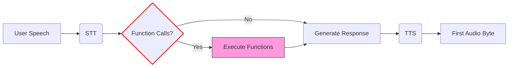
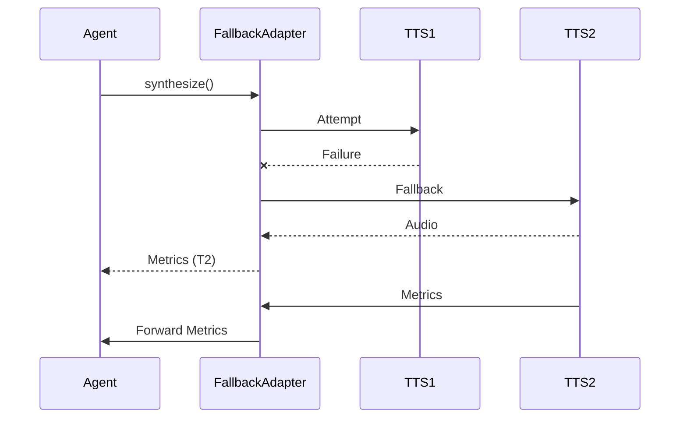
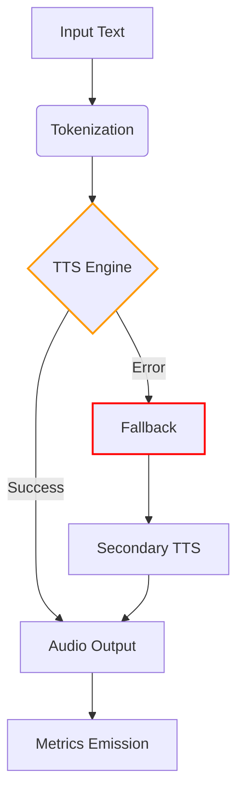

## Text-to-Speech (TTS) Implementation

[source](https://github.com/livekit/agents/blob/dev-1.0/livekit-agents/livekit/agents/tts/tts.py)

### Core TTS Interface

```python
class TTS(ABC):
    @abstractmethod
    def synthesize(self, text: str) -> ChunkedStream:
        """Convert text to audio (non-streaming)"""

    @abstractmethod
    def stream(self) -> SynthesizeStream:
        """Create real-time synthesis stream"""
```

#### Synthesized Audio Structure
```python
@dataclass
class SynthesizedAudio:
    frame: rtc.AudioFrame  # Audio data
    request_id: str        # Unique request identifier
    is_final: bool         # Marks end of audio segment
    segment_id: str        # Grouping ID for multi-part responses
    delta_text: str        # Text chunk being synthesized
```

### Streaming Implementation
```python
class SynthesizeStream:
    def push_text(self, token: str) -> None:
        """Add text incrementally"""

    def flush(self) -> None:
        """Mark end of current segment"""
        
    async def __anext__(self) -> SynthesizedAudio:
        """Get next audio chunk"""
```

### Fallback Adapter Implementation

Ensures continuous TTS service with automatic failover:

```python
class FallbackAdapter(TTS):
    def __init__(
        self,
        tts_instances: list[TTS],
        *,
        attempt_timeout: float = 10.0,
        max_retries: int = 1,
        no_fallback_after: float = 3.0
    ):
        """
        Args:
            tts_instances: Ordered list of TTS providers
            attempt_timeout: Per-provider attempt timeout
            max_retries: Retries per provider before failing over
            no_fallback_after: Disable fallback after X seconds of audio
        """
```

#### Usage Example
```python
primary_tts = ElevenLabsTTS()
backup_tts = AzureTTS()
fallback_tts = FallbackAdapter([primary_tts, backup_tts])

# Automatically fails over if primary fails
async for audio in fallback_tts.synthesize("Hello world"):
    play_audio(audio.frame)
```

### Stream Adapter Implementation

Enables real-time streaming for non-streaming TTS:

```python
class StreamAdapter(TTS):
    def __init__(
        self, 
        tts: TTS,
        tokenizer: SentenceTokenizer
    ):
        """
        Args:
            tts: Non-streaming TTS to wrap
            tokenizer: Splits text into synthesis chunks
        """
```

#### Processing Flow:
1. Accepts incremental text input
2. Splits text into sentences using tokenizer
3. Synthesizes sentences sequentially
4. Emits audio chunks in real-time

### Key Configuration Parameters

| Parameter          | Default  | Description                          |
|--------------------|----------|--------------------------------------|
| `attempt_timeout`  | 10s      | Timeout per synthesis attempt        |
| `max_retries`      | 1        | Retries before switching providers   |
| `no_fallback_after`| 3s       | Minimum audio to prevent fallback    |
| `sample_rate`      | 24000    | Target output sample rate            |
| `num_channels`     | 1        | Mono/stereo output                   |

### Best Practices

1. Use FallbackAdapter with geographically distributed providers
2. Set no_fallback_after to 2-3 seconds for natural voice continuity
3. Monitor TTFB (Time-to-First-Byte) for latency optimization
4. Implement audio caching for frequently used phrases
5. Use sentence tokenization for natural speech pacing
6. Combine with acoustic echo cancellation in voice interfaces

### Advanced Features

- **Audio Resampling**: Automatic sample rate conversion
- **Multi-voice Support**: Dynamic voice selection per request
- **Prosody Control**: SSML markup for pitch/rate adjustments  
- **Phoneme Alignment**: Word-level timing metadata
- **Emotion Modeling**: Expressive speech synthesis
- **Multilingual Synthesis**: Automatic language detection

### Monitoring Metrics

[source](https://github.com/livekit/agents/blob/dev-1.0/livekit-agents/livekit/agents/metrics/base.py)

| Metric             | Description                          | Alert Threshold    | Function Calling Impact          |
|--------------------|--------------------------------------|--------------------|-----------------------------------|
| TTFB (Time to First Byte) | Total latency from request start to first audio chunk | >1500ms | Each function call adds 200-500ms per iteration |

### Detailed TTFB Breakdown

TTFB measures the total time from when:
1. User speech is detected (VAD START event)
2. Through complete processing pipeline:
   - STT transcription
   - LLM processing (including function executions)
   - TTS synthesis
3. Until first audio frame is emitted

See [Core Metrics](#core-metrics) for detailed break dowan of calcualtion.

### Key Components Affecting TTFB

1. **STT Latency**: Time to convert speech to text
2. **LLM Processing**: 
   - Initial response generation
   - Function execution time (cumulative across calls)
   - Result processing after function returns
3. **TTS Latency**: Time to generate first audio chunk

### Optimization Strategies

1. **Parallel Function Execution** (when safe):
```python
@ai_function
async def get_weather(ctx):
    # Execute I/O operations concurrently
    forecast, news = await asyncio.gather(
        fetch_forecast(ctx.values["location"]),
        fetch_weather_news()
    )
    return f"{forecast}. {news}"
```

2. **Caching Frequent Requests:**
```python
from functools import lru_cache

@lru_cache(maxsize=100)
def cached_search(query: str) -> dict:
    return expensive_search_operation(query)
```

3. **TTFB Budget Allocation:**
```python
# Recommended time distribution
TTFB_BUDGET = {
    "stt": 0.3,    # 30%
    "llm": 0.5,    # 50% 
    "tts": 0.2     # 20%
}
```

4. **Streaming Optimization:**
```python
async with llm.chat(...) as stream:
    first_chunk = await stream.__anext__()
    # Start TTS synthesis immediately on first text chunk
    tts_stream.push_text(first_chunk.text)
```

### Function Calling Specifics

1. **Cold Start Penalty** - First function call in a chain adds 100-300ms extra latency
2. **Sequential Calls** - Each subsequent function adds its full duration to TTFB
3. **Network Calls** - External API calls dominate TTFB (60-80% of total)

**Monitoring Recommendations:**
```python
# Track function execution times
def log_function(fn):
    async def wrapper(ctx):
        start = time.monotonic()
        try:
            return await fn(ctx)
        finally:
            duration = time.monotonic() - start
            ctx.agent.emit("fnc_metrics", {"name": fn.__name__, "duration": duration})
    return wrapper

@log_function
@ai_function
async def example_function(ctx):
    ...
```

### Threshold Guidance

| Scenario              | Recommended Max TTFB | Function Call Allowance       |
|-----------------------|-----------------------|-------------------------------|
| Real-time conversation| 1200ms                | 1-2 fast functions (<200ms)   |
| Complex workflows     | 2500ms                | 3-5 functions with caching    |
| Batch processing      | 5000ms                | Unlimited with async streaming|

### Cross-Component Impact

1. **STT** - Faster transcription reduces LLM start delay
2. **LLM** - Model size vs speed tradeoff directly affects TTFB
3. **TTS** - Streaming synthesis can mask latency after first chunk



### TTS Metrics Implementation

```python
from livekit.agents.metrics import TTSMetrics

class TTSMetrics:
    type: str = "tts_metrics"
    label: str            # Provider identifier (e.g. "cartesia.TTS")
    request_id: str       # Unique synthesis request ID
    timestamp: float      # Unix timestamp of metric creation
    ttfb: float           # Time-to-first-byte latency in seconds
    duration: float       # Total processing duration
    audio_duration: float # Output audio length in seconds  
    characters_count: int # Number of input characters
    streamed: bool        # Whether using streaming API
    cancelled: bool       # If request was cancelled
    error: str | None     # Error message if failed
```

### Metrics Collection Example

```python
class AlloyTask(AgentTask):
    """
    This is a basic example that demonstrates the use of TTS metrics.
    """
    def __init__(self) -> None:
        llm = openai.LLM(model="gpt-4o-mini")
        stt = deepgram.STT()
        tts = cartesia.TTS()
        super().__init__(
            instructions="You are Alloy, a helpful assistant.",
            stt=stt,
            llm=llm,
            tts=tts
        )
        
        # Wrap async handler in sync function
        def sync_wrapper(metrics: TTSMetrics):
            asyncio.create_task(self.on_metrics_collected(metrics))
            
        tts.on("metrics_collected", sync_wrapper)

    async def on_metrics_collected(self, metrics: TTSMetrics) -> None:
        logger.info("TTS Metrics Collected:")
        logger.info(f"\tType: {metrics.type}")
        logger.info(f"\tLabel: {metrics.label}")
        logger.info(f"\tRequest ID: {metrics.request_id}")
        logger.info(f"\tTimestamp: {metrics.timestamp}")
        logger.info(f"\tTTFB: {metrics.ttfb:.4f}s")
        logger.info(f"\tDuration: {metrics.duration:.4f}s")
        logger.info(f"\tAudio Duration: {metrics.audio_duration:.4f}s")
        logger.info(f"\tCancelled: {metrics.cancelled}")
        logger.info(f"\tCharacters Count: {metrics.characters_count}")
        logger.info(f"\tStreamed: {metrics.streamed}")
        logger.info(f"\tSpeech ID: {metrics.speech_id}")
        logger.info(f"\tError: {metrics.error}")
```

### Metrics Flow with Adapters



Key behaviors:
1. **FallbackAdapter** emits metrics from the active TTS provider
2. **StreamAdapter** forwards metrics from the wrapped TTS
3. Metrics include adapter-specific `label` for origin tracking
4. `streamed` field indicates real-time streaming usage

### Best Practices for Metrics

1. **Monitor Key Ratios**:
   ```python
   # Ideal TTFB < 1.5s, Duration/Audio < 2.0
   if metrics.ttfb > 1.5:
       logger.warning("High synthesis latency")
   
   if metrics.duration / metrics.audio_duration > 3.0:
       logger.error("Inefficient TTS processing")
   ```

2. **Error Handling**:
   ```python
   async def on_metrics_collected(self, metrics: TTSMetrics):
       if metrics.error:
           if "rate limit" in metrics.error:
               await self._switch_tts_provider()
           elif "connection" in metrics.error:
               self._check_network_status()
   ```

3. **Adapter-Specific Tracking**:
   ```python
   def _handle_tts_metrics(self, metrics: TTSMetrics):
       if "FallbackAdapter" in metrics.label:
           self._track_fallback_usage(metrics)
       elif "StreamAdapter" in metrics.label: 
           self._monitor_stream_efficiency(metrics)
   ```

### Configuration Additions

| Parameter          | Default | Purpose                          |
|--------------------|---------|----------------------------------|
| `max_ttfb`         | 2000ms  | Alert threshold for first chunk  |
| `min_audio_ratio`  | 0.8     | Minimum audio/input duration     |
| `error_window`     | 5       | Errors per minute before disable |

### Full Synthesis Flow



Key additions:
1. Clear TTSMetrics class documentation
2. Practical usage example with error handling
3. Adapter behavior visualization
4. Metrics-driven best practices
5. Configuration guidance for monitoring
6. Full system flow diagram
