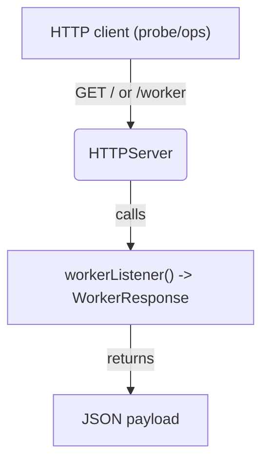
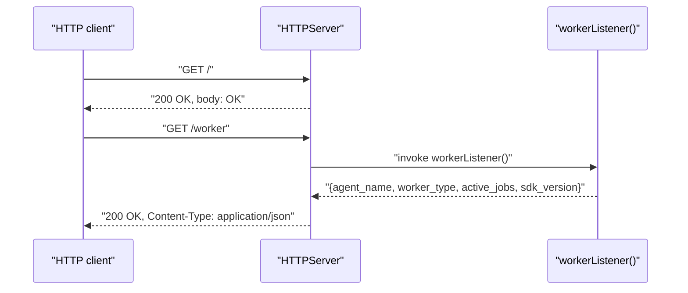

### HTTPServer architecture and usage

This document covers `agents/src/http_server.ts`, which exposes health and worker info endpoints for process-level monitoring and discovery.

#### Purpose

Provide a tiny HTTP surface for:
- Health checks for orchestration (readiness/liveness).
- A JSON snapshot of worker metadata (agent name, worker type, active jobs, SDK version).

#### High-level architecture



#### Endpoints

- `GET /`
  - Returns `200 OK` with body `OK`.
- `GET /worker`
  - Returns `200 OK` with JSON from the injected `workerListener()` callback.
  - Shape:
    - `agent_name: string`
    - `worker_type: string`
    - `active_jobs: number`
    - `sdk_version: string`
- Any other path: `404 Not Found`.

#### API

- Constructor: `new HTTPServer(host: string, port: number, workerListener: () => WorkerResponse)`
  - `host`: interface to bind (e.g., `0.0.0.0`).
  - `port`: port to listen on.
  - `workerListener`: function that returns a serializable `WorkerResponse` snapshot.
- `run(): Promise<void>`
  - Starts listening and logs the bound port.
- `close(): Promise<void>`
  - Stops the server.

#### Typical usage and integration

The worker constructs and owns the HTTP server, passing a listener that captures live state:

```ts
import { HTTPServer } from "agents/src/http_server.js";

const http = new HTTPServer(host, port, () => ({
  agent_name: opts.agentName,
  worker_type: JobType[opts.workerType],
  active_jobs: procPool.processes.filter((p) => p.runningJob).length,
  sdk_version: version,
}));

await http.run();
// later ...
await http.close();
```

#### Request/response flow



#### Operational notes

- Bind address/port are controlled by the `WorkerOptions` passed to the worker.
- In development, the port may be zero (ephemeral); consult logs for the actual port.
- Health and info are intentionally simple; it’s fine to front this with a reverse proxy.

#### Known shortcomings and probable bugs

- Content-Type header typo
  - The code sets `Contet-Type` instead of `Content-Type` for `/worker`. Clients may not treat the body as JSON. Fix: `res.writeHead(200, { 'Content-Type': 'application/json' });`.

- Lack of method checks
  - All HTTP methods are treated the same. Consider restricting to `GET` and returning `405 Method Not Allowed` for others.

- No error handling around `workerListener()`
  - If the callback throws, the request may hang or return a partial response. Wrap in try/catch and return `500`.

- No CORS headers
  - If consumed from browser contexts, add appropriate CORS headers.

- Security exposure
  - Defaults may bind to `0.0.0.0`. Ensure this surface is protected if deployed on public networks.

- TypeScript/node typings
  - Uses `node:http`; make sure `@types/node` is installed and `tsconfig` includes `"types": ["node"]` to avoid linter errors.


