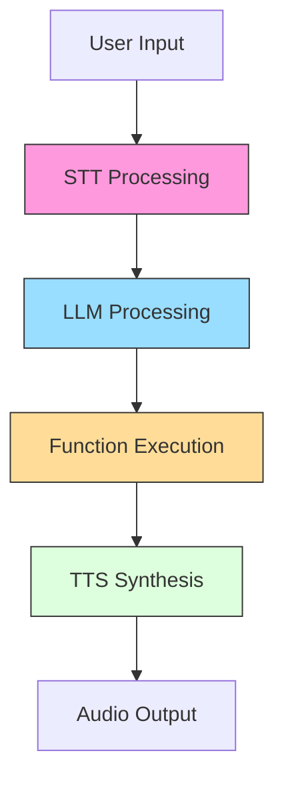
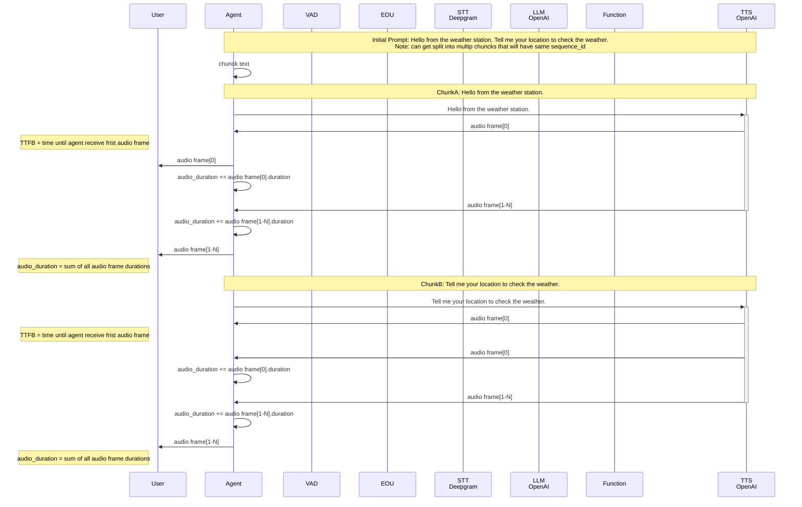
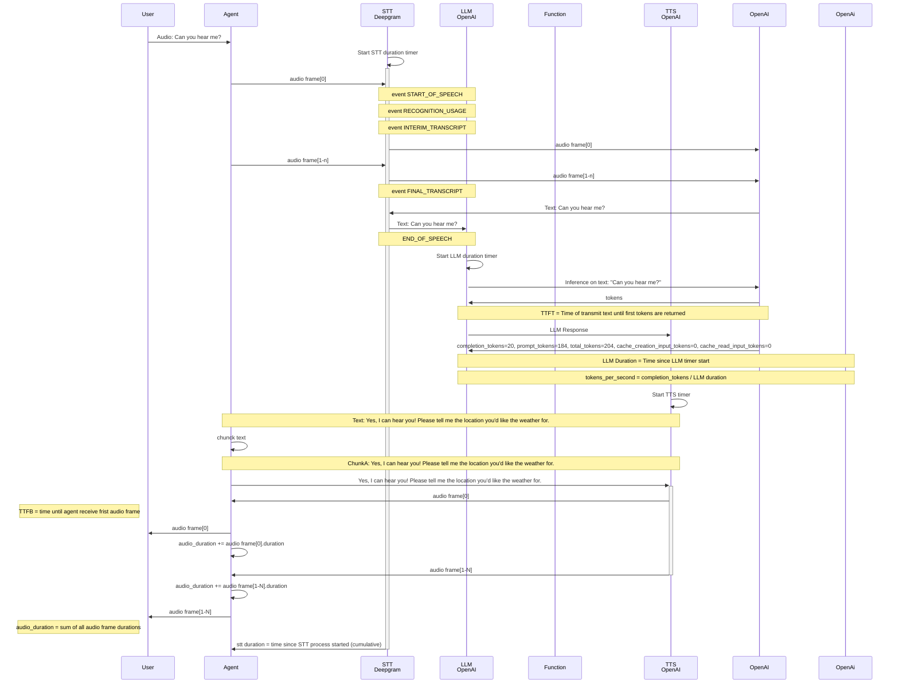

## Performance Monitoring & Metrics

The framework provides detailed performance metrics collected through utility modules. All metrics are measured in milliseconds unless otherwise specified.

### Core Metrics

| Metric | Calculation | Description | Impact Factors |
|--------|-------------|-------------|----------------|
| **STT Latency** | `transcript_end - audio_start` | Full speech-to-text conversion time | Audio length, model complexity |
| **TTFB (Time to First Byte)** | `first_audio_frame_time - text_start` | TTS response initiation delay | text length, model complexity  |
| **TTFT (Time to First Token)** | `first_token_time - llm_start` | LLM response initiation delay | Model size, context length |

### Metric Visualization

```mermaid
gantt
    title End-to-End Processing Timeline
    dateFormat  X
    axisFormat %s
    section Components
    STT Processing : 0, 1500
    LLM Processing : 1500, 3000
    TTS Synthesis : 3000, 4500
```

### Initial Prompt Metrics Example

This example breaks down what metrics are calculated during the initial prompt when someone joins the room that says:  

`Initial Prompt: Hello from the weather station. Tell me your location to check the weather.`

The text is chunked into two parts and sent to TTS.

## Metrics Round Trip (no function call)

This example breaks down what metrics are calculated during a user request and the response they hear.

**User:** `Can you hear me?`
**Reponse:** `Yes, I can hear you! Please tell me the location you'd like the weather for.`

### Best Practices

1. Monitor P90/P95 values instead of averages
2. Set component-specific alert thresholds
3. Correlate metrics with business KPIs
4. Retain historical data for trend analysis
5. Implement metric sampling in high-volume systems
6. Use dimensional tagging for advanced filtering
7. Combine with distributed tracing for debugging

This section should be added after the [Error Handling Strategies](#error-handling-strategies) section in the API guide.

