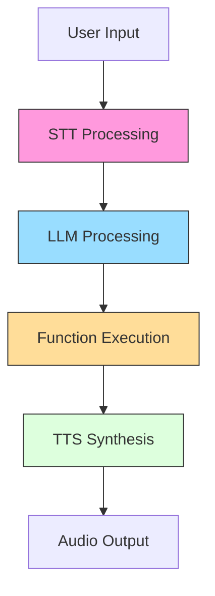

## Performance Monitoring & Metrics

The framework provides detailed performance metrics collected through utility modules. All metrics are measured in milliseconds unless otherwise specified.



### Core Metrics

| Metric | Calculation | Description | Impact Factors |
|--------|-------------|-------------|----------------|
| **STT Latency** | `transcript_end - audio_start` | Full speech-to-text conversion time | Audio length, model complexity |
| **TTFT (Time to First Token)** | `first_token_time - llm_start` | LLM response initiation delay | Model size, context length |
| **TTLT (Time to Last Token)** | `last_token_time - llm_start` | Complete LLM response generation | Response length, model throughput |
| **TTS Latency** | `first_audio_time - tts_start` | Text-to-speech synthesis delay | Voice complexity, streaming setup |
| **Function Execution** | `fnc_end - fnc_start` | AI function processing duration | Network I/O, computation intensity |
| **End-to-End Latency** | `output_start - input_start` | Total pipeline processing time | All component efficiencies |
| **Error Rate** | `(errors / total_requests) * 100` | Failure percentage per component | Service stability, error handling |

### Metric Collection Implementation

```python
# Simplified metric tracking implementation
class MetricTracker:
    def __init__(self):
        self.metrics = defaultdict(list)
        
    def record(self, name: str, value: float):
        self.metrics[name].append(value)
        
    def get_stats(self, name: str) -> dict:
        values = self.metrics.get(name, [])
        return {
            "avg": np.mean(values),
            "p90": np.percentile(values, 90),
            "count": len(values)
        }

# Usage in processing pipeline
async def stt_wrapper(audio_stream):
    start = time.monotonic()
    result = await stt.process(audio_stream)
    utils.metrics.record("stt_latency", time.monotonic() - start)
    return result
```

### Monitoring Best Practices

1. **Alert Thresholds**
```python
# Example alert configuration
ALERT_RULES = {
    "stt_latency": {"warning": 1500, "critical": 2500},
    "ttft": {"warning": 2000, "critical": 3500},
    "error_rate": {"warning": 5.0, "critical": 10.0}
}
```

2. **Dashboard Implementation**
```python
# Sample metrics export for monitoring systems
def export_metrics():
    return {
        "stt": {
            "latency": utils.metrics.get_stats("stt_latency"),
            "error_rate": utils.error_counter.get_rate("stt")
        },
        "llm": {
            "ttft": utils.metrics.get_stats("ttft"),
            "token_rate": utils.metrics.get_stats("tokens_per_sec")
        }
    }
```

3. **Performance Optimization**
```python
# Identify slowest components
def analyze_bottlenecks():
    stats = {
        "stt": utils.metrics.get_stats("stt_latency")["p90"],
        "llm": utils.metrics.get_stats("ttft")["p90"],
        "tts": utils.metrics.get_stats("tts_latency")["p90"]
    }
    return max(stats, key=stats.get)
```

### Specialized Metrics

1. **Streaming Metrics**
```python
# Real-time throughput calculation
class ThroughputCalculator:
    def __init__(self):
        self.token_count = 0
        self.start_time = None
        
    def update(self, tokens: int):
        if not self.start_time:
            self.start_time = time.monotonic()
        self.token_count += tokens
        
    @property
    def tokens_per_sec(self):
        return self.token_count / (time.monotonic() - self.start_time)
```

2. **Concurrency Metrics**
```python
# Track parallel processing capacity
class ConcurrencyTracker:
    def __init__(self):
        self.active_tasks = 0
        self.peak_tasks = 0
        
    def task_start(self):
        self.active_tasks += 1
        self.peak_tasks = max(self.peak_tasks, self.active_tasks)
        
    def task_end(self):
        self.active_tasks -= 1
```

### Metric Visualization

```mermaid
gantt
    title End-to-End Processing Timeline
    dateFormat  X
    axisFormat %s
    section Components
    STT Processing : 0, 1500
    LLM Processing : 1500, 3000
    TTS Synthesis : 3000, 4500
```



### Best Practices

1. Monitor P90/P95 values instead of averages
2. Set component-specific alert thresholds
3. Correlate metrics with business KPIs
4. Retain historical data for trend analysis
5. Implement metric sampling in high-volume systems
6. Use dimensional tagging for advanced filtering
7. Combine with distributed tracing for debugging

This section should be added after the [Error Handling Strategies](#error-handling-strategies) section in the API guide.

