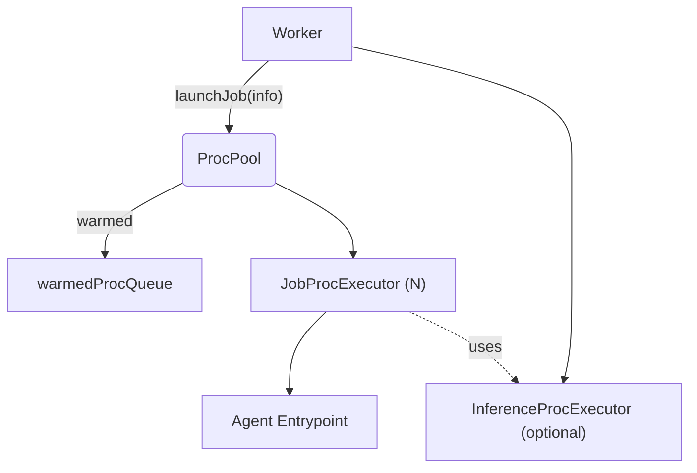
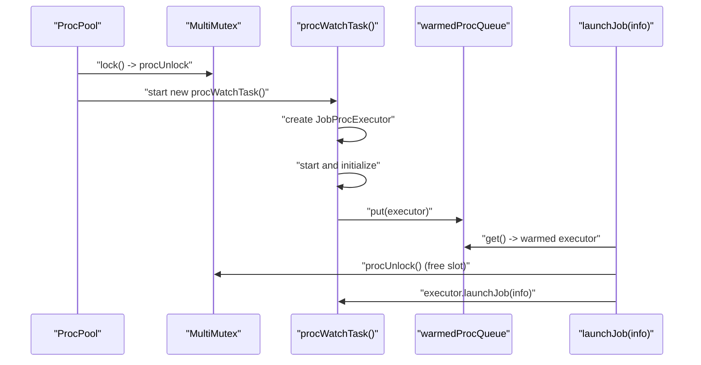

### ProcPool architecture and usage

This document explains `agents/src/ipc/proc_pool.ts` — the process pool that pre-warms and manages `JobProcExecutor` instances for running agent jobs.

#### Purpose

`ProcPool` provides:
- Pre-warmed executors to reduce job startup latency.
- A concurrency cap on warmed processes via `MultiMutex`.
- A queue (`warmedProcQueue`) from which ready executors are drawn when jobs arrive.
- On-demand executor creation when no pool is configured.

#### High-level architecture

#### Concurrency model

- When `numIdleProcesses > 0`, a `MultiMutex` of size `numIdleProcesses` limits the number of warmed executors.
- `run(signal)` loops: acquires one `MultiMutex` slot, spawns `procWatchTask()` which prepares a warmed executor and puts it into `warmedProcQueue`. The unlock handle is stored in `procUnlock` and is only released when a warmed executor is actually consumed by `launchJob()`.
- If initialization fails, the slot is immediately released to avoid deadlock.

#### Operations

- `start()`
  - Starts the background warming loop if a pool size was configured.

- `procWatchTask()`
  - Creates a new `JobProcExecutor` and pushes it into `executors`.
  - Serializes initialization via `initMutex` to avoid contention during startup.
  - If not closed, starts and initializes the executor.
  - On success, puts the executor into `warmedProcQueue`.
  - On init failure, releases the reserved pool slot (`procUnlock`) if present.
  - Waits for the executor to finish (`join()`), then removes it from `executors`.

- `launchJob(info)`
  - If a pool exists: waits for a warmed executor from `warmedProcQueue`; after obtaining it, releases the reserved pool slot (`procUnlock`) so the warming loop can prepare another one; launches the job on that executor.
  - If no pool: constructs a fresh `JobProcExecutor`, starts, initializes, and launches the job.

- `close()`
  - Marks closed and aborts the warming loop.
  - Closes any warmed but idle executors and all tracked executors.
  - Waits for `procWatchTask` promises to settle.

#### Control flow: warming and consumption

#### Typical usage

`ProcPool` is internal to `Worker`. You normally configure it via `WorkerOptions.numIdleProcesses`, `initializeProcessTimeout`, and `shutdownProcessTimeout`.

#### Known shortcomings and probable bugs

- Removal bug when cleaning up executors
  - In `finally`, the code calls `this.executors.splice(this.executors.indexOf(proc))`, which removes from the found index to the end of the array instead of a single element. It should be `splice(index, 1)` to remove exactly one executor. This can inadvertently delete multiple executors.

- Early return path may skip cleanup
  - If `closed` becomes true after pushing the executor but before initialization (`if (this.closed) { return; }`), it relies on `finally` to splice the executor (subject to the splice bug above). Ensure proper closing and single-element removal.

- Warmed executor dies before consumption
  - If a warmed executor exits before being consumed, the reserved mutex slot may remain pending until `launchJob` tries to unlock. Consider releasing the slot (or re-warming) when the executor terminates pre-consumption.

- `launchJob` waiting semantics
  - With a pool, `warmedProcQueue.get()` awaits indefinitely if no warmed executor is available (e.g., repeated init failures). Consider a timeout and fallback to on-demand spawn to avoid head-of-line blocking.

- Shutdown ordering
  - `close()` calls `close()` on warmed queue items and all executors but does not await each executor's `join()` here. The pending joins occur inside running tasks; ensure callers tolerate in-flight shutdown.

#### Tuning notes

- `numIdleProcesses`: trade-off between latency (higher is faster) and memory/CPU (higher is costlier).
- `initializeProcessTimeout` and `closeTimeout`: keep realistic bounds for environment and agent init time.
- Memory guardrails come from `WorkerOptions` and are passed to executors; adjust per agent complexity.

