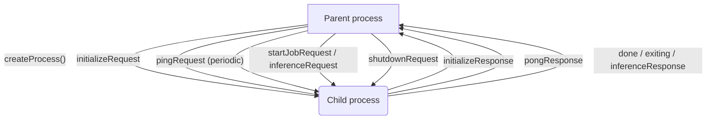
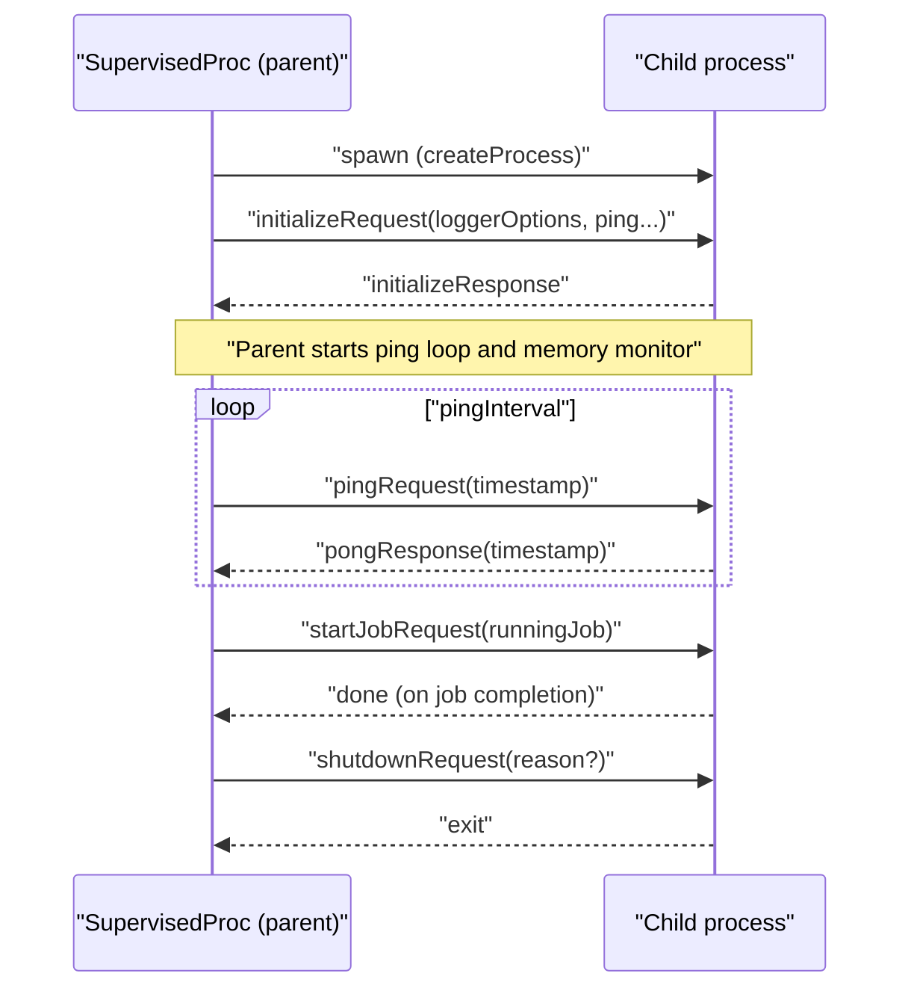

### SupervisedProc architecture and usage

This document describes `agents/src/ipc/supervised_proc.ts` — the base class that supervises child processes used by executors (e.g., job and inference). It manages spawning, an initialization handshake, health pings, timeouts, and shutdown.

#### Purpose

Provide a common lifecycle for child processes:
- Spawn and initialize a child process with consistent logger and ping configuration.
- Liveness checks via ping/pong and a high-latency warning threshold.
- Memory usage monitoring and enforcement (warn/kill thresholds).
- Graceful shutdown with a timeout and forced kill fallback.

#### High-level structure

#### Lifecycle overview

- `start()`
  - Validates state, calls `createProcess()` (implemented by subclasses), marks started, and kicks off `run()`.

- `initialize()`
  - Sends `initializeRequest` with `loggerOptions`, ping intervals/timeouts, and awaits the first message which must be `initializeResponse`. A timer enforces `initializeTimeout`.

- `run()`
  - Awaits `init.await` (resolved by `initialize()`).
  - Starts periodic `pingRequest` at `pingInterval` and a `pongTimeout` that kills the child if no timely pong is received.
  - Starts memory monitoring, warning or closing when thresholds are exceeded.
  - Registers message handlers:
    - `pongResponse`: computes latency, warns if above `highPingThreshold`, refreshes the `pongTimeout`.
    - `exiting`: logs reason.
    - `done`: marks closing, removes message listener.
  - Registers process error and exit handlers to unblock `join()`.
  - Calls subclass `mainTask(proc)` to wire child-specific message handling.

- `launchJob(info)`
  - Ensures no job is running, stores `runningJob`, and sends `startJobRequest`.

- `close()`
  - Sends `shutdownRequest` and waits up to `closeTimeout`; kills process if it does not exit in time; clears timers.

#### IPC messages

Defined in `agents/src/ipc/message.ts`:
- Initialization: `initializeRequest`, `initializeResponse`
- Health: `pingRequest`, `pongResponse`
- Control: `startJobRequest`, `shutdownRequest`, `exiting`, `done`
- Inference: `inferenceRequest`, `inferenceResponse`

#### Sequence: start, handshake, run, shutdown

#### Typical subclassing

Subclasses implement:
- `createProcess()`: how to fork/spawn the child (e.g., `child_process.fork`).
- `mainTask(proc)`: any executor-specific message routing (e.g., inference request multiplexing).

Examples:
- `ipc/job_proc_executor.ts`
- `ipc/inference_proc_executor.ts`

#### Known shortcomings and probable bugs

- Memory monitoring uses parent memory, not child
  - `process.memoryUsage()` measures the supervising parent’s heap, not the child’s. This defeats enforcement for the child process. Consider either requesting memory stats from the child or sampling the child PID via OS APIs.

- Memory watch interval missing delay
  - `setInterval` for memory monitoring is called without a delay, causing a tight loop that can peg CPU. Provide a reasonable interval (e.g., 1000 ms).

- Timers not consistently cleared
  - In the normal `done`/`exit` path, `pingInterval`, `pongTimeout`, and the memory watch interval may remain until `close()` or error handling clears them. Ensure all timers are cleared as soon as the child is finished to avoid leaks.

- Initialization timeout handling
  - The `initialize()` timeout throws from the timer callback and calls `init.reject()`. Since `run()` awaits `init.await` in a fire-and-forget task, this can surface as an unhandled rejection. Prefer explicit cancellation and consistent cleanup.

- `#logger` child context stability
  - The logger is created with `{ runningJob: this.#runningJob }` at construction time. Before any job is launched this is undefined, and it does not update when `runningJob` changes. Consider deriving child logger fields at log time or recreating the child logger when a job starts.

#### Tuning recommendations

- Choose `pingInterval`, `pingTimeout`, and `highPingThreshold` appropriate to your agent’s workload and platform jitter.
- Set realistic `initializeTimeout` and `closeTimeout` bounds for your environment.
- Implement child-side graceful handling of `shutdownRequest` and timely `pongResponse` to avoid forced kills.

