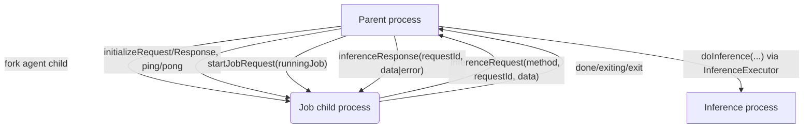
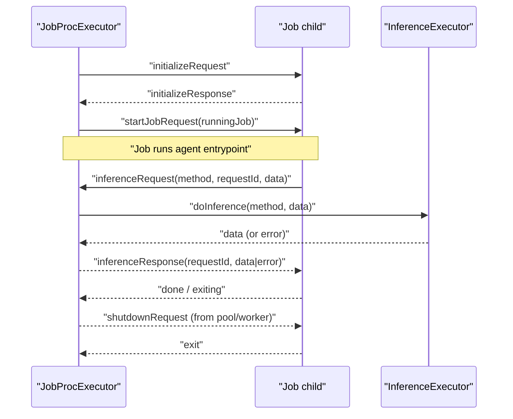

### JobProcExecutor architecture and usage

This document explains `agents/src/ipc/job_proc_executor.ts` — the supervised child-process executor that runs a single agent job and multiplexes inference requests between the job process and the global inference executor.

#### Purpose

- Spawn the job child process (`job_proc_lazy_main.js`) for a given agent module path.
- Perform the common supervised lifecycle (via `SupervisedProc`): initialization, ping/pong, timeouts, shutdown.
- Launch exactly one `RunningJobInfo` into the child.
- Bridge inference requests from the job child to the global `InferenceExecutor` and return responses.

#### High-level architecture

#### Key fields and behavior

- `createProcess()`
  - `fork(new URL('./job_proc_lazy_main.js', import.meta.url), [agent])` — the child receives the agent module path as argv[2].

- `mainTask(proc)`
  - Listens for `inferenceRequest` from the child and delegates to `#doInferenceTask`.
  - Tracks each inference task in `#inferenceTasks` (not awaited on close).

- `launchJob(info: RunningJobInfo)`
  - Requires `init.done === true` (initialized) and no currently running job.
  - Sets `#jobStatus = JobStatus.RUNNING` and `#runningJob = info`, then sends `startJobRequest`.

- `status`, `runningJob`
  - `status` throws if not set; becomes `RUNNING` on launch. Not updated automatically to a terminal state in current code.

#### Job launch and inference flow

#### Integration points

- Constructed and managed by `ProcPool`:
  - In pooled mode: pre-warmed, then assigned a job when available.
  - In non-pooled mode: created per job and initialized before launch.
- Inference is delegated to `InferenceExecutor` (often an `InferenceProcExecutor`).

#### Known shortcomings and probable bugs

- Status never transitions out of RUNNING
  - `#jobStatus` is set to `RUNNING` on `launchJob`, but there is no state update on `done`/`exit`. Consider updating status when receiving `done` or on process exit.

- Unbounded `#inferenceTasks` growth
  - Pushed to on every request and never pruned. While the process exits on close, references remain in the parent until GC. Consider removing settled promises or awaiting all in `close()`.

- Error serialization across IPC
  - `inferenceResponse.value.error` is typed as `Error`, but native IPC serialization loses prototype/stack. Normalize to a plain object ({ name, message, stack }) on send and reconstruct if needed on receive.

- Missing propagation of `userArguments`
  - The `userArguments` property is available but never sent to the child. If intended, include it in `startJobRequest` or a separate message.

- Logger context
  - Logger is created without dynamic job context. Consider adding job identifiers to the child logger fields when a job launches.

#### Practical tips

- Ensure `initialize()` completes before `launchJob()`.
- If you customize inference, validate method names and payload schemas on both sides (child and parent).
- On shutdown, prefer graceful `shutdownRequest` handling in the child so the parent doesn't have to kill.

