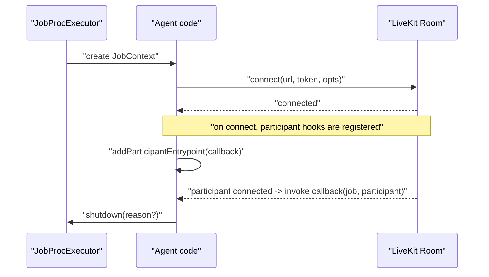
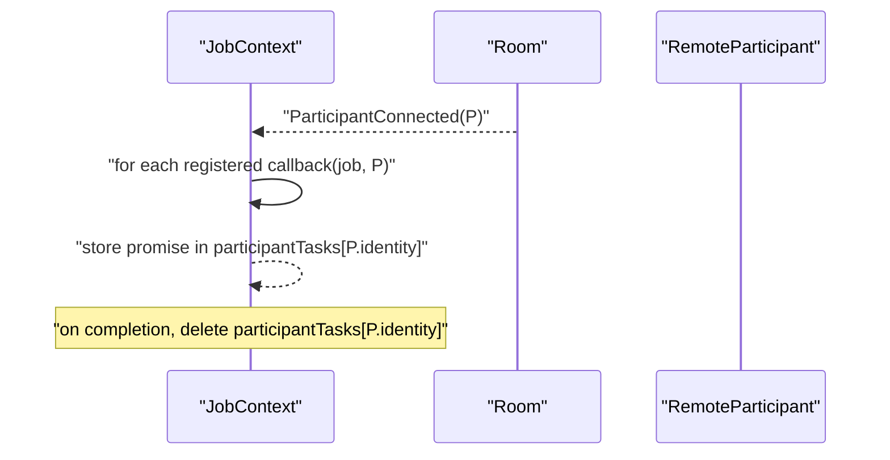

### Job APIs: JobContext, JobRequest, and JobProcess

This document explains `agents/src/job.ts` — the public runtime surface available to agent code when a job is launched, along with how jobs are accepted and initialized.

#### Key types

- `JobContext`
  - The main interface exposed to an agent entrypoint. Provides access to the LiveKit room, the agent participant, inference executor, and participant-driven hooks.
- `JobRequest`
  - The request object handed to `WorkerOptions.requestFunc`. Decide whether to accept or reject a job and optionally set participant identity/name/metadata.
- `JobProcess`
  - Minimal process metadata and `userData` storage for the process running the job.
- `AutoSubscribe`
  - Controls which remote tracks are auto-subscribed on connect: `SUBSCRIBE_ALL`, `SUBSCRIBE_NONE`, `VIDEO_ONLY`, `AUDIO_ONLY`.
- `CurrentJobContext`
  - Static accessor to the currently running `JobContext` inside the job process.

#### High-level usage

```ts
// Agent entrypoint (default export) gets a JobContext
export default async function run(job: JobContext) {
  await job.connect();
  const participant = await job.waitForParticipant();
  job.addShutdownCallback(async () => {
    // cleanup resources
  });
}
```

#### Job acceptance flow

`JobRequest` is constructed by the worker on availability checks and passed to your `requestFunc`:

```ts
async function requestFunc(req: JobRequest) {
  // Inspect room or publisher
  if (req.room?.name && shouldAccept(req)) {
    await req.accept('My Agent', '', JSON.stringify({ foo: 'bar' }));
  } else {
    await req.reject();
  }
}
```

Notes:
- `accept(name, identity, metadata, attributes)` allows customizing the agent participant identity/name and metadata.
- If `identity` is empty, it defaults to `agent-<job.id>`.

#### JobContext lifecycle



#### JobContext API

- `get job(): proto.Job`
  - The job protobuf from the control plane.
- `get room(): Room`
  - The `@livekit/rtc-node` room instance used by the agent.
- `get agent(): LocalParticipant | undefined`
  - The agent participant after `connect()`.
- `get inferenceExecutor()`
  - A global `InferenceExecutor` for cross-job inference calls.
- `connect(e2ee?, autoSubscribe?, rtcConfig?)`
  - Establishes RTC connection using the job’s URL and token.
  - `autoSubscribe` defaults to `SUBSCRIBE_ALL`. For `AUDIO_ONLY` or `VIDEO_ONLY`, it subscribes only matching tracks for already-present participants.
- `waitForParticipant(identity?)`
  - Resolves when a non-agent participant is present (immediately if already present, otherwise waits for `ParticipantConnected`). Rejects if the room disconnects first.
- `addParticipantEntrypoint(callback)`
  - Registers a callback to run on every new non-agent participant. Throws if the same callback is added twice.
- `addShutdownCallback(callback)`
  - Adds a promise to be awaited during job shutdown.
- `shutdown(reason = '')`
  - Signals the job to shut down; triggers executor-level shutdown.

#### Participant entrypoints



Behavior:
- If a new participant with the same identity arrives before a prior task for that identity finishes, a warning is logged and the new task is still scheduled.

#### CurrentJobContext

Provides `CurrentJobContext.getCurrent()` for code paths that don’t receive `JobContext` explicitly. Set by the executor when the job starts.

#### Known shortcomings and probable bugs

- Event listener cleanup
  - `JobContext` subscribes to `RoomEvent.ParticipantConnected` in the constructor and never removes this handler on shutdown. Consider removing listeners during shutdown to avoid leaks if the room persists longer than the job function.

- Typo in warning message
  - In `onParticipantConnected`, the warning string includes a typo: "prticipant".

- Participant task mapping assumptions
  - `participantTasks` is keyed by `participant.identity`. If identity changes or is undefined at some point, tasks could be mis-associated. The code assumes `identity` is defined (`p.identity!`).

- Auto-subscribe partial behavior
  - For `AUDIO_ONLY`/`VIDEO_ONLY`, it sets `subscribed` true for matching existing publications, but it does not explicitly unsubscribe others. If non-matching tracks were already auto-subscribed by the SDK, additional unsubscribes might be required.

- Global context
  - `CurrentJobContext` is a static global. In the presence of multiple concurrent jobs in the same process (not typical with the current architecture), this would be unsafe.

#### Tips for agent authors

- Call `connect()` early to avoid user-perceived delays.
- Use `waitForParticipant(identity)` to await a specific user before starting heavy logic.
- Use `addShutdownCallback` to release resources (files, network connections, timers).
- Use `inferenceExecutor` for model calls; it is shared across jobs and offloads work to the inference subprocess.


