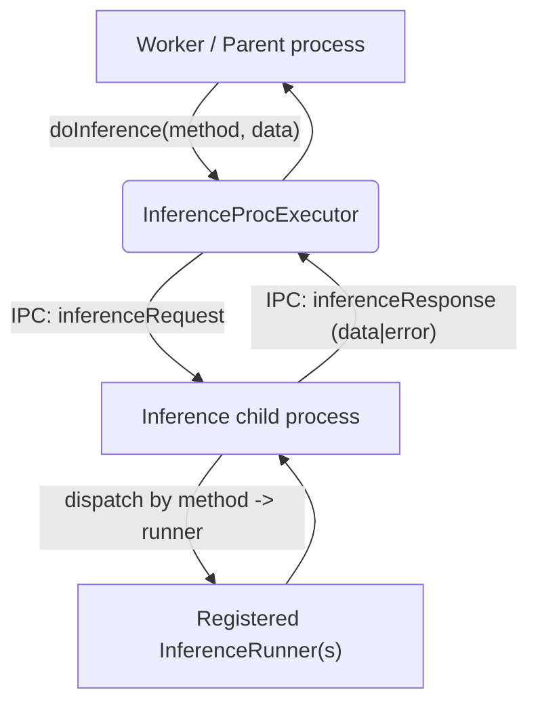
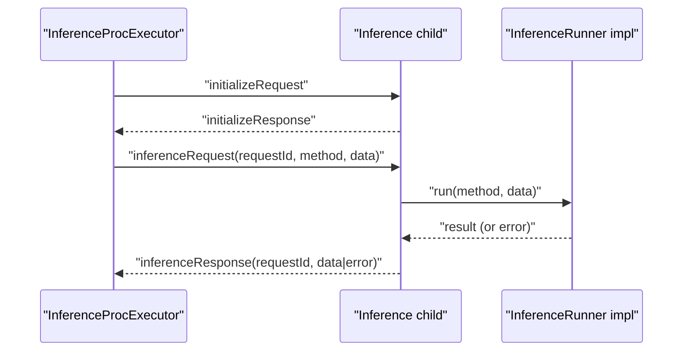

### Inference executor and runners

This document describes `agents/src/ipc/inference_proc_executor.ts` and `agents/src/inference_runner.ts`: how inference runs in a supervised child process, how requests are multiplexed, and how to register custom runners.

#### Purpose

- `InferenceProcExecutor`: a supervised child-process host for model inference. It accepts method calls from job processes and routes them to registered inference runners in the child, returning results via IPC.
- `InferenceRunner`: an abstract base and a registry for available inference methods (by name) and their import paths in the child process.

#### High-level architecture



#### Registration and lifecycle

- Register available methods before starting the worker:

```ts
import { InferenceRunner } from 'agents/src/inference_runner.js';

InferenceRunner.registerRunner('classify', new URL('./runners/classify.js', import.meta.url).pathname);
InferenceRunner.registerRunner('embed', new URL('./runners/embed.js', import.meta.url).pathname);
```

- When the worker starts, if any runner is registered, it constructs an `InferenceProcExecutor` with the registry and starts/initializes the child process.
- The executor is supervised (via `SupervisedProc`): initialized with `initializeRequest`, ping/pong health checks, memory limits, and graceful shutdown.

#### IPC messages (inference-specific)

- Parent to child: `inferenceRequest { requestId, method, data }`
- Child to parent: `inferenceResponse { requestId, data, error? }`

#### Request/response flow



#### InferenceProcExecutor API

- Constructor options: runners mapping, timeouts, memory thresholds, ping intervals.
- `createProcess()`
  - `fork(new URL('./inference_proc_lazy_main.js', import.meta.url), [JSON.stringify(runners)])`
- `mainTask(proc)`
  - Listens for `inferenceResponse` and resolves the matching pending promise in `#activeRequests` by `requestId`.
- `doInference(method: string, data: unknown): Promise<unknown>`
  - Generates a request id, stores a pending entry, sends `inferenceRequest`, and resolves on matching `inferenceResponse`. Throws if `error` is present.

#### InferenceRunner API

- `InferenceRunner.registerRunner(method: string, importPath: string)`
  - Static registry of method -> module path inside the child process.
- Extend `InferenceRunner<Input, Output>`
  - Implement `initialize()`, `run(data: Input)`, `close()` in your child-side module.

#### Typical usage pattern

```ts
// parent-side (already constructed by Worker)
const result = await inferenceExecutor.doInference('classify', { text: 'hello world' });

// child-side (runner)
export default class ClassifyRunner extends InferenceRunner<{ text: string }, { label: string }> {
  async initialize() { /* load model */ }
  async run(data) { /* return { label } */ }
  async close() { /* release model */ }
}
```

#### Known shortcomings and probable bugs

- No timeout for doInference
  - `doInference` awaits indefinitely for a response. If the child dies or a response is never sent, the promise never resolves and the entry remains in `#activeRequests`. Consider adding a per-request timeout and cleanup.

- Error serialization
  - `error` is sent as an `Error` instance, which loses prototype/stack across IPC. Normalize to a plain object and reconstruct if needed on the caller side.

- Backpressure and queueing
  - Multiple concurrent inference requests are supported, but there is no backpressure control. Consider queueing limits or per-method concurrency caps to avoid overloading the child.

- Orphaned requests on process crash
  - On child `error/exit`, pending requests are not explicitly rejected in this class; callers can hang. Ensure higher-level supervision rejects outstanding requests or add rejection on process failure.

- Runner name collisions
  - `registerRunner` throws if a method is already registered; this is expected. Document method names clearly to avoid conflicts across libraries.

#### Operational tips

- Keep runner initialization fast; heavy models should be loaded lazily or cached within the child process.
- Structure `data` payloads as stable, versioned objects; avoid sending large binary blobs over IPC.
- Monitor ping latency and memory warnings (inherited from `SupervisedProc`) to detect model overload.


