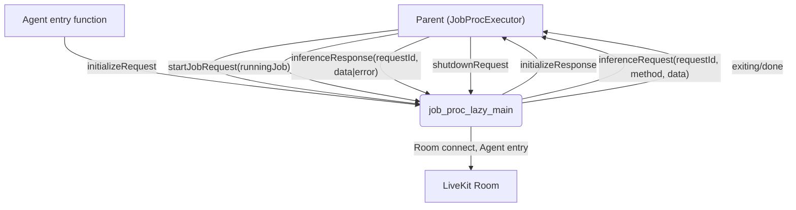
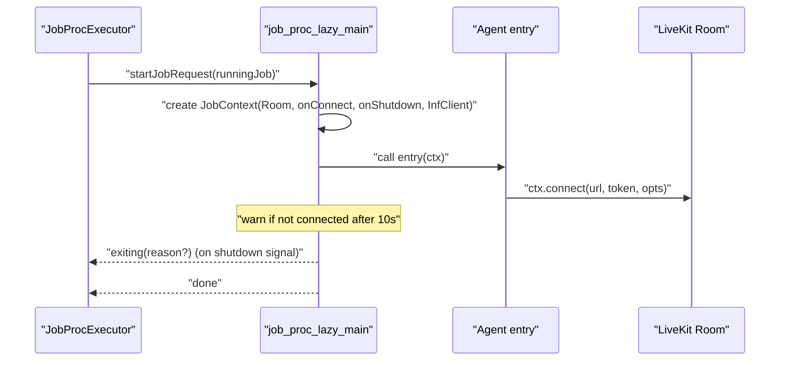

### Job child process: job_proc_lazy_main.ts

This document explains `agents/src/ipc/job_proc_lazy_main.ts`, the child process that loads the agent module, hosts the `JobContext`, bridges inference requests to the parent, and coordinates graceful shutdown.

#### Responsibilities

- Receive initialization from the parent and configure logging.
- Dynamically import the agent module and run its `prewarm` and `entry` functions.
- Create the `JobContext` (with a room and inference bridge) and expose it to agent code.
- Respond to pings, send pongs, and detect orphaning when not pinged by the parent.
- Forward inference requests to the parent and return responses back to the agent code.
- Gracefully drain on shutdown and emit `done`.

#### Architecture

#### Boot and handshake

1. Waits for the first IPC message to be `initializeRequest`, then configures the logger.
2. Imports the agent module from `process.argv[2]`, validates default export is an `Agent`, sets a default `prewarm` if missing, runs `prewarm`.
3. Sends `initializeResponse`.

#### Ping/pong and orphan detection

- On every `pingRequest`, replies with `pongResponse { lastTimestamp, timestamp }` and refreshes an `ORPHANED_TIMEOUT` timer (15s). If the parent stops pinging, the child logs a warning and resolves its `join` future to exit.

#### Job startup and shutdown

Shutdown sequence details:
- A local `EventEmitter` (`closeEvent`) coordinates shutdown.
- On `RoomEvent.Disconnected` (if not initiated by the agent), emits close.
- When `shutdownRequest` arrives: emits `close`, clears orphan timer, removes message handler, and resolves `join` if no job is running.
- After close: disconnects the room, awaits all `shutdownCallbacks`, sends `done`, logs, and exits.

#### Inference bridge (InfClient)

- The child implements a lightweight `InferenceExecutor` client:
  - On `doInference(method, data)` generates a `requestId`, sends `inferenceRequest`, stores a `PendingInference`, and awaits `inferenceResponse`.
  - On receiving `inferenceResponse`, resolves the matching pending promise by `requestId`.

#### Notable implementation details and issues

- Request ID generation bug
  - `const requestId = 'inference_job_' + randomUUID;` misses parentheses. It should call `randomUUID()`; otherwise the ID becomes a stringified function reference.

- Potential race on pending map
  - The pending map entry is created after sending the request. If a very fast response arrives first, it could be treated as unexpected. Create the `PendingInference` before sending.

- No per-request timeout
  - `doInference` awaits indefinitely. Consider a timeout and cleanup of the pending entry.

- Grammar and log clarity
  - The 10s warning message reads: "room not connect after job_entry was called". Improve wording to: "room not connected within 10s after entry; did you call ctx.connect()?".

- Shutdown reason inconsistency
  - `closeEvent.emit('close', true, reason)` is used in some paths, while `shutdownRequest` emits `close` with only a reason string. Code reading the event uses array indexing (`close[1]`) which becomes undefined. Pass a consistent tuple.

- Signal handlers
  - SIGINT/SIGTERM handlers log using a `logger` declared later. This is safe because the closure captures the variable by reference and the assignment occurs before signals are typically delivered, but be mindful during refactors.

#### Tips for agent authors

- Always call `ctx.connect()` early in your entry function to avoid delayed joins.
- Register `addShutdownCallback` for cleanup and ensure long-running tasks abort on shutdown signals.
- Use `inferenceExecutor` from the `JobContext` for model calls; it transparently routes to the parent’s inference process.

