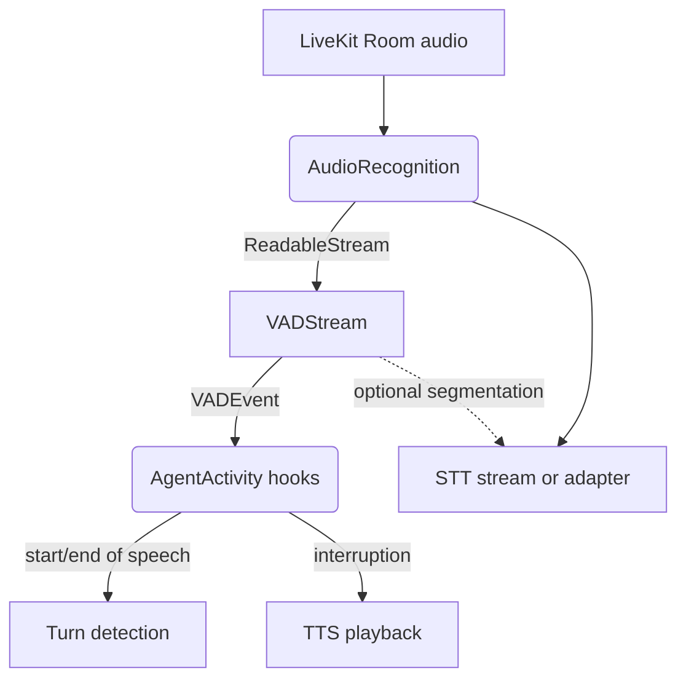
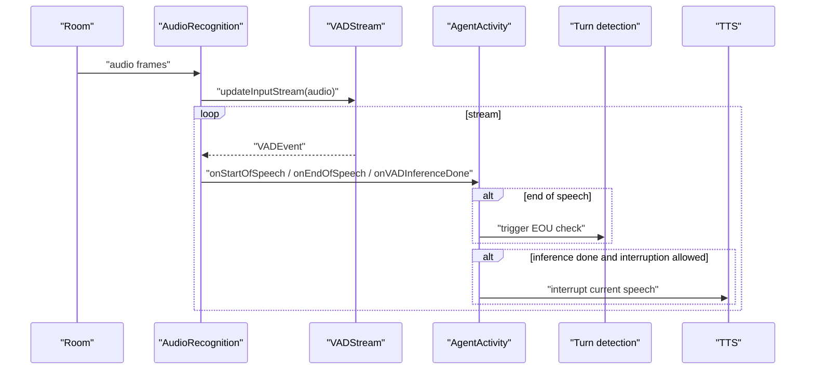

### Voice Activity Detection (VAD) architecture and usage

This document explains `agents/src/vad.ts` — the abstract VAD interfaces used by the voice stack — and how VAD fits into the overall streaming, STT, turn detection, and interruption architecture.

#### Purpose

- Provide a common interface (`VAD`, `VADStream`) to plug in different VAD implementations (e.g., Silero in `plugins/silero`).
- Consume audio frames as a stream and produce VAD events (`START_OF_SPEECH`, `INFERENCE_DONE`, `END_OF_SPEECH`, `METRICS_COLLECTED`).
- Feed downstream logic for turn detection, TTS interruption, and STT segmentation.

#### High-level architecture



Where VAD is used:
- `voice/AudioRecognition.createVadTask`: attaches `vad.stream()` to the agent's input audio and reacts to events for turn detection and speech state.
- `voice/Agent.default.sttNode`: wraps non-streaming STT in a `STTStreamAdapter` that requires a VAD to segment audio into utterances.
- Examples: `examples/src/realtime_turn_detector.ts` loads a Silero VAD in `prewarm` and passes it to `AgentSession`.

#### Core types

- `VADEventType`: `START_OF_SPEECH`, `INFERENCE_DONE`, `END_OF_SPEECH`, `METRICS_COLLECTED`.
- `VADEvent`: event payload with timing, frames, probability, and raw accumulation thresholds.
- `VADCapabilities`: currently exposes `updateInterval` for metrics reporting.
- `VADCallbacks`: typed emitter for `metrics_collected` events.
- `VAD` (abstract): `label` and `stream()` factory for a `VADStream`.
- `VADStream` (abstract): an async iterator over `VADEvent` with input/output streams and helpers.

#### VADStream API

- `updateInputStream(audio: ReadableStream<AudioFrame>)`
  - Set or swap the upstream audio source. Under the hood, audio is queued into an internal `DeferredReadableStream` and forwarded to the VAD pipeline.
- `detachInputStream()`
  - Detach the current audio source without closing the VAD pipeline.
- `flush()`
  - Pushes an internal sentinel to force processing of buffered audio.
- `endInput()`
  - Closes the input side to signal end of audio.
- `close()`
  - Releases writers/readers and closes the output; iteration ends.
- Async iteration
  - `for await (const ev of vad.stream()) { ... }`

Implementation notes:
- Internally uses `IdentityTransform` to model input and output pipes.
- Splits the output into two readers via `tee()`: one for downstream consumption and one for metrics aggregation.
- Maintains `#lastActivityTime` to compute idle time for metrics.

#### Voice pipeline with VAD



#### Example usage

```ts
// Prewarm a model VAD and pass into session
proc.userData.vad = await silero.VAD.load();

const session = new voice.AgentSession({
  vad: proc.userData.vad,
  stt: new deepgram.STT(),
  tts: new elevenlabs.TTS(),
});

// Internally, AudioRecognition wires VAD:
const vadStream = vad.stream();
vadStream.updateInputStream(audioStream);
for await (const ev of vadStream) {
  // handle events
}
```

#### Metrics collection

- `monitorMetrics()` consumes a split of the output event stream and emits `metrics_collected` periodically based on `updateInterval`.
- Collected fields include timestamp, idle time since last activity, total inference duration, inference count, and VAD label.

#### Known shortcomings and probable bugs

- Inference duration never accumulates
  - `inferenceDurationTotal` is initialized and reset but never incremented from events. It should sum `ev.inferenceDuration` on `INFERENCE_DONE`.

- First idle time may be huge
  - `#lastActivityTime` starts at zero and is only set on `INFERENCE_DONE` or `END_OF_SPEECH`. The first `START_OF_SPEECH` will compute idle time from epoch. Initialize `#lastActivityTime` on stream construction to current time.

- Metrics loop and cleanup
  - The metrics reader loop runs until the output ends; ensure `close()` is called to break the loop. Consider cancelling the metrics reader explicitly on close.

- Stream resource release
  - `close()` cancels the output reader and closes the output writable, but the input reader and input writer may still hold locks in some paths. Review releasing all locks when closing.

- Deprecated `pushFrame`
  - Marked for removal; prefer `updateInputStream`.

#### Where to find concrete VADs

- Silero-based VAD: see `plugins/silero/src/vad.ts` for a concrete implementation that extends these base classes.


