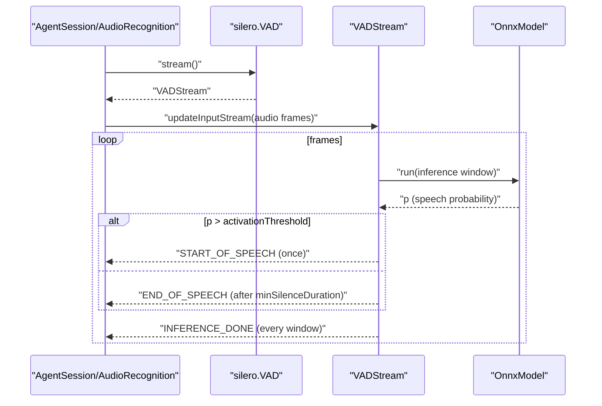

### Silero VAD plugin

This document explains `plugins/silero/src/vad.ts`: a concrete Voice Activity Detection implementation that extends the core `VAD` and `VADStream` in `@livekit/agents` using an ONNX model.

- Class: `plugins/silero/src/vad.ts#VAD` (extends `baseVAD`)
- Stream: `plugins/silero/src/vad.ts#VADStream` (extends `baseStream`)

#### Purpose

- Run lightweight, streaming VAD using a Silero ONNX model.
- Work with arbitrary input sample rates, resampling to the model's rate (8kHz or 16kHz).
- Emit timely VAD events for use in turn detection, TTS interruption, and STT segmentation.

#### Options and defaults

```ts
export interface VADOptions {
  minSpeechDuration: number;        // ms of speech before START_OF_SPEECH
  minSilenceDuration: number;       // ms of silence to end speech
  prefixPaddingDuration: number;    // ms of audio kept before detected start
  maxBufferedSpeech: number;        // ms of buffered output speech cap
  activationThreshold: number;      // probability threshold for speech
  sampleRate: 8000 | 16000;         // model rate
  forceCPU: boolean;                // use CPU even if GPU present
}
```

Defaults (`defaultVADOptions`):
- `minSpeechDuration: 50`
- `minSilenceDuration: 550`
- `prefixPaddingDuration: 500`
- `maxBufferedSpeech: 60000`
- `activationThreshold: 0.5`
- `sampleRate: 16000`
- `forceCPU: true`

Update live via `VAD.updateOptions(partial)`; propagates to active streams.

#### Loading and prewarming

```ts
const vad = await silero.VAD.load({ sampleRate: 16000 });
proc.userData.vad = vad; // set during agent prewarm
```

- `load()` creates an ONNX runtime session (`newInferenceSession`) and returns a ready `VAD`.
- Recommended to call in the agent `prewarm` phase.

#### Streaming flow



#### Resampling and buffering

- If input sample rate != model rate, an `AudioResampler` (QUICK quality) converts frames for inference.
- A speech buffer stores resampled audio to return complete clips on `START_OF_SPEECH` and `END_OF_SPEECH`.
- `prefixPaddingSamples` retains leading context before speech start.

#### Event semantics

- `INFERENCE_DONE`
  - Emitted for each inference window; includes `probability`, `inferenceDuration`, and the window audio.
- `START_OF_SPEECH`
  - Emitted after `minSpeechDuration` of speech; includes prefixed buffered audio.
- `END_OF_SPEECH`
  - Emitted once silence exceeds `minSilenceDuration` after speaking.

All events include: cumulative `speechDuration`/`silenceDuration`, `samplesIndex`, `timestamp`, `speaking` flag, and raw accumulators.

#### Updating options at runtime

- `VAD.updateOptions(partial)` updates defaults and calls `VADStream.updateOptions` for active streams.
- `VADStream.updateOptions` recomputes buffer sizes and resets the max-reached flag if the buffer grows.

#### Performance and backpressure

- Each inference step measures `inferenceDuration` and accumulates `#extraInferenceTime` vs realtime window; warns if > 200 ms behind.
- After each step, leftover data beyond the window is pushed back into frame buffers to avoid drift.

#### Integration with core VAD

- Extends the core `VAD`/`VADStream` interfaces in `@livekit/agents`, so it plugs into `AudioRecognition` and `AgentSession` without additional glue.
- Emits events consumed by `AgentActivity` for turn detection and interruption.

#### Known notes and issues

- Mixed sample rates: If subsequent frames carry a different input sample rate, an error is logged and the frame is skipped.
- Buffer overflow: When `maxBufferedSpeech` is exceeded, further data for the current speech is ignored until an end is detected; a warning is logged.
- Activation hysteresis: Separate speech/silence threshold durations provide stability, but rapid toggling near threshold can still occur with noisy audio.

#### Minimal example

```ts
const vad = await silero.VAD.load();
const stream = vad.stream();
stream.updateInputStream(audioStream);
for await (const ev of stream) {
  if (ev.type === VADEventType.START_OF_SPEECH) {
    // handle start
  }
}
```


