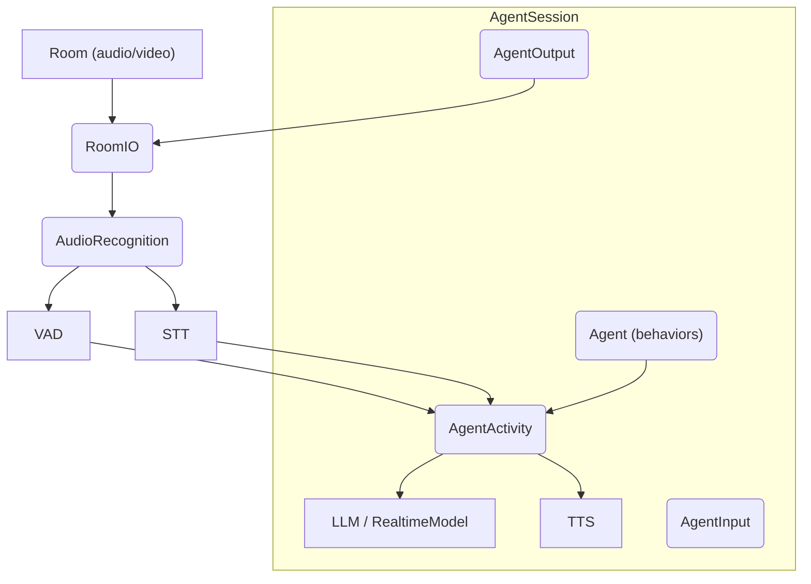
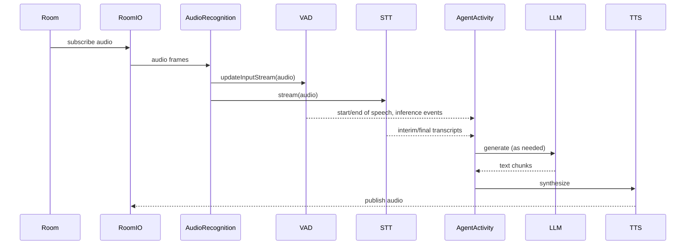

### Voice AgentSession architecture and usage

This document covers `agents/src/voice/agent_session.ts`, the orchestrator for realtime voice interactions. It wires VAD, STT, LLM/RealtimeModel, TTS, turn detection, room I/O, and agent activity.

#### Purpose

- Manage the voice interaction lifecycle for an agent within a LiveKit `Room`.
- Coordinate audio input/output, transcription, generation, and interruptions.
- Emit rich events about user/agent state, messages, metrics, and errors.

#### High-level architecture



#### Construction and options

```ts
new AgentSession({
  vad, stt, llm, tts,
  turnDetection,              // 'stt' | 'vad' | 'realtime_llm' | 'manual' | _TurnDetector
  voiceOptions: {             // defaults shown
    allowInterruptions: true,
    discardAudioIfUninterruptible: true,
    minInterruptionDuration: 500,
    minInterruptionWords: 0,
    minEndpointingDelay: 500,
    maxEndpointingDelay: 6000,
    maxToolSteps: 3,
  },
});
```

#### Lifecycle

- `start({ agent, room, inputOptions?, outputOptions? })`
  - Creates `RoomIO` and starts it.
  - Initializes `AgentActivity` for the given `Agent` and wires audio input if present.
  - Emits agent state changes: `initializing` → `listening`.
- `updateAgent(agent)`
  - Drains and replaces the current activity with a new one derived from the new agent.
  - Ensures audio input is re-attached to the new activity.

#### Core methods

- `say(text | ReadableStream<string>, { audio?, allowInterruptions?, addToChatCtx? }) => SpeechHandle`
  - Enqueue TTS playback (and optional pre-produced audio). Returns a `SpeechHandle` for interruption/cancellation.

- `generateReply({ userInput?, instructions?, toolChoice?, allowInterruptions? }) => SpeechHandle`
  - Initiate LLM generation; constructs a user `ChatMessage` if `userInput` provided. If the session is draining, delegates to the next activity.

- `commitUserTurn()` / `clearUserTurn()`
  - Manually mark or clear the end of the user's turn when using manual turn detection.

#### Events

See `agents/src/voice/events.ts` for event types. Notable events include:
- `UserInputTranscribed`: streaming transcripts from STT.
- `AgentStateChanged` and `UserStateChanged`: state transitions.
- `ConversationItemAdded`: message added to chat context.
- `FunctionToolsExecuted`: tool execution summary.
- `MetricsCollected`: VAD or other metrics.
- `SpeechCreated`: speech started/queued.
- `Error`: error surfaced from subsystems.

#### Turn detection modes

- `'vad'`: driven by VAD `END_OF_SPEECH` and timing thresholds.
- `'stt'`: driven by STT end-of-utterance plus word and duration thresholds.
- `'realtime_llm'`: server-side turn detection by the realtime model (e.g., OpenAI Realtime).
- `'manual'`: user code calls `commitUserTurn()`.
- Custom `_TurnDetector`: pluggable algorithm via `AudioRecognition`.

#### Typical flow



#### State accessors

- `chatCtx`: returns a copy of the global `ChatContext`.
- `agentState`: current agent state (`initializing`, `listening`, ...).
- `currentAgent`: throws if not started; otherwise returns active `Agent`.
- `input`/`output`: structured I/O handles for audio/text.

#### Known behaviors and notes

- Start idempotency: calling `start()` repeatedly is safe; subsequent calls no-op.
- Activity replacement drains current activity before starting the next to avoid overlaps.
- `say()` and `generateReply()` throw if session is not running.
- When draining (during agent swap), `generateReply()` uses `nextActivity` to keep experience seamless.

#### Known shortcomings and probable bugs

- Start does not await activity initialization
  - `start()` calls `updateActivity(this.agent)` without `await`. The session state is set to `listening` immediately, while `AgentActivity.start()` and audio wiring may still be in progress. Early `say()`/`generateReply()`/audio could race with initialization. Consider awaiting `updateActivity` or emitting an explicit "ready" event.

- Missing lifecycle locking
  - A TODO notes adding a lock around the activity lifecycle. Concurrent `updateAgent()` or rapid successive starts could interleave drains/starts and lead to transient undefined `activity` states or missed wiring.

- Generate during drain edge case
  - `generateReply()` routes to `nextActivity` when `this.activity.draining` is true; however, if draining is triggered without `nextActivity` set (e.g., external shutdown), it throws. Ensure callers handle this or guard the state.

- No-op output change handlers
  - `onAudioOutputChanged()` and `onTextOutputChanged()` are empty; if dynamic output routing is intended, this is a gap (not strictly a bug but a missing feature).


