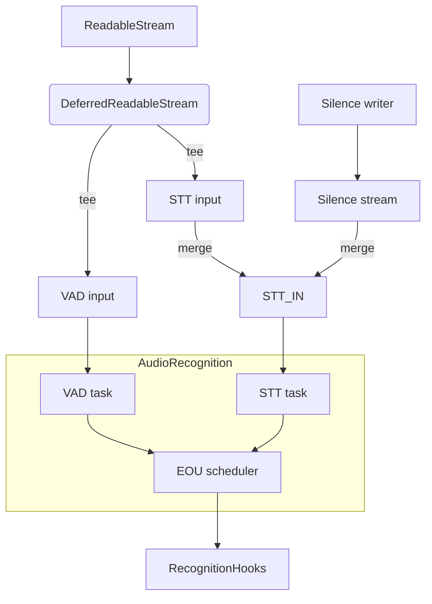
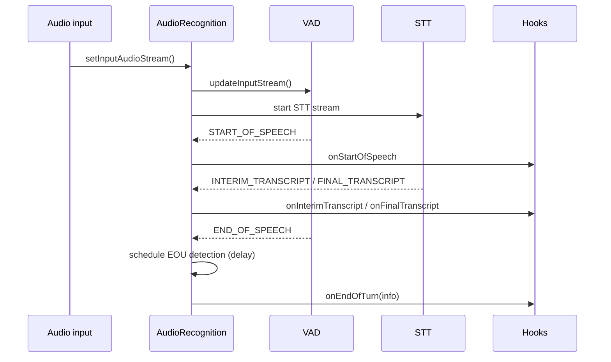

### AudioRecognition architecture and usage

This document describes `agents/src/voice/audio_recognition.ts`, which coordinates audio ingestion, VAD, STT, and end-of-user (EOU) turn detection for voice agents.

#### Purpose

- Split the incoming audio stream for concurrent VAD and STT processing.
- Maintain interim and final transcripts and user speaking state.
- Detect the end of the user's turn (via VAD- or STT-based heuristics or a model turn detector) and notify higher layers.
- Provide imperative helpers to commit or clear a user turn.

#### High-level architecture



#### Construction

```ts
const rec = new AudioRecognition({
  recognitionHooks,            // onStartOfSpeech/onVADInferenceDone/onEndOfSpeech/.../onEndOfTurn
  stt,                         // STTNode (ReadableStream<SpeechEvent> | null)
  vad,                         // VAD implementation
  turnDetector,                // optional model-based detector
  turnDetectionMode,           // 'vad' | 'stt' | 'realtime_llm' | 'manual'
  minEndpointingDelay,
  maxEndpointingDelay,
});

rec.setInputAudioStream(audioStream);
await rec.start();
```

#### Key responsibilities

- VAD task
  - Creates a `vad.stream()`, feeds it audio, and forwards `START_OF_SPEECH`, `INFERENCE_DONE`, and `END_OF_SPEECH` to hooks.
  - Tracks `speaking` and sets `lastSpeakingTime` when speech ends; triggers EOU detection under VAD-based or STT-committed modes.

- STT task
  - Calls `stt(input)` to get a `ReadableStream<SpeechEvent>`; reads events and updates interim/final transcripts.
  - On `FINAL_TRANSCRIPT`: appends to `audioTranscript`, clears interim, records language and time; may trigger EOU if not currently speaking.
  - On `END_OF_SPEECH` in STT-based mode: marks `userTurnCommitted` and may trigger EOU.

- EOU detection
  - Builds a temporary `ChatContext` containing the accumulated transcript and (optionally) queries the `turnDetector` to compute an endpointing delay between `minEndpointingDelay` and `maxEndpointingDelay`.
  - Schedules a debounced task that sleeps until `lastSpeakingTime + endpointingDelay`, then calls `hooks.onEndOfTurn({ newTranscript, transcriptionDelay, endOfUtteranceDelay })`.
  - If the hook returns `true`, clears `audioTranscript` and resets `userTurnCommitted`.

- Manual control
  - `commitUserTurn(audioDetached: boolean)`: optionally injects ~500 ms of silence (to flush STT) and schedules EOU detection; sets `userTurnCommitted = true`.
  - `clearUserTurn()`: clears transcripts and restarts the STT task.

#### Typical sequence



#### API surface

- `setInputAudioStream(stream)` / `detachInputAudioStream()`
- `start()` / `close()`
- `commitUserTurn(audioDetached: boolean)` / `clearUserTurn()`
- `currentTranscript: string`

#### End-of-turn scheduling

- VAD-based: EOU runs after VAD emits `END_OF_SPEECH` (already waited through `silenceDuration`), plus a small endpointing delay.
- STT-based: EOU runs after `END_OF_SPEECH` or `FINAL_TRANSCRIPT` (when not speaking), depending on mode and `userTurnCommitted`.
- Model-based: `turnDetector.unlikelyThreshold()` and `predictEndOfTurn()` adjust the endpointing delay.

#### Known shortcomings and probable bugs

- Missing await on `supportsLanguage`
  - In EOU detection, the code calls `turnDetector.supportsLanguage(this.lastLanguage)` without `await`. Since the API is async, this condition always evaluates truthy (a Promise), and the language check is skipped. It should be `if (!(await turnDetector.supportsLanguage(this.lastLanguage))) { ... }`.

- `sampleRate` never set
  - `commitUserTurn(audioDetached)` attempts to flush STT by writing silence if `this.sampleRate` is defined, but `sampleRate` is never assigned in this class. As a result, silence injection may never occur. Consider capturing the first input frame's `sampleRate` and setting `this.sampleRate`.

- Transcript growth if not committed
  - `audioTranscript` only clears when `onEndOfTurn` returns `true`. If the hook declines commitment repeatedly, transcripts will grow across attempts. Consider a cap or periodic truncation.

- Potential race between VAD and STT triggers
  - EOU can trigger off VAD `END_OF_SPEECH` and also off STT `FINAL_TRANSCRIPT` when `!speaking`. Rapid sequences may schedule overlapping tasks; cancellations help, but subtle races may persist.

- STT stream type check
  - If `stt()` does not return a `ReadableStream`, the current implementation silently does nothing beyond the type check. Consider logging a warning for non-stream outputs.

- Cleanup paths
  - VAD stream detaches and closes only via the `abort` handler; for normal completion, ensure it is closed/detached to stop background loops.

#### Integration notes

- Hooks typically belong to `AgentActivity`, which uses VAD events to drive turn detection and to interrupt TTS.
- The STT stream can be a direct streaming recognizer or an adapter that segments by VAD.
- Silence injection is only used to coax out final transcripts from STT when audio is detached (push-to-talk or manual modes).


