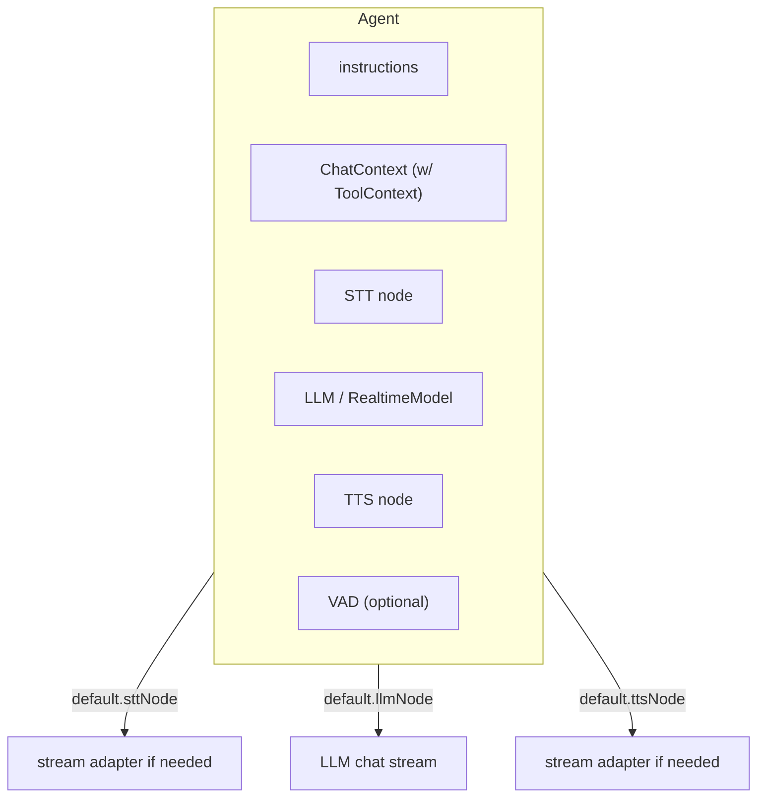

### Voice Agent architecture and usage

This document covers `agents/src/voice/agent.ts`, the authoring surface for building voice agent behaviors. It provides defaults for STT/LLM/TTS nodes, manages chat context and tools, and exposes lifecycle hooks.

#### Purpose

- Hold the agent’s instructions, chat context, tool context, and node references (`STT`, `VAD`, `LLM/RealtimeModel`, `TTS`).
- Offer default node wrappers that adapt non-streaming providers into streaming forms.
- Provide hooks for entry/exit and user-turn completion.

#### High-level architecture



#### Construction

```ts
const agent = new voice.Agent({
  instructions: 'You are helpful...',
  chatCtx,            // optional initial ChatContext
  tools,              // tool context, merged into internal copy
  turnDetection,      // mode hint for session wiring
  stt, vad, llm, tts, // optional nodes (can be provided by session/activity)
});
```

#### Key APIs

- Getters: `vad`, `stt`, `llm`, `tts`, `chatCtx` (readonly copy), `instructions`, `toolCtx`, `session` (through `AgentActivity`).
- Lifecycle hooks: `onEnter()`, `onExit()`; called by the activity when becoming active/inactive.
- Update chat context: `updateChatCtx(chatCtx)` preserves the tool context and updates the active activity if present.

#### Default node wrappers

- `default.sttNode(agent, audio, modelSettings)`
  - Requires an `STT` node; throws if missing.
  - If non-streaming, wraps with `STTStreamAdapter` (requires `agent.vad`).
  - Returns a `ReadableStream` that yields `SpeechEvent | string` from the underlying stream.

- `default.llmNode(agent, chatCtx, toolCtx, modelSettings)`
  - Requires an `LLM` node (non-realtime); throws if missing or if a `RealtimeModel` is provided.
  - Calls `llm.chat({ chatCtx, toolCtx, toolChoice, parallelToolCalls: true })` and exposes a `ReadableStream` of `ChatChunk | string`.

- `default.ttsNode(agent, text, modelSettings)`
  - Requires a `TTS` node; if non-streaming, wraps with `TTSStreamAdapter` + `BasicSentenceTokenizer`.
  - Returns a `ReadableStream<AudioFrame>` that yields audio frames.

- `default.transcriptionNode` / `default.realtimeAudioOutputNode`
  - Pass-through defaults returning the input stream.

#### Typical usage

```ts
const session = new voice.AgentSession({ vad, stt, llm, tts });
await session.start({ agent: new voice.Agent({ instructions: '...' }), room });
session.say('Hello!');
```

#### Tool calling context

- `asyncLocalStorage` carries an optional `functionCall` context for nested tool execution. Use `isStopResponse`/`StopResponse` to abort generation early from within tools.

#### Known shortcomings and probable bugs

- Tools shallow copy
  - In constructor, `this._tools = { ...tools }` performs a shallow copy; nested objects inside `tools` are shared/referenced. Consider deep cloning if mutation isolation is important.

- Missing streaming path for RealtimeModel
  - `default.llmNode` rejects `RealtimeModel` (by design) but there’s no equivalent helper for realtime multimodal nodes here; ensure `AgentActivity` or session provides the correct path.

- Error message mentions AgentTask/VoiceAgent
  - In `default.sttNode`, the error refers to "AgentTask/VoiceAgent" which may be legacy naming. Consider aligning wording with current `Agent`/`AgentSession` terms.

- Tokenizer default may not match TTS models
  - `TTSStreamAdapter` uses `BasicSentenceTokenizer`; for some languages/models better segmentation may be needed. Consider making tokenizer configurable.


