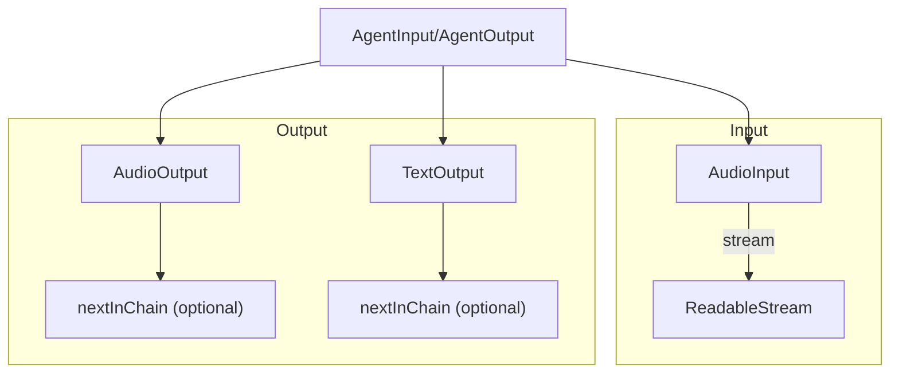

### Voice IO architecture and usage

This document covers `agents/src/voice/io.ts`, which defines the input/output abstraction for voice agents: audio input streams, audio output sinks, and text output sinks. It also declares node function types used by the pipeline (`STTNode`, `LLMNode`, `TTSNode`).

#### Purpose

- Provide pluggable I/O surfaces that AgentSession/AgentActivity can wire to LiveKit `Room` or other sources/sinks.
- Track attachment/detachment state, enable/disable flags, and playback lifecycle for audio sinks.
- Offer a uniform contract for LLM/STT/TTS node functions.

#### High-level architecture



#### Node function types

- `STTNode(audio, modelSettings) => Promise<ReadableStream<SpeechEvent | string> | null>`
- `LLMNode(chatCtx, toolCtx, modelSettings) => Promise<ReadableStream<ChatChunk | string> | null>`
- `TTSNode(text, modelSettings) => Promise<ReadableStream<AudioFrame> | null>`

#### AudioInput

- Wraps a `DeferredReadableStream<AudioFrame>`.
- Methods:
  - `get stream()` – readable stream for audio.
  - `onAttached()` / `onDetached()` – lifecycle hooks for enable/disable.

#### AudioOutput

- EventEmitter with playback lifecycle tracking and optional chaining to another `AudioOutput`.
- Key fields:
  - `sampleRate?: number` – optional sink rate.
  - `nextInChain?: AudioOutput` – chained sink that receives `onAttached`/`onDetached` and playback events.
- Playback lifecycle:
  - `captureFrame(frame)` – called to push a frame; starts a new playback segment if not currently capturing.
  - `flush()` – marks end of current segment (does not emit finished).
  - `clearBuffer()` – abstract; immediate stop; implementers must call `onPlaybackFinished` accordingly.
  - `onPlaybackFinished(event)` – marks a segment as finished, resolves waiters, and emits `playbackFinished`.
  - `waitForPlayout()` – waits until all captured segments complete and returns the last `PlaybackFinishedEvent`.
- Chain propagation:
  - `onAttached()` / `onDetached()` forward to `nextInChain` if present.

`PlaybackFinishedEvent`:
- `playbackPosition: number`, `interrupted: boolean`, `synchronizedTranscript?: string`.

#### TextOutput

- Abstract sink for generated text.
- Methods:
  - `captureText(text)` – ingest a string chunk.
  - `flush()` – mark current text segment as complete.
  - `onAttached()` / `onDetached()` – propagate to `nextInChain`.

#### AgentInput/AgentOutput controllers

- `AgentInput`
  - Tracks an `AudioInput | null` and an enable flag.
  - `audioEnabled` getter/setter toggles attached/detached callbacks on the current `AudioInput`.
  - Setting `audio` invokes the provided `audioChanged` callback (used by higher layers to rewire pipelines).

- `AgentOutput`
  - Tracks `AudioOutput | null` and `TextOutput | null`, with independent enable flags.
  - Setting `audio` or `transcription` detaches the previous sink (if any), stores the new one, triggers the corresponding `...Changed` callback, and then calls `onAttached()` on the new sink.
  - `setAudioEnabled` / `setTranscriptionEnabled` toggle attachment state on current sinks.

#### Typical usage

```ts
// Configure session IO
const input = new MyAudioInput();
const audioSink = new MyAudioOutput(/* sampleRate */ 48000);
const textSink = new MyTextOutput();

session.input.audio = input;
session.output.audio = audioSink;
session.output.transcription = textSink;
```

#### Known shortcomings and probable bugs

- Playback finished accounting
  - `onPlaybackFinished` warns when called more times than segments, but does not protect against under-reporting (segments never finished). Consider timeouts or health counters.

- Capture and flush semantics
  - `flush()` resets `_capturing` but does not emit any event; if an implementer forgets to call `onPlaybackFinished`, `waitForPlayout()` can hang. Document and enforce via tests.

- Chain error handling
  - `onAttached`/`onDetached` propagate, but errors thrown by `nextInChain` are not caught. Consider try/catch to isolate chains.

- AgentInput change handling
  - `AgentInput.audio = stream` immediately calls `audioChanged()` but does not attach/detach the new stream. Attachment is controlled by `audioEnabled` and consumer logic; ensure callers call `onAttached()` for initial hookup if needed.

- TextOutput completeness
  - There is no built-in `waitForFlush()`; upstream must infer completion. Consider adding a future for text segment completion similar to audio.


