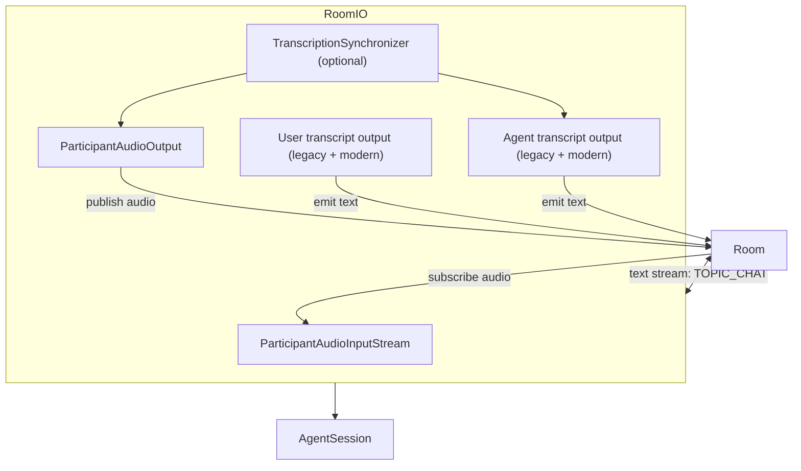

### RoomIO architecture and usage

This document covers `agents/src/voice/room_io/room_io.ts`, which bridges a LiveKit `Room` to the voice agent’s input/output interfaces. It selects a participant, subscribes to audio, publishes agent audio, synchronizes transcripts, and handles text input streams.

#### Purpose

- Manage room-level I/O and bind them to `AgentSession.input`/`output`.
- Select the active user participant (optionally by identity) and listen for joins/leaves.
- Publish agent audio output and forward user/agent transcripts to room data/text streams.
- Optionally synchronize transcript progression with audio playout.

#### High-level architecture

#### Options

- `RoomInputOptions`
  - `audioSampleRate`, `audioNumChannels`, `textEnabled`, `audioEnabled`, `videoEnabled`
  - `participantIdentity?`: focus on a specific user; otherwise auto-select the first acceptable participant.
  - `noiseCancellation?`: enable on input.
  - `textInputCallback?`: default interrupts and calls `generateReply` with `userInput`.
  - `participantKinds?`: accepted kinds (default `SIP`, `STANDARD`).

- `RoomOutputOptions`
  - `transcriptionEnabled`, `audioEnabled`, `audioSampleRate`, `audioNumChannels`
  - `syncTranscription`: if true, couples agent transcript timing with audio playout.
  - `audioPublishOptions`: passed to `TrackPublishOptions` (defaults to microphone source).

#### Lifecycle

- `start()`
  - Registers text stream handler for `TOPIC_CHAT` (if enabled).
  - Creates `ParticipantAudioInputStream` and output sinks (`ParticipantAudioOutput`, transcript outputs) per options.
  - Starts `TranscriptionSynchronizer` if enabled and audio output is present.
  - Subscribes to room events: connection state, participant joined/left.
  - Kicks off `initTask()`:
    - Waits for room connection; seeds existing participants; waits for the selected participant; calls `setParticipant`.
    - Updates agent transcript output to use the local participant identity; starts audio output.
  - Attaches created I/O to `AgentSession.input/ output` and subscribes to `AgentSession` events for state and user transcription.

#### Text input handling

- Room text stream handler calls `onUserTextInput(reader, participantInfo)`:
  - Validates target participant.
  - Reads the entire text payload (`reader.readAll()`), then invokes `textInputCallback(sess, { text, info, participant })`.
  - Default callback: `sess.interrupt()` then `sess.generateReply({ userInput: text })`.

#### Transcript forwarding

- `forwardUserTranscript()` consumes the session’s `UserInputTranscribed` stream and forwards chunks to `userTranscriptOutput`, awaiting `captureText` to avoid races; flushes on final events.

#### Participant selection

- If `participantIdentity` is set, waits for that identity.
- Otherwise, ignores participants that are marked as publishing on behalf of the agent (`ATTRIBUTE_PUBLISH_ON_BEHALF`) and filters by `participantKinds`.

#### API

- `setParticipant(identity: string | null)` / `unsetParticipant()`
  - Switch active user and retarget user transcript sinks.
- Getters `audioOutput` / `transcriptionOutput`
  - Return either the raw sink or the synchronized proxy depending on `syncTranscription`.

#### Known shortcomings and probable bugs

- Text handler unregister TODO
  - A TODO notes the text stream handler is not unregistered on close. Without a `close()` method, this can leak handlers across restarts. Implement a `close()` to remove room listeners and unregister text handler.

- Participant disconnect behavior
  - On participant disconnected, it calls `unsetParticipant()` but does not attempt to reselect a new one. Depending on UX, a new participant might be auto-selected; clarify behavior behind AJS-177.

- Transcript forwarder reader not released
  - `forwardUserTranscript()` obtains a reader but never releases it. On shutdown, ensure it is cancelled/released.

- Agent output selection TODO
  - A TODO indicates falling back to agent’s audio output if RoomIO has none (AJS-176). Currently only uses `participantAudioOutput`.

- Attribute keys hard-coded
  - Uses `lk.agent.state` attribute; consider constants or namespacing strategy.

