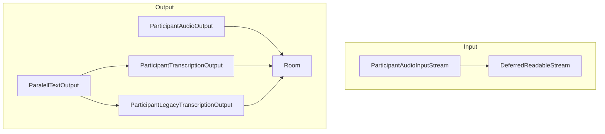
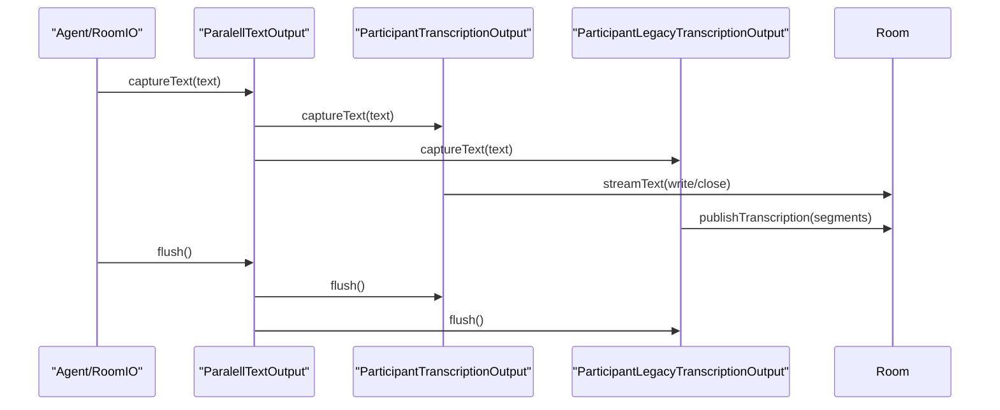

### Room IO streams: _input.ts and _output.ts

This document covers `agents/src/voice/room_io/_input.ts` and `_output.ts`, the low-level building blocks that connect LiveKit media/text streams to the agent I/O layer.

#### Purpose

- `_input.ts`: Subscribe to the active participant’s microphone, resample, and expose as a `ReadableStream<AudioFrame>` via `AudioInput`.
- `_output.ts`: Publish agent audio frames to the room and publish transcripts to both legacy and modern text paths.

#### Architecture

### _input.ts: ParticipantAudioInputStream

- Listens for `RoomEvent.TrackSubscribed`/`TrackUnpublished`.
- Tracks target participant identity; when set, subscribes to the first microphone track and pipes audio into `deferredStream`.
- Applies resampling via `resampleStream` to the requested `sampleRate`.

Key methods:
- `setParticipant(participant: RemoteParticipant | string | null)` – switches the active source; closes stream when unset.
- Internals:
  - `onTrackSubscribed(track, publication, participant)` – guards by identity and source; sets the stream source.
  - `onTrackUnpublished(...)` – if the active publication is removed, falls back to the first available track.

### _output.ts: Transcription outputs

- Base class `BaseParticipantTranscriptionOutput` maintains state and picks a `trackId` (microphone) associated with a participant.
- Two concrete outputs:
  - `ParticipantTranscriptionOutput`: uses the room’s text stream (`streamText`) API.
  - `ParticipantLegacyTranscriptionOutput`: publishes transcription via legacy `publishTranscription` API.
- `ParalellTextOutput` fans out text to both sinks when both are enabled.

Flow:

Participant selection:
- `setParticipant(participant)` updates the identity and tries to associate a track ID. On mic track publishes, handlers update `trackId` opportunistically.

### _output.ts: ParticipantAudioOutput

- Extends `AudioOutput` to publish frames via `AudioSource`/`LocalAudioTrack`.
- Tracks pushed duration, queues, and interruption via futures.
- `start()` publishes and waits for subscription to complete.
- `captureFrame(frame)` pushes to `AudioSource` and increments duration.
- `flush()` starts a task that waits for playout (or interruption), then emits `onPlaybackFinished`.
- `clearBuffer()` resolves the interruption future, causing any pending playout wait to compute played duration net of queue and finish.

#### Known shortcomings and probable bugs

- Input: publication fallback ordering
  - On `onTrackUnpublished`, it iterates `participant.trackPublications.values()` and picks the first track with `publication.track`. If there are multiple microphones, no prioritization is applied.

- Input: event listener cleanup
  - The class registers room event listeners in the constructor but does not remove them on shutdown. Provide a `close()` to remove listeners and detach the source.

- Output: publish options ignored
  - `ParticipantAudioOutput.publishTrack()` always wraps new `TrackPublishOptions({ source: SOURCE_MICROPHONE })` instead of using the provided `options.trackPublishOptions`. This ignores caller-specified options.

- Output: duration units
  - `pushedDurationMs` is computed as `samplesPerChannel / sampleRate` (seconds), but named ms. Rename to seconds or multiply by 1000 for milliseconds.

- Output: text output sequencing
  - `ParticipantTranscriptionOutput.captureText` gates on any pending `flushTask`. If capture bursts are large, this can serialize excessively. Consider buffering or backpressure.

- Output: missing teardown
  - Text outputs and audio output do not expose `close()`; they hold room listeners and writers that should be closed on shutdown.

