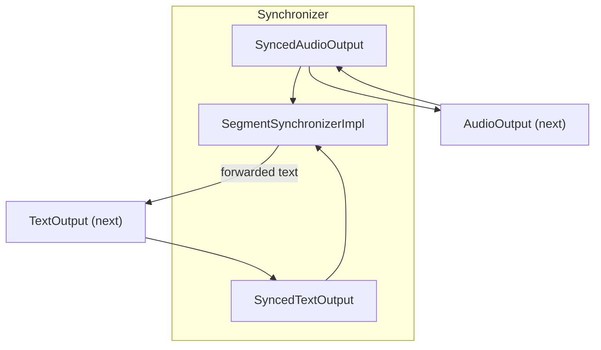
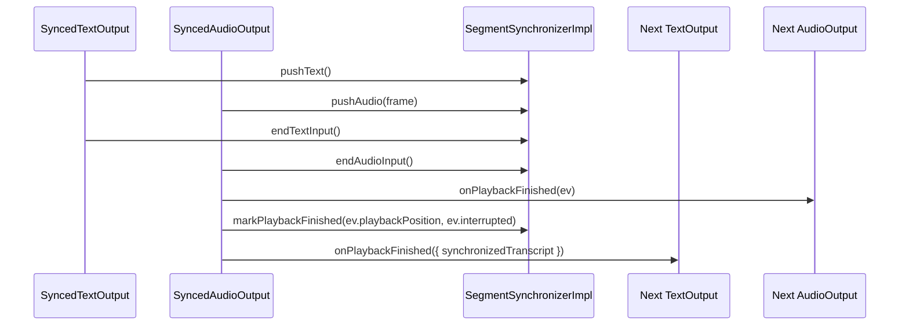

### TranscriptionSynchronizer architecture and usage

This document describes `agents/src/voice/transcription/synchronizer.ts`, which aligns agent text output with audio playout. It segments text, throttles emission based on an estimated speech rate, and annotates playback-finished events with a synchronized transcript.

#### Purpose

- Pace the agent’s transcript to match actual audio timing.
- Provide synchronized transcript text alongside audio `onPlaybackFinished` events.
- Allow enabling/disabling on the fly and rotating segments cleanly.

#### High-level architecture

#### Text pacing model

- Uses a target rate derived from `speed * STANDARD_SPEECH_RATE` (hyphens per second).
- Tokenizes sentences and words via `SentenceTokenizer` (defaults from `tokenize/basic`).
- Hyphenates words to approximate syllables; delays are computed so the number of emitted hyphens follows elapsed time.

#### API

- Constructor: `new TranscriptionSynchronizer(nextAudio: AudioOutput, nextText: TextOutput, options?)`
  - Wraps the provided outputs with `SyncedAudioOutput`/`SyncedTextOutput` and constructs an initial segment impl.
- Properties:
  - `audioOutput`, `textOutput`: the wrapped outputs to bind into RoomIO.
  - `enabled`: getter/setter to toggle synchronization.
- Methods:
  - `rotateSegment()`: finishes the current segment and starts a new one.
  - `barrier()`: await current rotation to complete.
  - `close()`: stop rotation and close the current impl.

#### SegmentSynchronizerImpl core

- Maintains two inputs:
  - Audio: accumulates `pushedDuration` seconds, marks `done` in `endAudioInput()`.
  - Text: token stream; forwards chunks into an internal output stream with delays; marks `done` in `endTextInput()`.
- When playback finishes (from audio `onPlaybackFinished`), if not interrupted, marks `playbackCompleted` and returns the full text as `synchronizedTranscript`; otherwise returns only forwarded text so far.
- Exposes `readable` and captures forwarded text to the next sink, ending with an automatic `flush()`.

#### Typical flow

#### Known shortcomings and probable bugs

- Seconds vs milliseconds
  - Durations are computed as `samplesPerChannel / sampleRate` (seconds) but named as ms in some places. Align naming/units or multiply by 1000 when labeling as ms.

- Start time dependency
  - `startWallTime` is set on the first audio frame with `frameDuration > 0`. If text arrives early or audio is silent initially, pacing begins late. Consider starting on first text or a small bias.

- Rotation during capture
  - `SyncedTextOutput.captureText`/`SyncedAudioOutput.captureFrame` call `barrier()` then push. If `_impl.textInputEnded`/`audioInputEnded` is true, they rotate the segment and push after barrier. Rapid alternation could cause extra rotations.

- Reader closure order
  - `captureTaskImpl` reads from `outputStream` and then flushes `nextInChain`. Ensure `nextInChain.flush()` is safe when the downstream sink is changing participants or being replaced.

- Long sentences
  - The pacing splits by words and hyphens. Very long tokens without hyphens may emit with minimal delay. Consider capping per-token delay.

#### Tuning

- `options.speed` scales pacing; set >1 for faster text, <1 for slower.
- Swap tokenizer/hyphenator for language-specific behavior.

