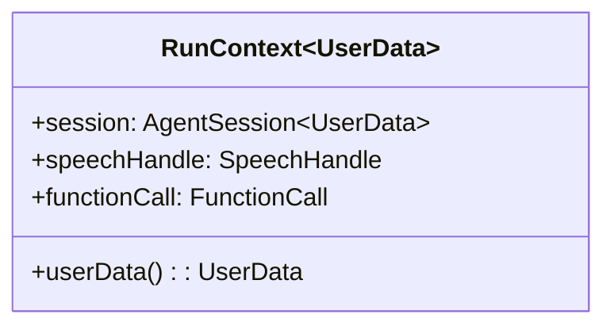

### RunContext architecture and usage

This document explains `agents/src/voice/run_context.ts`, a simple data holder passed around during a single generation/tool execution, providing access to the session, current speech handle, and the active function call.

#### Purpose

- Bundle context for a single reply or tool execution step so code can access:
  - The current `AgentSession` (to read options, emit events, access IO, etc.).
  - The current `SpeechHandle` (to check interruption state, chain completion, etc.).
  - The current `FunctionCall` (when executing tools).
- Provide typed access to per-session `userData` with generic typing.

#### Structure



#### API

- Constructor: `new RunContext(session, speechHandle, functionCall)`
- Getter: `userData` – returns `session.userData` with type parameter `UserData`.

#### Typical usage

```ts
function executeTool(ctx: RunContext<MyUserData>) {
  const { userData, speechHandle } = ctx;
  if (speechHandle.interrupted) return;
  // use userData to customize behavior
}
```

#### Known shortcomings and probable bugs

- No nullability guards
  - Assumes `session`, `speechHandle`, and `functionCall` are always provided; callers must ensure they’re valid.

- Mutability exposure
  - Exposes references to mutable `session` and `speechHandle`; misuse can alter session state from deep within tools. Consider narrower interfaces for tool code.

- Minimal surface area
  - No helper methods for common operations (emitting events, interrupt checks with timeouts, etc.). Keeping it simple is fine, but document intended usage patterns.


