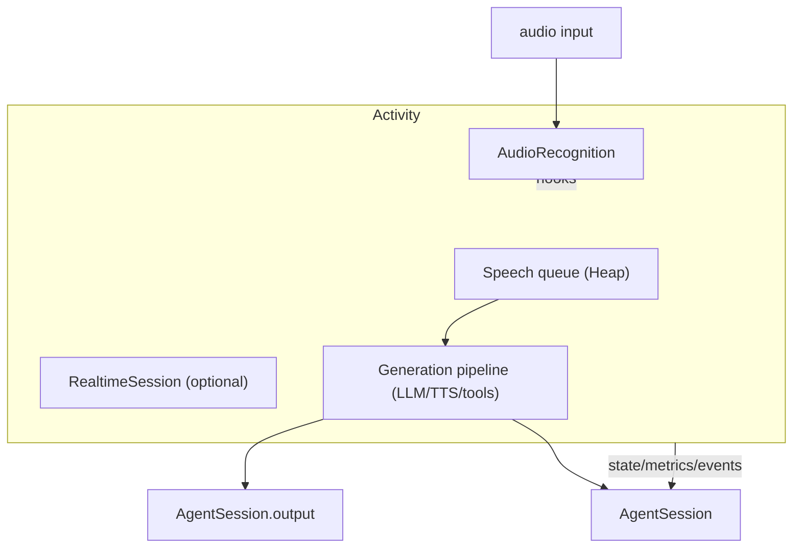
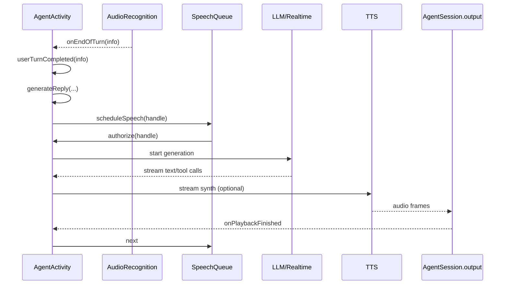

### AgentActivity architecture and usage

This document explains `agents/src/voice/agent_activity.ts`, the core runtime that orchestrates recognition (VAD/STT), generation (LLM/RealtimeModel + TTS), speech queueing/interruptions, and tool execution for a single active agent in an `AgentSession`.

#### Purpose

- Wire up recognition (AudioRecognition) and the generation pipeline for the current agent.
- Manage a priority speech queue with interruption and authorization semantics.
- Bridge RealtimeModel sessions (server-side events, user transcription, tool streams).
- Emit `AgentSession` events for state, metrics, errors, user transcripts, speech creation, and tool execution.

#### High-level architecture

#### Lifecycle

- `start()`
  - Binds the agent, configures RealtimeModel or LLM instructions/chat/tools, subscribes to metrics.
  - Starts `AudioRecognition` with configured turn detection mode and delays.
  - Spawns `mainTask()` (speech queue runner) and calls agent `onEnter()` in a tracked task.

- `drain()` and `close()`
  - `drain()` waits for queue to empty (speech tasks may continue to run). `close()` detaches audio, closes recognition and realtime session, and unsubscribes listeners.

#### Speech queue and interruptions

- A max-heap of `[priority, timestamp, SpeechHandle]` ensures higher priority first, then FIFO within same priority.
- `scheduleSpeech(handle, priority, bypassDraining=false)` enqueues and wakes `mainTask()`.
- `mainTask()` authorizes the front speech (`_authorizePlayout()`), waits for its `waitForPlayout()`, then proceeds.
- `interrupt()` interrupts current speech and all queued speeches, and calls `realtimeSession.interrupt()`.

#### Recognition integration

- Hooks update user state on VAD start/end, emit interim/final transcripts, and trigger interruption on VAD inference when thresholds are met.
- End-of-turn (`onEndOfTurn`) coordinates with RealtimeModel vs LLM pipelines, optionally interrupts current speech, runs `onUserTurnCompleted`, then calls `generateReply` with the resulting user message.

#### Generation paths

- Non-realtime (LLM): `pipelineReplyTask`
  - Drives `performLLMInference`, `performTTSInference`, `performTextForwarding`, `performAudioForwarding`, and `performToolExecutions`.
  - Waits for authorization, updates session state on first frame/text, and adds assistant messages (interrupted or final) to chat context.

- Realtime: `realtimeReplyTask` / `realtimeGenerationTask`
  - Uses `RealtimeSession` to push user input, get streamed message/audio/tool events, forward to IO, and handle truncation on interruption.

#### Typical flow

#### Known shortcomings and probable bugs

- Turn detection mode warnings
  - Several branches coerce/override `turnDetectionMode` based on capabilities. This is good UX but can mask misconfiguration; consider surfacing as configuration errors instead of silent fallback.

- Authorization vs task start
  - Tasks for say/pipeline/realtime begin setup before authorization; heavy upstream work may occur before playback is allowed. Consider deferring heavy steps until authorized to reduce wasted work on interrupts.

- Queue wakeups
  - `wakeupMainTask()` is called from many places; ensure it is invoked after all state affecting queue selection is updated to avoid spurious loops.

- Realtime truncation timing
  - On interruption, truncation uses `playbackPosition` potentially from seconds vs ms mismatch if upstream uses different units; verify consistency.

- State transitions
  - Transitions between `thinking`/`speaking`/`listening` rely on first-frame/text futures and task completions; edge races can leave session in the wrong state if sinks change mid-stream.

- Tool step cap
  - `maxToolSteps` enforcement is correct, but repeated tool executions within one step aren’t capped here; ensure `performToolExecutions` bound checks align.

