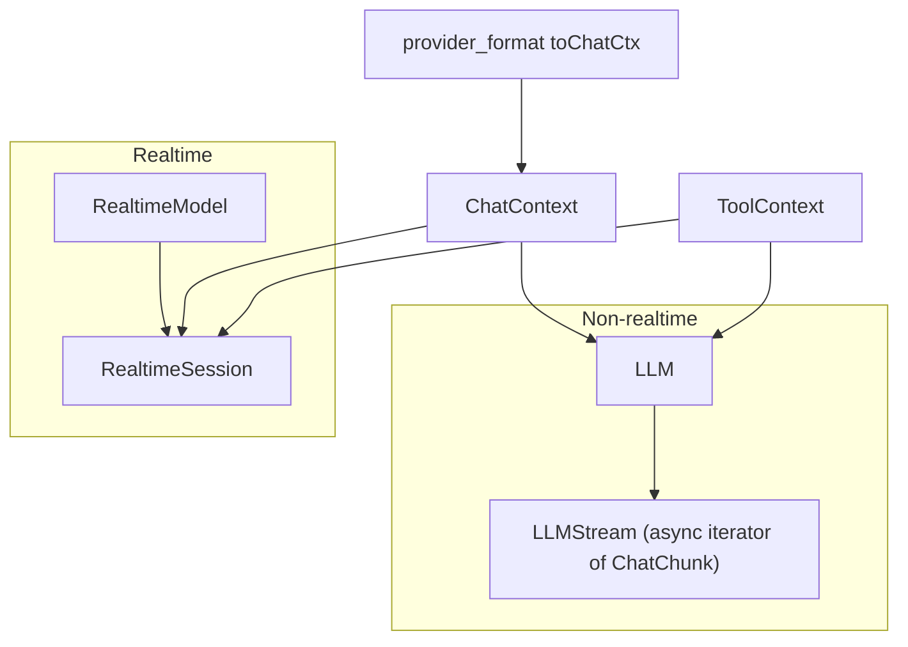
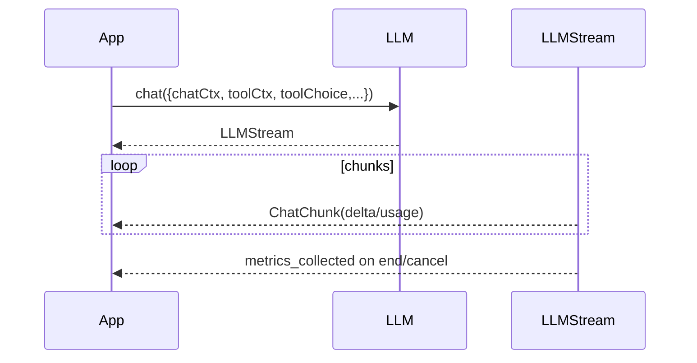

### LLM architecture and usage

This document covers the LLM components used by the voice pipeline:
- Public types (`agents/src/llm/index.ts`)
- Base non-realtime LLM (`agents/src/llm/llm.ts`)
- Realtime model/session (`agents/src/llm/realtime.ts`)
- Provider format shims (`agents/src/llm/provider_format/*`)

#### Purpose

- Provide a common streaming interface for chat completions and tool calls (LLM), and a separate interface for realtime multimodal models (RealtimeModel).
- Normalize chat contexts across providers via provider-format shims.
- Emit metrics used by `AgentActivity` and the session.

#### High-level architecture

#### Public types and exports

- `index.ts` re-exports ToolContext helpers, ChatContext types, ProviderFormat, `LLM`/`LLMStream` types, `RealtimeModel`/`RealtimeSession` types, and utilities (oai params, tool execution helpers).

#### Non-realtime LLM: `llm.ts`

- `LLM`
  - Abstract class with `chat({ chatCtx, toolCtx, connOptions, parallelToolCalls, toolChoice, extraKwargs }): LLMStream`.
  - `label()` and `model` for metrics and provider identification.
  - Lifecycle hooks: `prewarm()`, `aclose()`.

- `LLMStream`
  - Async iterator yielding `ChatChunk` { id, delta?, usage? }.
  - Internals: two `AsyncIterableQueue`s (queue→output). `monitorMetrics()` forwards queued events to output and collects usage to emit `LLMMetrics` on stream end/cancel.
  - Aborts on `close()`, closing output and setting `closed`.

Sequence:

Notes:
- `tokensPerSecond` uses seconds from hrtime; verify divisor for nanoseconds.

#### Realtime model: `realtime.ts`

- `RealtimeModel`
  - Initialized with `RealtimeCapabilities` (messageTruncation, turnDetection, userTranscription, autoToolReplyGeneration).
  - `session()` returns a `RealtimeSession` instance; `close()` shuts down model resources.

- `RealtimeSession` (EventEmitter)
  - Input: `setInputAudioStream()`, `pushAudio()`, `commitAudio()`, `clearAudio()`.
  - Output: `generateReply()` → `GenerationCreatedEvent { messageStream, functionStream, userInitiated }`.
  - Events: `generation_created`, `input_speech_started/stopped`, `input_audio_transcription_completed`, `metrics_collected`, `error`, `reconnected`.
  - Control: `updateInstructions`, `updateChatCtx`, `updateTools`, `updateOptions({ toolChoice })`, `interrupt()`, `truncate({ messageId, audioEndMs })`.
  - Internals: a background task drains a deferred input audio stream and calls `pushAudio`.

#### Provider format shims

- Purpose: transform our `ChatContext` to provider-native payloads.
- `provider_format/index.ts`:
  - `toChatCtx('openai'|'google', chatCtx, injectDummyUserMessage=true)` delegates to provider-specific transformers; throws on unsupported format.

- OpenAI (`openai.ts`)
  - Groups tool calls, builds `messages[]` with `role` and mixed `content` (text and image_url). Uses `serializeImage` to ensure data URL vs external URL.
  - Tool calls as `tool_calls` and function outputs as `role: tool` messages.

- Google (`google.ts`)
  - Returns `[turns[], { systemMessages }]`. Flattens grouped tool calls, maps roles to `user`/`model`, collects parts (text, inlineData/fileData for images, functionCall/functionResponse). Optionally injects a trailing dummy user turn to satisfy generation constraints.

#### Integration points

- `AgentActivity.pipelineReplyTask` uses `LLM.chat()`; tool calls are consumed via `performToolExecutions` using `ChatChunk.delta.toolCalls` and usage for metrics.
- `AgentActivity.realtime*` uses `RealtimeModel` and `RealtimeSession` for streaming text/audio and tool calls.
- `AgentSession` tags `LLMMetrics` with `speechId` through `AgentActivity`’s async local storage.

#### Known shortcomings and probable bugs

- LLMStream metrics duration divisor
  - `tokensPerSecond` divides tokens by seconds computed as `Math.trunc(Number(duration / 1e9))`; if duration is small, truncation may cause divide-by-zero. Consider using floating seconds.

- RealtimeSession input drain
  - `_mainTaskImpl` never releases the reader; on `close()`, only cancels the task. Ensure the deferred stream is detached or reader released to avoid leaks.

- Provider shims error handling
  - Provider transformers throw on unsupported types; upstream should surface errors near providers to aid debugging.

- Google format injection
  - The dummy user turn can change model behavior. Make it configurable at call sites where provider expects it.

