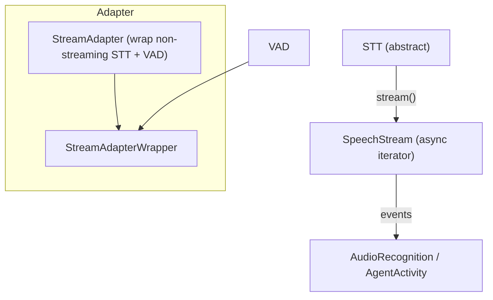
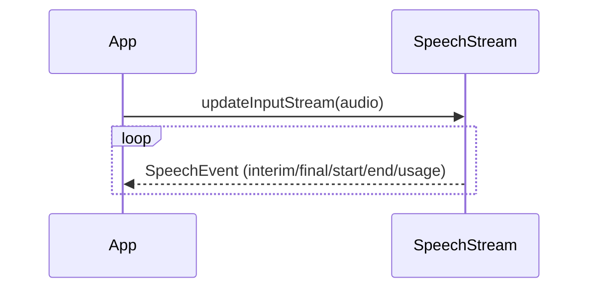
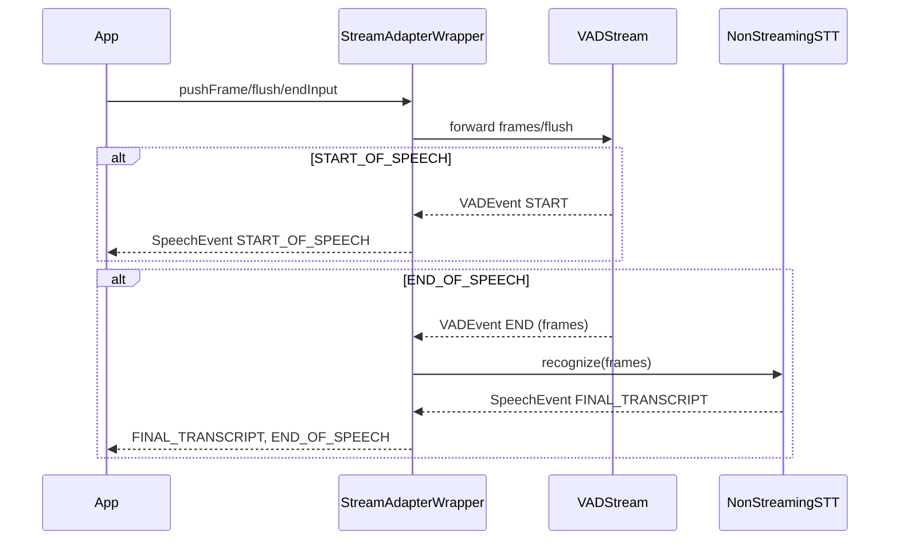

### STT architecture and usage

This document covers the speech-to-text base types and streaming model:
- Base and events/metrics (`agents/src/stt/stt.ts`)
- Streaming adapter for non-streaming providers (`agents/src/stt/stream_adapter.ts`)

#### Purpose

- Normalize STT providers behind an abstract interface that supports both request/response and streaming.
- Emit standardized events (`SpeechEventType`) and metrics (`STTMetrics`) for the voice pipeline.
- Provide a VAD-backed adapter to segment audio for providers lacking streaming endpoints.

#### High-level architecture

#### Base types and events

- `SpeechEventType`:
  - `START_OF_SPEECH`, `INTERIM_TRANSCRIPT`, `FINAL_TRANSCRIPT`, `END_OF_SPEECH`, `RECOGNITION_USAGE`.
- `SpeechEvent`: `type`, `alternatives?` (array of `SpeechData`), optional `requestId`, `recognitionUsage`.
- `STTCapabilities`: `streaming`, `interimResults`.
- Metrics (`STTMetrics`): emitted on `recognize()` completion (non-streaming) and on `RECOGNITION_USAGE` (streaming), including duration, label, audioDuration, streamed flag.

#### STT abstract class

- `recognize(AudioBuffer) => Promise<SpeechEvent>`
  - Times the call and emits metrics; subclasses implement `_recognize`.
- `stream(): SpeechStream`
  - Returns a provider-implemented stream class with push/flush/end semantics.
- `capabilities`: advertises streaming/interim support.

#### SpeechStream

- Async iterator with internal queues for input and output.
- Accepts `AudioFrame` via `updateInputStream()` or `pushFrame()` and handles optional resampling to `neededSampleRate`.
- `flush()` pushes a sentinel to request immediate processing; `endInput()` stops new input.
- `monitorMetrics()` forwards queued events to output and emits `STTMetrics` on `RECOGNITION_USAGE` events.

Typical sequence:

#### StreamAdapter for non-streaming providers

- `StreamAdapter(stt, vad)` exposes `stream()` returning `StreamAdapterWrapper` and proxies `recognize()`.
- `StreamAdapterWrapper`:
  - Creates a `VADStream` and forwards input audio; on VAD `START_OF_SPEECH`, emits `START_OF_SPEECH`; on `END_OF_SPEECH`, calls underlying `stt.recognize(ev.frames)` and emits the resulting final transcript (if non-empty) followed by `END_OF_SPEECH`.
  - Disables the base `monitorMetrics()`; metrics still flow through from the wrapped STT via the adapter’s event proxy.

Flow:

#### Integration points

- Used by AudioRecognition (STT task) and AgentActivity (interim/final to events) in the voice pipeline.
- In Agent.default.sttNode, if provider is non-streaming, it wraps via STTStreamAdapter (requires a VAD).

#### Known shortcomings and probable bugs

- SpeechStream monitor closes output after queue drains
  - Ensure providers emit `RECOGNITION_USAGE` periodically; otherwise metrics may never be emitted for streaming paths.

- Adapter emits END before FINAL on edge cases
  - If `recognize()` returns an event without `.alternatives[0].text`, adapter drops it and only END_OF_SPEECH reaches listeners. Consider emitting an empty FINAL with timing metadata for consistency.

- Resampler lifecycle
  - `SpeechStream` creates an `AudioResampler` on the first rate mismatch; no explicit teardown. If per-stream reuse leaks, add close support.

- Error propagation
  - Adapter catches recognize errors and logs them, continuing the loop; consider surfacing an `Error` event to upstream for observability.

