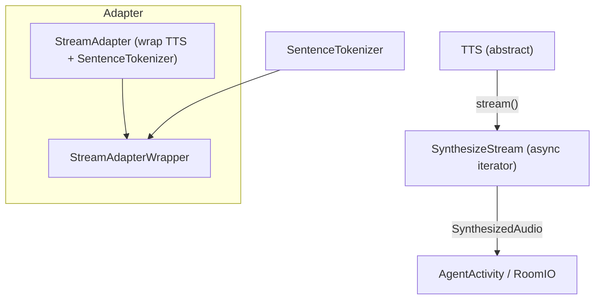
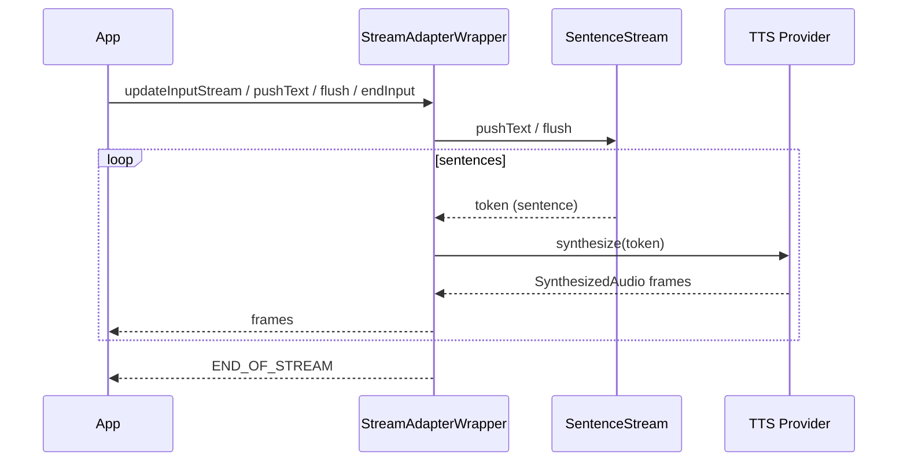

### TTS architecture and usage

This document covers the text-to-speech base interfaces and streaming model:
- Base/capabilities (`agents/src/tts/tts.ts`)
- Streaming adapter using a sentence tokenizer (`agents/src/tts/stream_adapter.ts`)

#### Purpose

- Normalize TTS providers behind an abstract interface that supports request/response and streaming.
- Emit standardized metrics (`TTSMetrics`) including time to first byte, duration, characters, and audio duration.
- Provide an adapter that segments text (by sentences) and synthesizes incrementally in a stream.

#### High-level architecture

#### Base interfaces

- `TTS(sampleRate, numChannels, capabilities)`
  - `capabilities.streaming` indicates if provider supports streaming.
  - `synthesize(text): ChunkedStream` for single-shot synthesis.
  - `stream(): SynthesizeStream` for incremental text → audio.

- `SynthesizeStream`
  - Async iterator yielding `SynthesizedAudio` ({ requestId, segmentId, frame, deltaText?, final }).
  - Input via `updateInputStream(textReadable)` or `pushText(text)`; `flush()` to segment; `endInput()` to finish.
  - Collects metrics (TTFB, duration, characters, audioDuration), emitted via `metrics_collected`.
  - Aborts on `close()`; detaches deferred stream and closes queues.

- `ChunkedStream`
  - Async iterator for one-shot synthesis; `collect()` merges frames; emits metrics on completion.

#### Streaming adapter

- `StreamAdapter(tts, sentenceTokenizer)` proxies metrics from underlying TTS and returns `StreamAdapterWrapper`.
- `StreamAdapterWrapper`:
  - Creates a `SentenceStream` from the tokenizer.
  - Forwards input text and flush signals to the tokenizer; for each sentence token, starts a synthesis task with `tts.synthesize(token)`.
  - Queues audio frames in order, waiting for the previous sentence’s audio to finish before enqueueing the next (`await prevTask.result`).
  - Emits `END_OF_STREAM` when the sentence stream is exhausted.

Flow:

#### Integration points

- Used by `AgentActivity.pipelineReplyTask` and `say()` to stream synthesized audio to `AgentSession.output.audio`.
- `TranscriptionSynchronizer` may couple agent transcript progress with audio playout; `SynthesizedAudio.deltaText` can be used by providers to supply incremental text.

#### Known shortcomings and probable bugs

- Duration units
  - Audio duration accumulates seconds (`samplesPerChannel / sampleRate`) but is labeled as a duration; ensure consistent units across metrics and synchronizer.

- SynthesizeStream mainTask/metrics coupling
  - If no text arrives, `monitorMetrics` might not start; `mainTask` closes output directly. Verify downstream handles empty streams.

- Adapter ordering and backpressure
  - Sentences are serialized by awaiting the previous task; long sentences can block subsequent ones. Consider chunking or overlapping if provider supports it.

- Error propagation
  - Adapter does not surface provider synthesis errors to the app; consider emitting an error event.

