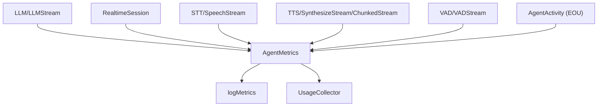

### Metrics architecture and usage

This document describes the unified metrics model under `agents/src/metrics/**`:
- Types (`base.ts`), logging helpers (`utils.ts`), and usage aggregation (`usage_collector.ts`).

#### Purpose

- Provide consistent, strongly-typed telemetry across LLM, STT, TTS, VAD, end-of-user (EOU), and RealtimeModel components.
- Attach `speechId` where appropriate so UI/logs can correlate metrics to a specific speech handle.
- Offer utilities to log metrics and compute simple usage summaries (tokens, characters, audio duration).

#### High-level architecture

#### Types (`base.ts`)

- `AgentMetrics`: union of
  - `LLMMetrics`: timings, token counts, tokensPerSecond, optional `speechId`.
  - `STTMetrics`: duration (0 for streaming), audioDuration (seconds), streamed flag.
  - `TTSMetrics`: ttfb, duration, audioDuration (seconds), cancelled, charactersCount, streamed, optional `segmentId`/`speechId`.
  - `VADMetrics`: idleTime since last activity, inferenceDurationTotal, inferenceCount.
  - `EOUMetrics`: endOfUtteranceDelay, transcriptionDelay, onUserTurnCompletedDelay, optional `speechId`.
  - `RealtimeModelMetrics`: rich token counters (input/output/total), per-modality details, timings.

Units convention:
- All timestamps are epoch milliseconds; durations are seconds unless called out; some sources calculate with `process.hrtime` and convert to milliseconds.

#### Emission points

- LLM: `LLMStream.monitorMetrics()` emits on stream end/cancel.
- STT: `STT.recognize()` emits per call; `SpeechStream.monitorMetrics()` emits for streaming usage events.
- TTS: `SynthesizeStream.monitorMetrics()` emits per segment and on end; `ChunkedStream.monitorMetrics()` emits for single-shot.
- VAD: `VADStream.monitorMetrics()` emits periodically based on `updateInterval`.
- EOU: `AgentActivity.userTurnCompleted` emits one `EOUMetrics` per committed turn.
- Realtime: provider implementation emits `realtime_model_metrics`; `AgentActivity` can tag `speechId` via async-local storage.

#### Logging and usage aggregation

- `utils.logMetrics(metrics)`
  - Pretty-prints per-type metrics; rounds select fields; logs via the shared logger.

- `UsageCollector`
  - `collect(metrics)`: accumulates LLM tokens (or Realtime input/output), TTS characters, and STT audio duration.
  - `getSummary()`: returns `{ llmPromptTokens, llmPromptCachedTokens, llmCompletionTokens, ttsCharactersCount, sttAudioDuration }`.

#### Known shortcomings and probable bugs

- Duration unit inconsistencies
  - Some metrics compute durations in seconds while others are logged/rounded assuming milliseconds. Standardize or document clearly per field.

- Missing `speechId` propagation
  - Only certain emitters attach `speechId`. Ensure propagation in realtime metrics and adapter proxies where needed.

- STT streaming usage
  - `RECOGNITION_USAGE` emission depends on provider behavior; without it, streaming STT yields no metrics beyond non-streaming calls.

- UsageCollector gaps
  - Does not aggregate VAD/EOU; depending on product needs, consider adding counts/delays for monitoring turn performance.

