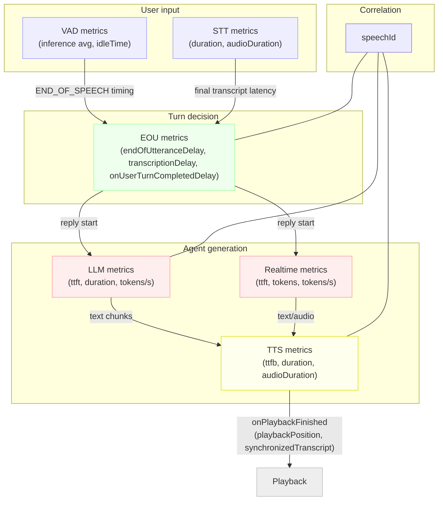

### Using metrics to locate and reduce latency

This guide explains how to interpret emitted metrics (VAD, STT, EOU, LLM, RealtimeModel, TTS) to find latency hotspots and apply targeted fixes.

#### VAD (vad_metrics)

- What to watch: `inferenceDurationTotal`/`inferenceCount` (avg/window), `idleTime` between activity.
- Symptoms: High average inference time → VAD behind realtime; delayed END_OF_SPEECH.
- Fixes:
  - Lower sample rate/window size; use QUICK resampler; prefer a faster device path.
  - Reduce copies/resampling; ensure one resample hop.
  - Tune Silero options: `minSilenceDuration`, `minSpeechDuration`, `activationThreshold`.

#### STT (stt_metrics) and EOU

- What to watch: `stt_metrics.duration` (non‑streaming), and EOU `transcriptionDelay` (END_OF_SPEECH → final text).
- Symptoms: Large `transcriptionDelay` → slow STT finalization; high `duration` for non‑streaming.
- Fixes:
  - Prefer streaming STT; for non‑streaming, use the VAD stream adapter and inject brief silence on commit to flush.
  - Reduce audio chunk size; match provider sample rate; avoid resampler churn.
  - Choose lower‑latency model/tier; keep region proximate.

#### Endpointing (eou_metrics)

- What to watch: `endOfUtteranceDelay`, `transcriptionDelay`, `onUserTurnCompletedDelay`.
- Symptoms:
  - High `endOfUtteranceDelay` → conservative endpointing or indecisive model.
  - High `onUserTurnCompletedDelay` → slow user callback.
- Fixes:
  - Tune min/max endpointing delay; adjust EOU unlikely thresholds; simplify or offload work in `onUserTurnCompleted`.

#### LLM (llm_metrics)

- What to watch: `ttft` (first token), `duration`, `tokensPerSecond`.
- Symptoms: High `ttft` → cold starts/large prompts/region latency; low `tokensPerSecond` → throttling or heavy model.
- Fixes:
  - Prewarm; trim prompt/context; cache tool schemas; colocate with provider; pick a faster model.

#### Realtime model (realtime_model_metrics)

- What to watch: `ttft`, `duration`, `inputTokens`/`outputTokens`/`totalTokens`, `tokensPerSecond`.
- Symptoms: Slow `ttft` or tokens/s → server latency or context/tool overhead.
- Fixes: Reduce context, disable auto tool replies if unneeded, minimize tool schema churn, target an optimal region/instance.

#### TTS (tts_metrics)

- What to watch: `ttfb` (first audio frame), `duration` vs `charactersCount`, `audioDuration`.
- Symptoms: High `ttfb` → voice/model warmup or provider latency; slow throughput → long segments or heavy voice.
- Fixes:
  - Use streaming voices; tokenize into shorter sentences; prewarm voices; choose faster voice; lower sample rate/channels if acceptable.

#### Playback and synchronization

- What to watch: `onPlaybackFinished.playbackPosition` vs generation end; `synchronizedTranscript` availability.
- Symptoms: Audio finishes long after text; large queued audio.
- Fixes: Reduce output queue size; emit first frames sooner; lower sample rate to shrink frames; ensure streaming end‑to‑end.

#### Cross‑cutting tactics

- Correlate by `speechId`: AgentActivity tags LLM/TTS/EOU to build a per‑reply timeline.
- Derive stage latencies:
  - User turn to audible agent ≈ `endOfUtteranceDelay + transcriptionDelay + llm.ttft + tts.ttfb`.
- Enable `logMetrics` to sanity‑check units and outliers quickly.
- Run workers close to media/LLM/TTS regions; avoid unnecessary resampling; minimize data copies.

#### Quick triage playbook

- Agent starts speaking late: check LLM `ttft`, TTS `ttfb`, EOU `endOfUtteranceDelay`.
- Agent responds long after user stops: check STT `transcriptionDelay` and endpointing thresholds.
- Choppy/laggy stream: check tokens/s (LLM/Realtime), TTS throughput (duration vs chars), VAD inference time spikes.

#### Target ranges (rough guidelines)

- VAD avg/window: < 10–20 ms; STT `transcriptionDelay`: < 300–800 ms; LLM `ttft`: < 300–800 ms; Realtime `ttft`: < 250–600 ms; TTS `ttfb`: < 150–500 ms (provider/region dependent).

#### Relationships between metrics

